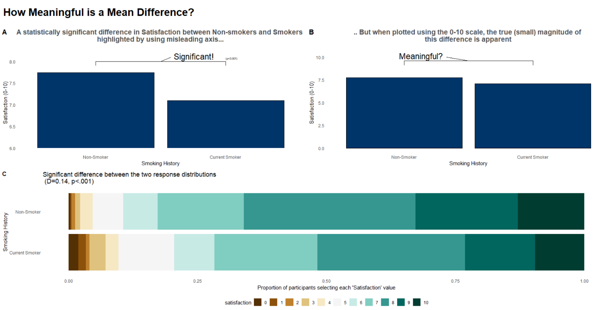

The example dataset for this month's webinar was based on a survey of overall satisfaction performed in Germany in 2014 and [published in 2016](http://dx.doi.org/10.4232/1.12437). The primary endpoint was overall satisfaction with life.

The question posed to the participants was: "How would you rate your satisfaction with your life overall on a scale from 0-10?", where 10 means completely satisfied. There was only one observation per participant and no treatment groups, as no treatment was administered.

The objective of this survey was to explore the most relevant factors for satisfaction in life. Several factors, such as smoking status, working hours per week or number of doctor visits per year were collected. The dataset and its specification can be found [here](https://github.com/VIS-SIG/Wonderful-Wednesdays/tree/master/data/2020/2020-05-13).

We received a variety of submissions and we would like to thank everyone for their contributions. The visualizations that were presented during the June 2020 Wonderful Wednesday webinar are described below, with a few discussion points highlighted. To see the full discussion around each of the visualizations, check out the webinar recording in the [PSI Video-on-Demand library](https://www.psiweb.org/vod/item/psi-vissig-webinar-wonderful-wednesday-4). The subtitles contain the timestamps of the webinar recording, in case you would like to listen to the discussion around a specific visualization.

<a id="example1"></a>

# Example 1. CDF plot (03:10 - 08:50)


[link to code](#example1 code)  
[high-resolution image](./plots/cdf.png)

The first submission discussed during this webinar was a cumulative distribution function (CDF) plot with the cumulative proportion of subjects on the vertical axis and the satisfaction with life on the horizontal axis. This horizontal axis has been reversed, ranging from highest satisfaction (10; on the left) to lowest satisfaction (0; on the right). This is also highlighted by the arrow labelled "Less satisified", which is very helpful. The curves show the proportion of subjects reaching a certain level of satisfaction or higher. The difference between non-smokers and smokers can be clearly seen in this graph, with non-smokers being more satisfied with life than smokers. This message is also communicated in the title of the graph.

The graph is very well designed with little to no visual clutter, which helps to focus on the actual data. A suggestion for improvement would be to place the subgroup labels directly next to the lines and to use the same color for the subgroup labels that was used for the lines which would allow removing the legend symbols.

To further highlight the difference between the two groups, it could be helpful to fill the area between the two curves using the color of the more satisfied group (or vice versa). This could even be shown as an additional bar chart below this visualization. This would facilitate comparing subgroup differences at the various cut-offs.

In summary, this graph is very effective for communicating a simple and clear message and could be used in a presentation. It appears that the creator of this graph already went through the process of exploring the data to reach the conclusion that smoking status is a relevant factor for satisfaction of life. Examples for exploratory visualizations that could help with reaching such a conclusion were also submitted and are discussed further below.


<a id="example2"></a>

# Example 2. Treeplot (08:50 - 12:10)


[link to code](#example2 code)  
[high-resolution image](./plots/tree.png)

The second submission discussed during the webinar was a treeplot. The title contains the question that was posed to the participants and the subtitle describes that the tile sizes are proportional to the subgroup sizes. The mean satisfaction within subgroups is color-coded, as shown in the legend.

This plot gives a quick overview of the subgroups, allowing to see all the data visually in one place, which is great. The use of the font size could be improved. At first glance, it appears that it was coded with the data, but it seems it has more to do with the space constraints and the size of the tiles. For example, the font size for smoking status "N" and "Y" is the same but the size of the tiles indicates that the non-smoker group is much larger compared to the smoker group.


<a id="example3"></a>

# Example 3. Bar plots (12:10 - 17:20)



[link to code](#example3 code)  
[high-resolution image](./plots/bar.png)

The next visualization was specifically designed for a presentation. It starts of with a question ("How meaningful is a mean difference?") and tries answering that question through a series of bar plots, looking at the data in different ways. This submission focuses on one single factor (smoking status), as already seen in the CDF plot above.

The first bar plot in the top left shows a statistically significant mean difference on an adapted scale from 6 to 8. In the top right we can see a very similar plot but this time on the complete scale from 0 to 10, which makes the magnitude of the difference appear much smaller. The stacked bar plot at the bottom shows a significant difference between the two response distributions instead of only comparing the means. Like the CDF plot, this visualization shows that non-smokers are performing better than smokers, regardless of the cut-off that is chosen.

Interestingly, a divergent color scheme was used in the stacked bar chart. A suggestion to make the comparisons in the stacked bar chart even easier would be to add reference lines connecting the different areas/cut-offs.

In summary, this is a well thought through visualization example.


<a id="example4"></a>

# Example 4. Power BI dashboard (17:20 - 26:45)


[link to code](#example4 code)  
[high-resolution image](./plots/powerbi.png)


This submission is an interactive Power BI dashboard. The number of participants and overall mean is given in the top left. A stacked bar chart as well as a classic bar plot show the distribution of the satisfaction responses. The factors are shown in supplementary bar plots below. In these bar plots a subgroup can be selected and all the other plots will adapt automatically. Check out the recording of the webinar [here](https://www.psiweb.org/vod/item/psi-vissig-webinar-wonderful-wednesday-4) (starting at 17:20) to see how the interactivity works in practice.

This can be a very useful and easy tool to explore the data, replacing many tables. The arrangement of the different tiles on the dashboard seems also well thought through, starting with the main results in the top left and finishing with the summary results in the bottom right.

It is not entirely clear why some of the bar plots are vertical while others are horizontal. A horizontal presentation can be useful when labels are long to increase readibility, however, a consistent approach could be chosen.


<a id="example5"></a>

# Example 5. Funnel plot (26:45 - 37:20)


[link to code](#example5 code)  
[high-resolution image](./plots/funnel1.png)

The next submission is an interactive visualization as well. In this funnel plot, each dot represents a subgroup estimate. This is the first visualization that does not only explore the factors in isolation, but also looks at all possible combination of subgroups. The overall mean with 95% prediction intervals is also shown. The vertical axis represents the average satisfaction ranging from 0 to 10 and the horizontal axis the subgroup size, i.e., larger subgroups are shown more to the right.

The name, the size and the mean of a specific subgroup becomes visible by hovering over a dot. This tool is specifically useful to explore extreme values. Check out the recording of the webinar [here](https://www.psiweb.org/vod/item/psi-vissig-webinar-wonderful-wednesday-4) (starting at 26:45) to see how the interactivity works in practice.

Most data points are squeezed towards the top left of the plot, given that the full scale is shown on both axes, causing a lot of white space. The visualization does include an interactive zooming option. A couple of other suggestions  to allow zooming in are: 1) the subgroup size could be shown on a logarithmic scale; 2) apply a minimum threshold to the subgroup size because the very small subgroups are usually not of interest.

Additional interesting interactive tools could be: 1) highlight all subgroups related to a certain factor, e.g., all subgroups relevant for smoking status. This would allow quicker identification of relevant factors. 2) when hovering over one subgroup, the complement of this subgroup could be highlighted as well.

In summary, this is a great, innovative idea to explore subgroups.


<a id="example6"></a>

# Example 6. Funnel plot (37:20 - 48:45)


[link to code](#example6 code)  
[high-resolution image](./plots/funnel2.png)

This submission is similar to the funnel plot seen above but providing additional features, such as:

* Specific subgroups can be highlighted. For example, by selecting the non-smokers, it becomes apparent that most subgroups including non-smokers lie above the mean reference line. 
* The shading of the dots is linked to the number of subgroup levels. The white dots represent single-level factors while the more transparent dots represent higher level subgroups. The number of subgroup levels displayed can also be controlled (e.g., only 1-factorial subgroups could be displayed).
* All parent subgroups of a selected subgroup can be highlighted. This could be used to explore the driving factors among a combination of factors forming a subgroup. 

Check out the recording of the webinar [here](https://www.psiweb.org/vod/item/psi-vissig-webinar-wonderful-wednesday-4) (starting at 37:20) to see more details.


# Code

<a id="example1 code"></a>

## Example 1. CDF plot (R)


```{r, echo = TRUE, eval=FALSE}
### Load packages
library(here)
library(tidyverse)

### Load data
data <- data.frame(read_delim(here("Satisfaction_wW2005.csv"), delim=';'))
data$smoker <- ifelse(data$smoker == "Y", "Smoker", ifelse(data$smoker == "N", "Non-smoker", NA))

### Only keep non-missing data
data_nonmiss <- na.omit(data[, c("satisfaction", "smoker")])

### Derive number of subjects within subgroups
n <- data_nonmiss %>% group_by(smoker) %>% summarize(n = n())
  
### Create label variable including number of subjects
data_n <- merge(data_nonmiss, n, by = "smoker")
data_n$group <- paste0(data_n$smoker, " (n = ", data_n$n, ")")
  
### Plot
ggplot(data = data_n, aes(x = satisfaction, colour = group)) +
  stat_ecdf(size = 1, alpha = 0.5) +
  theme_minimal(base_size = 15) +
  scale_x_reverse(name = "Satisfaction with life", breaks = seq(0, 10, 1), minor_break = NULL) +
  scale_y_continuous(name = "Cumulative proportion of subjects", breaks = seq(0, 1, 0.25), minor_break = NULL) +
  scale_color_manual(name = NULL, values = c("#E7B800", "#2E9FDF")) +
  theme(legend.position = c(0.15, 0.85)) +
  geom_segment(aes(x = 4.5, y = 0.5, xend = 2.5, yend = 0.5), colour = "black", size = 1, arrow = arrow(length = unit(0.5, "cm"))) +
  annotate("text", x = 3.5, y = 0.53, label = "Less satisfied", size = 5, colour = "black") +
  ggtitle("Non-smokers more satisfied with life than smokers") +
  NULL

ggsave(file = here("cdf_smoker.png"), width = 35, height = 20, units = "cm")
```

[Back to blog](#example1)

<a id="example2 code"></a>

## Example 2. Treeplot (R)

```{r, echo = TRUE, eval=FALSE}
library(ggplot2)
if (!require('treemapify')) install.packages('treemapify');
if (!require('dplyr')) install.packages('dplyr');
if (!require('RColorBrewer')) install.packages('RColorBrewer');
library(treemapify)
library(dplyr)
library(RColorBrewer)

# read data
data <- read.csv(url('https://raw.githubusercontent.com/VIS-SIG/Wonderful-Wednesdays/master/data/2020/2020-05-13/Satisfaction_wW2005.csv'), na.strings = c(".", ""), header = TRUE)

foo_summarize<- function(dat = data, my_var = NULL, group_label = "NA"){
    
   suppressWarnings(
     ans<- dat %>%
        filter(!is.na(satisfaction)) %>%
        group_by({{my_var}}) %>%
        summarize(n = n(), 
                  mean_satisfaction = mean(satisfaction)) %>%
        mutate(percent = n / sum(n)*100) %>%
        mutate(group = group_label) %>%
        rename(Variable = names(.)[1])
   )
  
   return(ans)
}

#age
d_age<- foo_summarize(dat=data, my_var=age, group_label = "Age")
d_bmi<- foo_summarize(dat=data, my_var=bmi, group_label = "BMI")
d_w_hours<- foo_summarize(dat=data, my_var=w_hours, group_label = "Working hours")
d_todoctor<- foo_summarize(dat=data, my_var=todoctor, group_label = "Doctor visits per year")
d_income<- foo_summarize(dat=data, my_var=income, group_label = "Net income")
d_smoker<- foo_summarize(dat=data, my_var=smoker, group_label = "Smoker")
d_gender<- foo_summarize(dat=data, my_var=gender, group_label = "Gender")
d_employed<- foo_summarize(dat=data, my_var=employed, group_label = "Employment status")
d_graduat<- foo_summarize(dat=data, my_var=graduat, group_label = "Graduation")
d_graduat_f<- foo_summarize(dat=data, my_var=graduat_f, group_label = "Graduation of father")
d_graduat_m<- foo_summarize(dat=data, my_var=graduat_m, group_label = "Graduation of mother")
d_high_grad<- foo_summarize(dat=data, my_var=high_grad, group_label = "Highest educational grade")
d_high_grad_f<- foo_summarize(dat=data, my_var=high_grad_f, group_label = "Highest educational grade (father)")
d_high_grad_m<- foo_summarize(dat=data, my_var=high_grad_m, group_label = "Highest educational grade (mother)")

d_all<- do.call(rbind, list(d_age, d_bmi, d_w_hours, d_todoctor, d_income, d_smoker, d_gender, d_employed, d_graduat,
                            d_graduat_f, d_graduat_m, d_high_grad, d_high_grad_f, d_high_grad_m))

# replace NA with a category: Missing. Only explanatory vars are affected. Response (satisfaction) has no missings
d_all$Variable<- as.character(d_all$Variable)
d_all$Variable[which(is.na(d_all$Variable))]<- "Missing"

# create descrete response variable to display colors in the plot better
d_all$satisfation_categories<- cut(d_all$mean_satisfaction, 
                                   breaks=seq(round(min(d_all$mean_satisfaction)), round(max(d_all$mean_satisfaction)), 0.5), 
                                   labels=c("(6,6.5]", "(6.5,7]", "(7,7.5]", "(7.5,8]", "(8,8-5]", "(8.5-9]"), right = TRUE)

# create response with label
d_all$satisfaction_lab<- paste(d_all$Variable, " (", round(d_all$mean_satisfaction, 1), ")", sep = "")

# colors for plot
col_palette<- display.brewer.pal(n = 6, name = 'RdYlBu')
palette<- brewer.pal(n = 6, name = 'RdYlBu')


# plot
ggplot(d_all, aes(area=percent, label = Variable, fill = satisfation_categories, subgroup = group)) + 
            geom_treemap() + 
            geom_treemap_subgroup_border(size = 1.5, color = "black") +
            geom_treemap_text(grow = T, reflow = T, place = "topleft", layout = "scol", min.size = 1,
                              color = "Darkblue", size = 10) +
            scale_fill_manual(values = palette) + 
            facet_wrap( ~ group) + 
            theme(legend.position = "bottom", 
                  legend.text = element_text(color="black", size = 18), 
                  legend.title = element_text(size = 18),
                  plot.title = element_text(size = 24),
                  plot.subtitle = element_text(size = 20), 
                  plot.caption = element_text(size = 14),
                  strip.text = element_text(size = 14, face = "bold", color = "Darkblue")) +
            labs(title = 'How would you rate your satisfaction with your life overall on a scale from 0-10? (10=completely satisfied)',
                 subtitle = 'Descriptive analysis by subgroup: tiles are proportional to rel. frequencies of the choices within a subgroup',
                 caption ="Created with ggplot2-treemapify",
                 fill = "Mean Satisfaction")


ggsave("treeplot_may2020.png", width = 24, height = 12, units="in", dpi = 300)
```

[Back to blog](#example2)

<a id="example3 code"></a>

## Example 3. Bar plots (R)

```{r, echo = TRUE, eval=FALSE}
library(tidyverse)
library(Stack)
library(viridis)
library(IOHanalyzer)
library(car)
library(RColorBrewer)
display.brewer.all(colorblindFriendly = TRUE)
library(cowplot)
library(dgof)

#Colour Scheme
Orange <- "#EF7F04"
Green <- "#68B937"
Blue <- "#00A6CB"
Grey <- "#4E5053"
Darkblue <- "#003569"
Yellow <- "#FFBB2D"

#Load in data and make satisfaction and all other variables a factor. Also make a numeric version of satisfation for use late
Cohort <- read_csv('Cohort.csv') %>%
  mutate(satisfaction = factor(satisfaction, level=c(0, 1, 2, 3, 4, 5, 6, 7, 8, 9, 10))) %>%
  mutate_all(factor) %>%
  mutate(NumSat = as.numeric(satisfaction)) %>%
  mutate(NumSat = NumSat-1) #To put it back on a 0-10 scale

#Calculate means for the groups
means <- Cohort %>%
  group_by(smoker) %>% 
  summarise(
    NumSat = mean(NumSat, na.rm = TRUE) 
  ) %>%
  filter(!is.na(smoker)) #filter out the means for patients without a value for smoking (some implicit NA's)

#Significance test of mean differences
model <- lm(NumSat ~ smoker, data = Cohort)
summary(model)

#test of distributions
SmokerSat <- Cohort %>%
  select(smoker, NumSat) %>%
  filter(smoker=="Y")

NonSmokerSat <- Cohort %>%
  select(smoker, NumSat) %>%
  filter(smoker=="N")

KS <- ks.test(SmokerSat$NumSat, NonSmokerSat$NumSat)


#Make plot of means, 
p <- ggplot(means, aes(x=smoker, y=NumSat)) +
  geom_bar(stat="identity", fill=Darkblue, color="black", xpd = FALSE) +
  scale_y_continuous(name = "Satisfaction (0-10)") +
  scale_x_discrete(name = "Smoking History", 
                   labels=c("Non-Smoker","Current Smoker"))


#Fake plot for  aesthetic purporposes (remove the bar going below "6" on the chart with the reduced y axis)
   #Start with fake dataset
smoker <- c("N", "Y")
NumSat <-c(6,6)
fake.data <- data.frame(smoker,NumSat)


# make plot 1 where the scale is changed to emphasize difference
plot1 <- p+coord_cartesian(ylim=c(6,8.1))+
  theme_classic() +
  theme(line = element_blank()) +
  geom_bar(data=fake.data,stat="identity", fill="white", color="white") +  #Add a white rectangle below the "6.0" line using fake data
  ggtitle("A statistically significant difference in Satisfaction between Non-smokers and Smokers \n highlighted by using misleading axis... \n") +
  theme (plot.title = element_text(family = "sans", color=Grey, face="bold", size=14, hjust=0.5)) + #Edit font
  annotate("segment", x = "N", xend = "Y", y = 8.0, yend = 8.0,
           colour = "black") +
  annotate("segment", x = "N", xend = "N", y = 8.0, yend = 7.9,
           colour = "black") +
  annotate("segment", x = "Y", xend = "Y", y = 8.0, yend = 7.9,
           colour = "black") + 
  annotate("segment", x = 1.5, xend = 1.58, y = 8.0, yend = 8.1,
           colour = "black") +
  annotate(geom = "text", x = 1.6, y = 8.05, label = "Significant!", hjust = "left", vjust = "bottom", size = 6) +
  annotate(geom = "text", x = 2.0, y = 8.05, label = "(p<0.001)", hjust = "left", vjust = "bottom", size = 2) 
  

# make plot 2 which uses oringinal 0-10 scale
plot2 <- p+coord_cartesian(ylim=c(0,10)) +
  theme_classic() +
  theme(line = element_blank()) + 
  ggtitle(".. But when plotted using the 0-10 scale, the true (small) magnitude of \n this difference is apparent \n ") +
  theme (plot.title = element_text(family = "sans", color=Grey, face="bold", size=14, hjust=0.5)) + #Edit font
  annotate("segment", x = "N", xend = "Y", y = 9.6, yend = 9.6,
           colour = "black") +
  annotate("segment", x = "N", xend = "N", y = 9.6, yend = 9.1,
           colour = "black") +
  annotate("segment", x = "Y", xend = "Y", y = 9.6, yend = 9.1,
           colour = "black") + 
  annotate("segment", x = 1.5, xend = 1.33, y = 9.6, yend = 10,
           colour = "black") +
  annotate(geom = "text", x = 1.3, y = 9.8, label = "Meaningful?", hjust = "right", vjust = "bottom", size = 6) 


# make plot 3 - a staked bar chart to show distributional changes
Cohort$smoker %>% mutate(fct_reorder(smoker, NumSat, .fun="mean"))


plot3 <- ggplot(data=subset(Cohort, !is.na(smoker)), aes(y = reorder(smoker, NumSat))) +
  geom_bar(aes(fill = satisfaction), position = position_fill(reverse = TRUE)) +
  scale_fill_brewer(palette="BrBG") +
  guides(fill = guide_legend(nrow = 1)) +
  ggtitle("Significant difference between the two response distributions \n (D=0.14, p<.001)") +
  theme_classic() +
  theme(line = element_blank()) +
  theme(legend.position = "bottom", legend.box = "horizontal")+
  xlab("Proportion of participants selecting each 'Satisfaction' value") + 
  scale_y_discrete(name = "Smoking History", 
                   labels=c("Current Smoker","Non-Smoker")) +
  scale_x_continuous(breaks = c(0, .25, .50, .75, 1.00))
  ggtitle("The response distribution shows that smokers reported lower satisfaction scores (0-5) more often than non-smokers \n and higher satisfaction scores (9-10) less often than non-smokers") +
  theme (plot.title = element_text(family = "sans", color=Grey, face="bold", size=18, hjust=0.5))  #Edit font
  
#plot3 <- plot3 +  annotate(geom = "curve", x = 0.50, y = 2.60, xend = 0.65, yend = 2.45, 
#           curvature = -.25, arrow = arrow(length = unit(3, "mm"))
#  ) +
#  annotate(geom = "text", x = 0.5, y = 2.55, label = "Significant difference in distributions \n (D=0.14, p<.001)", hjust = "center", size = 3)

#design layout
  # Make a title
title <- ggdraw() + 
  draw_label(
    "How Meaningful is a Mean Difference?",
    fontface = 'bold',
    x = 0,
    hjust = 0,
    size = 22
  ) +
  theme(
    # add margin on the left of the drawing canvas,
    # so title is aligned with left edge of first plot
    plot.margin = margin(0, 0, 0, 7)
  )

top_row <- plot_grid(plot1, plot2, labels = c("A", "B"), align = "h")
Faceted_graphs <- plot_grid(top_row, plot3, labels = c(' ', 'C'), label_size = 12, ncol = 1)

plot_grid(title, Faceted_graphs,  
          ncol = 1,
          # rel_heights values control vertical title margins
          rel_heights = c(0.1, 1)
  )
```

[Back to blog](#example3)

<a id="example4 code"></a>

## Example 4. Power BI dashboard

```{r, echo = TRUE, eval=FALSE}
PSI survey

https://app.powerbi.com/view?r=eyJrIjoiOTZkOTVkYTEtMzE3OC00YTAzLWIyZGYtODZhZWYwYzM5MzQ1IiwidCI6ImY1NTgwM2MzLTRmYTktNDIzMy1hOGFiLTIxM2I3ZWI3MjEzNCJ9
```

[Back to blog](#example4)

<a id="example5 code"></a>

## Example 5. Funnel plot (R)

```{r, echo = TRUE, eval=FALSE}
##### code for funnel plot for submittion
library(doParallel)
library(data.table)
library(plotly)
library(tidyverse)

data_transform <- function(x, 
                           labels = c("low", "high"), 
                           except = NULL, 
                           threshold = 0.1, 
                           explicit_conv = NULL, 
                           explicit_conv_override = FALSE, 
                           binary_categories = FALSE, 
                           n_binary_categories=1, 
                           verbose = FALSE) {
  
  x_new <- x
  cutoff <- floor(threshold * nrow(x_new)) # if number of unique values is less than 10% of overall dataset size, treat corresponding covariate as categorical
  if(!is.null(explicit_conv) && explicit_conv_override){
    cutoff <- Inf
  }
  for (column in colnames(x_new)[!colnames(x_new) %in% except]) {
    fac <- as.factor(x[, column])
    if ((nlevels(fac) > cutoff) || column %in% explicit_conv) {
      if (!binary_categories) {
        n_quant <- length(labels) # number of quantiles
        quant <- quantile(x_new[, column], probs = 0:n_quant / n_quant, na.rm = TRUE)
        if (verbose) {message(sprintf("Transforming %s to categorical using following quantiles", column))}
        if (verbose) {message(paste0(capture.output(quant), collapse = "\n"))}
        x_new[, column] <- cut(x_new[, column], quant, include.lowest = TRUE, labels = labels)
      } else {
        n_quant <- n_binary_categories+1 # number of quantiles
        quant <- quantile(x_new[, column], probs = 0:n_quant / n_quant, na.rm = TRUE)
        if (verbose) {message(sprintf("Transforming %s to binary categorical columns using following quantiles", column))}
        if (verbose) {message(paste0(capture.output(quant), collapse = "\n"))}
        for (j in 2:(length(quant) - 1)) {
          x_new[, sprintf("%s_q%s", column, substr(names(quant)[j], 1, 2))] <-
            as.factor(cut(x_new[, column], c(quant[1], quant[j], quant[length(quant)]), include.lowest = TRUE, labels = FALSE))
          levels(x_new[, sprintf("%s_q%s", column, substr(names(quant)[j], 1, 2))]) <- c(0, 1)
        }
        # remove orignal column
        x_new[, column] <- NULL
      }
    }
    else if (typeof(x[, column]) != "integer") {
      if (verbose) {message(sprintf("Convert %s to factors", column))}
      x_new[, column] <- as.factor(x[, column])
    }
  }
  
  return(x_new)
}


return_subgroups <- function(x, 
                             eval_fun, 
                             covs, 
                             packages=NULL, 
                             comb = 3, 
                             comb_lowerbound = 1, 
                             n_cores = 1, 
                             first_N = Inf, 
                             verbose = !(first_N==Inf)) {
  
  
  
  data_cov_comb <- function(vec, k, n = length(vec),verbose = FALSE) {
    # returns all n over k combinations of elements in vec
    # n should be size of vec and k<=n
    if(verbose){message(sprintf("Computing %s combinations out of",k))}
    if(verbose){message(paste0(capture.output(vec), collapse = "\n"))}
    return(gtools::combinations(n, k, vec))
  }
  
  
  data_level_comb <- function(x, covs) {
    # takes a dataframe x where every column is of type integer/factor and computes all combinations between all the levels of covariates specified in covs
    return(tidyr::expand(x, x[covs]))
  }
  
  compute_eval <- function(x, covs, eval_fun, first_N_active = FALSE) {
    # computes the evaluation function on all subgroup combination of given covariates in covs (vector of strings)
    # returns a list with number of entrys equal to the number of possible covariate level combinations.
    # Each entry consits of two elements:
    # first entry contains the filtered dataset containing only subgroup datapoints
    # second entry contains single line dataframe output of eval_func augmented by subgroup labels
    comb <- data_level_comb(x, covs)
    
    if (first_N_active) {
      if (first_N_count <= nrow(comb)) {
        comb <- comb[1:first_N_count, ]
        first_N_count <<- 0
      } else {
        first_N_count <<- first_N_count - nrow(comb)
      }
    }
    
    subframes <- foreach(i = 1:nrow(comb)) %do% {
      x_filtered <- x
      for (j in 1:length(covs)) {
        x_filtered <- dplyr::filter(x_filtered, x_filtered[covs[j]] == as.character(unlist(comb[i, j])))
      }
      result <- eval_fun(x_filtered)
      result[covs] <- comb[i, ]
      
      return(result)
    }
    return(subframes)
  }
  
  #check if provided covs are contained in x
  for (name in covs) {
    if (!(name %in% colnames(x))) {
      stop(sprintf("Variable %s was not found in %s", name, toString(substitute(x))))
    }
  }
  
  #turn on verbose if first_N != Inf 
  if (first_N!=Inf){verbose <- TRUE} 
  
  cl <- makeCluster(n_cores)
  registerDoParallel(cl)
  
  if(verbose){message(sprintf("Number of cores: %s", getDoParWorkers()))}
  
  # computes the evaluation function on all subgroup combination of given covariates in covs (vector of strings) for 1,2 and 3 combinations(general: comb_lowerbound:comb)
  if (first_N == Inf) {
    results <- foreach(i = comb_lowerbound:comb, .combine = c) %do% {
      covs_comb <- data_cov_comb(covs, i,verbose=verbose)
      track_time <- system.time({
        result <- foreach(j = lapply(as.list(1:dim(covs_comb)[1]), function(x) covs_comb[x[1],]), .combine = c, .packages = c("foreach", packages)) %dopar% {
          compute_eval(x, j, eval_fun)
        }
      })
      if(verbose){message(paste0(capture.output(track_time), collapse = "\n"))}
      return(result)
    }
  } else {
    if(verbose){message(sprintf("Computing first %d subgroups using single core", first_N))}
    first_N_count <<- first_N
    results <- foreach(i = comb_lowerbound:comb, .combine = c) %do% {
      covs_comb <- data_cov_comb(covs, i,verbose=verbose)
      track_time <- system.time({
        result <- foreach(j = 1:min(nrow(covs_comb), first_N), .combine = c, .packages=c(packages)) %do% {
          if (first_N_count == 0) {
            return()
          }
          res <- compute_eval(x, covs_comb[j, ], eval_fun, first_N_active = TRUE)
        }
      })
      if(verbose){message(paste0(capture.output(track_time), collapse = "\n"))}
      return(result)
    }
  }
  
  stopCluster(cl)
  
  return(dplyr::bind_rows(results))
}

############################################################################################
############# read data
dat <- read.csv("./Satisfaction_wW2005.csv") %>%
  as.data.frame() %>% dplyr::select(-X, -ID) 

### global mean and se
dat_mean <- mean(dat$satisfaction)
dat_se <- sd(dat$satisfaction)/sqrt(nrow(dat))
dat_sd <- sd(dat$satisfaction)

fit <- function(x) {
  cf1 <- tryCatch({
    cf <- mean(x$satisfaction)
    se <- sd(x$satisfaction)/sqrt(nrow(x))
    c(cf, se,nrow(x))
  },
  warning = function(w) { #warning handling
    NA
  }, error = function(w) { #error handling
    c(dat_mean,dat_se,0)
  }
  )
  return(data.frame(av = cf1[1], se = cf1[2], N = cf1[3]))
}

subgroups <- return_subgroups(dat, 
                              fit,
                              comb = 3, 
                              comb_lowerbound = 1,
                              covs = colnames(dat)[1:14],
                              # first_N = 100, 
                              n_cores = 4,
                              verbose = TRUE)
# head(subgroups)

nams <- names(subgroups)[-c(1:3)]
subgroups$text <- NULL
subgroups$text <- apply(subgroups, 1, function(x){
  covs <- x[-c(1:3)]
  ind <- which(!is.na(covs))
  p1 <- NULL
  for(i in 1:length(ind)){
    p1 <- c(p1, sprintf("%s=%s", nams[ind[i]], covs[ind[i]]))
  }
  p1 <- paste(p1, collapse=",")
  p2 <- sprintf("|satisfaction=%.1f, N=%d", as.numeric(x[1]),as.numeric(x[3]))
  paste0(p1, p2)
})


## calculate dfs (assuming balance)
n_start <- 2
N <- n_start:nrow(dat)
q95 <- qt(0.975, df= N - 1)
ci <- data.frame(N = N,
                 lb = dat_mean - q95*dat_sd/sqrt(N),
                 ub = dat_mean + q95*dat_sd/sqrt(N))

fig <- subgroups %>% filter(N >= n_start) %>% 
  plot_ly(x = ~ N, y = ~av) %>%
  add_markers(name = 'Subgroup Estimates',text = ~text, hoverinfo = "text",
              color = I("blue"), alpha=0.2)%>%
  add_markers(x = nrow(dat), y = dat_mean,
              name = 'Overall Estimates',text = I(paste0("satisfaction = ",round(dat_mean,2))), 
              hoverinfo = "text",color = I("red"),alpha=0.2)%>%
  add_lines(x = ~ ci$N, y = ~ ci$lb, name = 'Lower 95% PI', hoverinfo = 'skip', 
            color = I("black"), alpha=0.5) %>%
  add_lines(x = ~ ci$N, y = ~ ci$ub, name = 'Upper 95% PI', hoverinfo = 'skip', 
            color = I("black"), alpha=0.5) %>%
  add_lines(x = I(n_start:nrow(dat)), y = dat_mean, 
            name = "Overall mean",hoverinfo = 'skip', color = I("red"),alpha=0.5) %>%
  layout(xaxis = list(range = c(n_start,(nrow(dat)+4)),title = "Subgroup size"),
         yaxis = list(range = c(1, 10),title = "Average satisfication"))
fig
htmlwidgets::saveWidget(fig, "./funnel_satisfaction.html")
```

[Back to blog](#example5)

<a id="example6 code"></a>

## Example 6. Funnel plot (R)

```{r, echo = TRUE, eval=FALSE}
###############################################################################
# Bayer AG
# Study            :
# Proj/Subst/GIAD  :
###############################################################################
# Name of program #############################################################
# Name             : SGS_WW2005.R
#
# Purpose          : Run subgroup screening  
# Programming Spec :
# Validation Level : 1 - Verification by Review
# R Version        : 4.0.0 (64 bit) on simulation server
###############################################################################
# Pre-conditions   : data source: ALLBUS dataset 2014/subset
# Post-conditions  :
# Comments         :
###############################################################################
# Author(s)        : Bodo Kirsch  03JUN2020
# Reference prog   : SGS
###############################################################################
# Changed by       : 
# Reason           :
###############################################################################


### delete workspace
rm(list=ls())


### AutoSub and load libraries
#setwd("c:/temp")


library(shiny)
library(subscreen)


### import data
D=read.csv2(file="Data_wW2005.csv", sep=",", dec=".", header=TRUE)


auwe <- function(D){
  
    # --- satisfaction mean ----------------------------------------------------------------
  
      satisfact  <- round(mean(D$satisfaction, na.rm = TRUE), 2)   # TRUE:  NA values stripped before the computation proceeds
      
      number.of.subjects     <- sum(!is.na(D$satisfaction))
  
    return(data.frame(number.of.subjects, satisfact))
}


HH <- subscreencalc(data=D,
           eval_function = auwe,
           endpoints   = "satisfaction",  
           treat       = "",            
           subjectid   = "ID",
           factors     = c("gender", "employed", "smoker", "graduat", "graduat_f", "graduat_m", 
                           "high_grad", "high_grad_f", "high_grad_m", "age", "w_hours", "todoctor", "bmi", "income") ,
           min_comb    = 1,
           max_comb    = 3,
           verbose     = T)


#write.csv(HH$sge, file = "Data_H.csv", na="")    

subscreenshow(HH, 
              host = "0.0.0.0", port = 1234)
```

[Back to blog](#example6)