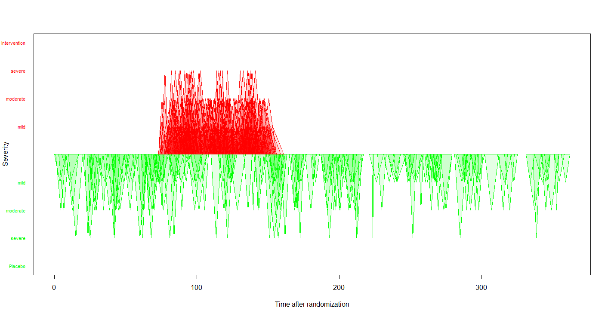
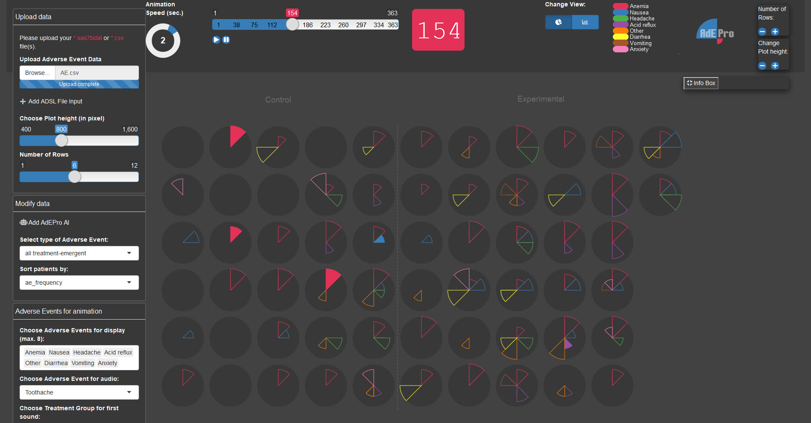

# Adverse event example data set

The adverse events (AEs) example data set is based on a clinical trial for treatment of Type II diabetes in adults that cannot manage their blood glucose control with a single oral therapy. The primary outcome was mean HbA1c at 6 months. AEs were monitored and collected for the entire course of the study. A more detailed description and link to the data can be found [here](https://github.com/VIS-SIG/Wonderful-Wednesdays/tree/master/data/2020/2020-09-09).

<a id="example1"></a>

## Example 1. Triangles, pie chart, boxplots


This visualisation has been submitted as an html file and can be found [here](./images/adverse-events - Vivek Rao.html). It is a compilation of three different plots. The first one shows a triangle for each AE where the height of the triangle represents the duration of the AE. The x axis, represents a time axis. Furthermore, we the AEs are split into three categories based on the severity: mild, moderate, and severe. Each categories is plotted in a separate line of the plot. The treatment group (placebo vs. intervention) is color-coded. One additional feature is the hover over effect which provides some useful additional information.

This is a very innovative plot and not common for representing AEs. The title covers the message of the plot and, hence, it is very helpful. Additionally, there is a subtitle which provides some additional useful information even though the second part (saying that severe AEs were resolved the quickest) cannot be seen clearly from the plot.

Using the height of the triangles to represent the duration is a bit challenging because we already have the x axis representing the time. Having that said, we see that the x axis (date of the AE) is not ordered chronologically. This is a bit surprising and it is not clear what the dates are ordered by. The alpha scaling that has been used in a sensible way to make all triangles visible.

The second visualisation is similar to a pie chart in its appearance. There is a lot of information included in this plot. We see all AEs represented in categories. it also provides a hover over functionality which gives you some more information.

The advantage of this plot is that it shows a lot of information in a very compact design. However, since it is a round design, it is a little bit hard to compare the height of the bars. So, it comes with some challenges, but it is definitely eye-catching.

The third visualisation is a pair of boxplots comparing the two treatment groups in terms of the duration of AEs. It is a rather "simple" or standard plot. It is often a good idea to keep it simple, so there is definitely nothing wrong with it. In addition, there are dots included which are be color-coded and seem to represent the frequency of the events. One comment would be that the type of AEs is not being considered in this plot. So, it might be a good idea to stratify this plot by system organ class.

[link to code](#example1 code)  


<a id="example2"></a>

## Example 2. Triangles - updated version


[high-resolution image](./images/plot_triangle_AE.png)  

This visualisation is ment to be an update of the first visualisation of Example 1. The main update is that the x axis is used as a time axis in chronological order. Now, the width of the triangles is being used to represent the duration of the AEs. The height represents the severity. Furthermore, the treatment group is represented by color and also by the direction the triangle point to. This is not a fully developed plot but rather a quick draft to show what it could look like updated some design features of the original plot.

[link to code](#example2 code)  

<a id="example3"></a>

## Example 3. Tendril plot


[high-resolution image](./images/tendril_plot - Agustin Calatroni.png)  

This is a very innovative visualisation. It is presented in a publication from 2018. You can see branches which represent one AE each. The branch itself represents the time path. Changes to the direction of the path depend on the treatment arm the AE occured in. Thus, it is kind of a car driving experience and it depends on the occurence of AE in each treatment arm where you end up.

In this plot, the paths are color coded and each branch represents a body system (and not only one single type of AE). Looking at the pink path (representing blood and lymphatic), we see that in the beginning, most of the AEs occur in the placebo, later on we see a lot more AEs occuring in the treatment group and, thus, the path ends up far to the right.

One comment is some AEs might become very influential if they happen at a rather late point in time. Furthermore, a hover over function (or some other type of interactivity) might make the plot very powerful. Also, the color coding could be used differently, for example, to represent the odds ratio.

[link to code](#example3 code)  

<a id="example4"></a>

## Example 4. AdEPro app



This is definitely more than just a visualisation - it's a tool. You can upload your data and all AEs are represented in the middle pane. Each patient is represented by a circle / pie chart. You can kick it off by pushing the go button and the app will show you the development of AEs over time. Each AE is represented by a "slice of the pie" and the color as well as the location of it will tell you which AE is showing. If an AE disappears, it will still be shown as an "empty slice". The size of the slice represents the severity. You have several different options you can work with, like changing which AEs will be shown (color coded), stop at a specific point in time, etc. You can even switch to a barplot representation instead of pie charts.

This is a fully developed app and thus, it is very useful and innovative. Its interactivity brings additional benefits to the user. Furthermore, this is available as an R package called "AdEPro".


[link to code](#example4 code)  


<a id="example5"></a>

## Example 5. Adverse event explorer

This is again an interactive app. It can be found [here](./images/ww-ae-xplorer-Rho.html). It shows a list of categories of AEs. You can see the results in the different treatment groups in different colors. Furthermore, the freqzency and the treatment difference is represented by dots and an treatment effect with a confidence interval, respectively. You can click on the plus sign next to the categories to further assess the AEs in more detail.

It is a very clear representation of AEs. The coloring is very straightforward and helpful. It is a tool to explore the data and thus, it does not come with a message by itself. However, this is not the aim of this tool. It is made to "play" with the data and assess your AEs in a very efficient way. Something that might be a useful extension would be addition of reference lines to make it easier to see which results correspond to which category or AE.

[link to code](#example5 code)  


<a id="example6"></a>

## Example 6. Volcano plots


[link to code](#example6 code)  
[high-resolution image](./images/volcano BS Phillips.png)  
[high-resolution image](./images/volcano PT Phillips.png)

It is an innovative idea to use this plot to visualise AE data. On the x axis we see the risk difference and on the y axis, the p-values are represented. The colors represent the treatment group and the saturation of the color corresponds to the p-value as well. The size of the dots is proportional to the number of events (in both arms). It is a very comprehensive and nice overview over the results.

One comment is that the colors might be switched, because the red one are might be seen as the more critical ones. However, those correspond to increased risk in the placebo group.

[link to code](#example6 code)  


# Code

<a id="example1 code"></a>

## Example 1. Triangles, pie chart, boxplots (html)
```{r, echo = TRUE, eval=FALSE}
<!doctype html>
<html lang="en">
  <head>
    <!-- Required meta tags -->
    <meta charset="utf-8">
    <meta name="viewport" content="width=device-width, initial-scale=1, shrink-to-fit=no">
    <title>Visualizing eczema trial data</title>

    <!-- Bootstrap CSS/JS/then Popper.js -->
    <link rel="stylesheet" href="https://stackpath.bootstrapcdn.com/bootstrap/4.3.1/css/bootstrap.min.css" integrity="sha384-ggOyR0iXCbMQv3Xipma34MD+dH/1fQ784/j6cY/iJTQUOhcWr7x9JvoRxT2MZw1T" crossorigin="anonymous">
    <script src="https://stackpath.bootstrapcdn.com/bootstrap/4.3.1/js/bootstrap.min.js" integrity="sha384-JjSmVgyd0p3pXB1rRibZUAYoIIy6OrQ6VrjIEaFf/nJGzIxFDsf4x0xIM+B07jRM" crossorigin="anonymous"></script>
    <script src="https://cdnjs.cloudflare.com/ajax/libs/popper.js/1.14.7/umd/popper.min.js" integrity="sha384-UO2eT0CpHqdSJQ6hJty5KVphtPhzWj9WO1clHTMGa3JDZwrnQq4sF86dIHNDz0W1" crossorigin="anonymous"></script>

    <!-- Load D3 -->
    <script src="https://d3js.org/d3.v4.min.js"></script>

    <!-- load fonts -->
    <link href="https://fonts.googleapis.com/css2?family=PT+Sans:ital,wght@0,400;0,700;1,400;1,700&family=PT+Serif:ital,wght@0,400;0,700;1,400&display=swap" rel="stylesheet">

    <!-- Embed Flourish graphics -->
    <script src="https://public.flourish.studio/resources/embed.js"></script>

    <!-- css -->
    <style>
            .path.domain {
              display: none;
            }
            .label {
              font-size: 10px;
              font-family: sans-serif;
              text-anchor: middle;
            }

          #tooltip  {
           position: absolute;
            height: auto;
            padding: 10px;
            background-color: rgba(255,255,255,0.7);
              border-radius: 3px;
            pointer-events: none;
          }

          #tooltip.hidden {
            display: none;
          }

          #tooltip p  {
            margin: 0;
            font-size: 14px;
            line-height: 18px;
          }

          #container  {
            position: inherit;
          }

          .graph-hed{
            font-family: 'PT Serif', serif;
            font-size: 0.90rem;
            font-weight: 700;
          }

          .graph-subhed{
            font-family: 'PT Serif', sans-serif;
            font-size: 0.80rem;
            font-weight: 400;
          }

          .hed  {
            font-family: 'PT Serif', serif;
            font-size: 2.25rem;
            font-weight: 700;
            text-align: center;
            width: 70%;
          }

          .byline {
            font-family: 'PT Sans', sans-serif;
            font-size: 1rem;
            font-style: italic;
          }

          .insight  {
            font-family: 'PT Sans', sans-serif;
            font-size: 1.2rem;
            font-style: italic;
            text-transform: uppercase;
          }

          .copy {
            font-family: 'PT Sans', serif;
            font-size: 1rem;
            font-weight: 400;
          }

          .copy-link  {
            border-bottom: 2px solid black;
            color: black;
          }

          .copy-link:hover  {
            border-bottom: 2px solid #cc0000;
            color: #cc0000;
            text-decoration: none;
          }
    </style>

    </head>

    <body>
      <div class="container" style="padding-top: 5%;"></div>

      <div class="container-fluid">
        <div class="row d-flex justify-content-center" style="margin-bottom: 0px;">
          <p class="hed">Analysis finds intervention treatment arm takes longer, on average, to resolve adverse events</p>
        </div>

        <div class="row d-flex justify-content-center">
        <div id="container"></div>

          <!-- place for tooltip -->
          <div id="tooltip" class="hidden"></div>

          <script>
                var margin = {top: 100, right: 40, bottom: 250, left: 150},
                    width = 1440 - margin.left - margin.right,
                    height = 650 - margin.top - margin.bottom;

                var overlap = 15;

                var x = d3.scaleBand()
                          .range([0, width])
                          .padding(0.1);
                var y = d3.scaleLinear()
                          .range([height, 2*height/3]);

                var svg = d3.select("#container")
                    .append("svg")
                    .attr("width", width + margin.left + margin.right)
                    .attr("height", height + margin.top + margin.bottom)
                    .append("g")
                    .attr("transform",
                          "translate(" + margin.left + "," + margin.top + ")");

                //create labels for each of the horizontal axes, i.e. Mild, Moderate, Severe
                svg.append("text")
                   .text("Mild")
                   .attr("transform",
                        "translate(" + (-65) + "," + "60)");

                svg.append("text")
                   .text("Moderate")
                   .attr("transform",
                        "translate(" + (-95) + "," + "170)");

                svg.append("text")
                   .text("Severe")
                   .attr("transform",
                        "translate(" + (-70) + "," + "275)");

                //graph-hed
                svg.append("text")
                   .text("=> Most adverse events were mild in severity, while severe adverse events were resolved the quickest.")
                   .attr("x", "0")
                   .attr("y", 0-2*height/7+25)
                   .classed("graph-hed", true);

               //graph-hed
               svg.append("text")
                  .text("Height of triangle represents duration of adverse event.")
                  .attr("x", "20")
                  .attr("y", 0-2*height/7+45)
                  .classed("graph-subhed", true);

                //create Placebo label
                svg.append("text")
                   .text("Placebo")
                   .attr("x", width-225)
                   .attr("y", 0-2*height/7+43);

                //create placebo box (red)
                svg.append("rect")
                   .attr("x", width-250)
                   .attr("y", 0-2*height/7+30)
                   .attr("fill", "rgba(255,0,0,0.2)")
                   .attr("height", "15px")
                   .attr("width", "15px");

              //create Intervention label
               svg.append("text")
                  .text("Intervention")
                  .attr("x", width-125)
                  .attr("y", 0-2*height/7+43);

                //create box for Intervention (black/gray)
                 svg.append("rect")
                    .attr("x", width-145)
                    .attr("y", 0-2*height/7+30)
                    .attr("fill", "rgba(0,0,0,0.2)")
                    .attr("height", "15px")
                    .attr("width", "15px");

                    //load data from GitHub
                d3.csv("https://raw.githubusercontent.com/vivrao9/Wonderful-Wednesdays/master/data/2020/2020-08-12/cleaned_df.csv", function(error, data) {
                      if (error) throw error;

                      //format data accordingly
                      data.forEach(function(d) {
                        d.severity = +d.severity;
                        d.aestdat = d3.timeParse("%d/%m/%Y")(d.aestdat);
                        d.aestdat = d3.timeFormat("%m/%d/%Y")(d.aestdat);
                        d.dur = +d.dur;
                        d.armn = +d.armn;
                      });

                      x.domain(data.map(function(d) { return d.aestdat; }));
                      y.domain([0, d3.max(data, function(d) { return d.severity; })/3.5]); //divide by 3.5 to add more scale to triangle heights

                      svg.selectAll(".bar")
                          .data(data)
                          .enter()
                          .append("polygon")
                          .attr("points",function(d) {

                            //create different coordinates for each polygon based on which axis they lie on
                              if (d.aesevn == 1)  { //if Mild, we'd want to add bar to the first axis
                                var left = x(d.aestdat) - overlap;
                                var top = y(d.dur + height/11.25);
                                var bottom = height/3; //350 = 500 - 100 - 50
                              } else if (d.aesevn == 2) { //if Moderate, add bar to second axis
                                var left = x(d.aestdat) - overlap;
                                var top = y(d.dur + height/22);
                                var bottom = 2*height/3; //350 = 500 - 100 - 50
                              } else  { //if Severe, we'd want to add bar to the third axis
                                var left = x(d.aestdat) - overlap;
                                var top = y(d.dur);
                                var bottom = height; //350 = 500 - 100 - 50
                              }

                              return left + ',' + bottom + ' '
                                 + (left + x.bandwidth()/2 + overlap) + ',' + top + ' '
                                 + (left + x.bandwidth() + (2 * overlap)) + ',' + bottom;
                          })
                          .attr("fill", function(d) {
                        if (d.armn == 0)  {
                          //if event is placebo, then color red
                          return "#CC0000";
                        }
                      })
                          .style("opacity", "0.2")
                          //show tooltip on hover
                          .on("mouseover", function(d)  {
                        var xPos = d3.event.pageX;
                        var yPos = d3.event.pageY;

                        //Update the tooltip position and value
                					d3.select("#tooltip")
                						.style("left", xPos + "px")
                						.style("top", yPos + "px")
                            .html("<p><b>Randomization date: </b>" + d.rando_date + "<br /><p><b>High level event: </b>" + d.aebodsys + "</p><p><b>Low level event: </b>" + d.aept + "</p><p><b>Duration: </b>" + d.dur + " days</p><p>This subject has reported <b>" + (d.repeatnum-1) + "</b> adverse events before this.</p>");

                        //add highlight to active polygon
                          d3.select(this)
                            .attr("stroke", "rgba(0,0,0,1)")
                            .attr("stroke-width", "2px")
                            .attr("opacity", "0.8");

                					//Show the tooltip
                					d3.select("#tooltip").classed("hidden", false);
                      })

                      .on("mouseout", function() {
                					//Hide the tooltip
                					d3.select("#tooltip").classed("hidden", true);

                          //remove highlight from active polygon
                          d3.select(this)
                            .attr("stroke", "none")
                            .attr("stroke-width", "0px");
                			   });

                  //first axis
                      svg.append("g")
                          .attr("transform", "translate(-7.5," + 2*height/3 + ")")
                          .call(d3.axisBottom(x)
                          .tickValues([]));

                  //second axis
                      svg.append("g")
                          .attr("transform", "translate(-7.5," + height/3 + ")")
                          .call(d3.axisBottom(x)
                          .tickValues([]));

                  //lowest axis
                        svg.append("g")
                          .attr("transform", "translate(-7.5," + height + ")")
                          .call(d3.axisBottom(x)
                          .tickValues(x.domain().filter(function(d,i){ return !(i%10)})));

                      svg.append("line")
                          .attr("x1", 0  - overlap)
                          .attr("y1", height)
                          .attr("x2", width  + overlap)
                          .attr("y2", height)
                          .attr("stroke-width", "2");
                    });

              </script>
            </div>

            <div class="row d-flex justify-content-center" style="margin-top: -180px;">
              <div class="col-md-6">
                <p class="byline">By Vivek Rao</p>

                <p class="copy">The above visualization is based on <a href="https://github.com/VIS-SIG/Wonderful-Wednesdays/tree/master/data/2020/2020-08-12" target="_blank" class="copy-link">clinical trial data</a> for an active treatment for eczema compared to placebo in adolescents that are unresponsive to standard care.</p>

                <p class="copy">An analysis revealed that more adverse events were recorded for subjects that were assigned to an intervention treatment arm, compared to those assigned to a placebo.</p>

                <p class="copy">See some of the insights below:</p>

                <div class="flourish-embed flourish-hierarchy" data-src="visualisation/3538282"></div>
                <p class="copy">Of the 61 patients closely followed in the 12-month period, 49 developed adverse effects relating to anemia.</p>

                <div class="flourish-embed flourish-scatter" data-src="visualisation/3538182"></div>
                <p class="copy">Subjects assigned to placebo treatment arm that reported an adverse event had their event treated in a duration of 6 days, on average. Participants assigned to interevention treatment, on average, saw the end of their adverse event in 8 days.</p>

              </div>
            </div>

    </body>
</html>
```


[Back to blog](#example1)


<a id="example2 code"></a>

## Example 2. Triangles - updated version
No code available

[Back to blog](#example2)


<a id="example3 code"></a>

## Example 3. Tendril plot
```{r, echo = TRUE, eval=FALSE}
# packages
pacman::p_load(tidyverse, rio)
pacman::p_load(lubridate)
pacman::p_load(labelled)
pacman::p_load(Tendril)
pacman::p_load(ggtext)
pacman::p_load(colorspace)

# import
ae <- import("https://raw.githubusercontent.com/VIS-SIG/Wonderful-Wednesdays/master/data/2020/2020-08-12/2020-08-12_ae_example_dataset.csv") %>% 
  mutate(rando_date = ymd(rando_date),
         aestdat = ymd(aestdat),
         aeeddat = ymd(aeeddat)) %>% 
  mutate(day = as.numeric(aestdat - rando_date)) %>% 
  as.data.frame()

# Fixed mistake in subject 2011
ae[ae$usubjid == "2011", "arm"] <- "Intervention"

# add labels
var_label(ae) <- list(
  usubjid = "unique subject identifier",
  arm = "treatment assignment name",
  armn = "treatment assignment numeric (0: placebo; 1:intervention)",
  rando_date = "date of randomisation (yyyymmdd)",
  repeatnum = "unique event identifier within usubjid",
  aept = "adverse event code at preferred term/lower level",
  aebodsys = "adverse event code at body system/higher level",
  aesev = "adverse event severity grade (mild, moderate, severe)",
  aesevn = "adverse event severity grade number (1: mild, 2: moderate, 3: severe)",
  aeser = "serious adverse event (no, yes)",
  aesern = "serious adverse event (0: no, 1: yes)",
  aestdat = "adverse event start date (yyyymmdd)",
  aeeddat = "adverse event end date (yyyymmdd)",
  dur = "adverse event duration (days)")

# export
setwd("C:/R/Wonderful-Wednesdays/2020-08-12")
export(ae, "2020-08-12_ae_example_dataset.rds")

# Tendril
subj <- ae %>%
  count(usubjid, arm) %>% 
  #add_row(usubjid = 3000, arm = "Intervention", n = 0) %>% 
  #add_row(usubjid = 3001, arm = "Placebo",      n = 0) %>%
  select(-n) %>% 
  as.data.frame()

pt <- Tendril(mydata = ae,
              rotations = rep(3, nrow(ae)),
              AEfreqThreshold = 5,
              Tag = "Comment",
              Treatments = c("Intervention", "Placebo"),
              Unique.Subject.Identifier = "usubjid",
              Terms = "aebodsys",
              #Terms = "aept",
              Treat = "arm",
              StartDay = "day",
              # SubjList = subj,
              # SubjList.subject = "usubjid",
              # SubjList.treatment = "arm",
              # filter_double_events = TRUE
)

# working with terms 
Terms <- pt$data %>% 
  group_by(Terms) %>% 
  summarise(n = n(),
            x = x[n]) %>% 
  ungroup() %>% 
  arrange(x) %>% 
  mutate(text = str_glue("{Terms} (n={n})")) 

# Reorder guides
pt$data$Terms <- fct_relevel(pt$data$Terms,
                             Terms %>% 
                               pull(Terms) %>% 
                               as.vector()
)

levels(pt$data$Terms) <- Terms %>% pull(text) %>% as.vector()

# plot Results
plot(pt) +
  geom_point(alpha = 0.25) +
  geom_path(alpha = 0.25) +
  geom_vline(xintercept = 0, color = 'gray50', linetype = "dashed") +
  geom_hline(yintercept = 0, color = 'gray50', linetype = "dashed") +
  #scale_color_brewer(type = "qual", palette = "Set1") +
  scale_color_discrete_qualitative(palette = "Dark3")+
  scale_x_continuous(limits = c(-100, 200)) +
  labs(title = "**Tendril Plot** of System Organ Class Adverse Events (AE) having at least 5 incidences",
       # caption ="The Tendril Plot: a novel visual summary of the incidence, significance and temporal aspects of AE in clinical trials (JAMIA 2018; 25(8): 1069-1073)"
       caption = 
       "Each MedDRA adverse event code at body system/higher level is
       represented by a line (tendril) and each point is an event. Since time runs
       along each tendril, it is the shape that carries the important information,
       rather than the x and y coordinates. An event on the Intervention treatment
       arm will tilt tendril direction to the *right*, and an event on the placebo arm will
       tilt tendril direction to the *left*.
       <br>
       *The Tendril Plot: a novel visual summary of the incidence, significance and temporal aspects of AE in clinical trials (JAMIA 2018; 25(8): 1069-1073)*"
       ) +
  guides(color = guide_legend(title = "AE at Body System")) +
  theme(aspect.ratio = 0.70,
        plot.title = element_markdown(),
        plot.caption = element_textbox_simple(
          size = 8,
          lineheight = 1,
          hjust = 0, vjust = 1,
          padding = margin(1, 1, 1, 1),
          margin = margin(1, 1, 1, 1)
        ),
        plot.caption.position = "plot",
        legend.position       = c(0.99,0.92),
        legend.justification  = c(1,1),
        legend.background     = element_rect(fill  = 'gray90'),
        legend.key            = element_rect(fill  = 'gray90'))

ggsave("C:/R/Wonderful-Wednesdays/2020-08-12/tendril_plot.png",
       width = 7.5, height = 6, units = "in")

```

[Back to blog](#example3)


<a id="example4 code"></a>

## Example 4. AdEPro app
```{r, echo = TRUE, eval=FALSE}

```

[Back to blog](#example4)


<a id="example5 code"></a>

## Example 5. Adverse event explorer
```{r, echo = TRUE, eval=FALSE}
library(safetyexploreR)
library(tidyverse)
library(readr)

psi_ae <- read_csv("psi-ae.csv")

ADAE_PSI <- 
  psi_ae %>%
  dplyr::mutate(
    USUBJID = usubjid,
    SITEID = 1,
    RFSTDTC = rando_date,
    AEDECOD = aept, 
    AESEQ = repeatnum,
    ASTDT = aeeddat, 
    AEBODSYS = aebodsys, 
    ARM = arm, 
    AESEV = aesev,
    AESER = aeser,
    AEREL = 'Y',
    AEOUT = dur,
    SEX = 'NA',
    RACE = 'NA'
  )

aeExplorer(
  data = ADAE_PSI,
  filters_event_col = c("AESER", "AESEV",
                        "AEREL"),
  filters_event_label = c("Serious?", "Severity",
                          "Relationship")
)
```

[Back to blog](#example5)


<a id="example6 code"></a>

## Example 6. Volcano plots
```{r, echo = TRUE, eval=FALSE}

```

[Back to blog](#example6)