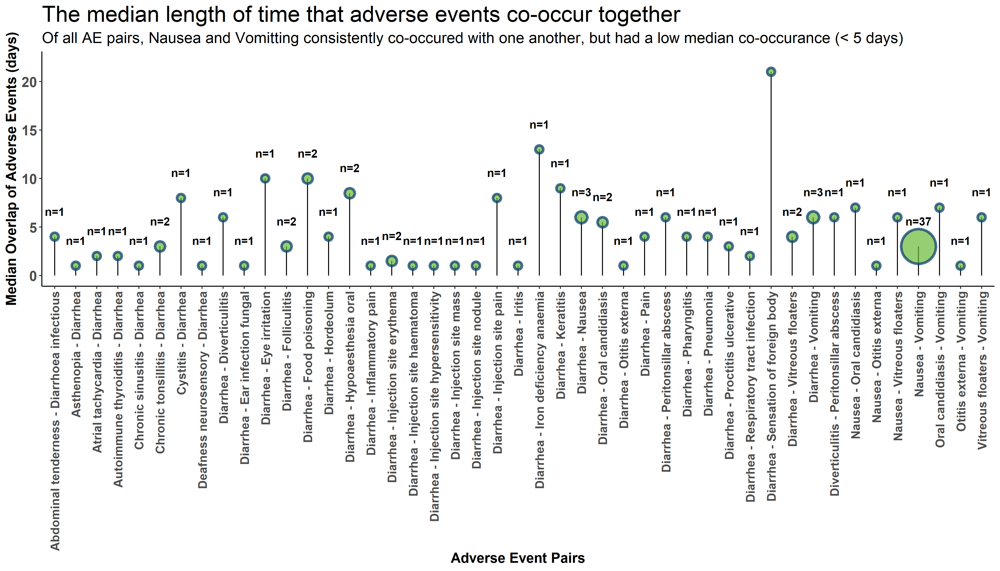
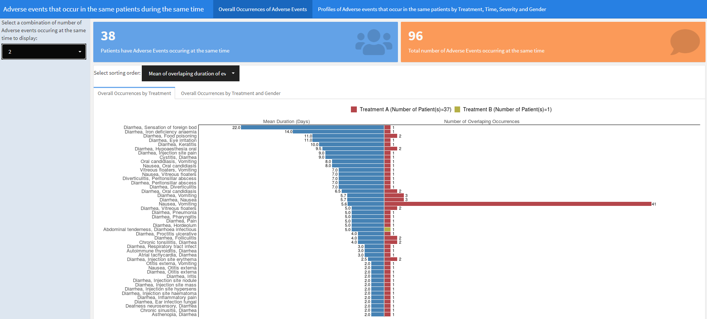
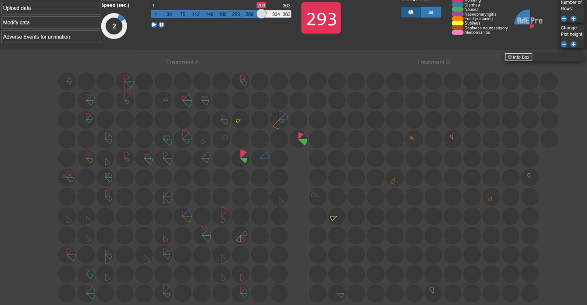
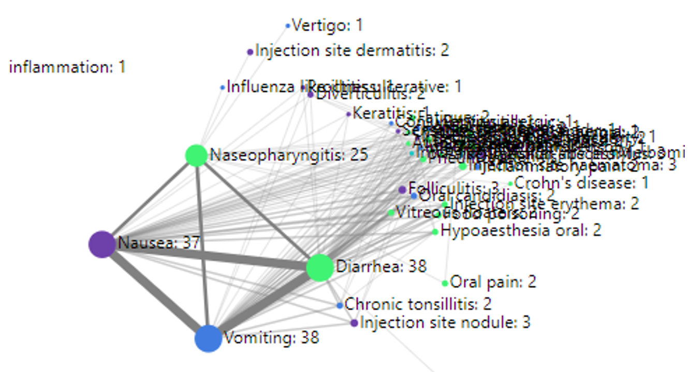

# *Adverse Event Co-Occurrence Challenge*

This month's challenge was based on a clinical trial for the treatment of Type II diabetes in adults that cannot manage their blood glucose control with a single oral therapy. The primary outcome in the trial was mean HbA1c at 6 months, and adverse events (AEs) were monitored and collected for the entire course of the study.

The data visualisation objectives were focussed on AEs, and were defined as follows:

* To quickly identify groupings of AEs that occur in the same patients at the same time in Treatment A.
* Do these groupings occur in Treatment B?
* Is there a difference based on sex?
* Are adverse events in these groupings severe?

The dataset is available [here](https://github.com/VIS-SIG/Wonderful-Wednesdays/tree/master/data/2020/2020-09-09).

<a id="example1"></a>

## <span style="color:blue">Example 1. Heat Map</span>


Included here is one of two heat map charts that were submitted. The graph shows pairs of AE terms represented as a grid, with one of each pair included on either the horizontal or vertical axis, and with the frequency of co-occurrences of each pair of terms being colour-coded. The plot shows quite clearly that Nausea and Vomiting are terms that co-occur at the highest frequency. 

The judging panel suggested a few possible enhancements. There is quite a lot of white space in this plot, and it was felt this plot might be more useful for exploring a larger dataset containing many co-occurring terms. It would then be useful to be able to limit the data displayed to only include pairs of terms with a frequency above a cut-off value, to focus on the more prevalent co-occurrences. A more meaningful method of sorting the AE terms might also be helpful. A comment was made that the eye tends to be drawn towards the dark blue areas of the plot, whereas these only represent a relatively small number of patients. The real "story" in this plot, i.e. co-occurrence of Nausea/Vomiting, would perhaps come through more strongly if darker tones were used for increasing frequency. Also, adding some additional contextual information to the plot would help the user to better understand what is being shown (for example that the frequency relates to co-occurrences of the pairs of AE terms.) 

A general comment on heatmaps is that representing a variable on a continuous colour scale can make it difficult for the user to accurately translate the frequencies into a quantitative value. Therefore a further enhancement might be to create ordered categories for frequency of occurrence, comprising perhaps 5-7 bins.

[link to code](#example1 code)

<a id="example2"></a>

## <span style="color:blue">Example 2. Lollipop Chart</span>




This plot also shows the frequencies of co-occurring pairs of AE terms, but includes the additional dimension of showing the median time of co-occurrence as a lollipop chart. When representing a quantitative measure as the distance along an axis, common choices of chart type are often either bar charts or dot plots. The latter is sometimes preferred because of the lower "data to ink ratio" (as proposed by Edward Tufte) which may produce a plot with a clearer message. The lollipop chart is a compromise between these two options, where the length of the "stick" represents, in this case, the median overlap time.  This leads to the possibility of using the stick to encode an additional variable, e.g. adding colour or line thickness, although care would be needed not to overcomplicate the graph.

The panel appreciated the fact that the title includes the key message that the chart is communicating. An enhancement might be to remove the "n=" labels above each "lollipop", as this information is already encoded in the size of the bubble, and would produce a cleaner looking plot. Also, the switching to a vertical format would make the labels easier to read, and meaningful sorting (e.g. by bubble size or median overlap) would enhance the chart. Also, perhaps applying a cut-off value (e.g. to remove the pairs of terms that only co-occur in a single patient) would be helpful. The above features are seen in some of the other submitted graphs (for example the Shiny App described in the next section). The graph is not providing a comparison of the two treatment groups, so this would be a further enhancement (e.g. splitting the graph into two panels in a vertical format).

[link to code](#example1 code)

<a id="example3"></a>

## <span style="color:blue">Example 3. RShiny App</span>




This Shiny App can be accessed by clicking [here](https://figplot.shinyapps.io/WW20201014/). The previous plots have focussed on pairs of co-occurring AE terms, but this app provides the ability to choose the number of co-occurring terms, i.e. 2-4 terms. The initial screen displays diverging bar charts, showing mean duration of co-occurring terms on the left side and number of patients with overlapping occurrences on the right side, split by treatment group. The AE terms can be sorted by mean duration or frequency of co-occurrences, and the data can also be split by treatment and gender.  The app can also display individual patient-level profiles with various display and filtering options.

The app was well received as a very useful and flexible tool for exploring the data. One of the design features that were appreciated included the inclusion of the statistic at the end of the bars. For the diverging bar charts, a legend is shown representing treatment group categories, but this colour-coding only seems to apply to the right-hand side of the diverging bar chart, i.e. showing the frequency of co-occurrences. However it wasn't clear whether bar chart on left-hand side, showing the mean duration, were also split by treatment, and if so, what colour-coding scheme would apply to this part of the chart. (This is not clear because no combinations of AE terms occurred in more than one treatment group)

A further enhancement might be for the user to be able to choose cut-off values for the number of co-occurring terms (e.g. >=2 terms, >=3 terms) rather than having to choose the exact number of terms. A further comment on the design is that the numbers at the top of the screen, showing the total number of patients and total number of AEs occurring at the same time, are disproportionately large and reminiscent of an "infographic" style (which is not popular with some members of the panel). These numbers could be moved elsewhere (e.g. panel on the left containing a lot of blank space) to draw more attention to the main plot.

<a id="example4"></a>

## <span style="color:blue">Example 4. Upset Plot</span>


This is a useful plot for displaying frequency counts where there is interest in the intersections of different categories, having a similar function to a Venn diagram but being much more practical where there are more than three categories. (It will always be possible to produce an Upset plot, regardless of the number of categories, whereas a Venn diagram quickly becomes impossible to produce or interpret beyond 4 or 5 categories.) The vertical bar chart shows the size of the various intersections (which is highlighting that Nausea and Vomiting is the most frequently-occurring pair of terms), and the horizontal bar chart shows the frequency of each individual category (showing that overall, Nasopharyngitis, Nausea and Vomiting are the most frequent, with a dramatic drop-off in the frequencies of other terms).

The plot requires a fair amount of explanation, and would work well with stakeholders who are already familiar with the format. It wouldn't work so well at a conference, for example, where there isn't the opportunity to explain the graph. Improved labelling (e.g. interpretation of "Intersection Size") would make the graph easier to understand.

Where there is a large number of categories (as in this example), displaying all of the combinations of categories is limited by the display area of the plot. In this case a "cut-off" has been applied to limit to an intersection size of 20. Ideally the graph would include interactivity, to allow the user to define which categories are displayed. In addition, the aspect ratio is challenging to display in a landscape screen, so flexibility in the layout of the various charts would be useful.

[link to code](#example4 code)

<a id="example5"></a>

## <span style="color:blue">Example 5. ADEPRO</span>




This app provides interactive exploration of AE data at the individual patient level. Each patient is represented as a grey circle, with coloured wedges within each circle mapped to different adverse event terms. Clicking the play button starts an animation running, with the elapsed time since the start of the study shown as a blue bar at the top of the screen. As time progresses,  filled coloured wedges appear within the grey circles at the appropriate time of onset of each respective AE. Coloured outline wedges represents AEs have occurred at a previous time during the study but have resolved.

Applying this app to the current challenge, co-occurring AE terms can be viewed by running the animation and observing circles with more than one coloured wedge at the same time. The outlined wedges, representing resolved AEs, did not necessarily co-occur, so the app relies on the user manually identifying the co-occurring AEs in real time as the animation progresses. The app doesn't provide an overall summary, so requires some input from the user to produce any required statistics, e.g. frequency counts, after viewing the animation.

[link to code](#example5 code)

<a id="example6"></a>

## <span style="color:blue">Example 6. Network</span>




The network diagram shown is a screenshot from an interactive app, which produces a network diagram displaying AE terms as nodes. The size of each node represents the incidence rate, and nodes are connected according to whether they co-occur in the same subject. The thickness of the lines represents the strength of the association in terms of frequency of co-occurrences. The nodes are colour-coded to represent the severity of the AEs. When each node in the network is clicked on, this displays all other AE terms that co-occurred with the selected term. The app also includes options for filtering the data, selecting the minimum and maximum frequency, and also defining the time window used for co-occurrences (e.g. AEs at exactly the same , within a +/- 2 day window etc.).  Further filter options include severity and gender. The app also includes useful display options, e.g. font size.

Although the plot is visually complex in terms of the large number of AE terms with overlapping terms and many connecting lines, in this case the message is quite clear because only four AE terms are dominant in the graph.

<a id="example7"></a>

## <span style="color:blue">Example 7. Apriori Algorithm</span>


This is an example of a Power BI dashboard, with a set of interactive filters on the left part of the screen, and right panel displaying the output from an algorithm called Apriori. The right panel displays a series of coloured nodes of varying size and colour saturation, and with arrows entering and leaving the circles at various points. The dynamic updating of the plot, by clicking on the filters, was a useful feature that was appreciated by the panel, as were several aspect of the design that are visually appealing and quite effective.

However the algorithm behind the plot was not familiar to the panel, who therefore struggled to interpret the message behind the graph. It was concerning that some of the associations that were strongly identified in some of the other plots (e.g. strong co-occurrence of Nausea and Vomiting) was not clearly shown in this plot.

# <span style="color:red">*Code*</span>

<a id="example1 code"></a>

## <span style="color:red">Examples 1 and 2. Heat Map and Lollipop Plot</span>

```{r, echo = TRUE, eval=FALSE}
library(tidyverse)
#Colour scheme
Orange <- "#EF7F04"
Green <- "#68B937"
Blue <- "#00A6CB"
Grey <- "#4E5053"
Darkblue <- "#003569"
Yellow <- "#FFBB2D" 
GreyedOut <- "#D3D3D3"

setwd("C:/Users/Q1062810/Documents/Wonderful Wednesday/AE2")

# Read in the data and make a unique subject ID based on the subjid and treatment
AE <- read.csv("AE.csv") %>%
  mutate(USUBJID = paste(Treatment, Subject, sep = '_')) %>%
  mutate(Adverse = as.character(Adverse))

#Make a dataset where subjects have more than one event (because we are looking for co-occurring events)
AE_events <- AE %>%
  group_by(USUBJID) %>%
  filter(n() > 1) %>%
  ungroup() %>%
  select(c(2,4,5,7,8,9)) %>% # Select the columns we care about
  rename(Adverse2=Adverse) %>% # Rename all the relevant variables  with a "2" as we will merge these back on to the initial dataset 
  rename(Start2 = Start) %>%
  rename(End2=End) %>%
  rename(System2=System) %>%
  rename(Severity2=Severity)
  
# Match merge the filtered data set onto the original data set by subject ID. 
# This gives us a data set which has every combination of AEs for all subjects which have more than 1 AE
AE_combined <- left_join(AE,AE_events) %>%
  rownames_to_column("combination_ID") %>%
  mutate(overlap = if_else(condition = Start >= Start2 & Start <= End2,true = 1, # Makes a flag to capture the events with overlap
                           false = if_else(condition=End >= Start2 & End <= End2, true = 1, 
                                           false = if_else(condition=Start2 >= Start & Start2 <= End, true = 1,
                                                           if_else(condition=End2 >= Start & End2 <= End, true = 1,false = 0))))) %>%
  mutate(different = if_else(condition= Adverse==Adverse2,true = 0,false = 1)) %>% # Makes a flag for all events where the AEs are duplicated as part of the merge process. this helps us remove these events
  mutate(Co_start = pmax(Start,Start2)) %>% 
  mutate(Co_end = pmin(End,End2)) %>%
  mutate(Time =Co_end - Co_start) %>% # Create a variable representing total overlap time
  filter(overlap==1 & different==1) %>% # filter just overlapping AEs  
  select(c("USUBJID","Adverse","Adverse2", "Time","Treatment")) %>% # Select relevant columns
  arrange(Adverse,Adverse2)


library(plyr)
AE_crosstab <- count(AE_combined, c('Adverse','Adverse2'))


plot <- ggplot(data = AE_crosstab, mapping = aes(x = Adverse,
                                       y = Adverse2,
                                       fill = freq)) +
  geom_tile() +
  xlab(label = "Adverse Event Name") +
  ylab(label = "Adverse Event Name") +
  theme(axis.text.x = element_text(angle =90, vjust =0.5, hjust=1))


plot 
ggsave("Co-occurance heat map v1.png",width = 35, height = 20, units = "cm")

#create function to sort within rows and make new var
f = function(x,y) {paste(sort(c(x, y)), collapse = " - ")}
f = Vectorize(f)


AE_crosstab <- AE_crosstab %>% mutate(dedup = f(Adverse, Adverse2))  %>%
  distinct(dedup, .keep_all=TRUE) %>%
  select(-dedup)

plot2 <- ggplot(data = AE_crosstab, mapping = aes(x = Adverse,
                                                 y = Adverse2,
                                                 fill = freq)) +
  geom_tile() +
  xlab(label = "Adverse Event Name") +
  ylab(label = "Adverse Event Name") +
  theme_classic() +
  theme(axis.text.x = element_text(angle =90,size=12, vjust =0.5, hjust=1, face="bold"), axis.text.y = element_text(size=14, face="bold"))+
  theme(plot.title = element_text(size=22)) +
  theme(plot.subtitle = element_text(size=15)) +
  theme(axis.title=element_text(size=14,face="bold"))

plot2

ggsave("Co-occurance heat map v2.png",width = 35, height = 20, units = "cm")

######TRY GGCORRPLOT #############

AE_combined2 <- AE_combined %>% mutate(dedup = f(Adverse, Adverse2)) %>%
  arrange(dedup,Time) %>% 
  group_by(USUBJID) %>%
  distinct(dedup, .keep_all=TRUE)%>%
  ungroup() %>%
  group_by(dedup) %>%
  mutate(position=rank(Time,ties.method = "first")) %>%
  ungroup() %>%
  rownames_to_column("Row")%>%
  mutate(Row=as.integer(Row))

AE_combined3 <- AE_combined %>% mutate(dedup = f(Adverse, Adverse2)) %>%
  arrange(dedup,Time) %>% 
  group_by(USUBJID) %>%
  distinct(dedup, .keep_all=TRUE)%>%
  ungroup() %>%
  group_by(dedup) %>%
  dplyr::summarise(Median_time = median(Time), patients = n()) %>%
  ungroup() 
 # %>%
 # filter(dedup!="Nausea - Vomiting")


data_label <- paste("n=",AE_combined3$patients,sep="")

plot5 <- ggplot(data = AE_combined3, mapping = aes(x = dedup,
                                                  y = Median_time)) +
  geom_segment(aes(x=dedup, xend=dedup, y=0, yend=Median_time)) +
  geom_point(aes(size=patients), color=Darkblue, fill=ggplot2::alpha(Green, 0.3), alpha=0.7, shape=21, stroke=2) +
  scale_size_area(max_size = 15) +
  geom_text(aes(label=data_label),size=4, vjust=-2.5, fontface="bold") +
  ylim(0, 22)+
  labs(y= "Median Overlap of Adverse Events (days)", x = "Adverse Event Pairs", title="The median length of time that adverse events co-occur together", subtitle = "Of all AE pairs, Nausea and Vomitting consistently co-occured with one another, but had a low median co-occurance (< 5 days)") +
  theme_classic() +
  theme(legend.position = "none", axis.text.x = element_text(angle =90,size=12, vjust =0.5, hjust=1, face="bold"), axis.text.y = element_text(size=14, face="bold"))+
  theme(plot.title = element_text(size=22)) +
  theme(plot.subtitle = element_text(size=15)) +
  theme(axis.title=element_text(size=14,face="bold"))


plot5 

ggsave("Co-occurance v2.png",width = 35, height = 20, units = "cm")

AE_combined4 <- AE_combined3 %>%
  group_by(patients) %>%
  arrange(Median_time) %>%
  rownames_to_column()

plot6 <- ggplot(data = AE_combined4, mapping = aes(x = dedup,
                                                   y = Median_time)) +
  geom_segment(aes(x=reorder(dedup, rowname), xend=dedup, y=0, yend=Median_time)) +
  geom_point(aes(x=reorder(dedup, rowname), size=patients), color=Darkblue, fill=ggplot2::alpha(Green, 0.3), alpha=0.7, shape=21, stroke=2) +
  scale_size_area(max_size = 15) +
  geom_text(aes(x=reorder(dedup, rowname),label=data_label),size=4, vjust=-2.5, fontface="bold") +
  ylim(0, 22)+
  labs(y= "Median Overlap of Adverse Events (days)", x = "Adverse Event Pairs", title="The median length of time that adverse events co-occur together", subtitle = "Of all AE pairs, Nausea and Vomitting consistently co-occured with one another, but had a low median co-occurance (< 5 days)") +
  theme_classic() +
  theme(legend.position = "none", axis.text.x = element_text(angle =90,size=12, vjust =0.5, hjust=1, face="bold"), axis.text.y = element_text(size=14, face="bold"))+
  theme(plot.title = element_text(size=22)) +
  theme(plot.subtitle = element_text(size=15)) +
  theme(axis.title=element_text(size=14,face="bold"))

  
```

[Back to blog](#example1)

<a id="example4 code"></a>

## <span style="color:red">Example 4. Upset Plot</span>

```{r, echo = TRUE, eval=FALSE}
# packages
pacman::p_load(tidyverse, rio)
pacman::p_load(labelled)
# devtools::install_github("krassowski/complex-upset")
library(ComplexUpset)

# import & recode ID & sort
ae <- import("https://raw.githubusercontent.com/VIS-SIG/Wonderful-Wednesdays/master/data/2020/2020-09-09/2020-09-09-fake-data_aes.csv") %>% 
   mutate(id = str_remove(Subject,"FAKE-DATA-") %>% 
             as.numeric(), 
          .after = Subject) %>% 
   arrange(id)

# 1 Duplicate
ae   %>% filter(id == 10084) %>% filter(`Adverse Event` == "Diarrhea")

# Remove Duplicate
ae <- ae %>% 
   distinct()

# export fixed file
ae %>% 
   export("C:/R/Wonderful-Wednesdays/2020-09-09/2020-09-09-fake-data_aes.csv.rds")

# extend to all days between adverse events
ae_l <- ae %>% 
   select(-Subject) %>% 
   pivot_longer(cols = 2:3,
                values_to = "day") %>% 
   group_by(id, `Adverse Event`, `Treatment`, System, Severity, Sex ) %>% 
   complete(day = seq(min(day), max(day), by = 1)) %>% 
   select(-name) %>% 
   ungroup() %>% 
   arrange(id, day)

# Add variables to wide data
ae_w2 <- ae_l %>% 
   select(id, day, Sex, Treatment, Severity, `Adverse Event`) %>%
   mutate(value = 1) %>%
   pivot_wider(id_cols = c("id","day","Treatment","Sex"),
               names_from = "Adverse Event",
               values_from = "value",
               values_fill	= 0) %>% 
   mutate(Treatment = factor(Treatment, labels = c("A","B")))
# You cannot do the analysis using severity because at each day there can be diverse severerities for
# different AE's overalapping

# Figure 2.1
upset(
   data = ae_w2,
   intersect = names(ae_w2)[-c(1:4)],
   min_size = 20,
   width_ratio = 0.25,
   height_ratio = 1,
   name  = NULL,
   queries=list(
      upset_query(
         intersect=c("Nausea","Vomiting"),
         color=  "#E41A1C",
         fill  =  "#E41A1C",
         
         only_components=c('intersections_matrix', 'Intersection size')
      )
   ),
   annotations = list(
      'Intersection Size\n(Treatment %)' = list(
         aes = aes(x=intersection, fill=Treatment ),
         geom = list(
            geom_bar(stat='count', position='fill'),
            geom_hline(yintercept = 0.5, col='gray90'),
            scale_y_continuous(labels=scales::percent_format()),
            scale_fill_brewer(palette = "Dark2")
         )
      ),
      'Intersection Size\n(Sex %)' = list(
         aes = aes(x=intersection, fill=Sex),
         geom = list(
            geom_bar(stat='count', position='fill'),
            geom_hline(yintercept = 0.5, col='gray90'),
            scale_y_continuous(labels=scales::percent_format()),
            scale_fill_manual(values = c("#E78AC3","#8DA0CB"))
         )
      )
   ),
   themes=upset_modify_themes(
      list('overall_sizes'= theme(axis.ticks.x = element_line()))
   )
) +
   labs(title = 'Co-Occurence of Daily AE Symptoms',
        caption = 'Symptoms with more than 20 days by Frequency: Total pool is 148 individuals for 2575 Daily AE Symptoms \n Lex, Alexander, et al. "UpSet: visualization of intersecting sets." IEEE transactions on visualization and computer graphics 20.12 (2014): 1983-1992.') +
   ggsave("C:/R/Wonderful-Wednesdays/2020-09-09/UpSet_plot.png",
          width = 11, height =10, units = "in")

```

[Back to blog](#example4)

<a id="example5 code"></a>

## <span style="color:red">Example 5. ADEPRO</span>

```{r, echo = TRUE, eval=FALSE}
##########################################################################################
## AdEPro for Wonderful Wednesday Webinar                                               ##
## Main purpose of this program: Restructure the example dataset to read it into AdEPro ##
##########################################################################################

# setwd("") # insert link to working directory

# read dataset and attribute column names
dat <- read.csv("2020-09-09-fake-data_aes.csv", sep=";", header=TRUE)
colnames(dat) <- c("SUBJID", "AESTDY", "AEENDY", "AEDECOD", "TRT01A", "SOC", "AESEV", "SEX")

n <- nrow(dat) # number of rows in dataset

## AE intensity must be numeric/integer and missing intensities are imputed with Moderate (2)
AESEVN <- as.integer(dat$AESEV); AESEVN[is.na(AESEVN)] <- 2

# Subject ID is not unique per treatment group, therefore the Subject ID receives a leading one for treatment A,
# and a leading 2 for treatment B, and only the numeric part of the original name is kept
TRT <- as.numeric(dat$TRT01A)
SJ <- substr(dat$SUBJID, 11, 15)
SUBJIDN <- as.integer(sapply(1:n, function(x) as.numeric(paste(TRT[x],SJ[x],sep=""))))

# other required variables for AdEPro are added: safety analysis set flag (assumed as Yes), death date (always missing),
# last visit date (date of overall last AE end date for all patients), treatment start date (set to 1 for all patients),
# treatment-emergent, serious and study drug related flag (always assumed as Yes)
dat.rest <- data.frame(SAFFN=as.integer(rep(1,n)), DTHDT=as.factor(rep(".",n)), LVDT=rep(max(dat$AEENDY),n), 
                       TRTSDT=as.integer(rep(1,n)),
                       SUBJIDN=SUBJIDN, AETRTEMN=as.integer(rep(1,n)), AESEVN=AESEVN, 
                       AESERN=as.integer(rep(1,n)), AERELN=as.integer(rep(1,n)))

# merge all together and write out AE dataset
dat_all <- cbind(dat, dat.rest)[,c(13,4,2,3,15,14,5,12,11,10,8,9,1,16,17)]
write.csv(dat_all, file="2020-09-09-fake-data_aes_modified.csv", row.names=FALSE, na=".")
# the generated dataset should be used under "Upload Adverse Event data" after starting the adepro app


# create additional subject level dataset to get all combinations of subject ID and treatment group 

subjects <- sort(unique(SJ)); N <- length(subjects) # all unique subjects
subjects_trt <- c(paste(1,subjects,sep=""),paste(2,subjects,sep="")) # all combinations subjects - treatment
subjects2 <- rep(paste("FAKE-DATA-",subjects,sep=""),2)

# get all AE data to merge with subject-treatment combinations
dat_all_sub <- unique(dat_all[,c(8:13)])
dat_sj0 <- data.frame(SUBJIDN=subjects_trt, SUBJID=subjects2,
                      TRT01A=rep(c("Treatment A", "Treatment B"), each=N))
dat_sj <- merge(dat_sj0, dat_all_sub, by = "SUBJID")

write.csv(dat_sj, file="2020-09-09-fake-data_subjects.csv", row.names=FALSE, na=".")
# the generated dataset should be used under "Upload Subject Level data" after starting the adepro app


# Load AdEPro
library(adepro)
launch_adepro() # launches the adepro app
# after the page is loaded, one can upload the adverse event and subject level dataset in the "Upload data" panel
```

[Back to blog](#example5)

