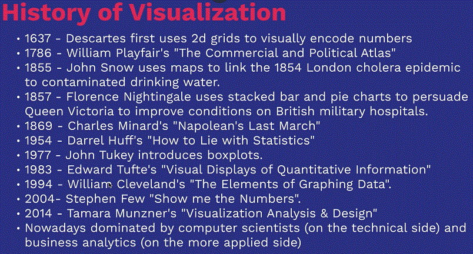
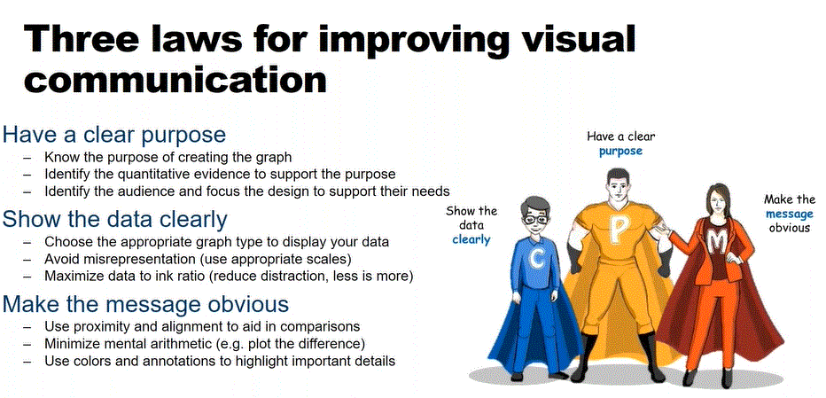
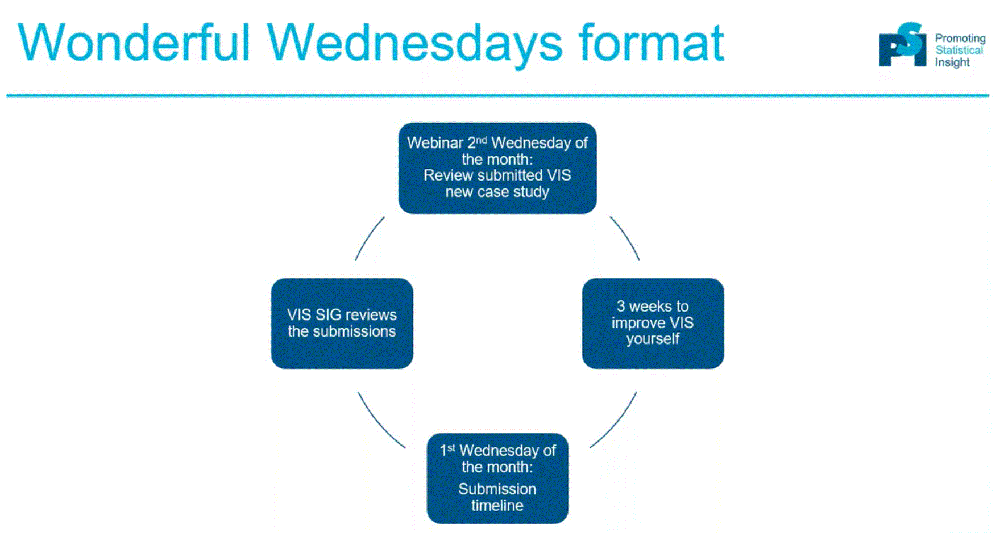

Welcome to the first blog entry of the Wonderful Wednesdays (WW) initiative! The aims of WW comprise to raise awareness about the opportunities in VIS and aims to increase the visualization expertise. Also, a gallery of relevant examples will be created.

# Why is visualization important?
We presented a couple of (famous) examples which show the importance of visualization. For example, based on summary statistics only, you most likely cannot fully understand the data (
Anscombe's quartet), but you need a graphical perspective as well. Also, we can see that there is a already some history of visualization:

[high-resolution image](./images/vishis.GIF)  
See more in the webinar!

# Learn about principles of visualization
Effective visualization is effective visual communication! The following three laws aim to improve visual communication:

[high-resolution image](./images/3lawsvis.GIF)  
Firstly, have a clear purpose, i.e. ask yourself WHY you are doing the visualization, look WHAT is the quantitative evidence to support the purpose, identify WHO is the audience, and WHERE the visualization will be shown. The second law is to show the data clearly: Determine the best type of plot to support your aim and show the right scale of your data
Lastly, make the message obvious (e.g. use informative labels or use color only if it adds value).
A good overview of principles of effective communication can be found [here](https://graphicsprinciples.github.io/)

# How you can participate in Wonderful Wednesdays
The WW (wonderful Wednesdays) is a learning community which aims to improve data visualizations. The participation is free for everybody and the process is as follows:

[high-resolution image](./images/format.gif)  
The data can be accessed and downloaded [here](https://github.com/VIS-SIG/Wonderful-Wednesdays). You can then submit your proposal (visualization + code) via this google [form](https://docs.google.com/forms/d/e/1FAIpQLSdNAaiuUAD89LAdQm5KNnLWs-MjqA4pzX2VHAwN7iqwoKpi-Q/viewform)
# Data example
The first data set is based on a clinical trial for the treatment of Psoriasis in aduts. The primary outcomes is measured in terms of PASI improvement relative to baseline, i.e. we are interested in at least 75% (PASI75), at least 90% (PASI90), and 100% (PASI100) reduction compared to baseline. A more detailed description and link to the data can be found [here](https://github.com/VIS-SIG/Wonderful-Wednesdays/tree/master/data/2020/2020-03-11).