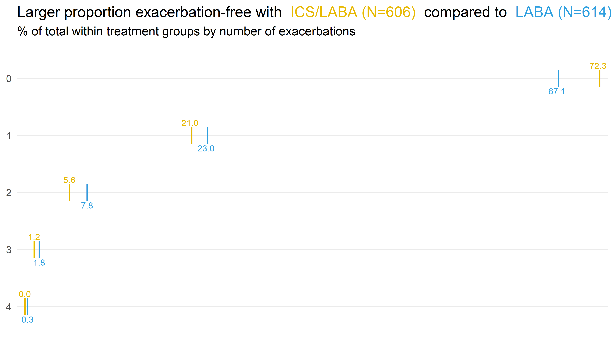

# Event data - COPD example data

Chronic Obstructive Pulmonary Disease (COPD) is a respiratory disease characterised by difficulty breathing and has increased mortality. An exacerbation can be life-threatening if not treated promptly. Data is based on the RISE study for patients with [moderate COPD](https://www.resmedjournal.com/article/S0954-6111(17)30314-1/fulltext).

The primary endpoint is the number of exacerbations during a six month treatment period. Event data - but patients can (and do) have multiple exacerbations. Statistical analysis used a Negative Binomial model.
[here](https://github.com/VIS-SIG/Wonderful-Wednesdays/tree/master/data/2020/2020-07-08).


<a id="example1"></a>

## Example 1. Dotplot


[high-resolution image](./images/dotplot - Markus Vogler.png)  

(A summary of the discussion will be added soon.)

[link to code](#example1 code)  


<a id="example2"></a>

## Example 2. Power BI app


[high-resolution image](./images/plot_triangle_AE.png)  

The app can be found [here](https://app.powerbi.com/view?r=eyJrIjoiYjM1YjBlMDEtYTk2OS00Mjk4LWIzMTMtZWIwYjllMzI0YzcwIiwidCI6ImY1NTgwM2MzLTRmYTktNDIzMy1hOGFiLTIxM2I3ZWI3MjEzNCJ9).

(A summary of the discussion will be added soon.)

[link to code](#example2 code)  


<a id="example3"></a>

## Example 3. Line plot


[high-resolution image](./images/plot_ww2020_08 - Steve Mallett.png)  

(A summary of the discussion will be added soon.)

[link to code](#example3 code)  


<a id="example4"></a>

## Example 4. Individual data


[high-resolution image](./images/Yearly Adjusted.PNG)  
[high-resolution image](./images/Probability Adjusted.PNG)  

(A summary of the discussion will be added soon.)

[link to code](#example4 code)  


# Code

<a id="example1 code"></a>

## Example 1. Dotplot (R)
```{r, echo = TRUE, eval=FALSE}
### Load packages
library(here)
library(tidyverse)
library(ggtext)

### Load data
data <- data.frame(read_delim(here("2020-07-08-COPD-PSI-data.csv"), delim=','))
data$ANTHONISEN <- fct_rev(factor(data$ANTHONISEN)) # reverse factor for plotting

### Get percentage for number of exacerbations by treatment group
freq <- data %>% group_by(RAND_TRT, ANTHONISEN, .drop = F) %>% summarise(n = n()) %>% mutate(freq = 100 * n / sum(n))
freq$freq_label <- format(round(freq$freq, 1), nsmall = 1)

### Add N's to treatment group labels
N <- data %>% group_by(RAND_TRT) %>% summarize(N = n())

### Create label variable including number of subjects
freq_n <- merge(freq, N, by = "RAND_TRT")
freq_n$RAND_TRT_L <- paste0(freq_n$RAND_TRT, " (N=", freq_n$N, ")")

### Colors
fill <- c("#E7B800", "#2E9FDF")

### Plot
ggplot(freq_n, aes(x = ANTHONISEN, y = freq, color = RAND_TRT)) +
  # Set minimal theme and flip x/y-axes
  theme_minimal(base_size = 20) +
  coord_flip() +
  # Plot points
  geom_point(position = position_dodge(width = 0), shape = 124, size = 10) +
  # Plot annotations (different positions by treatment group)
  geom_text(data = freq[freq$RAND_TRT == "ICS/LABA",], aes(label=freq_label, x=ANTHONISEN, y=freq), hjust=0.6, vjust=-1.5, size = 5) +
  geom_text(data = freq[freq$RAND_TRT == "LABA",], aes(label=freq_label, x=ANTHONISEN, y=freq), hjust=0.6, vjust=2.5, size = 5) +
  # Color treatment group labels in title
  labs(title = paste("Larger proportion exacerbation-free with <span style='color:", fill[1], "'>", unique(freq_n$RAND_TRT_L)[1], 
                     "</span> compared to <span style='color:", fill[2], "'>", unique(freq_n$RAND_TRT_L)[2], "</span>"),
       subtitle = "% of total within treatment groups by number of exacerbations") +
  theme(plot.title = element_markdown()) +
  # Set colors and remove legend (in comments: code to color treatment group labels in legend)
  #scale_color_manual(labels = paste("<span style='color:", fill, "'>", unique(freq$RAND_TRT), "</span>"), 
  #                   values = fill, name = NULL) +   
  #theme(legend.text = element_markdown(size = 12), legend.position = c(0.1, 0.89)) +
  #guides(colour = guide_legend(override.aes=list(size=0))) +
  scale_color_manual(values = fill) +
  theme(legend.position = "none") +
  # Remove clutter
  scale_y_continuous(expand = c(0,1)) +
  theme(axis.title.x = element_blank(), axis.text.x=element_blank(), 
        panel.grid.major.x = element_blank(), panel.grid.minor.x = element_blank()) +
  scale_x_discrete(name = NULL) +
  NULL

ggsave(file = here("dotplot.png"), width = 35, height = 20, units = "cm")
```


[Back to blog](#example1)


<a id="example2 code"></a>

## Example 2. Power BI app
```{r, echo = TRUE, eval=FALSE}

```

[Back to blog](#example2)


<a id="example3 code"></a>

## Example 3. Line plot
### R:
```{r, echo = TRUE, eval=FALSE}
####################################################################
# Program name: COPD_exacs_STEPP.R
# Purpose: To produce a STEPP plot for COPD exacerbations 
#          examining age and FEV1
#         (for Wonderful Wednesdays Aug 2020)
# Written by: Steve Mallett
# Date: 31-Jul-2020
####################################################################

library(haven)
library(ggplot2)
library(grid)
library(gridExtra)

copd_age <- read_sas("/.../plot_ww2020_08.sas7bdat") %>%
  filter(var == "age_n")
  
plot01 <- ggplot() +
  geom_ribbon(data = copd_age, aes(x = median, ymin = LowerExp, ymax = UpperExp), fill = "#b2e2e2", alpha = .5) +
  geom_line(data = copd_age, aes(x = median, y = ExpEstimate), color = "#006d2c", size = 0.5 ) +  
  geom_segment(aes(x=53, xend=72, y=0.82, yend=0.82), linetype = 2, color = "black") +
  scale_x_continuous("Age (years)",
                     # breaks=c(55, 60, 65, 70),
                     # labels=c(55, 60, 65, 70),
                     limits=c(53, 72)) +
  scale_y_log10(" ",
                breaks=c(0.4, 0.6, 0.8, 1.0, 1.2, 1.4, 1.6),
                limits=c(0.4, 1.6)) +
  theme_minimal() +
  theme(legend.position="none",
        text = element_text(size = 15),
        axis.ticks.x = element_blank(),
        axis.ticks.y = element_blank(),
        axis.text.x =  element_text(size = 20),  
        axis.text.y =  element_text(size = 20),        
        axis.title.x = element_text(size = 20),
        axis.title.y = element_text(size = 20),
        plot.title = element_text(hjust = 0.5, size = 25),
        panel.border = element_rect(colour = "black", fill=NA, size=0.25),
        # panel.grid = element_blank(),
        plot.margin=unit(c(0,0,0,0),"cm")) +
  ggtitle(label = " ")

copd_fev <- read_sas("/shared/175/arenv/arwork/gsk1278863/mid209676/present_2020_01/code/COPD/plot_ww2020_08.sas7bdat") %>%
  filter(var == "fev1_rv")

plot02 <- ggplot() +
  geom_ribbon(data = copd_fev, aes(x = median, ymin = LowerExp, ymax = UpperExp), fill = "#bdd7e7", alpha = .5) +
  geom_line(data = copd_fev, aes(x = median, y = ExpEstimate), color = "#08519c", size = 0.5 ) +  
  # geom_hline(yintercept = 0.82, linetype = 2, color = "black", size = 0.5) +
  geom_segment(aes(x=34, xend=60, y=0.82, yend=0.82), linetype = 2, color = "black") +
  scale_x_continuous("FEV1 (% predicted)",
                     breaks=c(34, 40, 45, 50, 55, 60),
                     labels=c(35, 40, 45, 50, 55, 60),
                     limits=c(34, 60)) +
  scale_y_log10(" ",
                breaks=c(0.4, 0.6, 0.8, 1.0, 1.2, 1.4, 1.6),
                limits=c(0.4, 1.6)) +
  theme_minimal() +
  theme(legend.position="none",
        text = element_text(size = 15),
        axis.ticks.x = element_blank(),
        axis.ticks.y = element_blank(),
        axis.text.x =  element_text(size = 20),  
        axis.text.y =  element_text(size = 20),        
        axis.title.x = element_text(size = 20),
        axis.title.y = element_text(size = 20),
        plot.title = element_text(hjust = 0.5, size = 25),
        panel.border = element_rect(colour = "black", fill=NA, size=0.25),
        # panel.grid = element_blank(),
        plot.margin=unit(c(0,0,0,0),"cm")) +
  ggtitle(label = " ")

g <- grid.arrange(plot01, plot02, ncol =1, nrow = 2,
                  left = textGrob("Rate Ratio (ICS+LABA / LABA)", rot = 90, gp = gpar(fontsize=20)),
                  top = textGrob("ICS+LABA Reduces COPD Exacerbation Rate by 18 Percent Compared\n to LABA, Consistently Across Age and Lung Function Values", gp = gpar(fontsize=25)),
                  bottom = textGrob("\nAnalysis performed using a negative binomial regression model adjusting for number of previous \nexacerbations and region. Sliding window STEPP plots, using overlapping subgroups (N=350).", gp = gpar(fontsize=18)))

ggsave("/.../plot_ww2020_08.png", g, width=12, height=12, dpi=300)
```

### SAS:
```{r, echo = TRUE, eval=FALSE}
libname outdata "H:\arwork\gsk1278863\mid209676\present_2020_01\code\COPD";

PROC IMPORT OUT= WORK.copd 
            DATAFILE= "C:\Users\sam31676\OneDrive - GSK\_Non Project\Data Visualisation\PSI data vis SIG\Wonderful Wednesdays\2020 08\ww08.txt" 
            DBMS=CSV REPLACE;
     GETNAMES=YES;
     DATAROW=2; 
RUN;

data copdx;
  set copd;
  fu_years=study_days_n/365.25;
  logfu=log(fu_years);
run;

* Fit overall model;

proc genmod data=copdx;
  class rand_trt prev_exac region;
  model anthonisen = rand_trt prev_exac region fev1_rv /dist=negbin link=log offset=logfu type3; 
  lsmeans rand_trt / diff exp cl om;
run;

* Main macro to create plot data;

%macro create(id=, var=, class=, covars=);
proc sort data=copdx;
  by &var;
run;

options nosymbolgen mprint;
%let r1=50;
%let r2=350;
%let n = 1221;

%macro split;
%global m;
%let i = 0;
%let low = 1;
%let high = %eval(&r2);

%do %until (&high > &n);
  %let i = %eval(&i+1);

  data copd&i;
    set copdx;
	if _n_ >= &low and _n_ <= &high;
    group = &i;
	run;

  %let low = %eval(&low+&r1);
  %let high = %eval(&low+&r2-1);
  %let m = &i;
  %end;

%mend split;
%split;

%macro combine;
data copd_all;
  set 
  %do i = 1 %to &m;
    copd&i
	%end;
	;
run;
%mend combine;
%combine;

proc means data=copd_all noprint;
  by group;
  var &var;
  output out=med(keep=group median) median(&var)=median;
run;

ods output diffs=diffs;

proc genmod data=copd_all;
  by group;
  class &class;
  model anthonisen = &covars/dist=negbin link=log offset=lnstudyday; 
  lsmeans rand_trt / diff exp cl om;
run;
quit;

data plot&id;
  merge diffs(keep=group ExpEstimate lowerexp upperexp) med;
  by group;
  var="&var";
run;
%mend create;
%create(id=1, var=fev1_rv, class=%str(rand_trt prev_exac region), covars=%str(rand_trt prev_exac region));
%create(id=2, var=age_n, class=%str(rand_trt prev_exac region), covars=%str(rand_trt prev_exac region));

data outdata.plot_ww2020_08;
  set plot1 plot2;
run;
```

[Back to blog](#example3)


<a id="example4 code"></a>

## Example 4. Individual data
```{r, echo = TRUE, eval=FALSE}
library(tidyverse)
library(RColorBrewer)
library(readxl)

#Colour scheme
Orange <- "#EF7F04"
Green <- "#68B937"
Blue <- "#00A6CB"
Grey <- "#4E5053"
Darkblue <- "#003569"
Yellow <- "#FFBB2D" 
GreyedOut <- "#D3D3D3"

setwd("C:/Users/philip.griffiths/OneDrive - OneWorkplace/Documents/Wonderful Wednesday/Exacerbations")

#Read in a dataset and create a flag value for exacerbations >=1
exacerbations <- read_csv("2020-07-08-COPD-PSI-data.csv")  %>%
  mutate(flag = as.numeric(ifelse(ANTHONISEN >= 1, "1", "0")))

#linear regression to adjust number of exacerbations based on Baseline values
Model <- lm(ANTHONISEN ~ FEV1_RV + PREV_EXAC + AGE_C + GENDER + SMOKER + AIRFLOW, data = exacerbations)

#logistic regression to determine the probability of >=1 exacerbation adjusted for baseline
LogisticModel <- glm(flag ~ FEV1_RV + PREV_EXAC + AGE_C + GENDER + SMOKER + AIRFLOW,data = exacerbations,family = binomial)

#Check out the models. I actually removed region. it was highly sig, but I dont have a theoretical reason for that, and also just loads of US
summary(Model)
summary(LogisticModel)

#Make an "adjusted" exacerbation rate and a probability exacerbation
Adjusted <- predict(Model, data = exacerbations)
Prob <-predict(LogisticModel, type = "response")

#add the ajusted and probability columns to the main dataset. make adjusted exacerbations per year
#Sequence1 is a consecutively ordered variable for the waterfall plot later on
exacerbations_pred <- add_column(exacerbations, adjust=Adjusted) %>%
  add_column(prob=Prob) %>%
  mutate(years=STUDY_DAYS_N/365) %>%
  mutate(ratio=adjust / years) %>%
  arrange(ratio) %>%
  add_column(sequence1 = 1:nrow(exacerbations))

#create two datasets (one for treat and one for control) and test the difference between them
treat <-exacerbations_pred %>%
  filter(RAND_TRT=="ICS/LABA")

control <- exacerbations_pred %>%
  filter(RAND_TRT=="LABA")
  
wilcox.test(treat$ratio, control$ratio,paired=FALSE)

whichmedian <- function(x) which.min(abs(x - median(x)))

#Median patient on treatment for reference line
TreatMed <- exacerbations_pred %>%
  filter(RAND_TRT=="ICS/LABA") %>%
  slice(whichmedian(ratio))

#Median patient on control for refeence line
ControlMed <- exacerbations_pred %>%
  filter(RAND_TRT=="LABA") %>%
  slice(whichmedian(ratio))

#create plot
p <- exacerbations_pred %>%
  ggplot() +
  geom_col(aes(x=sequence1, y=ratio, fill=RAND_TRT, color=RAND_TRT)) + #column - aes takes seq1 for the x as this is the reordered Ps. Need fill and colour so that the col outlines are the correct colour
  ggtitle("Group level advantage for ICS/LABA patients was replicated at the\npatient level using demographic adjusted yearly exacerbation rate") + #titles etc
  xlab("Patients, in order of adjusted exacerbation probability") +
  xlab("Patients, in order of adjusted exacerbations per year") + 
  ylab("Adjusted exacerbations per year") +
  geom_vline(aes(xintercept = sequence1), linetype='dashed', col = Darkblue, TreatMed)  + #reference lines for median treatment response and median control response
  geom_vline(aes(xintercept = sequence1), linetype='dashed', col = Green, ControlMed)  +
  scale_fill_manual(values=c(Darkblue, Green), name = "Condition", labels = c("Treatment\n(ICS/LABA)", "Control\n(LABA)")) + #make sure that the col and legend have the chosen colors. Update legend text
  scale_colour_manual(values=c(Darkblue, Green)) + #make sure the outlines for the cols are also coloured in line with the above
  guides(color = FALSE, size = FALSE) + # remove legend for the col outline
  theme(axis.text.x=element_blank(), # remove the participant numbers 
        axis.ticks.x=element_blank()) + # remove x-axis ticks
  theme (plot.title = element_text(family = "sans", color=Grey, face="bold", size=22, hjust=0.5)) + #Edit font
  theme (axis.title = element_text(family = "sans", color=Grey, face="bold", size=22)) + #Edit font
  theme(panel.background = element_blank()) # blank out the background

p + annotate(geom = "text", x = (ControlMed$sequence1 + 3), y = 3, label = "Median difference", hjust = "left", size = 6) + #add text higlighting the median
  annotate(geom = "segment", y = 3, yend = 3, x = (TreatMed$sequence1 + 3), xend = (ControlMed$sequence1 - 3), 
           arrow = arrow(length = unit(3, "mm"))) + #this controls the arrow heads
  annotate(geom = "segment", y = 3, yend = 3, x = (ControlMed$sequence1 - 3), xend = (TreatMed$sequence1 + 3), 
           arrow = arrow(length = unit(3, "mm")))

#additional manipulation to reorder the dataset based on probability of exacerbation and creaion of a consecutive numbering (sequence2)
exacerbations_pred <- exacerbations_pred %>%
  arrange(prob) %>%
  add_column(sequence2 = 1:nrow(exacerbations))

#create two datasets (one for treat and one for control) and test the difference between them
treat <-exacerbations_pred %>%
  filter(RAND_TRT=="ICS/LABA")

control <- exacerbations_pred %>%
  filter(RAND_TRT=="LABA")

wilcox.test(treat$prob, control$prob,paired=FALSE)

#Median patient on treatment for ref line
TreatMed <- exacerbations_pred %>%
  filter(RAND_TRT=="ICS/LABA") %>%
  slice(whichmedian(prob))

#Median patient on control for ref line
ControlMed <- exacerbations_pred %>%
  filter(RAND_TRT=="LABA") %>%
  slice(whichmedian(prob))

#see above plot for comments
q <- exacerbations_pred %>%
  ggplot() +
  geom_col(aes(x=sequence2, y=prob, fill=RAND_TRT, color=RAND_TRT)) +
  ggtitle("Group level advantage for ICS/LABA patients was replicated at the patient \n level showing higher probability of Exacerbations for Control patients") + 
  ylab("Adjusted probability of >=1 exacerbation") +
  xlab("Patients, in order of adjusted exacerbation probability") + 
  geom_vline(aes(xintercept = sequence2), linetype='dashed', col = Darkblue, TreatMed)  +
  geom_vline(aes(xintercept = sequence2), linetype='dashed', col = Green, ControlMed)  +
  scale_fill_manual(values=c(Darkblue, Green), name = "Condition", labels = c("Treatment\n(ICS/LABA)", "Control\n(LABA)"))+
  scale_colour_manual(values=c(Darkblue, Green)) + 
  guides(color = FALSE, size = FALSE) +
  theme(axis.text.x=element_blank(), 
        axis.ticks.x=element_blank()) + 
  theme (plot.title = element_text(family = "sans", color=Grey, face="bold", size=22, hjust=0.5)) + 
  theme (axis.title = element_text(family = "sans", color=Grey, face="bold", size=22)) + 
  theme(panel.background = element_blank()) 

 
q + annotate(geom = "text", x = (ControlMed$sequence2 + 3), y = 0.6, label = "Median difference", hjust = "left", size = 6) +
  annotate(geom = "segment", y = 0.6, yend = 0.6, x = (TreatMed$sequence2 + 3), xend = (ControlMed$sequence2 - 3), 
           arrow = arrow(length = unit(3, "mm"))) +
  annotate(geom = "segment", y = 0.6, yend = 0.6, x = (ControlMed$sequence2 - 3), xend = (TreatMed$sequence2 + 3), 
           arrow = arrow(length = unit(3, "mm")))
```

[Back to blog](#example4)