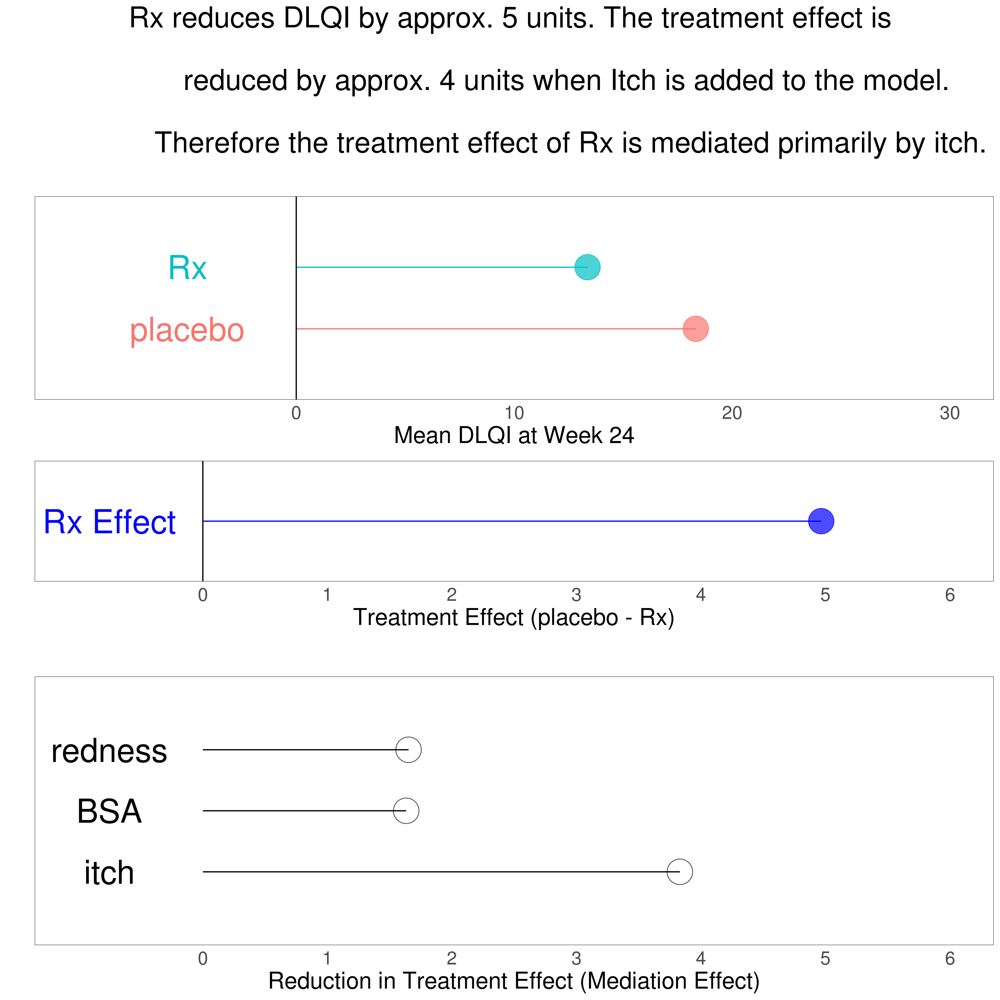
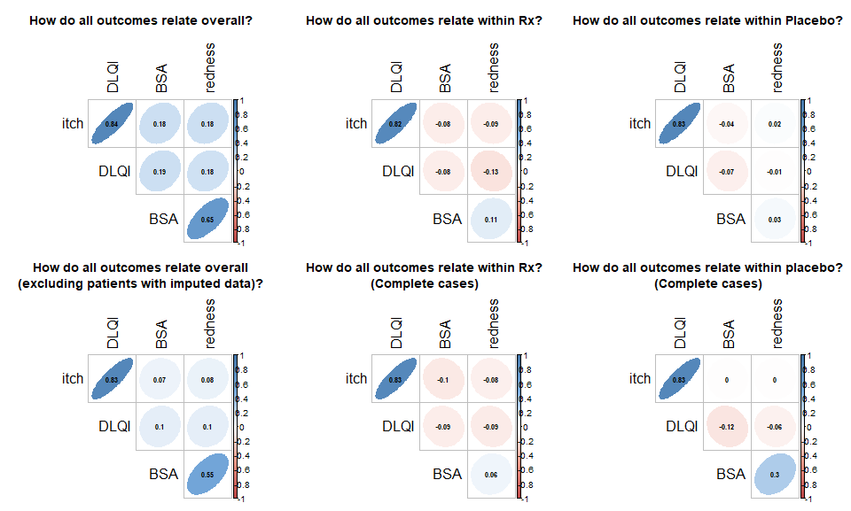
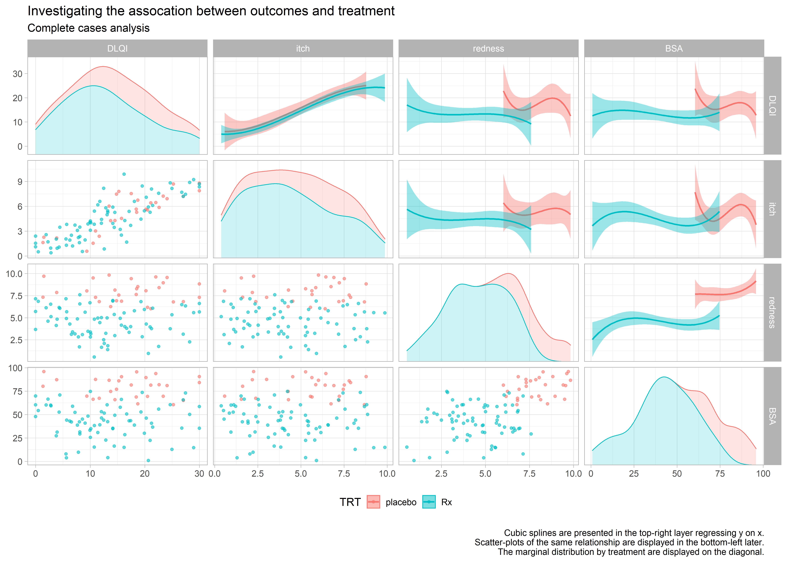

# Mediator effect example data set

The purpose of this exercise is to develop data visualization techniques to illustrate that one variable is a mediator for a treatment effect and that this mediator effect is stronger than in other variables. A more detailed description and link to the data can be found [here](https://github.com/VIS-SIG/Wonderful-Wednesdays/tree/master/data/2020/2020-10-14).

<a id="example1"></a>

## Example 1. Mediation on treatment effect


[high-resolution image](./images/DLQI_mediation_mallett2 - Steve Mallett.png  

(A summary of the discussion will be added, soon.)

[link to code](#example1 code)  


<a id="example2"></a>

## Example 2. Bayesian model


The html file can be found [here](./images/mediation_brms - Agustin Calatroni.html).

(A summary of the discussion will be added, soon.)


[link to code](#example2 code)  

<a id="example3"></a>

## Example 3. Barplot


[high-resolution image](./images/barplot - Lorenz Uhlmann.png)  

(A summary of the discussion will be added, soon.)

[link to code](#example3 code)  

<a id="example4"></a>

## Example 4. Parallel coords


[high-resolution image](./images/parallel_coords - Mark Baillie.png)  

(A summary of the discussion will be added, soon.)


[link to code](#example4 code)  


<a id="example5"></a>

## Example 5. Correlation plot


[high-resolution image](./images/corrplot - Mark Baillie.png)  

(A summary of the discussion will be added, soon.)

[link to code](#example5 code)  


<a id="example6"></a>

## Example 6. Scatter matrices




[high-resolution image](./images/scatter-matrix-final.png)  
[high-resolution image](./images/scatter-matrix-locf - Mark Baillie.png)  
[high-resolution image](./images/scatter-matrix-cc - Mark Baillie.png)  

(A summary of the discussion will be added, soon.)

[link to code](#example6 code)  


# Code

<a id="example1 code"></a>

## Example 1. Mediation on treatment effect
```{r, echo = TRUE, eval=FALSE}
library(tidyverse)
library(dplyr)
library(tidyr)
library(mediation)
library(grid)
library(gridExtra)
library(haven)
library(ggplot2)
library(cowplot)

data <- read_csv("/shared/175/arenv/arwork/gsk1278863/mid209676/present_2020_01/code/mediation/TRT.csv")

# Summarise data
sum <- data %>%
  group_by(TRT) %>%
  summarise(avg=mean(DLQI))
sort <- c(1,2)
sum <- cbind(sum, sort)

# Plot Mean DLQI
plot01 <- ggplot(data=sum) +
  geom_text(aes(x=-5, y=sort, label=TRT, color=TRT), size=10) +
  geom_segment(aes(x=0, xend=avg, y=sort, yend=sort, color=TRT)) +
  geom_vline(aes(xintercept=0)) + 
  geom_point(aes(x=avg, y=sort, color=TRT), alpha=0.7, size=10) +
  scale_x_continuous("Mean DLQI at Week 24",
                     labels=c(" ", "0", "10", "20", "30"),
                     breaks=c(-10, 0, 10, 20, 30),
                     limits=c(-10, 30)) +
  scale_y_continuous(" ",
                     labels=c(" ", " ", " "),
                     breaks=c(1,2,3),
                     limits=c(0, 3)) +
  labs(title="Rx reduces DLQI by approx. 5 units. The treatment effect is \n
              reduced by approx. 4 units when Itch is added to the model. \n
              Therefore the treatment effect of Rx is mediated primarily by itch.\n") +
  theme_minimal() +
  theme(legend.position="none",
        text = element_text(size = 20),
        axis.ticks.x = element_blank(),

        axis.text.y =  element_blank(),        
        axis.ticks.y = element_blank(),
        axis.title.x = element_text(size = 20),
        plot.title = element_text(hjust = 0.5, size = 25),
        panel.border = element_rect(colour = "black", fill=NA, size=0.25),
        panel.grid = element_blank())

# Mediation analysis (itch)
model.I <- lm(itch ~ TRT, data)
model.Yi <- lm(DLQI ~ TRT + itch, data)
med.itch <- mediate(model.I, model.Yi, treat='TRT', mediator='itch',
                   boot=TRUE, sims=500)
itch <- (med.itch$d0)*(-1)

# Mediation analysis (BSA)
model.B <- lm(BSA ~ TRT, data)
model.Yb <- lm(DLQI ~ TRT + BSA, data)
med.BSA <- mediate(model.B, model.Yb, treat='TRT', mediator='BSA',
                    boot=TRUE, sims=500)
BSA <- (med.BSA$d0)

# Mediation analysis (redness)
model.R <- lm(redness ~ TRT, data)
model.Yr <- lm(DLQI ~ TRT + redness, data)
med.redness <- mediate(model.R, model.Yr, treat='TRT', mediator='redness',
                   boot=TRUE, sims=500)
redness <- (med.redness$d0)

# Combine ACME values
sort <- c(1, 2, 3)
V1 <- " "
A <- data.frame(cbind(itch, BSA, redness))
A2 <- gather(A, var, val)
A3 <- cbind(A2, sort, V1)

# Overall treatment effect
var = "Effect"
sort = 1
coeff <- data.frame(cbind(summary(model.0 <- lm(DLQI ~ TRT, data))$coefficients[2,1]*(-1), var)) %>%
  mutate(val=as.numeric(V1)) 
coeff2 <- cbind (coeff, sort)

# Plot treatment effect
plot02 <- ggplot() +
  geom_vline(aes(xintercept=0)) +  
  geom_text(data=coeff2, aes(x=-0.75, y=sort), label="Rx Effect", color="blue", size=10) +
  geom_segment(data=coeff2, aes(x=0, xend=val, y=sort, yend=sort), color="blue") +
  geom_point(data=coeff2, aes(x=val, y=sort), color="Blue", alpha=0.7, size=10) +
  scale_x_continuous("Treatment Effect (placebo - Rx)",
                     labels=c(" ", "0", "1", "2", "3", "4", "5", "6"),
                     breaks=c(-1, 0, 1, 2, 3, 4, 5, 6),
                     limits=c(-1, 6)) +
  scale_y_continuous(" ",
                     labels=c(" "),
                     breaks=c(1),
                     limits=c(1)) +
  theme_minimal() +
  theme(text = element_text(size = 20),
        axis.ticks.x = element_blank(),
        axis.text.y =  element_blank(),        
        axis.ticks.y = element_blank(),
        axis.title.x = element_text(size = 20),
        plot.title = element_text(hjust = 0.5, size = 25),
        panel.border = element_rect(colour = "black", fill=NA, size=0.25),
        panel.grid = element_blank(),
        plot.caption=element_text(hjust = 0)) 

# Plot mediation effect
plot03 <- ggplot() +
  geom_text(data=A3, aes(x=-0.75, y=sort, label=var), color="black", size=10) +
  geom_segment(data=A3, aes(x=0, xend=val, y=sort, yend=sort)) +
  geom_point(data=A3, aes(x=val, y=sort), color="black", alpha=0.7, size=10, shape=1) +
  scale_x_continuous("Reduction in Treatment Effect (Mediation Effect)",
                     labels=c(" ", "0", "1", "2", "3", "4", "5", "6"),
                     breaks=c(-1, 0, 1, 2, 3, 4, 5, 6),
                     limits=c(-1, 6)) +
  scale_y_continuous(" ",
                     labels=c(" ", " ", " "),
                     breaks=c(1, 2, 3),
                     limits=c(0, 4)) +
  theme_minimal() +
  theme(text = element_text(size = 20),
        axis.ticks.x = element_blank(),
        axis.text.y =  element_blank(),        
        axis.ticks.y = element_blank(),
        axis.title.x = element_text(size = 20),
        plot.title = element_text(hjust = 0.5, size = 25),
        panel.border = element_rect(colour = "black", fill=NA, size=0.25),
        panel.grid = element_blank(),
        plot.caption=element_text(hjust = 0)) +
  ggtitle(label = " ") 

p <- plot_grid(plot01, plot02, plot03, align = "v", nrow = 3, rel_heights = c(1.5, 0.6, 1.2))

ggsave("/shared/175/arenv/arwork/gsk1278863/mid209676/present_2020_01/code/mediation/DLQI_mediation_mallett.png", p, width=12, height=12, dpi=300)
```


[Back to blog](#example1)


<a id="example2 code"></a>

## Example 2. Bayesian model
The code can be found [here](./code/mediation_brms - Agustin Calatroni.rmd).

[Back to blog](#example2)


<a id="example3 code"></a>

## Example 3. Barplot
```{r, echo = TRUE, eval=FALSE}
# Baplots to show the reduction in treatment effect on DLQI.
# ==========================================================

# Read in the data set:
dat <- read.csv("mediation_data.csv")


fit <- lm(DLQI ~ TRT, data = dat)
t.val.pure <- coef(summary(fit))[2, 3]

t.val.vec <- numeric(3)
j <- 1
for (i in c(2, 4, 6)) {
  fit <- lm(dat$DLQI ~ dat[, i] + dat$TRT)
  t.val.vec[j] <- coef(summary(fit))[3, 3]
  j <- j + 1
}

# Redo without imputed data:
t.val.vec.re <- numeric(3)
j <- 1
for (i in c(2, 4, 6)) {
  dat.re <- dat[which(dat[, i+1] == F), ]
  fit <- lm(dat.re$DLQI ~ dat.re[, i] + dat.re$TRT)
  t.val.vec.re[j] <- coef(summary(fit))[3, 3]
  j <- j + 1
}

# Combine both vectors:
t.vals <- c(t.val.vec.re[3], t.val.vec[3],
            t.val.vec.re[2], t.val.vec[2],
            t.val.vec.re[1], t.val.vec[1])

# Calculate difference:
t.vals - t.val.pure

# Calculate the difference:
t.val.diff <- t.vals - t.val.pure
t.val.mat <- matrix(t.val.diff, ncol = 3)
fit <- lm(DLQI ~ TRT, dat)
t.val.mat.pr <- t.val.mat/abs(coef(summary(fit))[2, 3]) * 100

png("barplot.png", width = 7, height = 5, res = 300, units = "in")
par(xpd = T, cex.main = 0.9)
barplot(t.val.diff, horiz = T, col = c("darkcyan", "blue"), xlim = c(0, 5),
        space = rep(c(0.25, 0), 3),
        main = "Adjusting for itch leads to the greatest reduction
        in the absolute standardized treatment effect on DLQI (unadjusted effect: 4.7).
        Removing the LOCF imputed data diminishes the differences.",
        xlab = "Reduction in the absolute standardized treatment effect")
y.coord <- c(1.25, 3.5, 5.75)
text(-0.25, y.coord[3], "itch")
text(-0.25, y.coord[2], "BSA")
text(-0.35, y.coord[1], "redness")
for (i in 1:nrow(t.val.mat)) {
  for (j in 1:ncol(t.val.mat)) {
    t.val <- paste0(format(round(t.val.mat[i, j], 1), nsmall = 1), " (",
                    format(round(t.val.mat.pr[i, j], 1), nsmall = 1), "%)")
    text(t.val.mat[i, j] + .45, y.coord[j] + i - 1.5, t.val,
         col = c("darkcyan", "blue")[i])
  }
}
legend("topright", legend = c("LOCF", "Observed"), fill = c("blue", "darkcyan"), bty = "n")
dev.off()
```

[Back to blog](#example3)


<a id="example4 code"></a>

## Example 4. Parallel coords
```{r, echo = TRUE, eval=FALSE}
## function to scale data
scale_this <- function(x) {
  (x - mean(x, na.rm = TRUE)) / sd(x, na.rm = TRUE)
}


library(tidyverse)

## read in data
final_in <- read_csv("mediation_data.csv")

## check data 
final_in %>% glimpse()

## scale data and put in long format
data <- 
  final_in %>% 
  select(!c("itch_LOCF", "BSA_LOCF", "redness_LOCF", "DLQI_LOCF")) %>%
  mutate(id = row_number(),
         itch = scale_this(itch),
         BSA = scale_this(BSA),
         redness = scale_this(redness),
         DLQI = scale_this(DLQI)) %>%
  pivot_longer(!c(TRT, id), names_to = "var", values_to = "val") 

### add an indicator for LOCF variables 
missing <- 
  final_in %>% 
  select(c("TRT", "itch_LOCF", "BSA_LOCF", "redness_LOCF", "DLQI_LOCF")) %>%
  mutate(id = row_number()) %>%
  pivot_longer(!c(TRT, id), names_to = "var", values_to = "LOCF") %>%
  mutate(var = str_remove(var, "_LOCF"))

## join to main data set
data <- 
  data %>%
  left_join(missing)

## check data set
data %>% glimpse()

## check LOCF vals
table(data$LOCF)


## plot data 
data %>%
  mutate(
    name = fct_relevel(var,
                       "DLQI", "itch", "redness",
                       "BSA"),
    TRT = fct_relevel(TRT, "Rx", "placebo")
  ) %>%
  ggplot(aes(
    x = name,
    y = val,
    group = id,
    colour = LOCF
  )) +
  geom_hline(yintercept = 0, colour = "black", alpha = 0.4, size = 1.1) +
  geom_point(alpha = 0.7, size = 0.5) +
  geom_line(alpha = 0.25, size = 0.5) +
  labs(title = "Relationship between outcome, treatment and LOCF imputation",
       subtitle = "Measurements are scaled (lower is a better) by outcome",
       caption = "\n The solid black line at zero represents the mean outcome (irrespective of treatment).\nA larger number of patients reported a better BSA and redness profile in the Rx arm.\nThe missing data pattern differs across groups, requiring further investigation.") +
  xlab("") +
  ylab("") +
  facet_wrap( ~ TRT, ncol = 1) +
  theme_minimal() +
  theme(legend.position = "bottom")


## Save plot
page_width <- 200
page_height <- 150
d_dpi <- 300
ggsave(file = paste0("parallel_coords.png"), 
       width = page_width, height = page_height, 
       units = "mm", dpi = d_dpi)
```

[Back to blog](#example4)


<a id="example5 code"></a>

## Example 5. Correlation plot
```{r, echo = TRUE, eval=FALSE}
#########################################
##  Warning this code requires a re-factor
## and put repeated steps in to a function
#########################################

library(corrplot)
library(tidyverse)

## read in data
final_in <- read_csv("mediation_data.csv")

#plot on one page
par(mfrow = c(2, 3))
par(cex = 0.75)

##-----------------------------------------------------
## Overall correlations
title <- "How do all outcomes relate overall?"

corrs <- final_in %>%
  dplyr::select("itch", "BSA", "redness", "DLQI") %>%
  filter(complete.cases(.)) %>%
  dplyr::mutate_all(as.numeric)

M <- cor(corrs)
col <-
  colorRampPalette(c("#BB4444", "#EE9988", "#FFFFFF", "#77AADD", "#4477AA"))
corrplot(
  M,
  method = "ellipse",
  col = col(200), tl.cex = 1/par("cex"),
  type = "upper",
  order = "hclust",
  number.cex = .7,
  title = title,
  addCoef.col = "black",
  # Add coefficient of correlation
  tl.col = "black",
  tl.srt = 90,
  # Text label color and rotation
  # hide correlation coefficient on the principal diagonal
  diag = FALSE,
  mar = c(0, 0, 3, 0)
)


##-----------------------------------------------------
### - By Rx arm
title <- "How do all outcomes relate within Rx?"

corrs <- final_in %>%
  filter(TRT == "Rx") %>%
  dplyr::select("itch", "BSA", "redness", "DLQI") %>%
  dplyr::mutate_all(as.numeric)
M <- cor(corrs)
col <-
  colorRampPalette(c("#BB4444", "#EE9988", "#FFFFFF", "#77AADD", "#4477AA"))

corrplot(
  M,
  method = "ellipse",
  col = col(200), tl.cex = 1/par("cex"),
  type = "upper",
  order = "hclust",
  number.cex = .7,
  title = title,
  addCoef.col = "black",
  # Add coefficient of correlation
  tl.col = "black",
  tl.srt = 90,
  diag = FALSE,
  mar = c(0, 0, 3, 0)
)


##-----------------------------------------------------
## By Placebo
corrs <- final_in %>%
  filter(TRT == "placebo") %>%
  dplyr::select("itch", "BSA", "redness", "DLQI") %>%
  dplyr::mutate_all(as.numeric)
M <- cor(corrs)
col <-
  colorRampPalette(c("#BB4444", "#EE9988", "#FFFFFF", "#77AADD", "#4477AA"))

title <- "How do all outcomes relate within Placebo?"
corrplot(
  M,
  method = "ellipse",
  col = col(200), tl.cex = 1/par("cex"),
  type = "upper",
  order = "hclust",
  number.cex = .7,
  title = title,
  addCoef.col = "black",
  # Add coefficient of correlation
  tl.col = "black",
  tl.srt = 90,
  # Text label color and rotation
  # hide correlation coefficient on the principal diagonal
  diag = FALSE,
  mar = c(0, 0, 3, 0)
)


##-----------------------------------------------------
## Overall and complete cases

corrs <- final_in %>%
  filter(itch_LOCF == FALSE &
           BSA_LOCF == FALSE & redness_LOCF == FALSE & DLQI_LOCF == FALSE) %>%
  filter(complete.cases(.)) %>%
  dplyr::select("itch", "BSA", "redness", "DLQI") %>%
  dplyr::mutate_all(as.numeric)

M <- cor(corrs)

col <-
  colorRampPalette(c("#BB4444", "#EE9988", "#FFFFFF", "#77AADD", "#4477AA"))


title <-
  "How do all outcomes relate overall\n(excluding patients with imputed data)?"
corrplot(
  M,
  method = "ellipse",
  col = col(200), tl.cex = 1/par("cex"),
  type = "upper",
  order = "hclust",
  number.cex = .7,
  title = title,
  addCoef.col = "black",
  # Add coefficient of correlation
  tl.col = "black",
  tl.srt = 90,
  # Text label color and rotation
  # hide correlation coefficient on the principal diagonal
  diag = FALSE,
  mar = c(0, 0, 3, 0)
)


##-----------------------------------------------------
### By Rx and complete cases
corrs <- final_in %>%
  filter(TRT == "Rx") %>%
  filter(itch_LOCF == FALSE &
           BSA_LOCF == FALSE & redness_LOCF == FALSE & DLQI_LOCF == FALSE) %>%
  filter(complete.cases(.)) %>%
  dplyr::select("itch", "BSA", "redness", "DLQI") %>%
  dplyr::mutate_all(as.numeric)
M <- cor(corrs)
col <-
  colorRampPalette(c("#BB4444", "#EE9988", "#FFFFFF", "#77AADD", "#4477AA"))

title <- "How do all outcomes relate within Rx?\n(Complete cases)"
corrplot(
  M,
  method = "ellipse",
  col = col(200), tl.cex = 1/par("cex"),
  type = "upper",
  order = "hclust",
  number.cex = .7,
  title = title,
  addCoef.col = "black",
  # Add coefficient of correlation
  tl.col = "black",
  tl.srt = 90,
  # Text label color and rotation
  # hide correlation coefficient on the principal diagonal
  diag = FALSE,
  mar = c(0, 0, 3, 0)
)


##-----------------------------------------------------
### Placebo and complete cases

corrs <- final_in %>%
  filter(TRT == "placebo") %>%
  filter(itch_LOCF == FALSE &
           BSA_LOCF == FALSE & redness_LOCF == FALSE & DLQI_LOCF == FALSE) %>%
  filter(complete.cases(.)) %>%
  dplyr::select("itch", "BSA", "redness", "DLQI") %>%
  dplyr::mutate_all(as.numeric)
M <- cor(corrs)
col <-
  colorRampPalette(c("#BB4444", "#EE9988", "#FFFFFF", "#77AADD", "#4477AA"))

title <-
  "How do all outcomes relate within placebo?\n(Complete cases)"
corrplot(
  M,
  method = "ellipse",
  col = col(200), tl.cex = 1/par("cex"),
  type = "upper",
  order = "hclust",
  number.cex = .7,
  title = title,
  addCoef.col = "black",
  # Add coefficient of correlation
  tl.col = "black",
  tl.srt = 90,
  # Text label color and rotation
  # hide correlation coefficient on the principal diagonal
  diag = FALSE,
  mar = c(0, 0, 3, 0)
)
```

[Back to blog](#example5)


<a id="example6 code"></a>

## Example 6. Correlation matrices
### a) Overview
```{r, echo = TRUE, eval=FALSE}
library(tidyverse)
library(ggforce)

## Save plot
page_width <- 350
page_height <- 250
d_dpi <- 400

## read in data
final_in <- read_csv("mediation_data.csv")


## Plot overall
ggplot(final_in, aes(x = .panel_x, y = .panel_y, colour = TRT, fill = TRT)) +
  geom_autopoint(alpha = 0.6) +
  geom_autodensity(alpha = 0.2) +
  geom_smooth(method = lm, formula = y ~ splines::bs(x, 3)) +
  facet_matrix(vars(DLQI, itch, redness, BSA), layer.diag = 2, layer.upper = 3, 
               grid.y.diag = FALSE) +
  labs(title = "Itch has a strong positive association with DLQI.",
       subtitle = "There is evidence that the DLQI treatment effect is mediated through itch.",
       caption = "\n Cubic splines are presented in the top-right layer regressing y on x.\nScatter-plots of the same relationship are displayed in the bottom-left later.\nThe marginal distribution by treatment are displayed on the diagonal.") +  
  theme_light(base_size = 14) +
  theme(legend.position = "bottom")

## save plot
ggsave(file = paste0("scatter-matrix-final.png"), 
       width = page_width, height = page_height, 
       units = "mm", dpi = d_dpi)
```

### b) LOCF and CC:
```{r, echo = TRUE, eval=FALSE}
library(tidyverse)
library(ggforce)

## Save plot
page_width <- 350
page_height <- 250
d_dpi <- 400

## read in data
final_in <- read_csv("mediation_data.csv")


## Plot overall
ggplot(final_in, aes(x = .panel_x, y = .panel_y, colour = TRT, fill = TRT)) +
  geom_autopoint(alpha = 0.6) +
  geom_autodensity(alpha = 0.2) +
  geom_smooth(method = lm, formula = y ~ splines::bs(x, 3)) +
  facet_matrix(vars(DLQI, itch, redness, BSA), layer.diag = 2, layer.upper = 3, 
               grid.y.diag = FALSE) +
  labs(title = "Investigating the assocation between outcomes and treatment",
       subtitle = "With LOCF imputation",
       caption = "\n Cubic splines are presented in the top-right layer regressing y on x.\nScatter-plots of the same relationship are displayed in the bottom-left later.\nThe marginal distribution by treatment are displayed on the diagonal.") +  
  theme_light(base_size = 14) +
  theme(legend.position = "bottom")

## save plot
ggsave(file = paste0("scatter-matrix-locf.png"), 
       width = page_width, height = page_height, 
       units = "mm", dpi = d_dpi)


## Plot complete cases
final_in %>%
  filter(itch_LOCF == FALSE & BSA_LOCF == FALSE & redness_LOCF == FALSE & DLQI_LOCF == FALSE) %>%
  ggplot(aes(x = .panel_x, y = .panel_y, colour = TRT, fill = TRT)) +
  geom_autopoint(alpha = 0.6) +
  geom_autodensity(alpha = 0.2) +
  geom_smooth(method = lm, formula = y ~ splines::bs(x, 3)) +
  facet_matrix(vars(DLQI, itch, redness, BSA), layer.diag = 2, layer.upper = 3, 
               grid.y.diag = FALSE) +
  labs(title = "Investigating the assocation between outcomes and treatment",
       subtitle = "Complete cases analysis",
       caption = "\n Cubic splines are presented in the top-right layer regressing y on x.\nScatter-plots of the same relationship are displayed in the bottom-left later.\nThe marginal distribution by treatment are displayed on the diagonal.") +  
  theme_light(base_size = 14) +
  theme(legend.position = "bottom")

## save plot
ggsave(file = paste0("scatter-matrix-cc.png"), 
       width = page_width, height = page_height, 
       units = "mm", dpi = d_dpi)
```
[Back to blog](#example6)