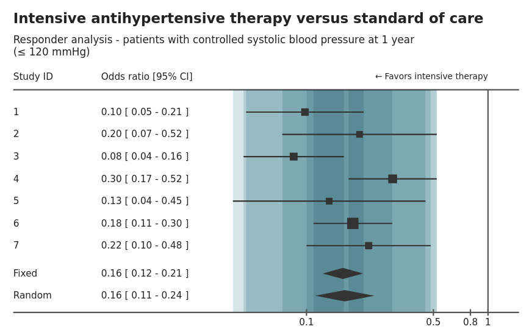
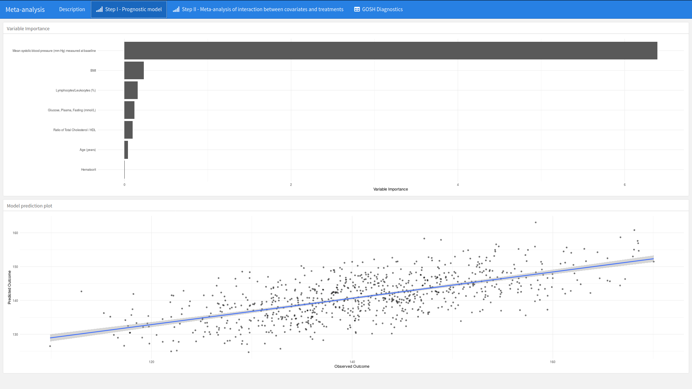
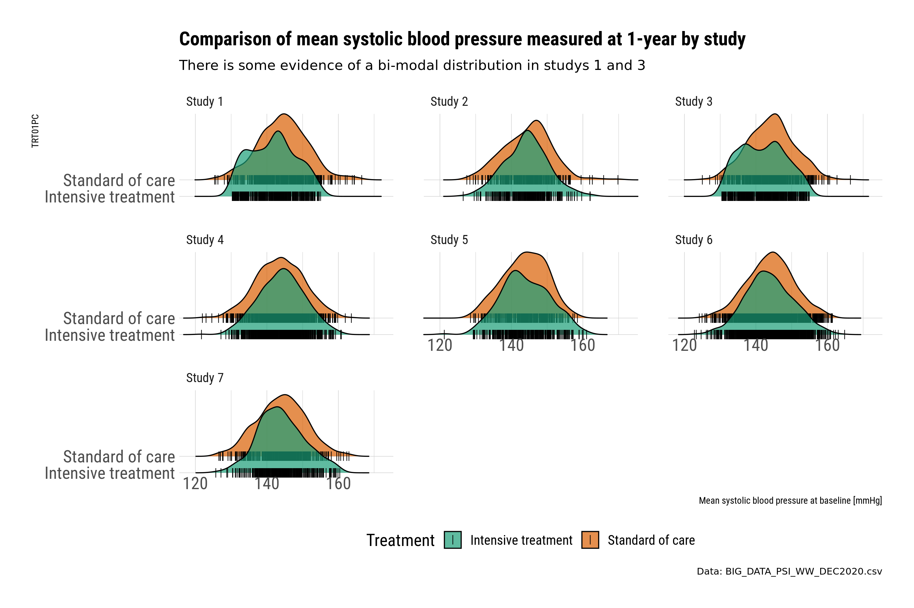
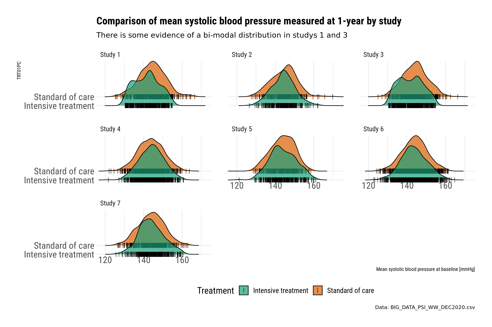
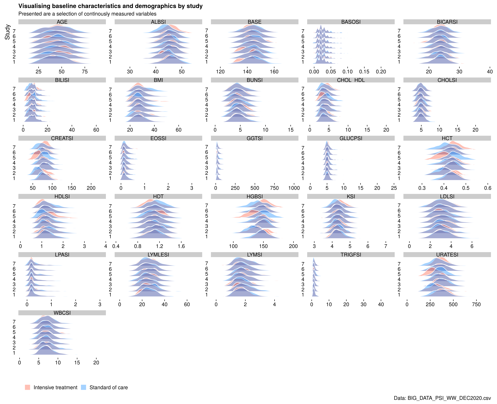

# Example meta-analysis dataset

The purpose of this webinar is to explore how data visualisation can be deployed to find insights when faced with big data.

For this webinar, we introduce the challenge of working with pooled or integrated clinical trial data. This is often referred to as meta-analysis. Further details can be found [here](https://github.com/VIS-SIG/Wonderful-Wednesdays/tree/master/data/2020/2020-11-11).

<a id="example1"></a>

## Example 1. Forest plot


[high-resolution image](./images/forest_plot_with_bands - Waseem Medhat.png)

The shiny app can be found [here](https://waseem-medhat.shinyapps.io/forest_plot_with_bands/).

(A summary of the discussion will be added, soon.)
[link to code](#example1 code)


<a id="example2"></a>

## Example 2. Explorer app


(A summary of the discussion will be added, soon.)


[link to code](#example2 code)

<a id="example3"></a>

## Example 3. Meta-analysis shiny app




[high-resolution image](./images/meta_app.png)

(A summary of the discussion will be added, soon.)

[link to code](#example3 code)

<a id="example4"></a>

## Example 4. Comparison of blood pressure by study






[high-resolution image](./images/eda-plot1a - Mark Baillie.png)
[high-resolution image](./images/eda-plot1b - Mark Baillie.png)
[high-resolution image](./images/eda-plot2a - Mark Baillie.png)
[high-resolution image](./images/eda-plot2b - Mark Baillie.png)

(A summary of the discussion will be added, soon.)

[link to code](#example4 code)


<a id="example5"></a>

## Example 5. Baseline characteristics


[high-resolution image](./images/ridge_plot - Mark Baillie.png)

(A summary of the discussion will be added, soon.)

[link to code](#example5 code)


# Code

<a id="example1 code"></a>

## Example 1. Forest plot
The following code only shows the app code. The complete code can be found [here](./code/forest_plot_with_bands-master - Waseem Medhat.zip) (zip folder).

```{r, echo = TRUE, eval=FALSE}
library(shiny)
library(shinythemes)
library(r2d3)
library(shinyhelper)

ui <- fluidPage(
  theme = shinytheme('united'),
  title = 'Visualizing Heterogeneity in Meta-Analyses',

  tags$style('
    body {
      margin: auto 30px;
    }
    footer {
      padding: 5px;
      text-align: right;
    }
    .shinyhelper-container i {
      font-size: 20px;
    }
    #control-panel {
      display: flex;
      align-items: center;
    }
    #forest-container {
      display: flex;
      flex-direction: column;
      align-items: center;
    }
  '),
  
  div(class = 'page-header',
      h1('Visualizing Heterogeneity in Meta-Analyses'),
      h3('Forest Plot with Heterogeneity Bands')),
  
  wellPanel(style = 'margin: 20px auto;',
            fluidRow(id = 'control-panel',
                     column(2,
                            radioButtons('summary_measure',
                                         label = 'Summary measure:',
                                         choices = list('Odds ratio' = 'or',
                                                        'Risk ratio' = 'rr'))),
                     column(5,
                            sliderInput('d3_width',
                                        'Plot width:',
                                        value = 850,
                                        min = 750,
                                        max = 1300,
                                        step = 10,
                                        post = ' px')),
                     column(5,
                            sliderInput('d3_height',
                                        'Plot height:',
                                        value = 500,
                                        min = 350,
                                        step = 10,
                                        max = 800,
                                        post = ' px')))),
  
  helper(content = 'interpretation',
         colour = 'teal',
         buttonLabel = 'OK',
         div(id ='forest-container',
             style = 'min-height: 350px;',
             d3Output('d3Forest'))),
  
  hr(),
  tags$footer('Built by',
              a(' Waseem Medhat',
                href = 'https://linkedin.com/in/waseem-medhat'),
              ' for ',
              a('Wonderful Wednesdays',
                href = 'https://psiweb.org/sigs-special-interest-groups/visualisation/welcome-to-wonderful-wednesdays')))

server <- function(input, output) {
  observe_helpers()
  
  observe({
    metadata <- readRDS(
      sprintf('data/metadata_%s.rds', input$summary_measure)
    )    
    
    removeUI('#d3Forest', immediate = TRUE)
    
    insertUI(
      selector = '#forest-container',
      where = 'beforeEnd',
      ui = d3Output('d3Forest', height = input$d3_height, width = input$d3_width)
    )
    
    output$d3Forest <- renderD3({
      r2d3(metadata, script = 'src/forestWithBands.js')
    })
  })
  
}

shinyApp(ui = ui, server = server)
```


[Back to blog](#example1)


<a id="example2 code"></a>

## Example 2. Explorer app

```{r, echo = TRUE, eval=FALSE}
# EC subscreen presentation

rm(list=ls())
setwd("o:/1_Global_Biostatistics/Biostatistics Innovation Center/BIC Project - Subgroup Analyses/Screening/_archive/WW/")

suppressPackageStartupMessages(library(dplyr)) 
library(survival)
library(subscreen)

A=read.csv(file="BIG_DATA_PSI_WW_DEC2020.csv", sep=",", dec=".", na.strings = "", header=TRUE)

A$CHG <- as.numeric(A$CHG)
A$PCHG <- as.numeric(A$PCHG)
A$AVALCAT1N <- as.numeric(A$AVALCAT1N)
A$AVALCAT2N <- as.numeric(A$AVALCAT2N)

A %>% group_by(Base_SBP) %>% count()

#dychotomisation/categorisation of continuous variables

A$HEIGHT <- as.numeric(A$HEIGHT)
hei.median <- median(A$HEIGHT, na.rm=TRUE)
A$Height_gr[A$HEIGHT <  171] <- "A) < 171 cm (median)"
A$Height_gr[A$HEIGHT >= 171] <- "B) >=171 cm"
A$Height_gr[is.na(A$HEIGHT)] <- "C) missing"

A$WEIGHT <- as.numeric(A$WEIGHT)
wei.median <- median(A$WEIGHT, na.rm=TRUE)
A$Weight_gr[A$WEIGHT <  60] <- "A) < 60 kg"
A$Weight_gr[A$WEIGHT >= 60] <- "B) 60-90 cm"
A$Weight_gr[A$WEIGHT >  90] <- "C) > 90 cm"
A$Weight_gr[is.na(A$WEIGHT)] <- "D) missing"

A$BMI <- as.numeric(A$BMI)
bmi.median <- median(A$BMI, na.rm=TRUE)
A$BMI_gr[A$BMI <  18.5] <- "A) < 18.5 (WHO)"
A$BMI_gr[A$BMI >= 18.5] <- "B) 18.5-24.9 (WHO)"
A$BMI_gr[A$BMI >=  25]  <- "C) 25-29.9 (WHO)"
A$BMI_gr[A$BMI >=  30]  <- "D) >=30 (WHO)"
A$BMI_gr[is.na(A$BMI)]  <- "E) missing"

A$Age_gr[A$AGE <  30] <- "A) < 30 years"
A$Age_gr[A$AGE >= 30] <- "B) 30-59 cm"
A$Age_gr[A$AGE >= 60] <- "C) 60-75 cm"
A$Age_gr[A$AGE >  75] <- "D) > 75 cm"

A$CHD10R1[A$CHD10R1=="High (>20%)"] <- "Mx High (>20%)"

A$ALBSI <- as.numeric(A$ALBSI)
median(A$ALBSI, na.rm=TRUE)
A$ALB_med[A$ALBSI <  45] <- "A) <  45 (median)"
A$ALB_med[A$ALBSI >= 45] <- "B) >= 45 (median)"
A$ALB_med[is.na(A$ALBSI)]  <- "C) missing"

A$BASOSI <- as.numeric(A$BASOSI)
median(A$BASOSI, na.rm=TRUE)
A$BASO_med[A$BASOSI <  0.02] <- "A) <  0.02 (median)"
A$BASO_med[A$BASOSI >= 0.02] <- "B) >= 0.02 (median)"
A$BASO_med[is.na(A$BASOSI)]  <- "C) missing"

A$BICARSI <- as.numeric(A$BICARSI)
median(A$BICARSI, na.rm=TRUE)
A$BICAR_med[A$BICARSI <  24] <- "A) <  24 (median)"
A$BICAR_med[A$BICARSI >= 24] <- "B) >= 24 (median)"
A$BICAR_med[is.na(A$BICARSI)]  <- "C) missing"

A$BILISI <- as.numeric(A$BILISI)
median(A$BILISI, na.rm=TRUE)
A$BILI_med[A$BILISI <  7] <- "A) <  7 (median)"
A$BILI_med[A$BILISI >= 7] <- "B) >= 7 (median)"
A$BILI_med[is.na(A$BILISI)]  <- "C) missing"

A$BUNSI <- as.numeric(A$BUNSI)
median(A$BUNSI, na.rm=TRUE)
A$BUN_med[A$BUNSI <  4.64] <- "A) <  4.64 (median)"
A$BUN_med[A$BUNSI >= 4.64] <- "B) >= 4.64 (median)"
A$BUN_med[is.na(A$BUNSI)]  <- "C) missing"

A$CASI <- as.numeric(A$CASI)
median(A$CASI, na.rm=TRUE)
A$CA_med[A$CASI <  2.38] <- "A) <  2.38 (median)"
A$CA_med[A$CASI >= 2.38] <- "B) >= 2.38 (median)"
A$CA_med[is.na(A$CASI)]  <- "C) missing"

A$CHOL_HDL <- as.numeric(A$CHOL_HDL)
median(A$CHOL_HDL, na.rm=TRUE)
A$CHOL_HDL_med[A$CHOL_HDL <  4] <- "A) <  4 (median)"
A$CHOL_HDL_med[A$CHOL_HDL >= 4] <- "B) >= 4 (median)"
A$CHOL_HDL_med[is.na(A$CHOL_HDL)]  <- "C) missing"

A$CHOLSI <- as.numeric(A$CHOLSI)
median(A$CHOLSI, na.rm=TRUE)
A$CHOL_med[A$CHOLSI <  4.95] <- "A) <  4.95 (median)"
A$CHOL_med[A$CHOLSI >= 4.95] <- "B) >= 4.95 (median)"
A$CHOL_med[is.na(A$CHOLSI)]  <- "C) missing"

A$CREATSI <- as.numeric(A$CREATSI)
median(A$CREATSI, na.rm=TRUE)
A$CREAT_med[A$CREATSI <  77] <- "A) <  77 (median)"
A$CREAT_med[A$CREATSI >= 77] <- "B) >= 77 (median)"
A$CREAT_med[is.na(A$CREATSI)]  <- "C) missing"

A$EOSLESI <- as.numeric(A$EOSLESI)
median(A$EOSLESI, na.rm=TRUE)
A$EOSLE_med[A$EOSLESI <  2] <- "A) <  2 (median)"
A$EOSLE_med[A$EOSLESI >= 2] <- "B) >= 2 (median)"
A$EOSLE_med[is.na(A$EOSLESI)]  <- "C) missing"

A$EOSSI <- as.numeric(A$EOSSI)
median(A$EOSSI, na.rm=TRUE)
A$EOS_med[A$EOSSI <  0.16] <- "A) <  0.16 (median)"
A$EOS_med[A$EOSSI >= 0.16] <- "B) >= 0.16 (median)"
A$EOS_med[is.na(A$EOSSI)]  <- "C) missing"

A$GGTSI <- as.numeric(A$GGTSI)
median(A$GGTSI, na.rm=TRUE)
A$GGT_med[A$GGTSI <  25] <- "A) <  25 (median)"
A$GGT_med[A$GGTSI >= 25] <- "B) >= 25 (median)"
A$GGT_med[is.na(A$GGTSI)]  <- "C) missing"

A$GLUCPSI <- as.numeric(A$GLUCPSI)
median(A$GLUCPSI, na.rm=TRUE)
A$GLUCP_med[A$GLUCPSI <  5.2] <- "A) <  5.2 (median)"
A$GLUCP_med[A$GLUCPSI >= 5.2] <- "B) >= 5.2 (median)"
A$GLUCP_med[is.na(A$GLUCPSI)]  <- "C) missing"

A$HCT <- as.numeric(A$HCT)
median(A$HCT, na.rm=TRUE)
A$HCT_med[A$HCT <  0.43] <- "A) <  0.43 (median)"
A$HCT_med[A$HCT >= 0.43] <- "B) >= 0.43 (median)"
A$HCT_med[is.na(A$HCT)]  <- "C) missing"

A$HDLSI <- as.numeric(A$HDLSI)
median(A$HDLSI, na.rm=TRUE)
A$HDL_med[A$HDLSI <  1.22] <- "A) <  1.22 (median)"
A$HDL_med[A$HDLSI >= 1.22] <- "B) >= 1.22 (median)"
A$HDL_med[is.na(A$HDLSI)]  <- "C) missing"

A$HDT <- as.numeric(A$HDT)
median(A$HDT, na.rm=TRUE)
A$HDT_med[A$HDT <  1.1] <- "A) <  1.1 (median)"
A$HDT_med[A$HDT >= 1.1] <- "B) >= 1.1 (median)"
A$HDT_med[is.na(A$HDT)]  <- "C) missing"

A$HGBSI <- as.numeric(A$HGBSI)
median(A$HGBSI, na.rm=TRUE)
A$HGB_med[A$HGBSI <  146] <- "A) <  146 (median)"
A$HGB_med[A$HGBSI >= 146] <- "B) >= 146 (median)"
A$HGB_med[is.na(A$HGBSI)]  <- "C) missing"

A$KSI <- as.numeric(A$KSI)
median(A$KSI, na.rm=TRUE)
A$K_med[A$KSI <  4.3] <- "A) <  4.3 (median)"
A$K_med[A$KSI >= 4.3] <- "B) >= 4.3 (median)"
A$K_med[is.na(A$KSI)]  <- "C) missing"

A$LDLSI <- as.numeric(A$LDLSI)
median(A$LDLSI, na.rm=TRUE)
A$LDL_med[A$LDLSI <  3.11] <- "A) <  3.11 (median)"
A$LDL_med[A$LDLSI >= 3.11] <- "B) >= 3.11 (median)"
A$LDL_med[is.na(A$LDLSI)]  <- "C) missing"

A$LPASI <- as.numeric(A$LPASI)
median(A$LPASI, na.rm=TRUE)
A$LPA_med[A$LPASI <  0.21] <- "A) <  0.21 (median)"
A$LPA_med[A$LPASI >= 0.21] <- "B) >= 0.21 (median)"
A$LPA_med[is.na(A$LPASI)]  <- "C) missing"

A$LYMLESI <- as.numeric(A$LYMLESI)
median(A$LYMLESI, na.rm=TRUE)
A$LYMLE_med[A$LYMLESI <  26] <- "A) <  26 (median)"
A$LYMLE_med[A$LYMLESI >= 26] <- "B) >= 26 (median)"
A$LYMLE_med[is.na(A$LYMLESI)]  <- "C) missing"

A$LYMSI <- as.numeric(A$LYMSI)
median(A$LYMSI, na.rm=TRUE)
A$LYM_med[A$LYMSI <  1.76] <- "A) <  1.76 (median)"
A$LYM_med[A$LYMSI >= 1.76] <- "B) >= 1.76 (median)"
A$LYM_med[is.na(A$LYMSI)]  <- "C) missing"

A$MONOLSI <- as.numeric(A$MONOLSI)
median(A$MONOLSI, na.rm=TRUE)
A$MONOL_med[A$MONOLSI <  6] <- "A) <  6 (median)"
A$MONOL_med[A$MONOLSI >= 6] <- "B) >= 6 (median)"
A$MONOL_med[is.na(A$MONOLSI)]  <- "C) missing"

A$TRIGFSI <- as.numeric(A$TRIGFSI)
median(A$TRIGFSI, na.rm=TRUE)
A$TRIGF_med[A$TRIGFSI <  1.41] <- "A) <  1.41 (median)"
A$TRIGF_med[A$TRIGFSI >= 1.41] <- "B) >= 1.41 (median)"
A$TRIGF_med[is.na(A$TRIGFSI)]  <- "C) missing"

A$URATESI <- as.numeric(A$URATESI)
median(A$URATESI, na.rm=TRUE)
A$URATE_med[A$URATESI <  357] <- "A) <  357 (median)"
A$URATE_med[A$URATESI >= 357] <- "B) >= 357 (median)"
A$URATE_med[is.na(A$URATESI)]  <- "C) missing"

A$WBCSI <- as.numeric(A$WBCSI)
median(A$WBCSI, na.rm=TRUE)
A$WBC_med[A$WBCSI <  7.1] <- "A) <  7.1 (median)"
A$WBC_med[A$WBCSI >= 7.1] <- "B) >= 7.1 (median)"
A$WBC_med[is.na(A$WBCSI)]  <- "C) missing"

A$BASE <- as.numeric(A$BASE)
median(A$BASE, na.rm=TRUE)
A$Base_SBP[A$BASE <  132] <- "A) < 132 mmHg"
A$Base_SBP[A$BASE >= 132] <- "B) 132-145 mmHg"
A$Base_SBP[A$BASE >= 145] <- "C) >= 145 mmHg"
A$Base_SBP[is.na(A$BASE)]  <- "D) missing"


#names(A)[names(A) == "AGEGR1"]   <- ""


factors=c("STUDYID", "SEX", "RACE", "ETHNIC", "Height_gr", "Weight_gr", "BMI_gr", "Age_gr", 
          "Base_SBP", "CHD10R1", "ALB_med", "BASO_med", "BICAR_med", "BILI_med", "BUN_med", "CA_med",
          "CHOL_HDL_med", "CHOL_med", "CREAT_med", "EOSLE_med", "EOS_med", "GGT_med", "GLUCP_med", "HCT_med",
          "HDL_med", "HDT_med", "HGB_med", "K_med", "LDL_med", "LPA_med", "LYMLE_med", "LYM_med",
          "MONOL_med", "TRIGF_med", "URATE_med", "WBC_med")

### analysis function "auwe" to be filled in with the statistical evaluation
auwe<- function(D){
  
  Mean.Change.SBP.SoC <- round(mean(D$CHG[D$TRT01PN == 0], na.rm=TRUE),2)
  Mean.Change.SBP.Int <- round(mean(D$CHG[D$TRT01PN == 1], na.rm=TRUE),2)
  Diff.Change.SBP     <- Mean.Change.SBP.SoC - Mean.Change.SBP.Int
  
  Mean.PctChange.SBP.SoC <- round(mean(D$PCHG[D$TRT01PN == 0], na.rm=TRUE),2)
  Mean.PctChange.SBP.Int <- round(mean(D$PCHG[D$TRT01PN == 1], na.rm=TRUE),2)
  Diff.PctChange.SBP     <-  Mean.PctChange.SBP.Int - Mean.PctChange.SBP.SoC
  
  N.SoC  <- sum(D$TRT01PN==0)
	N.Int  <- sum(D$TRT01PN==1)

	Responder.120.SoC    <- sum(D$AVALCAT1N[D$TRT01PN == 0] == 1, na.rm=TRUE)
	Responder.120.Int    <- sum(D$AVALCAT1N[D$TRT01PN == 1] == 1, na.rm=TRUE)

  Prop.Responder.120.SoC <- round(Responder.120.SoC/sum(!is.na(D$AVALCAT1N[D$TRT01PN == 0]), na.rm=TRUE)*100,2)
  Prop.Responder.120.Int <- round(Responder.120.Int/sum(!is.na(D$AVALCAT1N[D$TRT01PN == 1]), na.rm=TRUE)*100,2)

  Diff.Responder.120     <- Prop.Responder.120.Int - Prop.Responder.120.SoC
  OR.Responder.120       <- limit(round((Responder.120.Int * (N.SoC-Responder.120.SoC))/(Responder.120.SoC * (N.Int-Responder.120.Int)),3), high=100)
  RelRisk.Responder.120  <- limit(round((Responder.120.Int * N.SoC)/(Responder.120.SoC * N.Int),3), high=100)
  
  Responder.132.SoC    <- sum(D$AVALCAT2N[D$TRT01PN == 0] == 0, na.rm=TRUE)
  Responder.132.Int    <- sum(D$AVALCAT2N[D$TRT01PN == 1] == 0, na.rm=TRUE)
  
  Prop.Responder.132.SoC <- round(Responder.132.SoC/sum(!is.na(D$AVALCAT2N[D$TRT01PN == 0]), na.rm=TRUE)*100,2)
  Prop.Responder.132.Int <- round(Responder.132.Int/sum(!is.na(D$AVALCAT2N[D$TRT01PN == 1]), na.rm=TRUE)*100,2)
  
  Diff.Responder.132     <- Prop.Responder.132.Int - Prop.Responder.132.SoC
  OR.Responder.132       <- limit(round((Responder.132.Int * (N.SoC-Responder.132.SoC))/(Responder.132.SoC * (N.Int-Responder.132.Int)),3))
  RelRisk.Responder.132  <- limit(round((Responder.132.Int * N.SoC)/(Responder.132.SoC * N.Int),3))
  
  
	return(data.frame(Diff.Change.SBP, Mean.Change.SBP.SoC, Mean.Change.SBP.Int,
	                  Diff.PctChange.SBP, Mean.PctChange.SBP.SoC, Mean.PctChange.SBP.Int, 
	                  Diff.Responder.120, OR.Responder.120, RelRisk.Responder.120, Prop.Responder.120.SoC, Prop.Responder.120.Int,
	                  Diff.Responder.132, OR.Responder.132, RelRisk.Responder.132, Prop.Responder.132.SoC, Prop.Responder.132.Int,
	                  N.SoC, N.Int
	                  ))

}

#limit function / truncation of large or small estimates
limit <- function(x, low=0.05, high=20){
  if (!is.na(x)) y=min(high, max(low,x)) else y=NA
  return (y)
}

results <- subscreencalc(data=A,
                    eval_function=auwe,
                    endpoints=c("CHG", "PCHG", "AVALCAT1N", "AVALCAT2N"),
                    treat="TRT01PN",
                    subjectid="USUBJD",
			              factors=factors,
                    min_comb=1,
                    max_comb=2,
			              nkernel=16,
                    par_functions = "limit",
			              factorial = TRUE,
			              use_complement =FALSE, 
                    verbose=T)


#setwd("O:/1_Global_Biostatistics/Biostatistics Innovation Center/BIC Project - Subgroup Analyses/Screening/16244")
#save(results, file = "o:/1_Global_Biostatistics/Biostatistics Innovation Center/BIC Project - Subgroup Analyses/Screening/_archive/WW/sgs3.RData")
# rm("results")
# load("o:/1_Global_Biostatistics/Biostatistics Innovation Center/BIC Project - Subgroup Analyses/Screening/_archive/WW/sgs3.RData")

subscreenshow(results, port=14444)
```


[Back to blog](#example2)


<a id="example3 code"></a>

## Example 3. Meta-analysis shiny app


[Back to blog](#example3)


<a id="example4 code"></a>

## Example 4. Comparison of blood pressure by study
```{r, echo = TRUE, eval=FALSE}
library(readr)
library(tidyverse)
library(Hmisc)
library(hrbrthemes)
library(ggtext)
library(rlang)


# Functions originally from Cedric Scherer  
# https://cedricscherer.netlify.app/2019/08/05/a-ggplot2-tutorial-for-beautiful-plotting-in-r/
element_textbox_highlight <- function(..., hi.labels = NULL, hi.fill = NULL,
                                      hi.col = NULL, hi.box.col = NULL, hi.family = NULL) {
  structure(
    c(element_textbox(...),
      list(hi.labels = hi.labels, hi.fill = hi.fill, hi.col = hi.col, hi.box.col = hi.box.col, hi.family = hi.family)
    ),
    class = c("element_textbox_highlight", "element_textbox", "element_text", "element")
  )
}

element_grob.element_textbox_highlight <- function(element, label = "", ...) {
  if (label %in% element$hi.labels) {
    element$fill <- element$hi.fill %||% element$fill
    element$colour <- element$hi.col %||% element$colour
    element$box.colour <- element$hi.box.col %||% element$box.colour
    element$family <- element$hi.family %||% element$family
  }
  NextMethod()
}


## Read data and manipulate
data <- read_csv("BIG_DATA_PSI_WW_DEC2020.csv") %>%
  mutate(
    TRT01PC = if_else(TRT01P == "INT", "Intensive treatment", "Standard of care"),
    STUDYIDC = paste0("Study ", STUDYID)
  )

# Check color palettes 
# RColorBrewer::display.brewer.all()


#-------------------------------------------------------
# Small multiples of BASE by Study


plot1a <-
  ggplot(data, aes(x = BASE, y = TRT01PC, fill = TRT01PC)) +
  geom_density_ridges(scale = 4,
                      jittered_points = TRUE,
                      position = position_points_jitter(width = 0.05, height = 0),
                      point_shape = '|', point_size = 3, point_alpha = 1, alpha = 0.7) + 
  scale_y_discrete(expand = c(0, 0)) +   
  scale_x_continuous(expand = c(0, 0)) + 
  scale_fill_brewer(palette = "Dark2") +
  coord_cartesian(clip = "off") + 
  theme_ipsum_rc(base_size = 16) +
  labs(x = "DBP [mmHg] at 1-year") +
  facet_wrap(~STUDYIDC) +
  labs(
    x = "Mean systolic blood pressure at baseline [mmHg]",
    fill = "Treatment",
    title = "Comparison of mean systolic blood pressure measured at 1-year by study",
    subtitle = "There is some evidence of a bi-modal distribution in studys 1 and 3",
    caption = "Data: BIG_DATA_PSI_WW_DEC2020.csv"
  ) +
  theme(legend.position = "bottom")


ggsave("eda-plot1a.png", plot1a, height = 8, width = 12, dpi = 250)


#-------------------------------------------------------
# Small multiples of AVAL by Study


plot1b <-
  ggplot(data, aes(x = AVAL, y = TRT01PC, fill = TRT01PC)) +
  geom_density_ridges(scale = 4,
                      jittered_points = TRUE,
                      position = position_points_jitter(width = 0.05, height = 0),
                      point_shape = '|', point_size = 3, point_alpha = 1, alpha = 0.7) + 
  scale_y_discrete(expand = c(0, 0)) +   
  scale_x_continuous(expand = c(0, 0)) + 
  scale_fill_brewer(palette = "Dark2") +
  coord_cartesian(clip = "off") + 
  theme_ipsum_rc(base_size = 16) +
  labs(x = "DBP [mmHg] at 1-year") +
  facet_wrap(~STUDYIDC) +
  labs(
    x = "Mean systolic blood pressure at 1-year [mmHg]",
    fill = "Treatment",
    title = "Comparison of mean systolic blood pressure measured at 1-year by study",
    subtitle = "There is some evidence of a bi-modal distribution in studys 1 and 3",
    caption = "Data: BIG_DATA_PSI_WW_DEC2020.csv"
  ) +
  theme(legend.position = "bottom")


ggsave("eda-plot1b.png", plot1a, height = 8, width = 12, dpi = 250)


#-------------------------------------------------------
# Small multiples of AVAL vs BASE by Study

plot2a <-
  data %>% ggplot(aes(
    x = BASE,
    y = AVAL,
    group = TRT01PC,
    color = TRT01PC
  )) +
  geom_abline(
    intercept = 0,
    slope = 1,
    color = "grey",
    size = 1,
    alpha = 0.5
  ) +
  geom_smooth(
    method = "lm",
    formula = y ~ splines::bs(x, 3),
    se = TRUE,
    alpha = 0.55
  ) +
  geom_point(alpha = 0.45, size = 0.6) +
  facet_wrap( ~ STUDYIDC, ncol = 3) +
  scale_color_brewer(palette = "Dark2") +
  scale_x_continuous(breaks = scales::pretty_breaks(n = 5)) +
  scale_y_continuous(breaks = scales::pretty_breaks(n = 5)) +
  labs(
    x = "SBP [mmHg] at randomisation",
    y = "SBP [mmHg] at 1-year",
    color = "Treatment",
    title = "Comparison of pre-post mean systolic blood pressure (SBP) measured at baseline and 1-year",
    subtitle = "Study 1 and 3 may have data quality issues - further investigation required",
    caption = "The by-treatment relationship also disaplyed using a cubic splines.\ny = x reference line also displayed.\nData: BIG_DATA_PSI_WW_DEC2020.csv"
  )  +
  theme_ipsum_rc(base_size = 16) +
  theme(
    strip.text = element_textbox_highlight(
      size = 12,
      face = "bold",
      fill = "white",
      box.color = "white",
      color = "gray40",
      halign = .5,
      linetype = 1,
      r = unit(0, "pt"),
      width = unit(1, "npc"),
      padding = margin(2, 0, 1, 0),
      margin = margin(0, 1, 3, 1),
      hi.labels = c("Study 1", "Study 3"),
      hi.family = "Bangers",
      hi.fill = "firebrick",
      hi.box.col = "firebrick",
      hi.col = "white"
    ),
    legend.position = "bottom"
  )


ggsave("eda-plot2a.png", plot2a, height = 8, width = 12, dpi = 250)


#---------------------------------------
# Plot study1 and 3 only 

plot2b <-
  data %>%
  filter(STUDYID == c(1, 3)) %>% 
  ggplot(aes(
    x = BASE,
    y = AVAL,
    group = TRT01PC,
    color = TRT01PC
  )) +
  geom_abline(
    intercept = 0,
    slope = 1,
    color = "grey",
    size = 1,
    alpha = 0.5
  ) +
  geom_point(alpha = 0.7, size = 1) +
  facet_grid(TRT01PC  ~ STUDYIDC) +
  scale_color_brewer(palette = "Dark2") +
  scale_x_continuous(breaks = scales::pretty_breaks(n = 5)) +
  scale_y_continuous(breaks = scales::pretty_breaks(n = 5)) +
  labs(
    x = "Mean systolic blood pressure [mmHg] at randomisation",
    y = "Mean systolic blood pressure [mmHg] at 1-year",
    color = "Treatment",
    title = "The intensive treatment arm for study 1 and 3 displayed patterns of interest",
    subtitle = "It is always important to plot data many ways",
    caption = "http://robertgrantstats.co.uk/drawmydata.html \nData: BIG_DATA_PSI_WW_DEC2020.csv"
  )  +
  theme_ipsum_rc(base_size = 16) +
  theme(
    strip.text = element_textbox_highlight(
      size = 12,
      face = "bold",
      fill = "white",
      box.color = "white",
      color = "gray40",
      halign = .5,
      linetype = 1,
      r = unit(0, "pt"),
      width = unit(1, "npc"),
      padding = margin(2, 0, 1, 0),
      margin = margin(0, 1, 3, 1),
      hi.labels = c("Study 1", "Study 3"),
      hi.family = "Bangers",
      hi.fill = "firebrick",
      hi.box.col = "firebrick",
      hi.col = "white"
    ),
    legend.position = "bottom"
  )


ggsave("eda-plot2b.png", plot2b, height = 8, width = 12, dpi = 250)
```

[Back to blog](#example4)


<a id="example5 code"></a>

## Example 5. Correlation plot
```{r, echo = TRUE, eval=FALSE}
library(tidyverse)
library(ggridges)
library(readr)
library(ggtext)
library(rlang)

## Read data and manipulate
data <- read_csv("BIG_DATA_PSI_WW_DEC2020.csv") %>%
  mutate(
    TRT01PC = if_else(TRT01P == "INT", "Intensive treatment", "Standard of care"),
    STUDYIDC = paste0("Study ", STUDYID)
  )


plot_data <-
  data %>%
  pivot_longer(
    cols = c(
      AGE,
      ALBSI,
      BASOSI,
      BASE,
      BICARSI,
      BILISI,
      BMI,
      BUNSI,
      CHOL_HDL,
      CHOLSI,
      CREATSI,
      EOSSI,
      GGTSI,
      GLUCPSI,
      HCT,
      HDLSI,
      HDT,
      HGBSI,
      KSI,
      LDLSI,
      LPASI,
      LYMLESI,
      LYMSI,
      TRIGFSI,
      URATESI,
      WBCSI
    ),
    names_to = "var",
    values_to = "val"
  )


ridge_plot <- 
  plot_data %>%
  ggplot(aes(
    x = val,
    y = factor(STUDYID),
    fill = paste(STUDYIDC, TRT01PC)
  )) +
  geom_density_ridges(alpha = .4,
                      rel_min_height = .01,
                      color = "white") +
  scale_fill_cyclical(
    values = c("tomato", "dodgerblue"),
    name = "",
    labels = c(`Study 1 Intensive treatment` = "Intensive treatment",
               `Study 1 Standard of care` = "Standard of care"),
    guide = "legend"
  ) +
  theme_ridges(grid = FALSE) +
  facet_wrap( ~ var, scales = "free", ncol = 5) +
  labs(
    x = "",
    y = "Study",
    fill = "Treatment",
    title = "Visualising baseline characteristics and demographics by study",
    subtitle = "Presented are a selection of continously measured variables",
    caption = "Data: BIG_DATA_PSI_WW_DEC2020.csv"
  ) +
  theme(legend.position = "bottom")

ggsave(
  "ridge_plot.png",
  ridge_plot,
  height = 12,
  width = 16,
  dpi = 330
)
```

[Back to blog](#example5)


