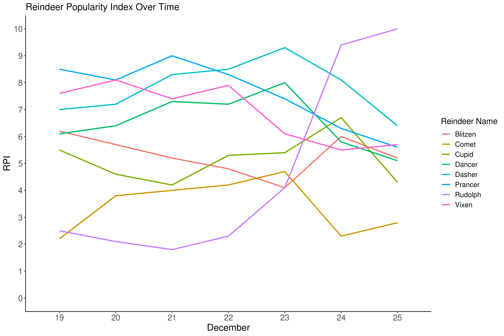
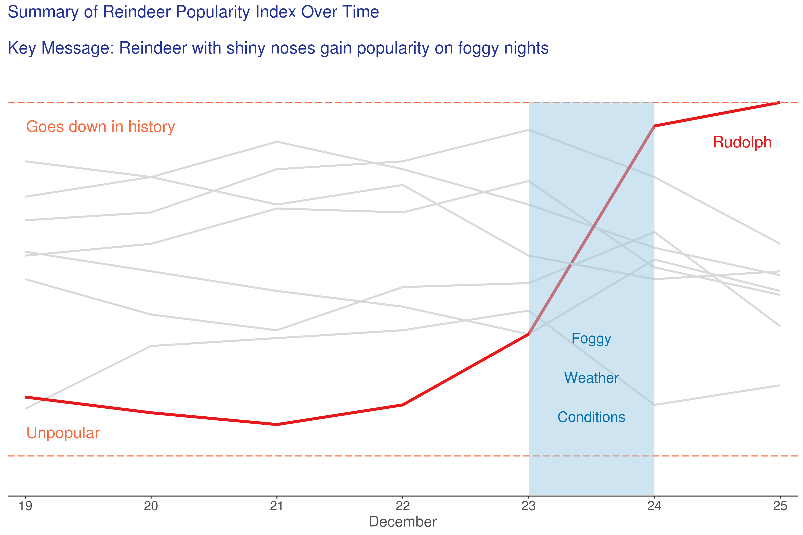

# Background

Here is a little festive fun, to illustrate the idea of "storytelling" with data. It is based on a longitudinal cohort study of species Rangier tarandus (reindeer). A cohort of n=8 reindeer were studied over 7 days, with primary endpoint of Reindeer Popularity Index (RPI). RPI is a validated measure of social acceptance by the herd, on a scale of 0 to 10.

## Excel Grouped Bar Chart

This chart was produced using Excel, showing popularity scores for each participant over the 7 day study period. This chart uses many of the default settings available in Excel, and the design of the graph has a number of shortcomings. The amount of information presented is overwhelming, and while the results for Rudolph appear atypical, there are a lot of improvements that could be made to gain insights into the data.


<a id="example1"></a>

## R Spaghetti Plot

The remaining  graphs were drawn using the ggplot2 package in R. In this example, RPI scores for each reindeer are drawn as lines on a common X-axis. It's easy to see why this type of plot is called a spaghetti plot, and  discerning any pattern in the data is challenging (although Rudolph is showing signs of being different from the other reindeer).


[link to code](#example1 code)

<a id="example2"></a>

## Decluttered Spaghetti Plot

An important stage in creating a clear data story is to remove "chart junk", i.e. any elements in the graph that might distract from the overall message. By experimenting with R "themes" we obtain a cleaner design. A consideration in data visualisation is the "cognitive load" we are placing on our audience, and in this case the viewer is having to work hard to move backward and forward between the lines and the legend.



[link to code](#example2 code)

<a id="example3"></a>

## Focussed Spaghetti Plot

At this stage, we've decided that the "story" here is Rudolph, with a low RPI score at the start of the study (consistent with other reindeer laughing and calling him names), who gains popularity prior to the end of the study period on 25th December.

Here we use "pre-attentive" attributes to focus the attention of the viewer, by use of a strong red colour representing Rudolph (consistent with the abnormal nasal colouration of this subject). We can lose the legend, and apply muted tones for the other study participants, the identities of which are not essential to the story.

Because interest lies in the relative RPI scores between subjects, a decision was made to remove the vertical axis in order to further simplify the design. However consideration always needs to be given to the audience; a more quantitative audience may require absolute RPI scores to be retained on the plot.


[link to code](#example3 code)

<a id="example4"></a>

## Completed Graph

Finally, we add a title with our key message. Rudolph's surge in popularity towards the end of the study coincides with a foggy night, and red shiny noses are thought to provide navigational assistance to airborne sleighs in these conditions [citation needed].

The final graph is certainly very effective in telling the audience our data "story". This was achieved by choosing the right chart type (line plot instead of bar chart), removing unnecessary clutter, and using design features (e.g. use of colour for highlighting and muted tones for de-emphasizing) to focus the attention of our viewer. 



[link to code](#example4 code)


<a id="example5"></a>

## Rudolph Animation

In this visualization, the number of packages (or presents) to be delivered within the last 2.5h before Christmas (midnight) is being presented over time by the region where the packages are supposed to arrive. Note that the local time is shown and, thus, it looks like a simultaneous delivery (due to the different time zones). In fact, this means that the package delivery starts in the Eastern regions and ends in the Western regions. The blue asteriscs seem to have some horizontal movement on their way down to zero. However, this is due to the nature of how the updates are done per time point. If there has been no update in a specific region but in the one next to it, the asterisc seems to be moving horizontically, but in fact it is an update in the near neighborhood.

This visualization is informative and helps to better understand Rudolph's stressful time just before Christmas. However, there are some issues which should be fixed. The region on the x axis is lacking some details (which might be due to the need for anonymization of the exact region). Furthermore, the color and the shape of the "dots" are somewhat irritating and you might lose your focus. Simple black dots would have been the better choice to avoid unnecessary clutter. Speaking about clutter: The background picture is certainly distracting and does not add any value to the visualization as it contains no additional information. Overall, it might still serve as an insight into the number of packages arriving just in time.


(The background picture has been downloaded from https://pixabay.com/ and slightly modified.)

[link to code](#example5 code)


# Code

<a id="example1 code"></a>

## R Spaghetti Plot

```{r, echo = TRUE, eval=FALSE}
library(ggplot2)
library(tidyverse)
library(dplyr)
library(tidyr)
library(readxl)

# Get data, and transpose into long format

data <- read_excel("/shared/175/arenv/arwork/gsk1278863/mid209676/present_2020_01/code/RPI/reindeer_data.xlsx") %>%
  pivot_longer(!SUBJECT, names_to = "Date", values_to = "RPI") %>%
  mutate(flag = (SUBJECT == "Rudolph"))

# Basic line plot (default grey theme)

plot01 <- ggplot() +
  geom_line(data = data, aes(x = Date, y = RPI, group=factor(SUBJECT), color=factor(SUBJECT)), size = 1) +
  scale_y_continuous("RPI",
                     breaks=c(0:10),
                     limits=c(0, 10)) +
  labs(title="Reindeer Popularity Index Over Time",
       color="Reindeer Name") +
  xlab("December")

ggsave("/shared/175/arenv/arwork/gsk1278863/mid209676/present_2020_01/code/RPI/R_example01.png", plot01, width=12, height=8, dpi=300)

```

[Back to blog](#example1)

<a id="example2 code"></a>

## Decluttered Spaghetti Plot

```{r, echo = TRUE, eval=FALSE}
plot02 <- ggplot() +
  geom_line(data = data, aes(x = Date, y = RPI, group=factor(SUBJECT), color=as.factor(SUBJECT)), size = 1) +
  scale_y_continuous("RPI",
                     breaks=c(0:10),
                     limits=c(0, 10)) +
  labs(title="Reindeer Popularity Index Over Time",
       color="Reindeer Name") +
  xlab("December") +
  theme_classic() +
  theme(plot.title = element_text(size = 16),
        axis.title = element_text(size = 16),
        axis.text = element_text(size = 14),
        legend.title = element_text(size = 14),
        legend.text = element_text(size = 12)) 

ggsave("/shared/175/arenv/arwork/gsk1278863/mid209676/present_2020_01/code/RPI/R_example02.png", plot02, width=12, height=8, dpi=300)

```

[Back to blog](#example2)

<a id="example3 code"></a>

## Focussed Spaghetti Plot

```{r, echo = TRUE, eval=FALSE}
plot03 <- ggplot() +
  geom_line(data = data, aes(x = Date, y = RPI, group=factor(SUBJECT), color=as.factor(flag), size = flag)) +
  scale_x_discrete("December",
                     labels = c("19", "20", "21", "22", "23", "24", "25"),
                   expand = c(0.02, 0.02)) +
  scale_y_continuous(" ",
                     breaks=c(0:10),
                     limits=c(0, 10)) +
  scale_color_manual(values=c("#d9d9d9", "#e41a1c")) +
  scale_size_manual(values=c(1, 1.5)) +
  labs(title="Reindeer Popularity Index Over Time",
       color="Reindeer Name") +
  theme_classic() +
  theme(plot.title = element_text(size = 16, color = "#525252"),
        axis.title.x = element_text(size = 16, color = "#525252"),
        axis.text.x = element_text(size = 14, color = "#525252"),
        axis.title.y = element_blank(),
        axis.text.y = element_blank(),
        axis.line.y = element_blank(),
        axis.ticks.y = element_blank(),
        legend.position = "none"
        ) +
  annotate("text", label = "Rudolph", x = 6.7, y = 9, color = "#e41a1c", size=6)

ggsave("/shared/175/arenv/arwork/gsk1278863/mid209676/present_2020_01/code/RPI/R_example03.png", plot03, width=12, height=8, dpi=300)

```

[Back to blog](#example3)

<a id="example4 code"></a>

## Completed Graph

```{r, echo = TRUE, eval=FALSE}
plot04 <- ggplot() +
  geom_line(data = data, aes(x = Date, y = RPI, group=factor(SUBJECT), color=as.factor(flag), size = flag)) +
  scale_x_discrete("December",
                   labels = c("19", "20", "21", "22", "23", "24", "25"),
                   expand = c(0.02, 0.02)) +
  scale_y_continuous("RPI",
                     breaks=c(0:10),
                     limits=c(0, 11),
                     expand = c(0, 0.02)) +
  scale_color_manual(values=c("#d9d9d9", "#e41a1c")) +
  scale_size_manual(values=c(1, 1.5)) +
  geom_hline(yintercept=10, color = "#f46d43", linetype = "longdash") + 
  geom_hline(yintercept=1, color = "#f46d43", linetype = "longdash") + 
  labs(title="Summary of Reindeer Popularity Index Over Time\n \nKey Message: Reindeer with shiny noses gain popularity on foggy nights") +
  xlab("December") +
  theme_classic() +
  theme(plot.title = element_text(size = 18, color = "#253494"),
        axis.title.x = element_text(size = 16, color = "#525252"),
        axis.text.x = element_text(size = 14, color = "#525252"),
        axis.title.y = element_blank(),
        axis.text.y = element_blank(),
        axis.line.y = element_blank(),
        axis.ticks.y = element_blank(),
        legend.position = "none"
  ) +
  annotate("text", label = "Rudolph", x = 6.7, y = 9, color = "#e41a1c", size=6) +
  annotate("rect", xmin=5, xmax = 6, ymin=0, ymax = 10, fill = "#9ecae1", alpha = 0.5) +
  annotate("text", label = "Foggy", x = 5.5, y = 4, color = "#0570b0", size=5.5) +
  annotate("text", label = "Weather", x = 5.5, y = 3, color = "#0570b0", size=5.5) +
  annotate("text", label = "Conditions", x = 5.5, y = 2, color = "#0570b0", size=5.5) +
  annotate("text", label = "Goes down in history", x = 1.6, y = 9.4, color = "#f46d43", size=6) +
  annotate("text", label = "Unpopular", x = 1.3, y = 1.6, color = "#f46d43", size=6) 

ggsave("/shared/175/arenv/arwork/gsk1278863/mid209676/present_2020_01/code/RPI/R_example04.png", plot04, width=12, height=8, dpi=300)

```
[Back to blog](#example4)

## Rudolph Animation

<a id="example5 code"></a>

```{r, echo = TRUE, eval = FALSE}
require(gganimate)
require(gapminder)
require(ggpubr)
require(png)

# Simulate data:
set.seed(12345)
y <- c()
for (j in 1:10) {
  for (i in 1:150) {
    y <- c(y, rnorm(10, 150-j*5-i))
  }
}

y[which(y < 0)] <- 0

x <- runif(10, 0, 1)
for (i in 1:((length(y)/10)-1)) {
  for (j in 1:10) {
    x <- c(x, x[(i-1)*10 + j] + rnorm(1, 0, 0.025))
  }
}
c.n <- paste0(0, 0:9)
z <- rep(paste0("09:", 31:59), each = 10)
z <- c(z, rep(paste0("10:", c(c.n, 10:59)), each = 10))
z <- c(z, rep(paste0("11:", c(c.n, 10:59)), each = 10))
z <- c(z, rep("Midnight", 10))
z <- rep(z, 10)

dat <- data.frame(x, y, z)

# Import background image:
img <- png::readPNG("Rudolph_cut.png")

# Create the plot:
p <- ggplot(dat, aes(x = x, y = y)) + theme_bw() +
    background_image(img) +
    theme(axis.line = element_line(colour = "white"),
        panel.grid.major = element_blank(),
        panel.grid.minor = element_blank(),
        panel.border = element_blank(),
        panel.background = element_blank(),
        axis.ticks = element_blank(),
        text = element_text(size=15)) +
    scale_x_continuous(name = "Region", limits = c(-1, 2), breaks = c(-1, 2),
                       labels = c("West", "East")) +
    scale_y_continuous(name = "No. of presents (million)", limits = c(0, 100),
                       breaks = c(0, 25, 50, 75, 100), labels = c("0", "2.5", "5", "7.5", "10")) +
    geom_point(shape = 8, color = "lightblue", size = 3)

# Transform it into an animated plot:
anim <- p + transition_states(states = z) + shadow_wake(wake_length = 0.1, alpha = T) +
  labs(title = "Number of presents to be delivered
       within 2.5h to Christmas.",
       subtitle = "Time: {closest_state}pm")

animate(anim, nframes = 300, height = 450, width = 550)
anim_save("rudolph.gif")
```
[Back to blog](#example5)