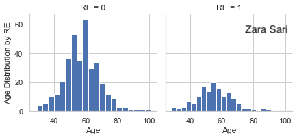
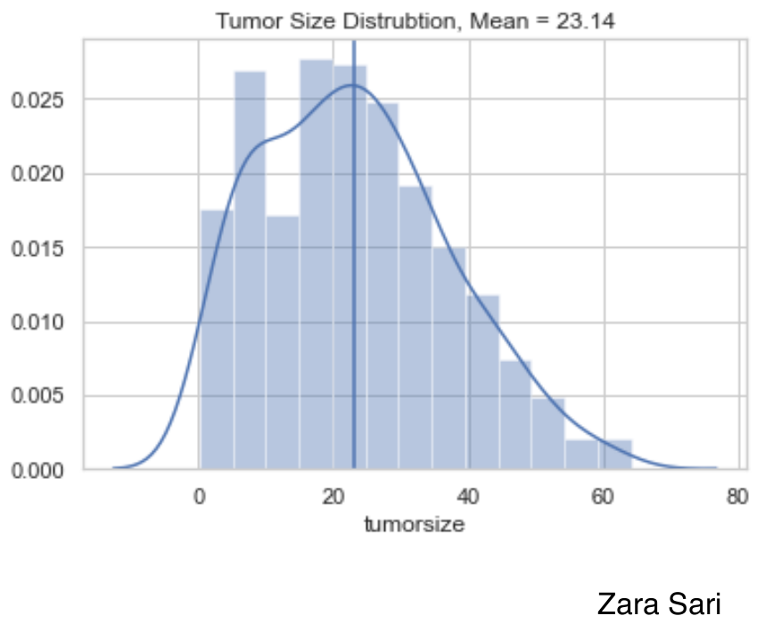
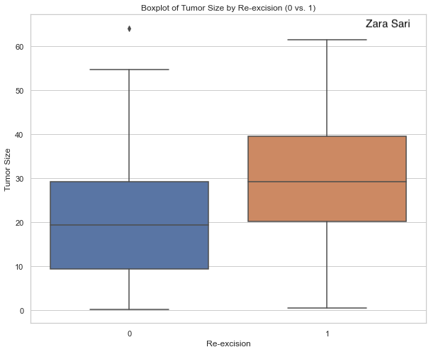
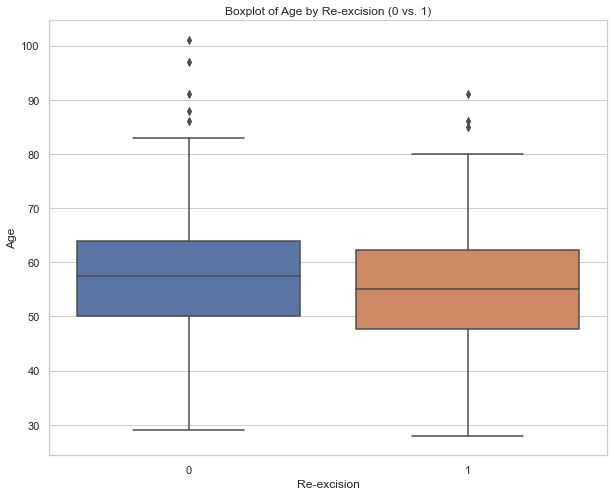
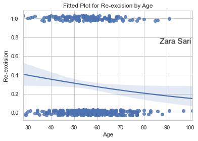
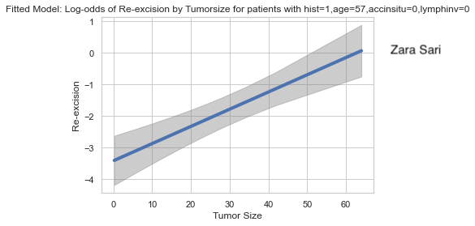
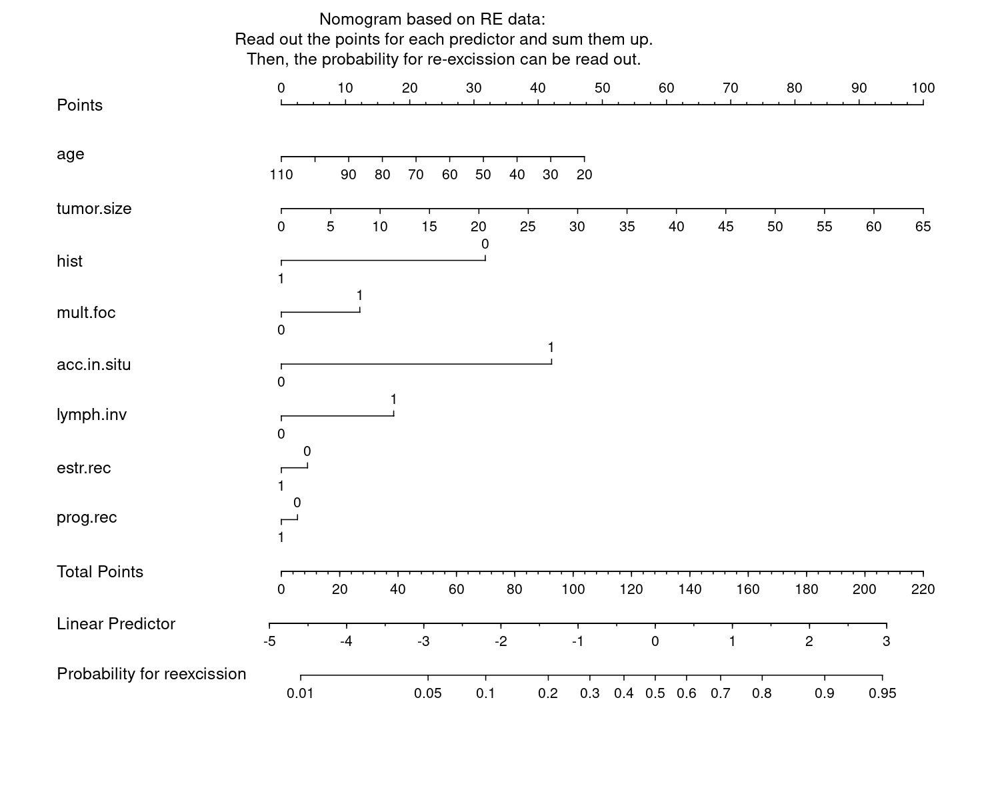

# Prediction dataset


<a id="example1"></a>

## Example 1. Exploratory analysis, correlation, and prediction

  
[high resolution image](./images/Age Dist by RE - Zara Sari.png)  
  

[high resolution image](./images/Age Plot - Zara Sari.png)  

  

This is a relatively simple plot to present the data which can be seen as a preview of the data which is very helpful to start with. There are some things we could improve. Since absolute data is used, it is a little bit hard to compare the groups with each other. We could even lay the two plots on top of each other to make a comparison between groups very straightforward. Furthermore, a title is missing.


[high resolution image](./images/RE by Age Boxplot - Zara Sari.png)  
  

This plot helps to compare the groups in regards to age and is therefore very helpful to get a first insight into a potential difference in age between both groups. Boxplots are very well-known and, thus, there is no need for any explanation when they are presented to the audience. The use of grey is done very nicely. The gridlines are visible but kept in the background. There is also a description below the boxplot which is very helpful. However, a title is still missing. Another detail is about the labeling. We could use "yes" and "no" instead of 1 and 0 on the x-axis.


[high resolution image](./images/TumorSize Distribution - Zara Sari.png)  
  

The same comments apply as above (for age plots).

[high resolution image](./images/TumorSize Dist by RE - Zara Sari.png)  
  
The same comments apply as above (for age plots).


[high resolution image](./images/RE by Tumor Boxplot - Zara Sari.png)  
  
The same comments apply as above (for age plots).

[high resolution image](./images/Correlation Plot - Zara Sari.png)  
  

Colours going fro m blue to red are used to present the correlation between variables. In general, it is a very good idea to present correlations as another step towards finding predictors. The red and blue ones pop out and you can identify strong correlations very quickly. The panel also liked the white space which makes it clear and "simple". Some things could be improved: The labels on the y-axis could be rotated 90 degrees to make them easier to read. Also, it is a bit of an visual "overload" since there is a lot of information in the plot. Furthermore, the column on the very left might be the most interesting one and could therefore be framed or anything like that to make the audience focus on it. You could even order this first column by correlation to make it easier to compare the correlations with each other. Also, it might not be clear what a correlation with a binary variable really means. How is the "direction" of the correlation defined. A short footnote might help here.


[high resolution image](./images/Log-odds by Age - Specific - Zara Sari.png)  
  

Log-odds are presented with confidence bands. The footnote is very helpful to better understand the plot and to interpret the results. However, the plot might be a bit challenging to a non-technical audience. At the same time, this plot can be very helpful to see if (fractional) polynomials of the predictors are needed in the model. Furthermore, the uncertainty is shown which is very helpful. The x-axis shows only data that we actually have. There is no extrapolation which is very good practice. The gridlines are also very helpful and the use of colour is nicely done.


[high resolution image](./images/Fitted Plot RE Age - Zara Sari.png)  
  
In this plot, we see the probability on the y-axis which is easier to interpret as compared to the plot above (using log-odds). The data points are included using some jittering which is a very good idea to make all data points visible. It might help to reduce the point size a little bit, though. Furthermore, we can easily see the "direction" of the predictor. This is a nice visualization to put on a poster, for example.


[high resolution image](./images/Fitted Plot RE Tumor Size - Zara Sari.png)  
  
The same comments apply as above (for age plots).

[high resolution image](./images/Log-odds by Tumor Size - Specific - Zara Sari.png)  

The same comments apply as above (for age plots).


[link to code](#example1 code)


<a id="example2"></a>

## Example 2. Classification tree

  
[high-resolution image](./images/tree - Lorenz Uhlmann.png)  

This is a very different way to present the data. Obviously, single trees are not recommended to do prediction. However, it may help to get a quick overview over the data.

Having the full name instead of variable labels would be an improvement of the plot. Furthermore the labels of categories should be updated to make clear what they stand for (instead of using 0/1 etc.). Also, the number of patients per path or box are missing. One way would be to use different thicknesses of the lines to represent the sample sizes. Another issues is about colouring which can be used to visualize the probabilities of re-excision. The use of the cut-off in regards to the probability to decide whether a box is denoted as "yes" or "no" is questionable. Another idea would be to present the tree in a horizontal way.

[link to code](#example2 code)

<a id="example3"></a>

## Example 3. Nomogram

  
[high-resolution image](./images/nomogram - Lorenz Uhlmann.png)  

This is a rather challenging visualization because it is not so easy to get a message out of by just looking at it. It is rather a tool. For a (new) patient, you need to read out the values per predictor, sum them up, and read out the probability for re-excision. It is kind of an interactive tool without interactivity.
The advantage of this plot is still that all predictors are included and the length between tickmarks (per unit) give an impression of the strenght of the impact of a predictor. Furthermore, there almost no clutter and it comes with a description.

In general, it might look a bit old-fashioned, but it may still be useful to some audience. An alternative would be a shiny app or something like that.

[link to code](#example3 code)

<a id="example4"></a>

## Example 4. Prediction app

  
The html file can be found [here](./images/viz_pred - Agustin Calatroni.html).

This is kind of a nomogram as an interactive app. Starting with the first tab, there is a nice explanation included, but also the plots speak for themselves. The color coding is clearly defined and we get a nice overview. The second tab, provides a visualization of an individual person. And the third tab provides us with the estimated model.

In general, it has got a very nice design.


[link to code](#example4 code)


<a id="example5"></a>

## Example 5. Interactive Model Studio

  

The html file can be found [here](./images/viz_ms_edited - Agustin Calatroni.html).

Here, we see the impact of each predictor which is a very nice idea to present the data and the prediction model. When you select a new patient the plot grows step by step and this is a very nice way to describe what is happening in the model.

Overall, it is a very nice and well-structured visualization. The colouring is nicely chosen and there are is very good title and a helpful footnote. It is just very useful and informative graph and tool.

[link to code](#example5 code)


# Code

<a id="example1 code"></a>

## Example 1. Exploratory analysis, correlation, and prediction

```{python, echo = TRUE, eval=FALSE, python.reticulate = FALSE}
#!/usr/bin/env python
# coding: utf-8

# In[1]:


###### #Following instructions in DataCamp course:
 
#https://campus.datacamp.com/courses/generalized-linear-models-in-python/modeling-binary-data?ex=15
#https://towardsdatascience.com/a-quick-guide-on-descriptive-statistics-using-pandas-and-seaborn-2aadc7395f32
#https://github.com/VIS-SIG/Wonderful-Wednesdays/tree/master/data/2020/2020-12-09


#Import libraries
 
import statsmodels.api as sm #Array based model
 
from statsmodels.formula.api import glm
 
import numpy as np
import matplotlib.pyplot as plt

#from lifelines import KaplanMeierFitter

from sklearn.ensemble import RandomForestClassifier


# In[2]:


import seaborn as sns


# In[3]:


import pandas as pd


# In[4]:


import os
print(os.getcwd()) #/Users/zahraSari


# In[23]:


cwd=os.chdir('/Users/zahraSari/Desktop/') 

#Change directory

Files = os.listdir(cwd) 


# In[24]:


#Data from Github : 
#https://github.com/VIS-SIG/Wonderful-Wednesdays/blob/master/data/2020/2020-12-09/Reexcision.csv    

data= pd.read_csv('Book.csv')

print(data)
 
#age
#tumorsize
#histology (hist; 0: others, 1: Invasive-duct./ductal-lob.)
#Multifocality (mult.foc; 0: no, 1: yes)
#Accomp. in situ (acc.in.situ; 0: others, 1: DCIS and LCIS)
#Lymphovascular invasion (lymph.inv; 0: no, 1: yes)
#Estrogen-receptor (estr.rec; 0: no, 1: yes)
#Progesterone-receptor (prog.rec; 0: no, 1: yes)


# In[25]:


print(data.columns.tolist()) #View the column names
 


# In[26]:


data.info() # Tumor size has 9 unknown variables
 


# In[27]:


data.mean()


# In[28]:


total_rows=len(data.axes[0])
total_cols=len(data.axes[1])
print("Number of Rows: "+str(total_rows))
print("Number of Columns: "+str(total_cols))


# In[29]:


data['tumorsize']= pd.to_numeric(data['tumorsize'])


# In[30]:


data=data.dropna() #Removing the 9 unknown variables from Data Frame
 


# In[31]:


data.mean()


# In[32]:


# Plot the age variable
sns.distplot(data['age'])

plt.axvline(np.median(data['age']),color='b', linestyle='--') 

plt.axvline(np.mean(data['age']),color='b', linestyle='-') 

#Display the plot
plt.show()
 
data.age.mean()


# In[33]:


# Plot first variable

sns.distplot(data['tumorsize'])
 
plt.axvline(np.median(data['tumorsize']),color='b', linestyle='--') 

plt.axvline(np.mean(data['tumorsize']),color='b', linestyle='-') 
    
    
# Display the

plt.show()

data.tumorsize.mean()
 


# In[34]:


#Interpretation: People with re-exision 

g = sns.FacetGrid(data, col='RE')
g.map(plt.hist, 'tumorsize', bins=20)


# In[35]:


g = sns.FacetGrid(data, col='RE')
g.map(plt.hist, 'age', bins=20)


# # Pivoting Features

# In[57]:


data['hist'].value_counts().sort_values()


# In[58]:


sns.countplot(x='hist',data=data,palette='hls')
plt.show()


# In[56]:


sns.countplot(x='RE',data=data,palette='hls')
plt.show()


# In[48]:


# Summary Chart Re-excision

ax = ((100 *data["RE"].value_counts() / len(data))).plot.bar(rot=0)
ax.set( ylabel="%", title="Re-excision")

plt.show()

# Summary Chart hist

ax = ((100 *data["hist"].value_counts() / len(data))).plot.bar(rot=0)
ax.set( ylabel="%", title="hist")

plt.show()

# Summary Chart multfoc

ax = ((100 *data["multfoc"].value_counts() / len(data))).plot.bar(rot=0)
ax.set( ylabel="%", title="multfoc")

plt.show()


# In[38]:


data.groupby(['RE']).mean() #Mean of variables for RE of 0 or 1


# In[39]:


#Interpretation: Age distribution for patinets who had Re-excision is lower than those with 

get_ipython().run_line_magic('matplotlib', 'inline')

sns.set(style="whitegrid")
plt.figure(figsize=(10,8))
ax = sns.boxplot( x='RE',y='age', data=data, orient="v")


# In[40]:


get_ipython().run_line_magic('matplotlib', 'inline')

sns.set(style="whitegrid")

plt.figure(figsize=(10,8))
ax = sns.boxplot(y='tumorsize' , x='RE', data=data, orient="v")

#The box plot shows you how a feature's values spread out for each class. 
#It's a compact representation of the distribution, showing the extreme high value, 
#upper quartile, median, lower quartile and extreme low value.


# In[41]:


df = df.convert_objects(convert_numeric=True)    
sub_df = df.groupby(['RECL_LCC','RECL_PI'])['COUNT'].sum().unstack()
sub_df.plot(kind='bar',stacked=True)


# # Correlating categorical features

# In[42]:


grid = sns.FacetGrid(data, row='accinsitu', size=2.2, aspect=1.6)
grid.map(sns.pointplot, 'hist', 'RE' , 'lymphinv', palette='deep')
grid.add_legend()


# In[43]:


print(data.corr)


# # Correlation

# In[44]:


####Correlation Plot#######

corr=data.corr()

# Generate a mask for the upper triangle
mask = np.zeros_like(corr, dtype=np.bool)
mask[np.triu_indices_from(mask)] = True

# Set up the matplotlib figure
f, ax = plt.subplots(figsize=(15, 13))

# Generate a custom diverging colormap
cmap = sns.diverging_palette(220, 10, as_cmap=True)

# Draw the heatmap with the mask and correct aspect ratio
sns.heatmap(corr, mask=mask, cmap=cmap, vmax=.3, center=0,
            square=True, linewidths=.5, cbar_kws={"shrink": .5})


# # Statistical Model - Logistic Model

# In[ ]:


#########Statistical Model############

#Fit logistic regression model
#Logistic regression is an improved version of linear regression.


# In[17]:


model = sm.GLM.from_formula("RE ~ hist + age + tumorsize + hist + multfoc + accinsitu + lymphinv + estrrec + progrec ", family = sm.families.Binomial(), data=data)
result = model.fit()
result.summary()

#Based on p-value being less than 0.05, 
#Significant variables are: hist, tumorsize, accinsitu, lymphinv
#Age is very close to 0.05 so speculuative whether it is significant, 
#Similarly for Intercept, p-value is very close to 0.05 but doesn't pass


#Coef for hist: (Thinking of linear regression formula Y = AX + B) 
#where A= -1.2014 , B is 0 since it is non-significant. 
#If a person’s hist is 1 unit more s/he will have a 0.052 (coefficient with age in the table above) unit more 
#chance of having heart disease based on the p-value in the table.

#Generally, positive coefficients indicate that the event becomes more likely as the predictor increases. 
#Negative coefficients indicate that the event becomes less likely as the predictor increases.


# In[67]:


#Removing non-significant variables and re-fitting the model
#Age seems to be significant now

model = sm.GLM.from_formula("RE ~ hist + age + tumorsize + accinsitu + lymphinv  -1 ", family = sm.families.Binomial(), data=data)
result = model.fit()
result.summary()

#coeffiecnt -1.2849 for hist shows increase of odds
#for ones with hist=1 than ones with hist=0

#According to this fitted model, older people are more
#likely to have Reexicision than younger people. The 
#log odds for heart disease increases by 0.0545 units for each year.
#If a person is 10 years older his or her chance of having RE
#increases by 0.0545 * 10 = 0.545 units.


# In[68]:


data[['RE','hist', 'age' , 'tumorsize' , 'accinsitu' , 'lymphinv']].corr()


# # Visualization of the Fitted Model

# In[91]:


#https://towardsdatascience.com/logistic-regression-model-fitting-and-finding-the-correlation-p-value-z-score-confidence-8330fb86db19
#With help from this site


# In[92]:


from statsmodels.sandbox.predict_functional import predict_functional


# In[104]:


values = {"hist": 0, "tumorsize": 50, "accinsitu":0 , "lymphinv" :0 }


# In[105]:


pr, cb, fv = predict_functional(result, "age", values=values, ci_method="simultaneous")


# In[106]:


ax = sns.lineplot(fv, pr, lw=4)
ax.fill_between(fv, cb[:, 0], cb[:, 1], color='grey', alpha=0.4)
ax.set_xlabel("age")
ax.set_ylabel("Re-excision")

ax.set_title('Fitted Model: Log-odd probability of Age by Re-excision')

#This plot of fitted log-odds  visualizes the effect of age on reexcision for 
#hist=0, tumorsize=23, accinsitu=0 and lumphinv=0 by the glm fitted model
#Slight negative correlation of age and RE are visible in this plot
#For the specific described variables


# In[ ]:


# In[100]:


from statsmodels.sandbox.predict_functional import predict_functional
values = {"hist": 0, "age": 45, "accinsitu":0 , "lymphinv" :0 }
pr, cb, fv = predict_functional(result, "tumorsize", values=values, ci_method="simultaneous")

ax = sns.lineplot(fv, pr, lw=4)
ax.fill_between(fv, cb[:, 0], cb[:, 1], color='grey', alpha=0.4)
ax.set_xlabel("Tumor Size")
ax.set_ylabel("Re-excision")

ax.set_title('Fitted Model: Log-odd probability of Tumorsize by Re-excision')

#This plot of fitted log-odds  visualizes the effect of tumorsize on reexcision for 
#hist=0, age=45, accinsitu=0 and lumphinv=0 by the glm fitted model
#Clear Positive correlation of tumorsize and RE are visible in this plot


# In[ ]:


# In[ ]:


# In[103]:


import seaborn as sns
 
#Plot the relationship between two variables in a DataFrame and 
#add overlay with the logistic fit


sns.regplot(x = 'tumorsize', y = 'RE',
            y_jitter = 0.03,
            data = data,
            logistic = True,
            ci = 95)

plt.title('Fitted Plot for Re-excision vs. Tumorsize')

# Display the plot
plt.show()

#Interpretation: the lower tumor sizes are associated with value 0 for Reexcision, 
#higher values of tumorsize.
#Tumor sizes of over 55 are associated with value of 1 for Reexicision.
#The confidence interval gets wider as the value of the predictor increases. The 
#wide interval is partly due to the small amount of data for larger tumor size.


# In[101]:


#Plot the relationship between two variables in a DataFrame and add overlay with the logistic fit

sns.regplot(x = 'age', y = 'RE',
            y_jitter = 0.03,
            data = data,
            logistic = True,
            ci = 95)
 
# Display the plot
plt.show()

#Interpretation: the lower values age is associated with value 0 for Reexcision, higher values of tumorsize
#eg. tumor size of over 55 are associated with value of 1 for Reexicision.
#The confidence interval gets wider as the value of the predictor increases. The 
#wide interval is partly due to the small amount of data for larger lower and higher ages.


# In[ ]:


# Compute predictions for the test sample df and save as prediction
prediction = model_fit.predict(exog = data)


# In[ ]:


# Add prediction to the existing data frame df and assign column name prediction
data['prediction'] = prediction


# In[ ]:


# Examine the first 5 computed predictions
print(data[['RE',  'hist', 'multfoc', 'accinsitu', 'lymphinv', 'estrrec', 'progrec']].head())


# In[ ]:


# Define the cutoff
cutoff = 0.5

# Compute class predictions: y_prediction
y_prediction = np.where(prediction > cutoff, 1, 0)


# # Machine Learning

# In[ ]:


#Random Forest


# In[ ]:


from sklearn.model_selection import train_test_split


# In[ ]:


y=data['RE']


# In[ ]:


train_df = data.drop(['RE'], axis=1)


# In[ ]:


import numpy as np

from sklearn.model_selection import train_test_split
X, y = np.arange(10).reshape((5, 2)), range(5)
X
list(y)


# In[ ]:


X_train, X_test, y_train, y_test = train_test_split(X, y, test_size=0.33, random_state=42)
X_train


# In[ ]:


y_train


# In[ ]:


X_test


# In[ ]:


y_test


# In[ ]:


#print("Before", train_df.shape, test_df.shape, combine[0].shape, combine[1].shape)

#train_df = train_df.drop(['Ticket', 'Cabin'], axis=1)
#test_df = test_df.drop(['Ticket', 'Cabin'], axis=1)
#combine = [train_df, test_df]

#"After", train_df.shape, test_df.shape, combine[0].shape, combine[1].shape


# In[ ]:


train_df = data.drop(['RE'], axis=1)


# In[ ]:


df = pd.DataFrame(np.random.randn(100, 2))

msk = np.random.rand(len(df)) < 0.8

train = df[msk]

test = df[~msk]

len(test)
len(train)


# In[ ]:


#####################DATACAMP#################

# Import train_test_split function
#from sklearn.model_selection import train_test_split

#X=data[['sepal length', 'sepal width', 'petal length', 'petal width']]  # Features
#y=data['species']  # Labels

# Split dataset into training set and test set
#X_train, X_test, y_train, y_test = train_test_split(X, y, test_size=0.3) # 70% training and 30% test


# Import train_test_split function
from sklearn.model_selection import train_test_split

X=data[['age' , 'tumorsize' , 'hist',  'multfoc' , 'accinsitu',  'lymphinv',  'estrrec' , 'progrec']]  # Features
y=data['RE']  # Labels

# Split dataset into training set and test set
X_train, X_test, y_train, y_test = train_test_split(X, y, test_size=0.3) # 70% training and 30% test


# In[ ]:


# In[ ]:


#Import Random Forest Model
from sklearn.ensemble import RandomForestClassifier

#Create a Gaussian Classifier
clf=RandomForestClassifier(n_estimators=100)

#Train the model using the training sets y_pred=clf.predict(X_test)
clf.fit(X_train,y_train)

y_pred=clf.predict(X_test)


# In[ ]:


#Import scikit-learn metrics module for accuracy calculation
from sklearn import metrics
# Model Accuracy, how often is the classifier correct?
print("Accuracy:",metrics.accuracy_score(y_test, y_pred))


# In[ ]:


RandomForestClassifier(bootstrap=True, class_weight=None, criterion='gini',
            max_depth=None, max_features='auto', max_leaf_nodes=None,
            min_impurity_decrease=0.0, min_impurity_split=None,
            min_samples_leaf=1, min_samples_split=2,
            min_weight_fraction_leaf=0.0, n_estimators=100, n_jobs=1,
            oob_score=False, random_state=None, verbose=0,
            warm_start=False)


# In[ ]:


```


[Back to blog](#example1)


<a id="example2 code"></a>

## Example 2. Classification tree

```{r, echo = TRUE, eval=FALSE}
# Prediction data:
##################

# Classification tree:
# ====================

setwd("/home/lorenz/Wonderful_Wednesday_Webinars/2021-01/")
dat <- read.csv("Reexcision.csv")
for (i in 1:ncol(dat)) {
  if (length(unique(dat[, i])) < 5) {
    dat[, i] <- factor(dat[, i])
  }
}

dat$RE <- factor(dat$RE, levels = c(0, 1), labels = c("no", "yes"))

require(rpart)
require(rpart.plot)
dat_tree <- rpart(RE~., dat, model = TRUE)
png("tree.png", height = 4, width = 6, res = 150, units = "in")
prp(dat_tree, type = 4, extra = 6, cex = 0.5, varlen = 0,
    main = 'Classification tree for reexcission:
    Accomp. in situ, Tumor size, and histology seem to be the most important predictors.
    Each box shows the predicted value and the relative frequency of the category RE=yes.')
dev.off()
```


[Back to blog](#example2)


<a id="example3 code"></a>

## Example 3. Nomogram

```{r, echo = TRUE, eval=FALSE}
# Nomogram:
# =========

setwd("/home/lorenz/Wonderful_Wednesday_Webinars/2021-01/")
dat <- read.csv("Reexcision.csv")
for (i in 1:ncol(dat)) {
  if (length(unique(dat[, i])) < 5) {
    dat[, i] <- factor(dat[, i])
  }
}

dat$RE <- factor(dat$RE, levels = c(0, 1), labels = c("no", "yes"))

require(rms)

# attach(dat)
# ddist <- datadist(age, tumor.size, hist, mult.foc, acc.in.situ, lymph.inv, estr.rec, prog.rec)
ddist <- datadist(dat)
options(datadist='ddist')
# detach(dat)
fit <- lrm(RE ~ ., data = dat)

png("nomogram.png", height = 8, width = 10, res = 150, units = "in")
par(xpd = T)
plot(nomogram(fit, fun = function(x) 1/(1 + exp(-x)),
              funlabel = "Probability for reexcission",
              fun.at = c(.001, 0.01, 0.05, seq(.1, .9, by = .1), .95, .99, .999)),
     label.every = 1)
text(0.4, 1.07, "Nomogram based on RE data:
     Read out the points for each predictor and sum them up.
     Then, the probability for re-excission can be read out.")
dev.off()
```

[Back to blog](#example3)


<a id="example4 code"></a>

## Example 4. Prediction app
The rmd file can be found [here](./code/viz_pred - Agustin Calatroni.rmd).

[Back to blog](#example4)


<a id="example5 code"></a>

## Example 5. Interactive Model Studio
```{r, echo = TRUE, eval=FALSE}
# LINKS
# modelStudio github: https://github.com/ModelOriented/modelStudio
# modelStudio package: https://modelstudio.drwhy.ai/index.html
# book: Explanatory Model Analysis Explore, Explain, and Examine Predictive Models: http://ema.drwhy.ai/
# website: https://modeloriented.github.io/DrWhy/

# location
rstudioapi::getSourceEditorContext()$path %>% 
  dirname() %>% 
  setwd()

# Import & Reshape
pacman::p_load(tidyverse)

d1 <- read.csv("https://raw.githubusercontent.com/VIS-SIG/Wonderful-Wednesdays/master/data/2020/2020-12-09/Reexcision.csv") %>% 
  mutate( hist         = factor(hist, labels = c("Others", "Invasive-duct./ductal-lob.")) %>% 
            fct_rev(),
          mult.foc     = factor(mult.foc, labels = c("No","Yes")),
          acc.in.situ  = factor(acc.in.situ, labels = c("Others","DCIS & LCIS")),
          lymph.inv    = factor(lymph.inv, labels = c("No","Yes")) %>% 
            fct_rev(),
          estr.rec     = factor(estr.rec, labels = c("No","Yes")),
          prog.rec     = factor(prog.rec, labels = c("No","Yes")) ) %>% 
  rename(`Residual_Tumor` = RE, 
         `Age` = age,
         `Tumor_Size` = tumor.size,
         `Histology` = hist,
         `Multifocality` = mult.foc,
         `Accomp_in_situ` = acc.in.situ,
         `Lymphovascular` = lymph.inv,
         `Estrogen_receptor` = estr.rec,
         `Progesterone_receptor` = prog.rec) 

# Logistic Regression w/ Interactions
f2 <- glm(Residual_Tumor ~ Age + Tumor_Size + Histology + 
            Multifocality + Accomp_in_situ + Lymphovascular +              
            Age*Lymphovascular + Accomp_in_situ*Lymphovascular, 
          data = d1, family = "binomial")

# Model Studio
pacman::p_load(modelStudio)
pacman::p_load(DALEX)

# Explain
explainer <- explain(f2,
                     data = d1,
                     y = d1$Residual_Tumor,
                     type = 'classification',
                     verbose = FALSE,
                     precalculate = FALSE)

# Interactive
modelStudio(explainer,
            facet_dim = c(1,1),
            new_observation = d1[140:150,],
            eda       = FALSE,
            show_info = FALSE,
            options = ms_options(w = 500, h = 400,
                                 margin_left = 200,
                                 show_boxplot = FALSE,
                                 show_subtitle = TRUE,
                                 ms_title    = "Interactive Model Studio",
                                 ms_subtitle = "Predictors of Residual Tumor in Breast-Conserving Therapy",
                                 positive_color = '#1a9641',
                                 negative_color = '#d7191c',
                                 default_color  = '#404040',
                                 bd_title     = 'Break-down Plot for Logistic Regression model',
                                 bd_subtitle = 'Shows contributions of every variable to a final prediction',
                                 fi_subtitle = '')) %>% 
  r2d3::save_d3_html(file = "viz_ms.html",
                     selfcontained = TRUE)

# Upload to RPubs
# markdown::rpubsUpload(title = "Interactive Model Studio", 
#                       htmlFile = "viz_ms_edited.html")
```

[Back to blog](#example5)


