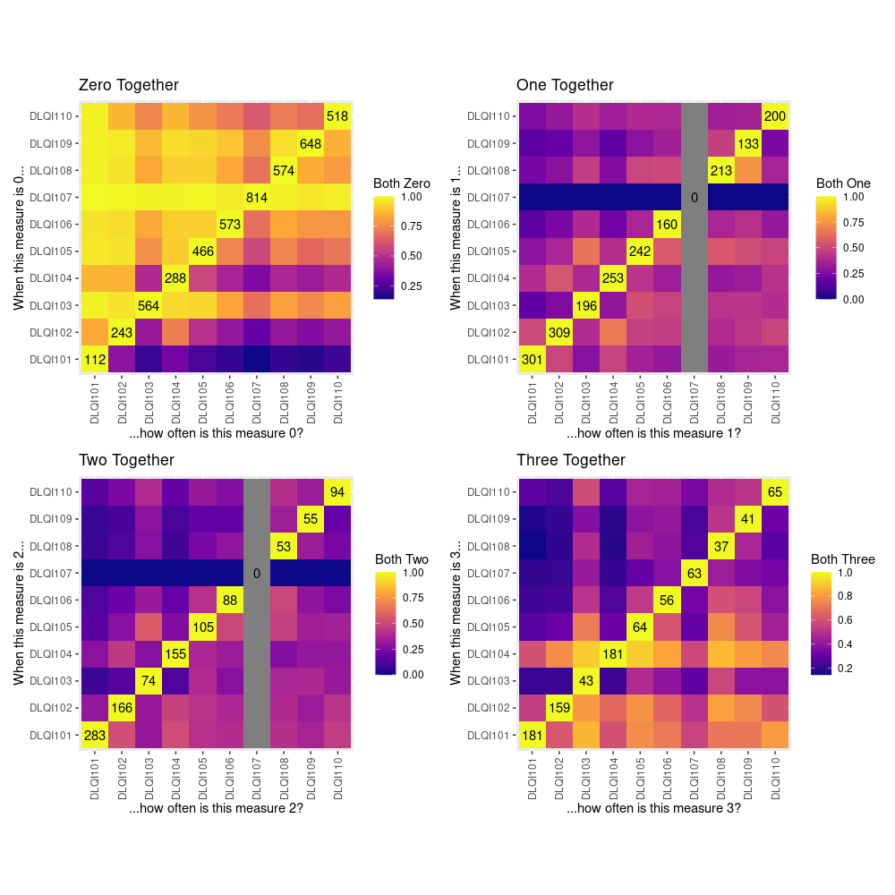
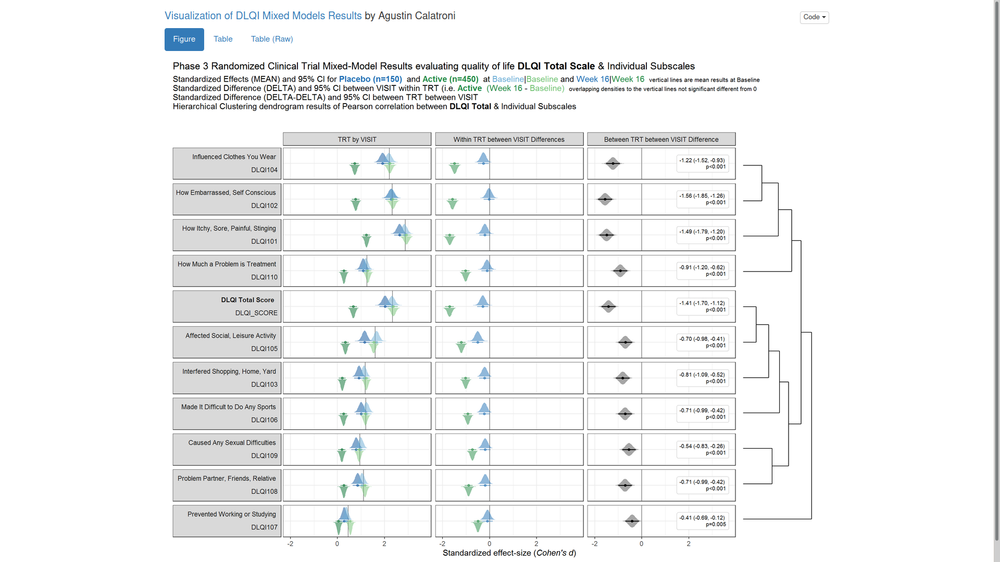

# DLQI data set
<!-- <Add a short description.> -->


<a id="example1"></a>

## Example 1. Heatmaps

  
[high resolution image](./images/Condistr - Devan Becker.png)  

(A summary of the discussion will be added shortly.)

[link to code](#example1 code)


<a id="example2"></a>

## Example 2. Mixed models

  

The app can be found [here](./images/dlqi_mixed - Agustin Calatroni.html).  

(A summary of the discussion will be added shortly.)

[link to code](#example2 code)

<a id="example3"></a>

## Example 3. Change in mean scores

  
[high resolution image](./images/Dumbbell - Samah Abdelaal.jpeg)  

(A summary of the discussion will be added shortly.)

[link to code](#example3 code)

<a id="example4"></a>

## Example 4. Histrograms

  

[high resolution image](./images/Histogram - Samah Abdelaal.jpeg)  

(A summary of the discussion will be added shortly.)

[link to code](#example4 code)


## Example 5. Lineplots

  
[high resolution image](./images/DLQI_single_items_210206 - Paolo Eusebi.png)  

  
[high resolution image](./images/DLQI_multidimensional_210206 - Paolo Eusebi.png)  


(A summary of the discussion will be added shortly.)

[link to code](#example5 code)


# Code

<a id="example1 code"></a>

## Example 1. Heatmaps

```{r, echo = TRUE, eval=FALSE, python.reticulate = FALSE}
library(GGally)
library(dplyr)
library(tidyr)
library(patchwork)

qol <- read.csv("Data/2021-01-13-QualityOfLife.csv")

head(qol)
glimpse(qol)

qol2 <- qol %>% 
    mutate_if(function(x){length(unique(x)) < 6}, factor)

ggpairs(qol2[qol2$VISIT == "Week 16", c(2, 3, 15)], 
    mapping = aes(colour = TRT))
ggpairs(qol[qol$VISIT == "Week 16", 5:14])
ggpairs(qol2[qol2$VISIT == "Week 16", 5:14])
ggpairs(qol[qol$VISIT == "Week 16", 5:14], 
    mapping = aes(colour = qol[qol$VISIT == "Week 16",]$TRT))
ggpairs(qol2[qol2$VISIT == "Week 16", 5:14], 
    mapping = aes(colour = qol2[qol2$VISIT == "Week 16",]$TRT))


#### Goal 1: Multidimensional nature of DLQI ####
# As integers, they're all highly correlated
# As categorical variables, need an intelligent way to summarise
# Something like PCA or NMF, but for categories?
# Collection of stacked bar plots?
# Percent agreement between categories?
# Compound Poisson model for discrete categories?
#### Goal 2: Show the effect of treatment, incorporate multidimensionality ####


# Attempt 1: Conditional Distributions

dlq <- select(qol, starts_with("DLQI")) %>% 
    select(-DLQI_SCORE)
heatmaps <- lapply(0:3, function(w){
    m1 <- sapply(1:10, function(x){
        f1 <- filter(dlq, dlq[, x] == w)
        if(nrow(f1) > 0) {
            return(apply(f1, 2, function(y) mean(y == w, na.rm = TRUE)))
        } else {
            return(rep(NA, 10))
        }
    })
    colnames(m1) <- rownames(m1)
    m1 <- m1 %>% as.data.frame() %>% 
        tibble::rownames_to_column(var = "from") %>% 
        pivot_longer(-from, names_to = "to", values_to = "both_0")
    return(m1)
})


numwords <- c("Zero", "One", "Two", "Three")
wrap_plots(lapply(1:4, function(i) {
    zeros <- apply(dlq, 2, function(x) sum(x == i - 1, na.rm = TRUE))
    ggplot(heatmaps[[i]]) +
        aes(x = to, y = from, fill = both_0) + 
        geom_tile() +
        labs(x = paste0("...how often is this measure ", i - 1, "?"), 
            y = paste0("When this measure is ", i - 1, "..."),
            title = paste0(numwords[i], " Together"),
            fill = paste0("Both ", numwords[i])) +
        scale_fill_viridis_c(option = "C") + 
        annotate("text", x = 1:10, y = 1:10, label = zeros) +
        theme(aspect.ratio = 1, 
            axis.text.x = element_text(angle = 90, vjust = 0.5))
}))
```


[Back to blog](#example1)


<a id="example2 code"></a>

## Example 2. Mixed models

The R Markdown file can be found [here](./code/dlqi_mixed - Agustin Calatroni.rmd). 

[Back to blog](#example2)


<a id="example3 code"></a>

## Example 3. Change in mean scores

```{r, echo = TRUE, eval=FALSE}
# Load data
dql <- read.csv("ww2020_dlqi.csv")
attach(dql)
View(dql)

# Load library
library(tidyverse)
library(ggplot2)
library(ggthemes)
library(ggcharts)
library(ggalt)

# Seperate treatment arms
new_A <- 
  dql %>% 
  filter(TRT=="A")
new_B <- 
  dql %>% 
  filter(TRT=="B")

## Treatment A : Placebo

dtA <- new_A %>%
  # Remove missing data
  filter(!is.na(new_A)) %>% 
  # Select relevant variables
  select(
    DLQI101, DLQI102, DLQI103, DLQI104, DLQI105,
    DLQI106, DLQI107, DLQI108, DLQI109, DLQI110,
    VISIT
    ) %>%
  # Summarize mean score for each question grouped by visit
  # while also renaming variables to indicate the meaning of each score
  group_by(VISIT) %>%
  summarise(
    Symptoms = mean(DLQI101, na.rm = T),
    Embarrassment = mean(DLQI102, na.rm = T),
   `Shopping and home care` = mean(DLQI103, na.rm = T),
    Clothes = mean(DLQI104, na.rm = T),
   `Social and leisure` = mean(DLQI105, na.rm = T),
    Sport = mean(DLQI106, na.rm = T),
    `Work and study` = mean(DLQI107, na.rm = T),
    `Close relationships` = mean(DLQI108, na.rm = T),
    Sex = mean(DLQI109, na.rm = T),
    Treatment = mean(DLQI110, na.rm = T)
   )

# Tidying data
dtA <- 
  dtA %>% 
  pivot_longer(
    !VISIT,
    names_to = "Domain",
    values_to = "Mean_Score"
    )

# Seperating the visit variable into baseline and week 16
dtA <-
  dtA %>% 
  pivot_wider(
    names_from = VISIT,
    values_from = Mean_Score
    )

# Ensuring the domain levels are ordered the same
dtA <-
  dtA %>% 
  mutate(
    Domain = factor(Domain,
                    levels = c("Symptoms", "Embarrassment",
                               "Shopping and home care",
                               "Clothes", "Social and leisure",
                               "Sport", "Work and study",
                               "Close relationships",
                               "Sex", "Treatment"))
    )

# Constructing a dumbbell plot using ggalt package with a ggchart theme

(a <- 
  ggplot()+
  geom_dumbbell(
    data = dtA,
    aes(
      y = Domain,
      x = Baseline,
      xend = `Week 16`
      ),
    size = 1.5,
    color = "lightgray",
    size_x = 3,
    colour_x = "violetred4",
    size_xend = 3,
    colour_xend = "maroon1"
    )
  + theme_ggcharts(grid = "Y")
  + labs(
    title = "Placebo"
    )
  + theme(
    plot.title = element_text(hjust = 0.5),
    axis.title.y = element_blank(),
    axis.title.x = element_blank(),
    axis.text.y = element_text(size = 9)
    ))

## Treatment B : Active Treatment

dtB <- new_B %>%
  # Remove missing data
  filter(!is.na(new_B)) %>% 
  # Select relevant variables
  select(
    DLQI101, DLQI102, DLQI103, DLQI104, DLQI105,
    DLQI106, DLQI107, DLQI108, DLQI109, DLQI110,
    VISIT
    ) %>%
  # Summarize mean score for each question grouped by visit
  # while also renaming variables to indicate the meaning of each score
  group_by(VISIT) %>%
  summarise(
    Symptoms = mean(DLQI101, na.rm = T),
    Embarrassment = mean(DLQI102, na.rm = T),
    `Shopping and home care` = mean(DLQI103, na.rm = T),
    Clothes = mean(DLQI104, na.rm = T),
    `Social and leisure` = mean(DLQI105, na.rm = T),
    Sport = mean(DLQI106, na.rm = T),
    `Work and study` = mean(DLQI107, na.rm = T),
    `Close relationships` = mean(DLQI108, na.rm = T),
    Sex = mean(DLQI109, na.rm = T),
    Treatment = mean(DLQI110, na.rm = T)
    )

# Tidying data
dtB <- 
  dtB %>% 
  pivot_longer(
    !VISIT,
    names_to = "Domain",
    values_to = "Mean_Score"
    )

# Seperating the visit variable into baseline and week 16
dtB <-
  dtB %>% 
  pivot_wider(
    names_from = VISIT,
    values_from = Mean_Score
    )

# Ensuring the domain levels are ordered the same
dtB <-
  dtB %>% 
  mutate(
    Domain = factor(Domain,
                    levels = c("Symptoms", "Embarrassment",
                               "Shopping and home care",
                               "Clothes", "Social and leisure",
                               "Sport", "Work and study",
                               "Close relationships",
                               "Sex", "Treatment"))
    )

# Constructing a dumbbell plot using ggalt package with a ggchart theme

(b <- 
  ggplot()+
  geom_dumbbell(
    data = dtB,
    aes(
      y = Domain,
      x = Baseline,
      xend = `Week 16`
      ),
    size = 1.5,
    color = "lightgray",
    size_x = 3,
    colour_x = "violetred4",
    size_xend = 3,
    colour_xend = "maroon1")
  + theme_ggcharts(grid = "Y") 
  + labs(
    title = "Active Treatment"
    ) + theme(
    plot.title = element_text(hjust = 0.5),
    axis.title.y = element_blank(),
    axis.title.x = element_blank(),
    axis.text.y = element_text(size = 9)
        ))

## Mean total score for both treatment arms

totaldt <- 
  dql %>%
  # Remove missing data
  filter(!is.na(dql)) %>%
  # select and summarizing relevant variables
  select(DLQI_SCORE, TRT, VISIT) %>%
  group_by(TRT, VISIT) %>%
  summarise(
    qtotal = mean(DLQI_SCORE, na.rm = T)
    )

# Tidying data
totaldt <- 
  totaldt %>% 
  pivot_wider(
    names_from = VISIT,
    values_from = qtotal
    )

totaldt$TRT[totaldt$TRT=="A"] <- "Placebo"
totaldt$TRT[totaldt$TRT=="B"] <- "Active Treatment"

# Constructing a dumbbell plot using ggcharts

(c <- 
  dumbbell_chart(
    data = totaldt,
    x = TRT,
    y1 = Baseline,
    y2 = `Week 16`,
    line_color = "lightgray",
    line_size = 3,
    point_color = c("violetred4", "maroon1"),
    point_size = 7
  ) + labs(
    x = NULL,
    y = NULL,
    title = "Dermatological Life Quality Index DLQI",
    subtitle = "Change in mean scores from Baseline to Week 16  (Top chart is total score)",
    caption = "Samah Abdelaal"
    ) + theme(
    axis.text.y = element_text(face = "bold"),
    plot.title = element_text(size = 14,
                              face = "bold"),
    plot.subtitle = element_text(size = 12),
    plot.caption = element_text(size = 11,
                                face = "italic"),
    legend.position = "bottom"
    ))

# Compine all three plots
library(gridExtra)

grid.arrange(c, arrangeGrob(b, a, ncol = 2), nrow = 2)
```

[Back to blog](#example3)


<a id="example4 code"></a>

## Example 4. Histrograms
```{r, echo = TRUE, eval=FALSE}
# Load data
dql <- read.csv("ww2020_dlqi.csv")
attach(dql)
View(dql)
summary(dql)

# Load Library
library(tidyverse)
library(ggplot2)
library(ggthemes)
library(ggcharts)

# Select relevant variables
dql_renamed <-
  dql %>%
  select(
    TRT, VISIT, DLQI_SCORE
    )

# Rename treatment levels
dql_renamed$TRT[dql_renamed$TRT=="A"] <- "Placebo"
dql_renamed$TRT[dql_renamed$TRT=="B"] <- "Active Treatment"

# Seperate visits

# Baseline visit
totalbaseline <- 
  dql_renamed %>% 
  filter(VISIT=="Baseline")

# Construct a histogram for each treatment arm at baseline visit
(d <- 
  ggplot(
    data = totalbaseline,
    aes(
      x = DLQI_SCORE
      ))
  + geom_histogram(
    binwidth = 1.5,
    color = "grey",
    fill = "deeppink3"
    ) +
  facet_grid(~ TRT)
  + theme_ng(grid = "X")
  + labs(
    x = "DLQI Score",
    y = "Count",
    title = "Total DLQI Score",
    subtitle = "At Baseline",
    caption = "Samah Abdelaal")
  + theme(
    axis.title.x = element_blank(),
    plot.title = element_text(size = 20,
                              face = "bold"),
    plot.subtitle = element_text(size = 18),
    plot.caption = element_text(size = 15,
                                face = "bold.italic")
    ))


# Week 16 visit
totalweek16 <- 
  dql_renamed %>% 
  filter(VISIT=="Week 16")

(e <- 
  ggplot(
    data = totalweek16,
    aes(
      x = DLQI_SCORE
      )
    )
  + geom_histogram(
    binwidth = 1.5,
    color = "grey",
    fill = "deeppink3"
    ) +
  facet_grid(~ TRT)
  + theme_ng(grid = "X")
  + labs(
    x = "DLQI Score",
    y = "Count",
    subtitle = "At Week 16"
    ) +
  theme(
    plot.subtitle = element_text(size = 18)
    ))

# Compine plots
library(gridExtra)

gridExtra::grid.arrange(d, e, nrow = 2)
```

[Back to blog](#example4)


<a id="example5 code"></a>

## Example 5. Lineplots

```{r, echo = TRUE, eval=FALSE, python.reticulate = FALSE}
library(tidyverse)
library(data.table)
library(grid)
library(cowplot)
library(RCurl)


x <- getURL("https://raw.githubusercontent.com/VIS-SIG/Wonderful-Wednesdays/master/data/2021/2021-01-13/ww2020_dlqi.csv")

d <- read.csv(text = x)
d1a <- d %>%
  gather(key = PARAMCD,
         value = AVAL, DLQI101:DLQI_SCORE, factor_key=TRUE) %>%
  filter(!PARAMCD %in% c("DLQIMCID", "DLQIRESP")) %>%
  mutate(VISIT = ifelse(VISIT=="Baseline", "Wk 0", "Wk 16"),
         VISITN = if_else(VISIT=="Wk 0", 0, 1))
d1a

d1b <- d1a %>%
  group_by(TRT, PARAMCD, VISITN, VISIT, AVAL) %>%
  summarise(n = n())%>%
  mutate(freq = n / sum(n))
d1b

d1a$TRT <- relevel(as.factor(d1a$TRT), "B")
d1b$TRT <- relevel(as.factor(d1b$TRT), "B")


tit_col = "grey50"
cap_col = "grey50"

ggplotib <- function(paramcd = NULL,
                     title = NULL, 
                     caption = NULL, 
                     breaks = 0:3,
                     transparency = 0.01){
  d1a_2 <- d1a %>%
    filter(PARAMCD %in% paramcd) %>%
    group_by(TRT, USUBJID, VISITN, VISIT) %>%
    summarise(AVAL_SUB = sum(AVAL))
  
  d1b_2 <- d1a_2 %>%
    group_by(TRT, VISITN, VISIT, AVAL_SUB) %>%
    summarise(n = n())%>%
    mutate(freq = n / sum(n))
  p1 <- ggplot() +
    geom_line(data = d1a_2, aes(x = VISITN, y = AVAL_SUB, group = USUBJID, col=TRT),
              alpha = transparency, size = 2) +
    geom_point(data = d1b_2, aes(x = VISITN, y = AVAL_SUB, size = freq, col=TRT)) +
    facet_grid(cols = vars(TRT)) +
    scale_x_continuous(breaks = c(0, 1), labels = c("Wk 0", "Wk 16"), limits = c(-0.1,1.1)) +
    scale_y_continuous(breaks = breaks) +
    theme_minimal() +
    labs(x = "", y = "", title = title, subtitle = caption) +
    theme(panel.grid = element_blank(),
          title = element_text(size = 12, colour = tit_col),
          plot.subtitle = element_text(size = 10, colour = cap_col, hjust = 0), 
          axis.text.x = element_text(size = 12, colour = "grey50"),
          plot.background = element_rect(fill="black"),
          strip.text = element_blank()) +
    guides(color = F, size = F)
  p1
}


# Unidimensional ----------------------------------------------------------
p1 <- ggplotib(paramcd = "DLQI101",
              title="Item 1",
              caption="Itchy, sore, painful, or stinging skin") +
  theme(axis.text.y = element_text(colour = "grey50"))
p1
p2 <- ggplotib(paramcd = "DLQI102",
              title="Item 2",
              caption="Embarassment") + 
  theme(axis.text.y = element_text(colour = "grey50"))
p2
p3 <- ggplotib(paramcd = "DLQI103",
              title="Item 3",
              caption="Interference with shopping / home / gardening") + 
  theme(axis.text.y = element_text(colour = "grey50"))
p3
p4 <- ggplotib(paramcd = "DLQI104",
              title = "Item 4",
              caption = "Influence on clothing") + 
  theme(axis.text.y = element_text(colour = "grey50"))
p4
p5 <- ggplotib(paramcd = "DLQI105",
              title = "Item 5",
              caption = "Social or leisure activities affected") + 
  theme(axis.text.y = element_text(colour = "grey50"))
p5
p6 <- ggplotib(paramcd = "DLQI106",
              title = "Item 6",
              caption = "Difficult to do any sport?") +
  theme(axis.text.y = element_text(colour = "grey50"))
p6
p7 <- ggplotib(paramcd = "DLQI107",
              title = "Item 7",
              caption = "Prevented you from working / studying?") + 
  theme(axis.text.y = element_text(colour = "grey50"))
p7
p8 <- ggplotib(paramcd = "DLQI108",
               title = "Item 8",
               caption = "Problems with partner / close friends / relatives") + 
  theme(axis.text.y = element_text(colour = "grey50"))
p8
p9 <- ggplotib(paramcd = "DLQI109",
               title = "Item 9",
               caption = "Sexual difficulties") + 
  theme(axis.text.y = element_text(colour = "grey50"))
p9
p10 <- ggplotib(paramcd = "DLQI110",
                title = "Item 10",
                caption = "Problem from treatment") + 
  theme(axis.text.y = element_text(colour = "grey50"))
p10

pt <- ggplotib(paramcd = "DLQI_SCORE", 
               breaks = 0:30, 
               transparency = 0.02,
               title = "DLQI",
               caption = "Total Score") +
  theme(axis.text.y = element_text(colour = "grey50"))
pt

# t_b
tfs <- 24
x <- 0.05
t1 <- textGrob(expression(bold("Active treatment") * phantom(bold(" vs. Placebo"))),
               x = x, y = 0.7, gp = gpar(col = "#F8766D", fontsize = tfs), just = "left")
t2 <- textGrob(expression(phantom(bold("Active treatment vs.")) * bold(" Placebo")),
               x = x, y = 0.7, gp = gpar(col = "#00BFC4", fontsize = tfs), just = "left")
t3 <- textGrob(expression(phantom(bold("Active treatment ")) * bold("vs.") * phantom(bold(" Placebo"))),
               x = x, y = 0.7, gp = gpar(col = "grey", fontsize = tfs), just = "left")
t4 <- textGrob(expression("Strips describe the flow of the patients from different categories between visits"),
               x = x, y = 0.4, gp = gpar(col = "grey", fontsize = 10), just = "left")
t5 <- textGrob(expression("Circles are proportional to the percentage of patients at every visit"),
               x = x, y = 0.25, gp = gpar(col = "grey", fontsize = 10), just = "left")

tb <- ggplot(data = d) +
  theme(panel.grid = element_blank(),
        plot.background = element_rect(fill="black"))  +
  coord_cartesian(clip = "off") +
  annotation_custom(grobTree(t1, t2, t3, t4, t5)) +
  theme(legend.position = 'none')
tb

b <- plot_grid(tb, p1, p2, p3, p4, p5, p6, p7, p8, p9, p10,
             nrow = 11, rel_heights = c(0.5, rep(1, 10)))
ggsave(plot=b, filename="b.png", path=("~") , width = 6, height = 32, device = "png")   

# Multidimensional --------------------------------------------------------
p12 <- ggplotib(paramcd = c("DLQI101", "DLQI102"),
                breaks = 0:6,
                transparency = 0.015,
                title="Item 1 + Item 2",
                caption="Symptoms and feelings") +
  theme(axis.text.y = element_text(colour = "grey50"))
p12

p34 <- ggplotib(paramcd = c("DLQI103", "DLQI104"),
                breaks = 0:6,
                transparency = 0.015,
                title="Item 3 + Item 4",
                caption="Daily activities") +
  theme(axis.text.y = element_text(colour = "grey50"))
p34

p56 <- ggplotib(paramcd = c("DLQI105", "DLQI106"),
                breaks = 0:6,
                transparency = 0.015,
                title="Item 5 + Item 6",
                caption="Leisures") +
  theme(axis.text.y = element_text(colour = "grey50"))
p56

p89 <- ggplotib(paramcd = c("DLQI108", "DLQI109"),
                breaks = 0:6,
                transparency = 0.015,
                title="Item 8 + Item 9",
                caption="Interpersonal relationships") +
  theme(axis.text.y = element_text(colour = "grey50"))
p89

tfs <- 42
x <- 0.0175
t1 <- textGrob(expression(bold("Active treatment") * phantom(bold(" vs. Placebo"))),
               x = x, y = 0.7, gp = gpar(col = "#F8766D", fontsize = tfs), just = "left")
t2 <- textGrob(expression(phantom(bold("Active treatment vs.")) * bold(" Placebo")),
               x = x, y = 0.7, gp = gpar(col = "#00BFC4", fontsize = tfs), just = "left")
t3 <- textGrob(expression(phantom(bold("Active treatment ")) * bold("vs.") * phantom(bold(" Placebo"))),
               x = x, y = 0.7, gp = gpar(col = "grey", fontsize = tfs), just = "left")
t4 <- textGrob(expression("Strips describe the flow of the patients from different categories between visits"),
               x = x, y = 0.4, gp = gpar(col = "grey", fontsize = 10), just = "left")
t5 <- textGrob(expression("Circles are proportional to the percentage of patients at every visit"),
               x = x, y = 0.25, gp = gpar(col = "grey", fontsize = 10), just = "left")

t <- ggplot(data = d) +
  theme(panel.grid = element_blank(),
        plot.background = element_rect(fill="black"))  +
  coord_cartesian(clip = "off") +
  annotation_custom(grobTree(t1, t2, t3, t4, t5)) +
  theme(legend.position = 'none')
t

t2 <- ggplot(data = d) +
  theme(panel.grid = element_blank(),
        plot.background = element_rect(fill="black"))  +
  theme(legend.position = 'none')
t2
col1 <- plot_grid(p1, p2, p3, p4, p5, p6, p7, p8, p9, p10,
               nrow = 10, rel_heights = c(rep(1, 10)))
col2 <- plot_grid(p12, p34, p56, p7, p89, p10,
                nrow = 6, rel_heights = c(2, 2, 2, 1, 2, 1))
col3 <- plot_grid(pt, t2,
                nrow = 2, rel_heights = c(4, 6))
cols <- plot_grid(col1, col2, col3, ncol = 3, rel_widths = c(3, 3, 3))
o <- plot_grid(t, cols, nrow = 2, rel_heights = c(0.5, 10))
ggsave(plot = o, filename="o.png", path=("~") , width = 18, height = 32, device = "png")   
```

[Back to blog](#example5)