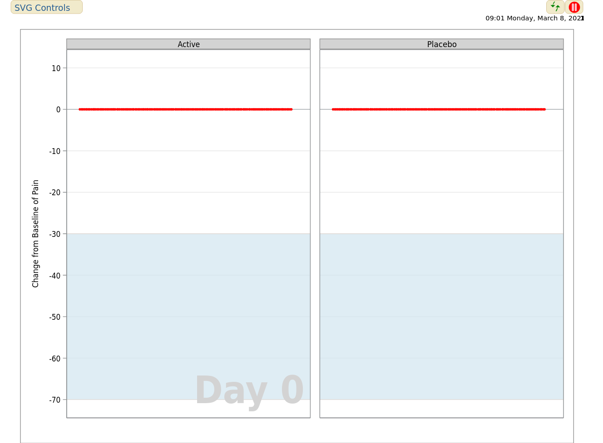
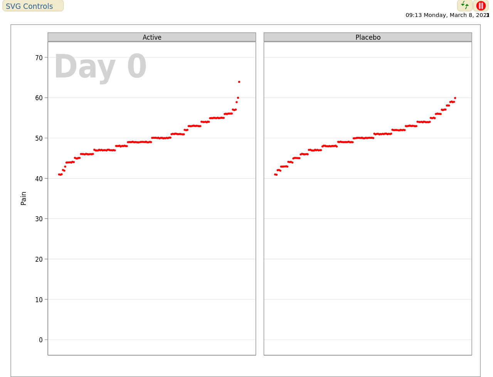

# Missing data
Missing data are present in almost any (clinical) data set. For this simulated data set, we assume a clinical phase III trial on Psoriasis. An active treatment arm is compared to a placebo arm. The main interest lies in the comparison of these two arms. (The comparison may be adjusted for age, gender, and BMI). The outcome variable is Pain which was collected on a visual analogue scale (range: 0-100). Greater values mean worse pain. Next to the original values, a dichotomized version of pain is calculated and included in the data set: Pain reduction from baseline of at least 30. Data were collected at baseline and at ten follow-up time points.


<a id="example1"></a>

## Example 1. Barplot

  
[high resolution image](./images/2021-02-10 - orhan aktaş.png)  

(A summary of the discussion will be added shortly.)

[link to code](#example1 code)


<a id="example2"></a>

## Example 2. Missing data pattern

  
The app can be found [here](./images/ch_missing_data - Agustin Calatroni.html)  

(A summary of the discussion will be added shortly.)

[link to code](#example2 code)

<a id="example3"></a>

## Example 3. Heatmap

  
[high resolution image](./images/heatmap - Lorenz Uhlmann.png)  

(A summary of the discussion will be added shortly.)

[link to code](#example3 code)

<a id="example4"></a>

## Example 4. Animated dot plots

  

  

The first animated visualization can be found [here](./images/missing_anim_chgfbl_svg - David Carr.svg).  
The second animated visualization can be found [here](./images/missing_anim_svg - David Carr.png).

(A summary of the discussion will be added shortly.)

[link to code](#example4 code)


<a id="example5"></a>

## Example 5. Sankey plots

  
The pdf file can be found [here](./images/Missing Sankey - David Carr.pdf).

(A summary of the discussion will be added shortly.)

[link to code](#example5 code)


# Code

<a id="example1 code"></a>

## Example 1. Barplot

The Rmd file can be found [here](./code/2021-02-10_final - orhan aktaş.Rmd)


[Back to blog](#example1)


<a id="example2 code"></a>

## Example 2. Missing data pattern

The Rmd file can be found [here](./code/ch_missing_data - Agustin Calatroni.rmd)

[Back to blog](#example2)


<a id="example3 code"></a>

## Example 3. Heatmap

```{r, echo = TRUE, eval=FALSE}
# Heatmap:
##########

# Load required packages:
require(naniar)
require(ggplot2)

# Load data set:
dat <- read.csv("missing_data.csv")

# Focus only on continuous pain variables:
dat <- dat[, c(1:11, 25)]

# Reshape data into long format and do some data preparation steps:
dat.long <- reshape(dat, varying = 1:11, direction = "long", sep = ".")
dat.long <- dat.long[, -4]
dat.long$time <- factor(dat.long$time)


dat.long.pbo <- dat.long[which(dat.long$trt == "pbo"), ]
dat.long.act <- dat.long[which(dat.long$trt == "act"), ]

names(dat.long.act)[3] <- "active"

dat.long.pbo <- dat.long.pbo[, -1]
dat.long.act <- dat.long.act[, -1]

dat.long.combined <- dat.long.act
dat.long.combined$placebo <- dat.long.pbo$pain

# Create heatmap:
gg_miss_fct(x = dat.long.combined, fct = time) +
  ggtitle("Percentage of missing values increases over time
and is generally higher in the active group") +
  xlab("Visit") + ylab("Treatment") +
  theme(axis.text.x = element_text(angle = 0, hjust = 0.5),
        text = element_text(size = 18))
ggsave("heatmap.png", height = 5, width = 10)
```

[Back to blog](#example3)


<a id="example4 code"></a>

## Example 4. Animated dot plot
The sas file for the first visualization can be found [here](./code/missing_anim_chgfbl_svg - David Carr.sas)  
The sas file for the second visualization can be found [here](./code/missing_anim_svg - David Carr.sas)  

[Back to blog](#example4)


<a id="example5 code"></a>

## Example 5. Sankey plots
The sas file can be found [here](./code/missing_sankey - David Carr.sas).

[Back to blog](#example5)