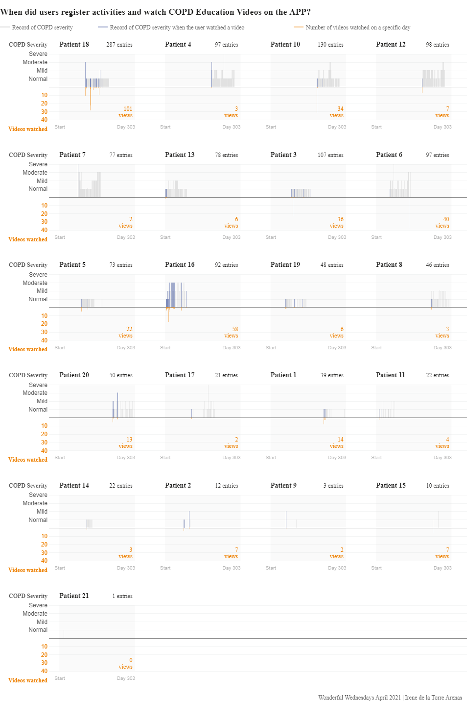
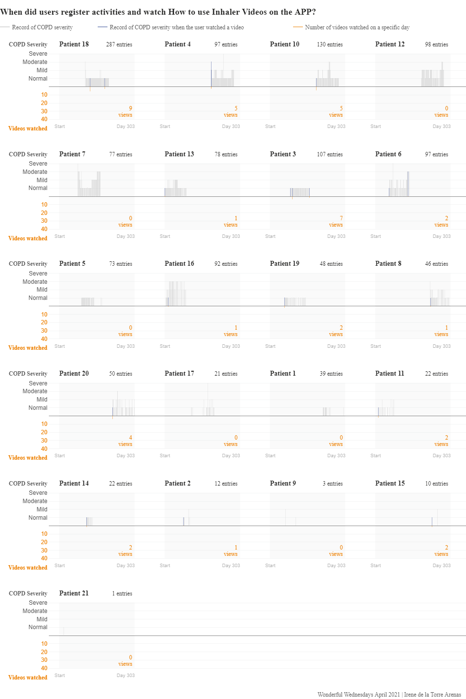
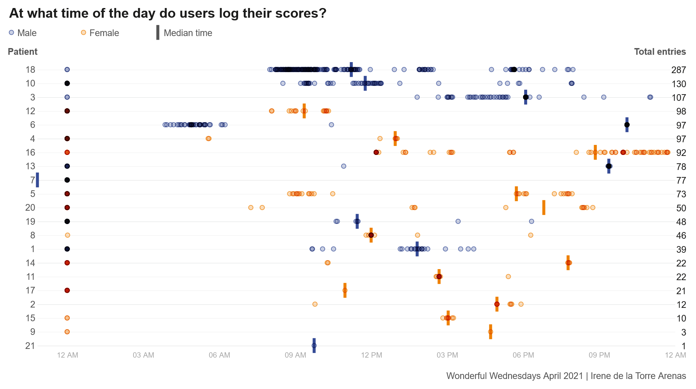
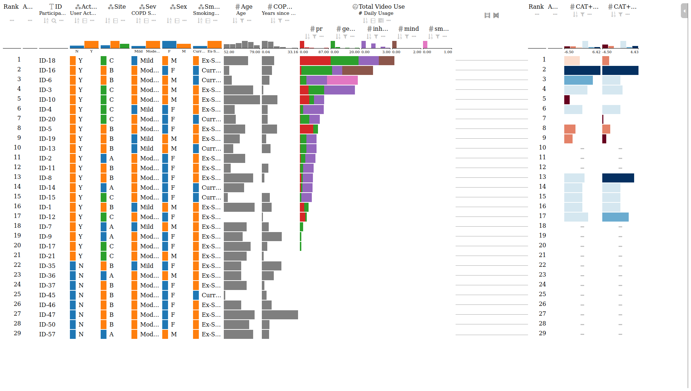

# Mobile app data
This was a 12-week small scale, open-label, parallel-group, randomised controlled trial of the app compared with usual care in people with mild–moderate COPD. The aim of the trial was to establish if the delivery of the self-management app would improve patients COPD impact. For this 60 participants were randomised 1:1 to either the app (N=29) or to usual care (N=31) and were stratified by COPD Severity, the study was not fully powered.

In the intervention arm:

* How does individual app usage change over time?
* How does app usage impact individual symptom and CAT scores?

The challenge was to explore these patterns/relationships visually.


<a id="example1"></a>

## Example 1. Visualization app

  
  
  
  
The app can be found [here.](https://observablehq.com/@irenedelatorre/wonderful-wednesday-april-2021-copd-app-data)  

(A summary of the discussion will be added shortly.)

[link to code](#example1 code)


<a id="example2"></a>

## Example 2. Dot plot over time

  
The video can be found [here](./images/data_viz - Lauren Bell.mp4).  

(A summary of the discussion will be added shortly.)

[link to code](#example2 code)

<a id="example3"></a>

## Example 3. LineUp

  
The app can be found [here](./images/h_lineup - Agustin Calatroni.html)  

(A summary of the discussion will be added shortly.)

[link to code](#example3 code)


# Code

<a id="example1 code"></a>

## Example 1. Visualization app

The code can be found [here](https://observablehq.com/d/93b698590f9dd7b2).


[Back to blog](#example1)


<a id="example2 code"></a>

## Example 2. Dot plot over time

```{r, echo = TRUE, eval=FALSE}
# Data viz PSI

#install.packages("readxl")
library("readxl")
library(lubridate)
library(dplyr)
library(ggplot2)
library(rayshader)
library(viridis)
library(gganimate)
library(scales)

setwd("C:/Users/lsh1703883/Documents/Data visualisation PSI")

viz_data <- read_excel("mobile app data.xlsx")

View(viz_data)

summary(viz_data)

str(viz_data)

viz_data$time <- lubridate::with_tz(viz_data$time, "Europe/London")
# hour
viz_data$hour <- hour(viz_data$time)
table(viz_data$hour)
# day 
viz_data$day <- wday(viz_data$date, label=TRUE)
table(viz_data$day)


# day of the week

viz_data <- viz_data %>% 
  group_by(AppID) %>% mutate(session=1:n()) 


viz_data <- viz_data %>% 
  group_by(AppID, date) %>% count(day,hour) 


viz_data <- na.omit(viz_data)

View(viz_data)


p <- ggplot(
  viz_data, 
  aes(x = as.factor(day), y=as.numeric(hour), size= 8)) + 
  geom_point(aes(fill = as.factor(AppID), colour=as.factor(AppID)))  + 
  xlab("Day of Activity in the App")+
  ylab("Time of Activity in the App ")+  
  labs(color = "Scenario")+ 
  scale_color_discrete()+
  theme_minimal()+
  guides(size = TRUE)+
  guides(alpha = FALSE)+
  guides(linetype = FALSE)+
  theme(legend.position = "none")+
  theme(axis.text = element_text(size = 12),
        title = element_text(size = 12,face="bold"),
        panel.border= element_rect(size=2,color="black",fill=NA))+
  scale_y_continuous(trans = "reverse",breaks=seq(3,21,3))
  
 
p

library(transformr)
library(av)

p <- p + transition_states(AppID, transition_length = 15, state_length = 15) +
  ggtitle(label = "Day and Time of Activity in the App",
          subtitle= 'Now showing App ID {closest_state}')

 
p <- p + theme(plot.subtitle=element_text(size=18, hjust=0, face="italic", color="dark blue")) +
  theme(plot.title=element_text(size=18, hjust=0.5, colour="black", vjust=-1))


final_animation<-animate(p,100,fps = 20,duration = 30, width = 950, height = 750,
                         renderer = av_renderer())


anim_save("./data_viz.mp4",animation=final_animation)
```


[Back to blog](#example2)


<a id="example3 code"></a>

## Example 3. LineUp

The rmd file can be found [here](./code/f_lineup - Agustin Calatroni.rmd).

[Back to blog](#example3)