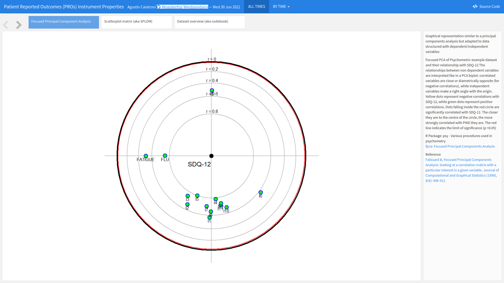

# Simulated Disease Questionnaire
The dataset includes item level data for a 12 item (question) Simulated Disease Questionnaire (SDQ-12) at four different timepoints and for 2000 patients. Each item is scored on a 0-3 scale (0 representing worst possible health state/most severe symptoms, 3 representing best possible health state and no symptoms), and a sum score is also calculated by adding all item responses. Each of the 12 items has been simulated to represent a distinct symptom


<a id="example1"></a>

## Example 1. Item Response Distribution Plot

  
[high resolution image](./images/Response Distributions - Philip Griffiths.png)  

This visualization displays the distribution of the individual items over each of the four days available in the data. Each horizontal bar is coloured in varying shades of blue with darker shades indicating higher levels of severity in the corresponding item for that day.

The visualization allows the viewer to quickly identify the greater severities observed on Day 4, and to compare the individual items on each day. This provides a nice overview of the data which is quick and easy to understand. The use of darker shades to represent darker colours is intuitive.

The panel did feel that some of the repeated axis labels are unnecessary and could be removed to reduce clutter, and that a more informative item sorting than alphabetical could be used. Whilst the individual items can easily be compared for each day, it is slightly more difficult to see the changes in each item over time. 

[link to code](#example1 code)


<a id="example2"></a>

## Example 2. Individual Item Level Plot

  
[high resolution image](./images/change-by-symptom-score-ITA - Irene De la Torre Arenas.png)  

This visualization also displays the distribution of the individual items over time, although an alternative layout is considered here which puts greater emphasis on the progression of each item over time. Again, an intuitive colour scheme is used with green shades indicating better outcomes and pink shades indicating worse.

The individual items are not ordered according to item number, suggesting some ordering has been applied, although it is not the easiest to see what this sorting is. There are also quite large spaces between the individual bars, which makes it slightly more difficult to compare the bars than if they were closer together. 

[link to code](#example2 code)

<a id="example3"></a>

## Example 3. Waterfall Plot

  
[high resolution image](./images/Ability_to_detect_change - Philip Griffiths.png)  

This waterfall plot displays the individual change score of each patient. The bars are coloured by the patients’ self-reported conditions, allowing us to easily see the tools’ ability to detect change. This nicely addresses one of the key focuses of this month’s challenge. The plot has a meaningful title and subtitle, and the removal of unnecessary clutter allows the viewer to really focus on what is important.

Whilst it is easy to see the patterns in the tails of the distribution and thus deduce the general picture, it is slightly harder to distinguish the message towards the middle of the plot where the colours frequently change. This could be somewhat addressed if at a given change score, the individual bars were sorted according to self-reported condition and thus colours were grouped. Without such a sorting, we observe an unusual effect where our eyes pick up some bars which appear to be of different colours than those which are in the legend. Adding a slight jitter or similar may also enhance this plot by allowing us to see the colours of those patients with a change score of zero.

[link to code](#example3 code)

<a id="example4"></a>

## Example 4. Network Plot

  


[high resolution image](./images/Network - Philip Griffiths.png).

This plot overviews relationships between the different items and scores. It displays some interesting connections, although it would benefit from some supplementary information to detail what exactly the connections show, what the colours of the bars represent, etc. The assumption of the panel was that the connections represented correlations, with colour used to indicate whether these are positive or negative. It would be great for this to be clarified on the plot, avoiding any risk of misinterpretation. Given the large number of connections in the network, allowing the user to interactively select which items to investigate would be a nice enhancement.

[link to code](#example4 code)


<a id="example5"></a>

## Example 5. Interactive Plot

  
The app can be found [here](./images/sdq - Agustin Calatroni.html).  

This interactive tool has multiple tabs each displaying different information. As well as the visualisation aspects, the final tab provides an overview of the data, allowing the user to deep-dive into the numbers. This is a great feature for an exploratory tool.

The first tab displays a principal component analysis showing the relationship between the items. Dots closer to the centre have higher correlations with SQD-12, and the relative positions of the dots display indicate relationships between individual items. This nicely allows the user to investigate multiple relationships. There is also the possibility for the user to select individual time points of interest. The plot is slightly difficult to interpret at first and takes a little bit of time to digest, particularly with the position of the items changing. However, the supplementary text is great for providing detail of how to understand the plot. It would be a useful addition if a key outlining the abbreviations for the individual items was always visible to the user.

The second tab provides a scatterplot matrix displaying item level distributions, correlations between items and distributional relationships between items. Again, the plot takes a little time to understand and dig into but provides a wealth of information that is useful for individuals who want to investigate the data at length. 

[link to code](#example5 code)


## Example 6. Wright Map

  
[high resolution image](./images/Wrightmap - Philip Griffiths.png).  

This final visualization has two features: a histogram displaying the underlying characteristics of the patient population and a supplementary graph displaying the expected response thresholds for the different severity levels in relation to the underlying latent scores.

Again, the plot takes a moment to interpret, but once understood provides a message that is easy to understand. It may help the viewer understood more quickly if the vertical gridlines were continued up to the histogram (or alternatively if the x-axis was positioned between the two plots) to make clear that the two aspects of the visual are connected.

The colouring of the points is generally sensible, although some panellists felt that using the darker blue score for the most severe response may be more intuitive. The bars are logically sorted according to the severe/moderate response threshold. The plot would benefit from an informative title and the use of integer values on the x-axis.

[link to code](#example6 code)

# Code

<a id="example1 code"></a>

## Example 1. Item response distribution plot

```{r, echo = TRUE, eval=FALSE, python.reticulate = FALSE}
library(tidyverse)
library(mirt)
library(ggpubr)

library(forcats)
library(psych)
library(polycor)
library(GPArotation)
library(xtable)
library(lavaan)
library(lavaanPlot)

library(WrightMap)
library(data.table)
library(ggcorrplot)
library(lme4)
library(Matrix) 
library(stringr)
library(hrbrthemes)
library(viridis)
library(gmodels)
library(pander)
library(rtf)
library(difR)


#Clear environment
rm(list=ls())

#Colour scheme
Turquoise100 <- "#00a3e0"
Turquoise75 <- "#40bae8"
Turquoise50 <- "#7fd1ef"
Turquoise25 <- "#bfe8f7"
Blue100 <- "#005587"
Blue50 <- "#7FAAC3"
Green100 <- "#43b02a"
Green50 <- "#a1d794"
Purple100 <-"#830065"
Purple50 <- "#c17fb2"

Names <- c(
  'Dry Cough',
  'Loss of Smell',
  'Skin Rash',
  'Fever',
  'Headache',
  'Short of Breath',
  'Diarrhoea',
  'Sore Throat',
  'Fatigue',
  'Runny Nose',
  'Ocular Issues',
  'Loss of Taste')


#Set data and results areas up
sourcedata <- "C:/Users/q1062810/OneDrive - IQVIA/Wonderful Wednesday/Psychometrics/"

setwd(sourcedata)
dat <-read.csv("PSI_WW_psychometric.csv")

### Make dataset for each timepoint ====
dat_t1 <- dat %>%
  select(c(ends_with("T1"))) %>%
  select(-c(starts_with("PGIC")))

colnames(dat_t1) <- Names

dat_t2 <- dat %>%
  select(c(ends_with("T2"))) %>%
  select(-c(starts_with("PGIC")))

colnames(dat_t2) <- Names

dat_t3 <- dat %>%
  select(c(ends_with("T3"))) %>%
  select(-c(starts_with("PGIC")))

colnames(dat_t3) <- Names

dat_t4 <- dat %>%
  select(c(ends_with("T4"))) %>%
  select(-c(starts_with("PGIC")))

colnames(dat_t4) <- Names

# Start data manip =========

myplot <- function(df, timepoint,graphname){

Resp_Dist <<- df %>% #set the dataset
  apply(2, table) %>% # tabulate response distributions
  as.data.frame() %>% #apply on the above line makes a matrix. This converts to a dataframe.
  mutate(Response = as.factor(c(0:3))) #Here we make sure that we have a column labelling the response options
#select(Response, starts_with("item")) #And move response to the front of the dataset

colnames(Resp_Dist) <<- c(Names,"Response")

#Make a staked barchart for one of the timepoints
#First transpose the dataset to long format
Resp_Dist <<- Resp_Dist %>%
  pivot_longer(cols = c(1:12), names_to = "Item", values_to = "Frequency") %>% #this is the line which makes a long dataset. here we are selecting all columns (ie columns relating to time 3) and keeping the item names in a new variable called "item" and the number that select each response option in a new variable called  "Frequency"
  mutate(Item = as.factor(Item)) %>% #make item a factor rather than just a character variable. important for plotting
  mutate(Response = as.factor(if_else(Response == 0, "Severe", 
                                      (if_else(Response == 1, "Moderate", 
                                               (if_else(Response == 2, "Mild",
                                                        "None")))))))


Resp_Dist$Response <- factor(Resp_Dist$Response, levels = c("Severe", "Moderate", "Mild", "None"))


Plot_Resp_Dist <<- ggplot(data=Resp_Dist, mapping = aes(fill = Response, x=reorder(Item, desc(Item)), y=Frequency)) + #start with a ggplot statement
  geom_bar(aes(fill=factor(Response)),position="fill", stat="identity")+ #tell it you want a bar chart. position "fill" makes it a stacked bar chart
  scale_fill_manual(name = "Response Option",values=c(Turquoise100, Turquoise75, Turquoise50, Turquoise25), guide = guide_legend(reverse = TRUE)) + #set the colours. Reverse makes sure that the bars are 0-3 rather than 3-0
  theme_classic() + #just removes gridlines etc 
  ggtitle(paste(timepoint))+ 
  labs(y= "Frequency of response option use", x = NULL) +
  scale_y_continuous(labels = scales::percent) + #makes the axis percent
  coord_flip() + #flips to a horizontal chart 
  theme(panel.background = element_blank(), axis.line = element_blank(),
        axis.text=element_text(size=10),
        axis.title=element_text(size=10),
        legend.text=element_text(size=10),
        legend.title=element_text(size=10),
        plot.title = element_text(size=16, face="bold"),
        plot.subtitle = element_text(size=14, face="bold"),
        legend.position="right")

#view plot
Plot_Resp_Dist

assign(graphname, Plot_Resp_Dist, envir = .GlobalEnv)

}
DAY1 <- vector(mode = "list", length = 9)
myplot(dat_t1, "Day 1", "DAY1")

DAY2 <- vector(mode = "list", length = 9)
myplot(dat_t2, "Day 2", "DAY2")

DAY3 <- vector(mode = "list", length = 9)
myplot(dat_t3, "Day 3", "DAY3")

DAY4 <- vector(mode = "list", length = 9)
myplot(dat_t4, "Day 4", "DAY4")

DAY1
DAY2
DAY3
DAY4

Response_Distributions <- ggarrange(DAY1, DAY2, DAY3, DAY4, common.legend = TRUE, legend = "bottom")

Response_Distributions <- annotate_figure(Response_Distributions, 
                top = text_grob("Symptom severity increased each day", color = "black", face = "bold", size = 20),
                bottom = NULL,
                left = "SDQ-12 item name",
                right = NULL)

Response_Distributions
png(filename = "Response Distributions.png",  width = 920, height = 540, units = "px", pointsize = 10,bg = "white")
Response_Distributions
dev.off()
```


[Back to blog](#example1)


<a id="example2 code"></a>

## Example 2. Individual item level plot

The code can be found [here](https://observablehq.com/@irenedelatorre/stacked-bar-chart-with-plot).

[Back to blog](#example2)


<a id="example3 code"></a>

## Example 3. Waterfall plot

You may need to run (some parts of) the code presented in Example 1 before you can run this one.

```{r, echo = TRUE, eval=FALSE}
library(tidyverse)
library(dplyr)


#Clear environment
rm(list=ls())

#Colour scheme
Turquoise100 <- "#00a3e0"
Turquoise75 <- "#40bae8"
Turquoise50 <- "#7fd1ef"
Turquoise25 <- "#bfe8f7"
Blue100 <- "#005587"
Blue50 <- "#7FAAC3"
Green100 <- "#43b02a"
Green50 <- "#a1d794"
Purple100 <-"#830065"
Purple50 <- "#c17fb2"

Names <- c(
  'Dry Cough',
  'Loss of Smell',
  'Skin Rash',
  'Fever',
  'Headache',
  'Short of Breath',
  'Diarrhoea',
  'Sore Throat',
  'Fatigue',
  'Runny Nose',
  'Ocular Issues',
  'Loss of Taste',
  'SDQ TOTAL',
  'FLU PRO',
  'Fatigue PRO')


#Set data and results areas up
sourcedata <- "C:/Users/q1062810/OneDrive - IQVIA/Wonderful Wednesday/Psychometrics/"

setwd(sourcedata)
dat <-read.csv("PSI_WW_psychometric.csv")

dat_t4 <- dat %>%
  head(2000) %>%
  select(c(starts_with("T4"), "PGIC_T4" )) %>%
  mutate(Group = if_else(PGIC_T4<=3, "Improved",
                         if_else(PGIC_T4 == 4, "No change", 
                                 if_else(PGIC_T4 == 5, "Worsened a little", "Worsened a lot")))) %>%
  arrange(desc(T4_SDQ_PRO_SUM_CHG)) %>%
  mutate(x = seq(1:2000))

dat_t4$Group <- as.factor(dat_t4$Group)
dat_t4$x <- as.factor(dat_t4$x)


Plot <- dat_t4 %>%
  ggplot() + 
  geom_col(aes(x=x, y=T4_SDQ_PRO_SUM_CHG, fill=Group), width = 1,  na.rm = TRUE) +
  ggtitle("Patients self-reported improvement and worsening \nmatched their SDQ-12 change scores", subtitle = "Supporting the ability of the SDQ-12 to detect change") +
  xlab("Patients, in order of SDQ-12 change score") + 
  ylab("SDQ-12 change score") +
  scale_fill_manual(breaks = c("Improved", "No change", "Worsened a little", "Worsened a lot"), 
                    values=c(Green50, Turquoise100, Blue100, Purple100), name = "Self-Reported Condition") +
  scale_y_continuous(limits = c(-35,30), breaks=c(-35, -15, 0, 15)) +
  theme_classic() + #formatting
  theme(panel.background = element_blank(), axis.line = element_blank(),
        axis.text=element_text(size=14),
        axis.title=element_text(size=16),
        legend.text=element_text(size=14),
        legend.title=element_text(size=16),
        plot.title = element_text(size=22, face="bold"),
        plot.subtitle = element_text(size=14, face="bold")) +
  theme(axis.text.x=element_blank(), # remove the participant numbers 
        axis.ticks.x=element_blank())  # remove x-axis ticks 
Plot

png(filename = "Ability_to_detect_change.png",  width = 920, height = 540, units = "px", pointsize = 10,bg = "white")
Plot
dev.off()
```

[Back to blog](#example3)


<a id="example4 code"></a>

## Example 4. Network plot
```{r, echo = TRUE, eval=FALSE}

library(tidyverse)
library(dplyr)
library(qgraph)
library(GGally)
library(network)

#Clear environment
rm(list=ls())

#Colour scheme
Turquoise100 <- "#00a3e0"
Turquoise75 <- "#40bae8"
Turquoise50 <- "#7fd1ef"
Turquoise25 <- "#bfe8f7"
Blue100 <- "#005587"
Blue50 <- "#7FAAC3"
Green100 <- "#43b02a"
Green50 <- "#a1d794"
Purple100 <-"#830065"
Purple50 <- "#c17fb2"

Names <- c(
'Dry Cough',
'Loss of Smell',
'Skin Rash',
'Fever',
'Headache',
'Short of Breath',
'Diarrhoea',
'Sore Throat',
'Fatigue',
'Runny Nose',
'Ocular Issues',
'Loss of Taste',
'SDQ TOTAL',
'Fatigue PRO',
'FLU PRO')


#Set data and results areas up
sourcedata <- "C:/Users/q1062810/OneDrive - IQVIA/Wonderful Wednesday/Psychometrics/"

setwd(sourcedata)
dat <-read.csv("PSI_WW_psychometric.csv")

dat_t1 <- dat %>%
  select(c(ends_with("_T1"), starts_with("T1") )) 
  

colnames(dat_t1) <- Names
cor(dat_t1)
dat_t1 <- dat_t1 # %>%
  #select(-`SDQ TOTAL`)
groups <- factor(c(
  rep("SDQ_ITEMS", 12),
  rep("SDQ_TOTAL", 1),
  rep("FATIGUE_PRO", 1),
  rep("FLU_PRO", 1)))


qgraph(cor(dat_t1), layout = "spring", labels =
         colnames(dat_t1),
       groups = groups, graph="glasso", sampleSize=2000)
```

[Back to blog](#example4)


<a id="example5 code"></a>

## Example 5. Interactive plot
The rmd file can be found [here](./code/sdq - Agustin Calatroni.rmd).

[Back to blog](#example5)


<a id="example6 code"></a>

## Example 6. Wright map

You may need to run (some parts of) the code in Example 1 before you can run the following code.

```{r, echo = TRUE, eval=FALSE}
###### 4 - Cat Long Form ####### 
#run the model. remember that for rasch models, these are 1 parameter models and will have the same slope across all items
GRM_model <- mirt(data=dat_t1, model = 1, itemtype = 'graded', SE=TRUE, verbose=FALSE)


#extract the coefficients
GRM_model_coef <- coef(GRM_model, IRTpars=TRUE, simplify=TRUE)

#save them as a dataframe
GRM_model_items <- round(as.data.frame(GRM_model_coef$items), 2)
Items <- rownames(GRM_model_items)

GRM_model_items <- cbind(Items, GRM_model_items) %>%
 
#create rasch based scores if this is necessary - are used in the person item map below. 
Scores <- (fscores(GRM_model, model = 'EAP'))


#Take threshold (b) parameters
thresholds <- GRM_model_items[3:5] 

#plot and save
###USING GGPLOT
#Data
thresholds_long <- thresholds %>%
  rownames_to_column() %>%
  rename(Item = rowname) %>%
  arrange(b1) %>%
  mutate(Item = fct_reorder(Item, b1)) %>%
  pivot_longer(cols=-Item, names_to = "threshold", values_to = "AVAL")
#Itemside
WrightMap_item <- ggplot(data = thresholds_long, aes(x=factor(Item), y=AVAL)) +
  geom_line(aes(group=factor(Item))) +
  geom_point(aes(colour=threshold), size=5) +
  scale_colour_manual(name="Response Threshold", labels = c("Severe/Moderate", "Moderate/Mild", "Mild/None"), values = c(Turquoise100, Blue100, Green100)) +
  labs( x = "Item", y = "Latent Score")  +
  theme_bw() + 
  theme(text = element_text(size=16),
        axis.text.x=element_text(colour="black"),
        axis.text.y=element_text(colour="black"))+
  theme(axis.text = element_text(size = 10)) + 
  theme(
    legend.title = element_text(size = 12),
    legend.text = element_text(size = 10)
  )+
  scale_y_continuous(breaks = seq(from = -2.5, to = 2.5, by = 1),limits=c(-2.5,2.5)) +
  coord_flip() +
  theme(legend.position="bottom") 
WrightMap_item

#PersonSide
Scores <- as.data.frame(Scores)
WrightMap_person <- ggplot(data = Scores) +
  geom_bar(aes(x=F1)) +
  scale_x_binned(breaks = seq(from = -2.5, to = 2.5, by = 0.25),limits=c(-2.5,2.5)) +
  #theme_bw()
  theme_void()
WrightMap_person

WrightMap <- ggarrange(WrightMap_person,WrightMap_item + font("x.text", size = 10),
                               ncol = 1, nrow = 2, align = "v", heights=c(0.75,2.25))

WrightMap

png(filename = "Wrightmap.png",  width = 920, height = 540, units = "px", pointsize = 10,bg = "white")
WrightMap
dev.off()
```

[Back to blog](#example6)