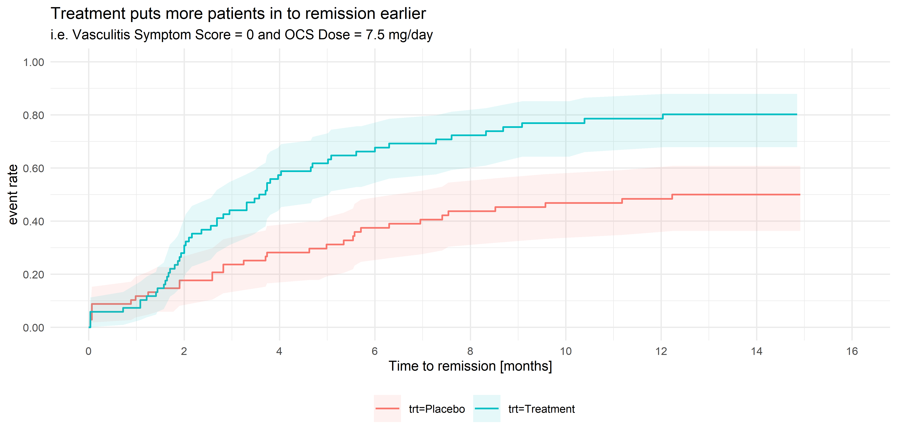

# Vasculitis Data
This is a study of a new investigational medicine for the treatment of a rare type of vasculitis, with patients randomised to active treatment or placebo, with an on-treatment period of 52 weeks and a subsequent off-treatment follow-up period of up for 8 weeks. An ideal medicine would reduce vasculitis symptoms and/or enable a reduction in OCS dose and/or reduce the risk of relapse. Additional endpoints are defined for total number of days the patient was in remission during the on-treatment period, and a binary endpoint for whether a patients achieved remission within the first 24 weeks and maintained in remission until the end of the on-treatment period. Being a rare disease, there is no established consensus on a single endpoint for demonstrating efficacy.


<a id="example1"></a>

## Example 1. Kaplan-Meier plot

  
[high resolution image](./images/remission-tte - Mark Baillie.png)  

(A summary of the discussion will be added shortly.)

[link to code](#example1 code)


<a id="example2"></a>

## Example 2. Lasagna plot

  
[high resolution image](./images/remission-individual - Mark Baillie.png)  

(A summary of the discussion will be added shortly.)

[link to code](#example2 code)

<a id="example3"></a>

## Example 3. Visualisation app

  
The app can be found [here](https://agstn.github.io/VAS/).  

(A summary of the discussion will be added shortly.)

[link to code](#example3 code)

<a id="example4"></a>


# Code

<a id="example1 code"></a>

## Example 1. Kaplan-Meier plot

```{r, echo = TRUE, eval=FALSE, python.reticulate = FALSE}
library(readr)
library(tidyverse)
library(labelled)
library(patchwork)
library(visR)

theme_set(theme_minimal(base_size = 8))

vas_data <- read_csv("vas_data.csv")

var_label(vas_data) <- c(
  subject	  =	'Subject ID',
  trt01pn	  =	'Randomised treatment (0 = Placebo; 1 = Treatment)',
  ady	        =	'Study Day',
  sym	        =	'Vasculitis symptom score',
  dose	     =	'Oral Corticosteroid (OCS) dose',
  rem	        =	'Subject in Remission, i.e. Vasculitis Symptom Score = 0 and OCS Dose <= 7.5 mg/day (Y/N)',
  rel	        =	'Relapse Event (Y)',
  acc_rem	  =	'Accrued Duration of Remission (Days)',
  sus_rem	  =	'Subject Achieved Remission Within First 24 Weeks and Remained in Remission Until EOS? (Y/N))'
)


# 1 rec per subject
vas_per <- vas_01 %>%
  distinct(subject, trt01pn, acc_rem, sus_rem) %>%
  mutate(trt01pc = factor(trt01pn,
                          levels = c(1, 2),
                          labels = c("P", "T")))


# 1 rec per subject
vas_event <- vas_data %>%
  group_by(subject) %>%
  filter(rem == "Y") %>%
  arrange(ady) %>%
  filter(row_number() == 1)


# 1 rec per subject
vas_noevent <- vas_data %>%
  group_by(subject) %>%
  filter(rem == "N") %>%
  arrange(ady) %>%
  filter(row_number() == n()) %>%
  mutate(adyN = ady)


vas_all <-
  bind_rows(vas_event, vas_noevent) %>%
  group_by(subject) %>%
  arrange(subject) %>%
  filter(row_number() == 1) %>%
  mutate(
    CNSR = if_else(rem == "Y", 0, 1),
    AVAL = ady / 30.5,
    trt = factor(
      trt01pn,
      levels = c(1, 2),
      labels = c("Placebo", "Treatment")
    )
  )

mod <- estimate_KM(vas_all, strata = "trt")

pp <-
  visr(
    mod,
    conf.int = 0.95,
    fun = "event",
    x_label = "Time to remission [months]",
    y_label = "event rate"
  ) %>%
  add_CI(style = "ribbon")

a <- pp +
  labs(title = "Treatment puts more patients in to remission earlier",
       subtitle = "i.e. Vasculitis Symptom Score = 0 and OCS Dose ≤ 7.5 mg/day") +
  theme(legend.position = "bottom",
        legend.title = element_blank())

ggsave("remission-tte.png", a,  dpi = 660, scale = 2)
```


[Back to blog](#example1)


<a id="example2 code"></a>

## Example 2. Lasagna plot

```{r, echo = TRUE, eval=FALSE}
library(readr)
library(tidyverse)
library(labelled)
library(patchwork)
library(visR)

theme_set(theme_minimal(base_size = 8))

vas_data <- read_csv("vas_data.csv")

var_label(vas_data) <- c(
  subject	  =	'Subject ID',
  trt01pn	  =	'Randomised treatment (0 = Placebo; 1 = Treatment)',
  ady	        =	'Study Day',
  sym	        =	'Vasculitis symptom score',
  dose	     =	'Oral Corticosteroid (OCS) dose',
  rem	        =	'Subject in Remission, i.e. Vasculitis Symptom Score = 0 and OCS Dose <= 7.5 mg/day (Y/N)',
  rel	        =	'Relapse Event (Y)',
  acc_rem	  =	'Accrued Duration of Remission (Days)',
  sus_rem	  =	'Subject Achieved Remission Within First 24 Weeks and Remained in Remission Until EOS? (Y/N))'
)


# 1 rec per subject
vas_per <- vas_01 %>%
  distinct(subject, trt01pn, acc_rem, sus_rem) %>%
  mutate(trt01pc = factor(trt01pn,
                          levels = c(1, 2),
                          labels = c("P", "T")))


# 1 rec per subject
vas_event <- vas_data %>%
  group_by(subject) %>%
  filter(rem == "Y") %>%
  arrange(ady) %>%
  filter(row_number() == 1)


# 1 rec per subject
vas_noevent <- vas_data %>%
  group_by(subject) %>%
  filter(rem == "N") %>%
  arrange(ady) %>%
  filter(row_number() == n()) %>%
  mutate(adyN = ady)


vas_all <-
  bind_rows(vas_event, vas_noevent) %>%
  group_by(subject) %>%
  arrange(subject) %>%
  filter(row_number() == 1) %>%
  mutate(
    CNSR = if_else(rem == "Y", 0, 1),
    AVAL = ady / 30.5,
    trt = factor(
      trt01pn,
      levels = c(1, 2),
      labels = c("Placebo", "Treatment")
    )
  )

mod <- estimate_KM(vas_all, strata = "trt")

b <- vas_all %>%
  ggplot(aes(y = reorder(subject,-ady), x = ady)) +
  geom_point(alpha = 0.1) +
  geom_point(alpha = 0.1,
             aes(y = reorder(subject,-ady), x = ady + acc_rem),
             colour = "red") +
  geom_linerange(alpha = 0.8,
                 aes(
                   y = reorder(subject,-ady),
                   xmin = ady,
                   xmax = ady + acc_rem
                 ),
                 colour = "red") +
  facet_wrap(~ trt, ncol = 2, scales = "free_y") +
  theme_bw(base_size = 8) +
  theme(
    panel.grid.major.y = element_blank(),
    panel.grid.minor.x = element_blank(),
    panel.grid.minor.y = element_blank(),
    axis.text.y = element_blank(),
    axis.ticks = element_blank()
  ) +
  labs(title = "Time to remission including remission duration",
       subtitle = "Vasculitis Symptom Score = 0 and OCS Dose ≤ 7.5 mg/day") +
  xlab("Study day") +
  ylab("Subjects")

ggsave("remission-individual.png", b, dpi = 660, scale = 2)
```


[Back to blog](#example2)


<a id="example3 code"></a>

## Example 3. Visualisation app

The code can be found [here](https://github.com/agstn/VAS).

[Back to blog](#example3)