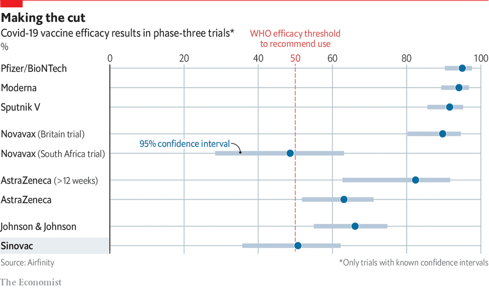
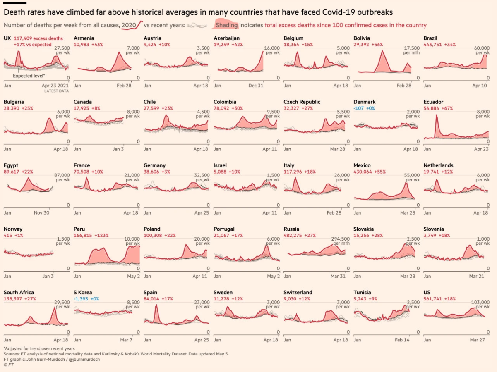

# COVID-19 data
We present your submitted COVID-19 visualizations.

## Example 1. Making the cut

  
[high resolution image](./images/Econ-Covid-Vax - Mark Baillie.webp)  
Source: https://www.economist.com/graphic-detail/2021/04/15/in-clinical-and-real-world-trials-chinas-sinovac-underperforms  
(visited: 05-Sep-2021)

(A summary of the discussion will be added shortly.)

## Example 2. Longitudinal plot

  
[high resolution image](./images/FT-covid1 - Mark Baillie.png)  

Source: https://www.ft.com/content/a2901ce8-5eb7-4633-b89c-cbdf5b386938  
(visited: 05-Sep-2021)

(A summary of the discussion will be added shortly.)

## Example 3. Death rates

  
[high resolution image](./images/FT_ExcessDeaths - Agustin Calatroni.png)  

Source:  
Coronavirus tracker: the latest figures as countries fight the Covid-19 resurgence
https://www.ft.com/content/a2901ce8-5eb7-4633-b89c-cbdf5b386938  
(visited: 05-Sep-2021)

(A summary of the discussion will be added shortly.)