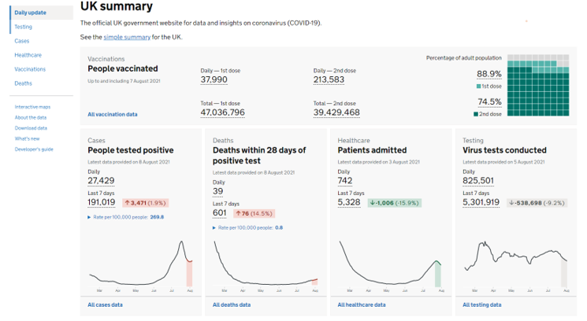
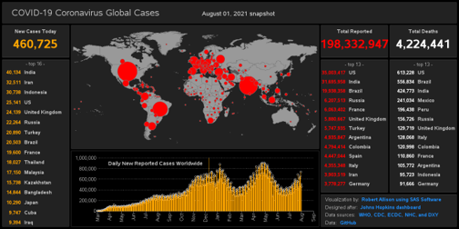
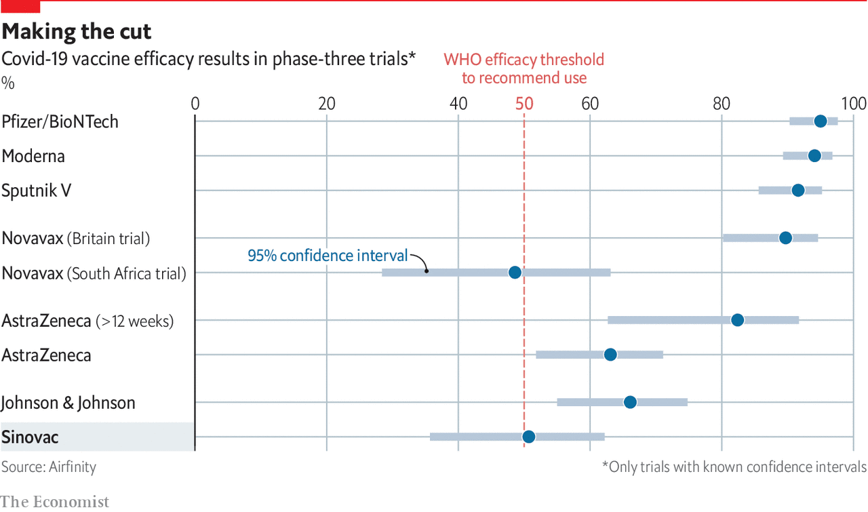
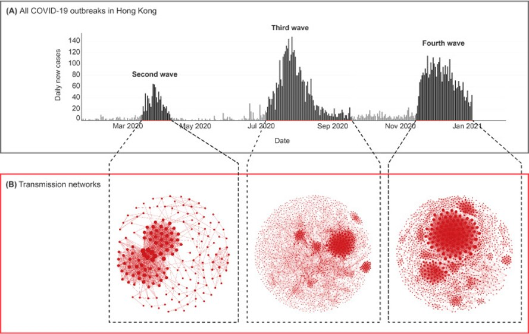

```{r setup, include=FALSE}
knitr::opts_chunk$set(echo = FALSE)
```


The first example was a [UK governmental COVID dashboard](https://coronavirus.data.gov.uk/). Clean and straight to the point, the UK site provides information about the pandemic in the country. It includes numbers and texts that answer the main questions that users might have: are cases rising? What are the vaccinations rates? By clicking each of the topics, users can see specific information in the form of interactive charts. 

  

In contrast a more do it yourself dashboard was presented [implemented in SAS](http://robslink.com/SAS/democd103/coronavirus_covid19_dashboard.htm#United_Kingdom).

  


[The next visualization](https://www.ft.com/content/a2901ce8-5eb7-4633-b89c-cbdf5b386938
), by the Financial Times, represents the excess of deaths caused by the Coronavirus pandemic. It shows a set of small multiples -one per country- highlighting when the number of deaths was higher than the average in recent years. Although the information is impressive, the chart is very crowded with data and annotations which makes understanding it a bit difficult. A similar project, done [by The Economist](https://www.economist.com/graphic-detail/coronavirus-excess-deaths-tracker), included interactivity to avoid this problem. Their implementation of tooltips to extract information is very well done.


The following visualization is an unusual chart done again [by The Financial Times: a streamgraph](https://www.ft.com/content/a2901ce8-5eb7-4633-b89c-cbdf5b386938). This type of plot is a stacked area chart displaced around a central axis. Its organic shapes and different looks might make them unconventional and attractive. However, with this type of chart is difficult to compare the size of the areas. And users who are not familiarized with them might have a hard time understanding them.

  


But visualizing the coronavirus pandemic doesn’t mean using rare charts, or interactive projects. One forest plot from [The Economist shows](https://www.economist.com/graphic-detail/2021/04/15/in-clinical-and-real-world-trials-chinas-sinovac-underperforms) how this traditional chart can be extremely successful at highlighting stories. The key is to include labels and annotations to make the information accessible and declutter the axis to make the data be the main protagonist.

  


Many of the projects around COVID used gamification and interactivity to explain complex scientific terms to the [general audience](https://www.washingtonpost.com/graphics/2020/world/corona-simulator/). The webinar highlighted two that explained how the virus can expand slower or faster depending on people staying or not at home. Users can understand better how simulations and models work by interacting with the different variables that feed the [interactive visualizations](https://ncase.me/covid-19/?fbclid=IwAR2r2dbfSJCRYjUfTUPC3rlKUGtlLsdAFJKTifLUcinUm2-7Olv6dYk-oi8).

  


The last example is a network analysis of how the virus moved in [Hong Kong during the different waves](https://www.thelancet.com/journals/eclinm/article/PIIS2589-5370(21)00209-1/fulltext).

  

