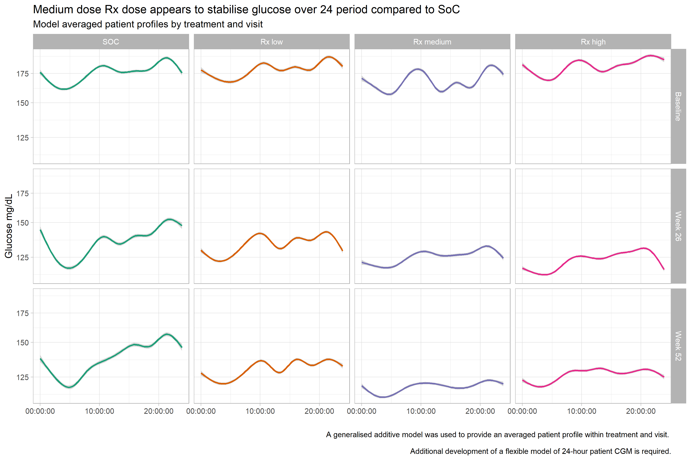
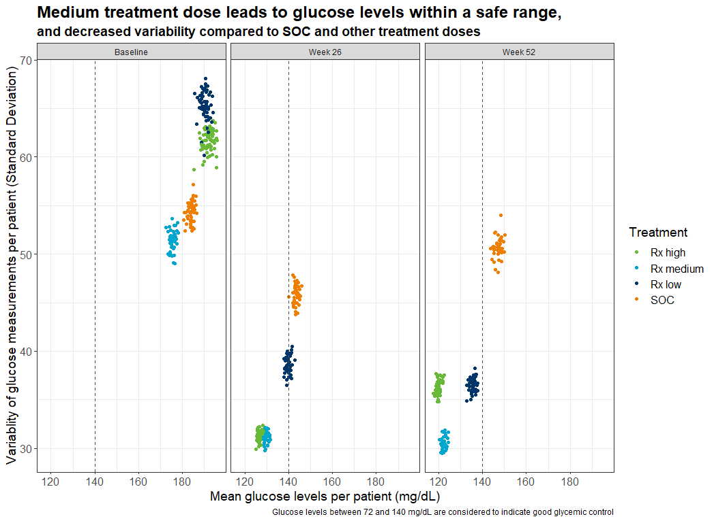
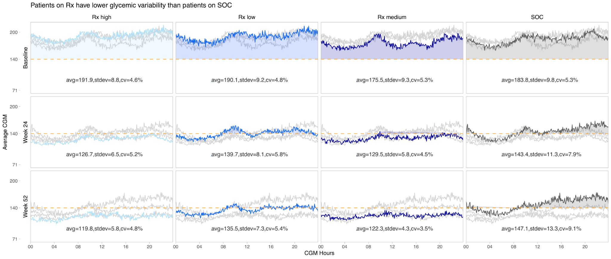

# Continuous Glucose Monitoring (CGM) data
Diabetes affects over 463 million people worldwide. Diabetes is a vascular disease that can lead to amputations, blindness, kidney failure and death. Managing patients’ glucose levels is key to managing their disease.

The CGM data allows us to approximate glucose levels every 5 minutes continuously throughout the day. Glucose values with low variability and within clinically relevant ranges of 72 and 140 mg/dL are considered to indicate good glycemic control. More information can be found [here](https://github.com/VIS-SIG/Wonderful-Wednesdays/tree/master/data/2021/2021-08-11).


<a id="example1"></a>

## Example 1. Bar plot

  
[high resolution image](./images/barplot - Lorenz Uhlmann.png)  

In this bar plot, the relatively complex data set is boiled down to a very simple visualization. The relative amount of time is plotted against the time, by the treatment group.

The panel liked its simplicity and that clutter has been avoided. Furthermore, the coloring is chosen in a sensible way. Grey is used for SOC whereas different shaded of green are used for the Rx treatments which increasing intensity with higher dose levels. The horizontal lines and the y-axis tick marks could have removed to make it even less cluttered, because the percentage is shown in each bar.


[link to code](#example1 code)


<a id="example2"></a>

## Example 2. Dashboard Trelliscope


The app can be found [here](https://agstn.github.io/CGM/)  

This is a lot more than just a visualization. It is a very comprehensive tool to do an extensive exploratory analysis of the data.

In the first tab ("AGP") we see individual patient data including individual profile plots over time. This is very helpful if you want to focus on specific patients. In the visualizations the level of information increases from top to bottom. In the first row, we see a summary over all data for this patient. The next row shows a summary over all days. And the last rows provides the user with individual patient profile plots.

In the second tab ("MODEL RESULTS"), we see a visualization of model results to detect clusters in the CGM values. The goal was to detect differences between clusters in regards to the time spent in the standardized glycemic ranges. The visualization helps the user to easily understand the results.

The last tab ("OTHER METRICS") follows a similar idea as the second tab. The clustering can be done on other variables in a flexible way. This makes this a very powerful tool with many options.

The whole tool comes with a lot of explanations of the definitions used and with clickable references.

The panel thinks that this is just a great and very powerful app to do a thorough exploratory data analysis.

[link to code](#example2 code)

<a id="example3"></a>

## Example 3. Patient profiles with quantiles

  

[high resolution image](./images/cgm_plot_quantiles.png).

This visualization shows quantiles of profile plots at week 52 for the different treatment groups. The message becomes very obvious in is stated in the title: Increasing dose leads to improved glucose stability at week 52.

The quantiles are color coded and the grid line helps to understand the results. It marks the upper limit of good glycemic control. Furthermore, the order of the treatment groups is sensibly chosen (from top left to bottom right - from SOC to the highest dose).


[link to code](#example3 code)

<a id="example4"></a>

## Example 4. Averaged patient profiles

  

[high resolution image](./images/MAD-CGM - Mark Baillie.png)  

In this visualization, we see the averaged profile plots for the different treatment groups. It is a very clean visualization and the message becomes quite obvious.

The panel thought coloring could be improved (for example, by using the same color with increasing intensity for the Rx arms with increasing dose levels). Furthermore, it might be better to re-organize the plots: The time points could be next to each other and the groups on top of each other.

A very good idea is the x-axis labeling. Even without a label it becomes clear right away that the time is displayed, due to the format that is being used.

[link to code](#example4 code)


<a id="example5"></a>

## Example 5. Profile plots with overlays

  
[high resolution image](./images/scatterplot_cgm_v0_2 - Abi Williams.png)  

This visualization follows a similar idea as the one above. Furthermore, the same ordering of the plots is used and therefore, the same idea of re-ordering them might apply. Another thing that could be improved is the order of the treatment arms (going from SOC to low - medium - high dose) and the coloring of the arms with increased intensity of the color for increased levels of dosing. (Grey is wisely chosen for SOC.)

The overlays make it easy to compare the different groups which is a very nice idea of visualizing this type of data.

[link to code](#example5 code)


## Example 6. Variability plot

  
[high resolution image](./images/profile_plot.png)  

In this plot, the variability (represented by the standard deviation) is plotted over time and by treatment group. This is a very good idea to present the stability of the values.

The title is very nicely done. The first line provides already a very clear message. The second line uses a smaller font size and provides additional information. This plot is very clear and easy to read. Only the coloring could be chosen in a different way as already discussed above.

[link to code](#example6 code)


# Code

<a id="example1 code"></a>

## Example 1. <Same title as above>

```{r, echo = TRUE, eval=FALSE}
# Barplot by treatment and time:
# Frequency of values per patient within the range of 72 and 140 mg/dL:

# Read in data:
dat <- read.csv("simulated_data.csv", sep = ",", dec = ".")

# Create function to calculate the percentage per patient:
num.f <- function(x) length(which(x >= 72 & x <= 140)) / length(x)

# Calculate mean values:
res <- aggregate(dat$Simulated_CGMValue, list(dat$SUBJID, dat$TREATMENT, dat$VISITNUM), num.f)
res <- aggregate(res$x, list(res$Group.2, res$Group.3), mean)

# Prepare the results to be plotted:
names(res) <- c("TREATMENT", "VISITNUM", "Value")
res$VISITNUM <- factor(res$VISITNUM, levels = c(3, 17, 21), labels = c("baseline", "26 weeks", "52 weeks"))
res$TREATMENT <- factor(res$TREATMENT, ordered = T,
                        levels = c("SOC", "Rx low", "Rx medium", "Rx high"))
res$Value <- res$Value*100
res$val.t <- format(round(res$Value, 1), nsmall = 1)

# Create the plot:
library(ggplot2)
library(RColorBrewer)
ggplot(res, aes(y=Value, x=VISITNUM, fill=TREATMENT)) + 
  geom_bar(position="dodge", stat="identity") +
  ylab("Time under good glycemic control (%)") + xlab ("Study visit number") +
  theme_minimal() + #scale_fill_brewer(palette="Set1")
  scale_fill_manual(breaks = c("SOC", "Rx low", "Rx medium", "Rx high"),
                    values = c("lightgrey", brewer.pal(n = 3, name = "Greens"))) +
  geom_text(aes(label=val.t), vjust = 1.5, size = 4, position = position_dodge(.9)) +
  ggtitle("The relative amount of time (averaged over all patients) under good glycemic control
(in the range of 72 and 140 mg/dL) was the highest in the medium and high dose.")
ggsave("barplot.png")
```


[Back to blog](#example1)


<a id="example2 code"></a>

## Example 2. Dashboard Trelliscope

The Rmd file can be found [here](https://github.com/agstn/CGM/blob/main/index.rmd) and [here](./code/index - Agustin Calatroni.rmd).  
The full code can be found [here](https://github.com/agstn/CGM).

[Back to blog](#example2)


<a id="example3 code"></a>

## Example 3. Patient profiles with quantiles

```{r, echo = TRUE, eval=FALSE}
####################################################################
# Program name: hgb_quantiles_f.R
# Purpose: To produce plot summarising spread of Hgb values at each
#         visit (for Wonderful Wednesdays July 2020)
# Written by: Steve Mallett
# Date: 12-Jun-2020
####################################################################

library(haven)
library(dplyr)
library(tidyr)
library(ggplot2)
library(grid)
library(gridExtra)

cgm0 <- read_sas("/shared/175/arenv/arwork/gsk1278863/mid209676/present_2020_01/code/CGM/cgm_data2.sas7bdat") %>%
  filter(trtcd == 0 & VISITNUM == 21)

quant <- cgm0 %>% group_by(CGMTIME) %>%
  do(quant = quantile(.$aval, probs = seq(0.2,0.8,.05)), probs = seq(0.2,0.8,.05)) %>%
  unnest(cols=c(quant, probs)) %>%
  mutate(delta = 2*round(abs(.5-probs)*100)) %>% 
  group_by(CGMTIME, delta) %>%
  summarize(quantmin = min(quant), quantmax= max(quant)) %>%
  mutate(hour = (CGMTIME/3600)) %>%
  filter(delta != 0)

# Produce plot for Placebo

plot0 <- ggplot() +
  geom_ribbon(data = quant, aes(x = hour, ymin = quantmin, ymax = quantmax,
                                    group = reorder(delta, -delta), fill = as.numeric(delta)),
              alpha = .5) +
  geom_segment(aes(x=1, xend=24, y=180, yend=180), linetype = 2, color = "blue") +
 scale_x_continuous(" ",
                    breaks=c(1,2,3,4,5,6,7,8,9,10,11,12,13,14,15,16,17,18,19,20,21,22,23,24),
                    limits=c(1, 24)) +
 scale_y_continuous("Glucose (mg/dL)",
                   breaks=c(100, 150, 200),
                   limits=c(100, 200),
                   ) +
  scale_fill_continuous(guide = guide_legend(direction = "horizontal", 
                                             title.position = "none")) + 
  scale_color_identity(name = " ",
                       guide=legend,
                       labels = " ") + 
  theme_minimal() +
  theme(legend.position="none",
        axis.text.x = element_blank(),
        axis.title.x = element_blank(),
        axis.text.y = element_text(size = 15, color = 'black'),
        axis.title.y = element_text(size = 25),

        axis.ticks.x=element_blank(),
        axis.text.y.left =  element_text(color = 'black'),        
        plot.title = element_text(hjust = 0.5, size = 25),
        text = element_text(size = 15),

        axis.title = element_text(size = 25),
        panel.border = element_rect(colour = "black", fill=NA, size=1),
        plot.margin=unit(c(1,0,0,0),"cm")) +
  ggtitle(label = "Placebo")

#####################################
cgm1 <- read_sas("/shared/175/arenv/arwork/gsk1278863/mid209676/present_2020_01/code/CGM/cgm_data2.sas7bdat") %>%
  filter(trtcd==1 & VISITNUM == 21)

quant <- cgm1 %>% group_by(CGMTIME) %>%
  do(quant = quantile(.$aval, probs = seq(0.2,0.8,.05)), probs = seq(0.2,0.8,.05)) %>%
  unnest(cols=c(quant, probs)) %>%
  mutate(delta = 2*round(abs(.5-probs)*100)) %>% 
  group_by(CGMTIME, delta) %>%
  summarize(quantmin = min(quant), quantmax= max(quant)) %>%
  mutate(hour = (CGMTIME/3600)) %>%
  filter(delta != 0)

plot1 <- ggplot() +
  geom_ribbon(data = quant, aes(x = hour, ymin = quantmin, ymax = quantmax,
                                 group = reorder(delta, -delta), fill = as.numeric(delta)),
              alpha = .5) +
  geom_segment(aes(x=1, xend=24, y=180, yend=180), linetype = 2, color = "blue") +
  scale_x_continuous(" ",
                     breaks=c(1,2,3,4,5,6,7,8,9,10,11,12,13,14,15,16,17,18,19,20,21,22,23,24),
                     limits=c(1, 24)) +
  scale_y_continuous("Glucose (mg/dL)",
                     breaks=c(100, 150, 200),
                     limits=c(100, 200),
  ) +
   scale_fill_continuous(guide = guide_legend(direction = "horizontal", 
                                             title.position = "none")) + 
  scale_color_identity(name = " ",
                       guide=legend,
                       labels = " ") + 
  theme_minimal() +
  theme(legend.position="none",
        axis.title.y = element_blank(),
        axis.title.x=element_blank(),
        axis.text.x=element_blank(),
        axis.ticks.x=element_blank(),
        axis.text.y.left =  element_blank(),        
        plot.title = element_text(hjust = 0.5, size = 25),
        text = element_text(size = 15),
        axis.text = element_text(size = 20),
        axis.title = element_text(size = 25),
        panel.border = element_rect(colour = "black", fill=NA, size=1),
        plot.margin=unit(c(1,0,0,0),"cm")) +
  ggtitle(label = "Low Dose")

##################################################################################################
cgm2 <- read_sas("/shared/175/arenv/arwork/gsk1278863/mid209676/present_2020_01/code/CGM/cgm_data2.sas7bdat") %>%
  filter(trtcd==2 & VISITNUM == 21)

quant <- cgm2 %>% group_by(CGMTIME) %>%
  do(quant = quantile(.$aval, probs = seq(0.2,0.8,.05)), probs = seq(0.2,0.8,.05)) %>%
  unnest(cols=c(quant, probs)) %>%
  mutate(delta = 2*round(abs(.5-probs)*100)) %>% 
  group_by(CGMTIME, delta) %>%
  summarize(quantmin = min(quant), quantmax= max(quant)) %>%
  mutate(hour = (CGMTIME/3600)) %>%
  filter(delta != 0)

plot2 <- ggplot() +
  geom_ribbon(data = quant, aes(x = hour, ymin = quantmin, ymax = quantmax,
                                 group = reorder(delta, -delta), fill = as.numeric(delta)),
              alpha = .5) +
  geom_segment(aes(x=1, xend=24, y=180, yend=180), linetype = 2, color = "blue") +
  scale_x_continuous("Time",
                     breaks=c(1,2,3,4,5,6,7,8,9,10,11,12,13,14,15,16,17,18,19,20,21,22,23,24),
                     limits=c(1, 24)) +
  scale_y_continuous("Glucose (mg/dL)",
                     breaks=c(100, 150, 200),
                     limits=c(100, 200)) +
  scale_fill_continuous(guide = guide_legend(title = "% patients in band",
                                             direction = "horizontal",
                                             title.position = "left",
                                             element_text(size=15))) +
   theme_minimal() +
  theme(legend.position=c(0.5, 0.65),
        plot.title = element_text(hjust = 0.5, size = 25),
        text = element_text(size = 15),
        axis.text = element_text(size = 15, color = 'black'),
        axis.title.y = element_text(size = 25),
        axis.title.x = element_text(size = 15),        
        legend.key.size = unit(1, "cm"),        
        panel.border = element_rect(colour = "black", fill=NA, size=1)) +
  # guides(colour = guide_legend(override.aes = list(size=3))) +
  ggtitle(label = "Medium Dose")

############################################################################################################
cgm3 <- read_sas("/shared/175/arenv/arwork/gsk1278863/mid209676/present_2020_01/code/CGM/cgm_data2.sas7bdat") %>%
  filter(trtcd==3 & VISITNUM == 21)

quant <- cgm3 %>% group_by(CGMTIME) %>%
  do(quant = quantile(.$aval, probs = seq(0.2,0.8,.05)), probs = seq(0.2,0.8,.05)) %>%
  unnest(cols=c(quant, probs)) %>%
  mutate(delta = 2*round(abs(.5-probs)*100)) %>% 
  group_by(CGMTIME, delta) %>%
  summarize(quantmin = min(quant), quantmax= max(quant)) %>%
  mutate(hour = (CGMTIME/3600)) %>%
  filter(delta != 0)

plot3 <- ggplot() +
  geom_ribbon(data = quant, aes(x = hour, ymin = quantmin, ymax = quantmax,
                                group = reorder(delta, -delta), fill = as.numeric(delta)),
              alpha = .5) +
  geom_segment(aes(x=1, xend=24, y=180, yend=180), linetype = 2, color = "blue") +
  scale_x_continuous("Time",
                     breaks=c(1,2,3,4,5,6,7,8,9,10,11,12,13,14,15,16,17,18,19,20,21,22,23,24),
                     limits=c(1, 24)) +
  scale_y_continuous(" ",
                     breaks=c(100, 150, 200),
                     limits=c(100, 200),
  ) +
  scale_fill_continuous(guide = guide_legend(direction = "horizontal", 
                                             title.position = "none",
                                             element_text(size=6))) + 

  theme_minimal() +
  theme(legend.position="none",
        plot.title = element_text(hjust = 0.5, size = 25),
        text = element_text(size = 15),
        axis.text.y = element_blank(),
        axis.text.x = element_text(size = 15, color = 'black'),
        axis.title.y = element_blank(),
        axis.title.x = element_text(size = 15),  
        legend.text=element_text(size=6),
        legend.title=element_text(size=15),
        legend.key.size = unit(1, "cm"),        
        panel.border = element_rect(colour = "black", fill=NA, size=1)) +
  guides(colour = guide_legend(override.aes = list(size=3))) +
  ggtitle(label = "High Dose")

#####################################################################################################

p <- grid.arrange(arrangeGrob(plot0, ncol=1, nrow=1),
                  arrangeGrob(plot1, ncol=1, nrow=1),
                  arrangeGrob(plot2, ncol=1, nrow=1),
                  arrangeGrob(plot3, ncol=1, nrow=1),
                  heights = c(1,1))

title <- ggdraw() + draw_label("Increasing Dose Leads To Improved Glucose Stability at Week 52", size = 25)

p2 <- plot_grid(title, p, ncol=1, rel_heights = c(1, 10))  

ggsave("/shared/175/arenv/arwork/gsk1278863/mid209676/present_2020_01/code/CGM/cgm_plot_quantiles.png", p2, width=18, height=12, dpi=300)
```

[Back to blog](#example3)


<a id="example4 code"></a>

## Example 4. Averaged patient profiles
```{r, echo = TRUE, eval=FALSE}
#-----------------------------------------------------------------------------
# Plot a model averaged patient profile
# Warning. The proposed model does not take in to account patients and shouldn't
# be believed, but is used for illustrative purposes. 
#-----------------------------------------------------------------------------

library(tidyverse)
library(readr)


simulated_data <- read_csv("simulated_data.csv")

simulated_data %>% glimpse()

simulated_data %>%
  mutate(TREATMENT = factor(TREATMENT, levels=c("SOC", "Rx low", "Rx medium", "Rx high")),
         VISIT = case_when(
           VISITNUM == 3 ~ "Baseline",
           VISITNUM == 17 ~ "Week 26",
           VISITNUM == 21 ~ "Week 52")
  ) %>%
  ggplot(aes(x = CGMTIME, y = Original_CGMValue, colour = TREATMENT, group = TREATMENT)) +
  geom_smooth(se = TRUE) +
  scale_y_continuous(trans = "log") +
  facet_grid(VISIT ~ TREATMENT ) +
  theme_light(base_size = 12) +
  #theme_dark() +
  theme(legend.position = "none") +
  xlab("") +
  ylab("Glucose mg/dL") +
  labs(title = "Medium dose Rx dose appears to stabilise glucose over 24 period compared to SoC",
       subtitle = "Model averaged patient profiles by treatment and visit",
       caption = "A generalised additive model was used to provide an averaged patient profile within treatment and visit. \n
       Additional development of a flexible model of 24-hour patient CGM is required.") +
  scale_color_brewer(palette="Dark2")

ggsave("MAD-CGM.png", width = 12, height = 8)
```

[Back to blog](#example4)


<a id="example5 code"></a>

## Example 5. Profile plots with overlays
No code has been submitted.

[Back to blog](#example5)

## Example 6. Variability plot
```{r, echo = TRUE, eval=FALSE}
## Continuous glucose monitoring data challenge

## Load packages and colours ----
library(tidyverse)

Orange <- "#EF7F04"
Green <- "#68B937"
Blue <- "#00A6CB"
Grey <- "#4E5053"
Darkblue <- "#003569"
Yellow <- "#FFBB2D"

## Read in dataset ----

data <- read_csv('simulated_data.csv')

data$VISITNUM <- as.character(data$VISITNUM)
data$TREATMENT <- as.factor(data$TREATMENT)

## Set up data frame for changing visitnum to visit name

visits <- data.frame(VISITNUM = c('3', '17', '21'),
                     Visit = c('Baseline', 'Week 26', 'Week 52'))

## join it on

dataa <- data %>% 
  full_join(visits)

levels(data$TREATMENT)

## reorder factor for treatment


dataa$Treatment <- factor(dataa$TREATMENT, levels = c("Rx high", "Rx medium", "Rx low", "SOC"))

## Add in mean and sd for each patient and visit combination ----

data1 <- dataa %>% 
  group_by(SUBJID, Visit, Treatment) %>% 
  summarise(mean_cgmsim = mean(Simulated_CGMValue), sd_cgmsim = sd(Simulated_CGMValue), 
            mean_cgm = mean(Original_CGMValue), sd_cgm = sd(Simulated_CGMValue),
            med_cgm = median(Original_CGMValue), iqr_cgm = IQR(Original_CGMValue),
            med_cgmsim = median(Simulated_CGMValue), iqr_cgmsim = IQR(Simulated_CGMValue))


# plotdata <- ggplot(data= data1, aes(x=mean_cgmsim, y = sd_cgmsim, colour= TREATMENT, shape= Visit))
# plotdata <- ggplot(data= data1, aes(x=mean_cgm, y = sd_cgm, colour= TREATMENT, shape= VISITNUM))
plotdata <- ggplot(data= data1, aes(x=mean_cgmsim, y = sd_cgmsim, colour= Treatment))
# plotdata <- ggplot(data= data1, aes(x=med_cgmsim, y = iqr_cgmsim, colour= TREATMENT))


plotdata + geom_point() +
  ggtitle('Medium treatment dose leads to glucose levels within a safe range,') +
  xlab('Mean glucose levels per patient (mg/dL)') +
  ylab('Variablity of glucose measurements per patient (Standard Deviation)') +
  scale_colour_manual(values = c(Green, Blue, Darkblue, Orange)) +
  geom_vline(aes(xintercept=140), linetype=2, colour=Grey) +
  facet_wrap(vars(Visit),labeller = labeller(Visit = label_wrap_gen(55))) +
  labs(caption = "Glucose levels between 72 and 140 mg/dL are considered to indicate good glycemic control",
       subtitle = "and decreased variability compared to SOC and other treatment doses") +
  theme_bw() +
  theme(panel.background = element_blank(), axis.line = element_blank(),
        axis.text=element_text(size=12),
        axis.title=element_text(size=14),
        # legend.position="none",
        legend.title = element_text(size=14),
        legend.text= element_text(size=12),
        plot.title = element_text(size=18, face="bold"),
        plot.subtitle = element_text(size=14, face="bold"))
```

[Back to blog](#example5)