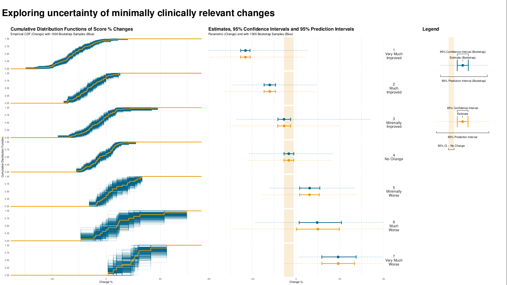
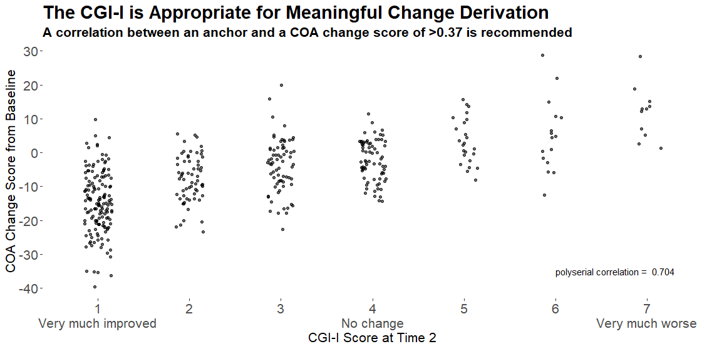
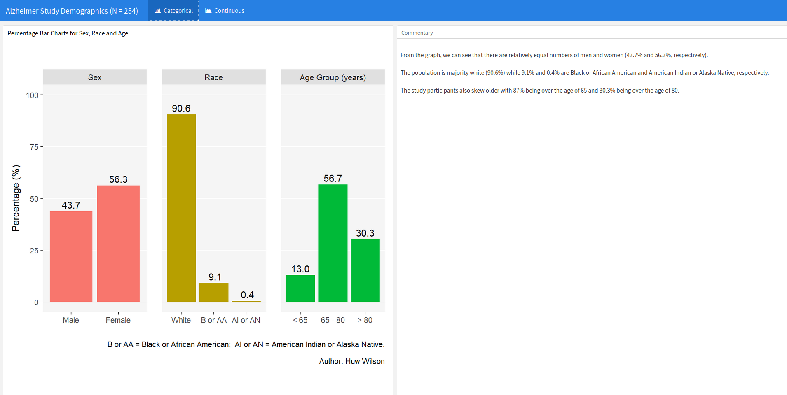

# CGI-I data example
The task is to display the relationship between changes from baseline of the total score and the corresponding CGI-I to guide the understanding of clinically relevant changes and especially assess minimal clinically relevant changes.


<a id="example1"></a>

## Example 1. Exploring uncertainty

  
[high resolution image](./images/plot_par_nonpar - Paolo Eusebi.png)  

This graph is formed in two panels, with the left panel showing the Cumulative Distribution Function (CDF) plots of percentage change from baseline in score, grouped by the anchor measure. A measure of variability has been added to the plot, derived using bootstrapping methods. The right panel is showing 95% CIs and 95% Prediction Intervals of scores for each category.

CDF plots used for comparing distributions are sometimes superimposed, so this approach may have been useful. However the confidence envelopes couldn’t then be shown simultaneously, so there’d need to be a way of interactively selecting one category at a time. Use of percentage change was discussed – absolute changes are often preferable in a scenario where clinical meaningful changes are being assessed.

Overall the design of the graph was appreciated, with a clear legend and good use of colour.

[link to code](#example1 code)


<a id="example2"></a>

## Example 2. Spaghetti and distribution plot

  
[high resolution image](./images/ww_mci - Agustin Calatroni.png)  

The upper part of the  graph is showing the distribution of the score values within each CGI-I category, using density plots of scores on an absolute scale. Distributions are shown separately for baseline and follow-up visits within each category, rather than change from baseline. Individual patient and mean changes are shown using slope plots.

The lower part of the graph shows the distribution of change from baseline values, with a measure of variability being derived using bootstrapping methods. Colour has been used to show paired mean differences outside a +/- 10 unit range.

In general, the graph contains a lot of information and takes some time to understand. However the graph tells a clear story in terms of the distribution of score across different categories, and shows clearly that the Minimally Improved category does not seem to be well differentiated from No Change category.

It was not clear why 10 used as the threshold in the lower panel; in practice we need to consider what is the clinically relevant threshold. The combination of summary level data (density plots) and with patient-level data was effective, although there’s the possibility of including more colour in the graph, e.g. colour coding positive versus negative changes in the patient-level data.

[link to code](#example2 code)

<a id="example3"></a>

## Example 3. Distribution plot by category I

  
[high resolution image](./images/reliable_clinical_change_plot_red_green_v0_2 - Mike Greenwood.png)  

This graph includes stacked density plots, sometimes known as a ridgeline plot. This graph type is useful where there are approximately 4-8 categories with a natural ordering, which is the case in this example. The graph is also showing patient level data as transparent dots on the X axis, and reference lines have been added. There is a lot of overplotting of the dots, so the opacity of dots is representing the data density at each value on the X-axis.

A title has been added to give a clear interpretation of the overall message.

[link to code](#example3 code)

<a id="example4"></a>

## Example 4. Distribution plot by category II

  


The html file can be found [here](./images/MCT_Ridges_v2 - Philip Griffiths.png).

The graph type here is similar to the previous graph, although with overlapping curves. The design is relatively simple compared to the previous plot, but with a stronger use of colour. The lack of unnecessary clutter is effective, although the overlap of the curves is unnecessary and could be distracting to the viewer. It would be useful to see the number of patients in each group, as this could be seen in the previous plot in term of the number of dots on the X-axis.

[link to code](#example4 code)


<a id="example5"></a>

## Example 5. Dot plot

  
[high resolution image](./images/MCT_Anchor_Correlation - Philip Griffiths.png)  

This graph used a different approach, showing only the patient-level data within each category as a scatter plot, with added jittering. The trend between categories is clear, and the number of patients can be compared between groups visually. It was noted that some people find it hard to compare distributions from scatter plots, so a hybrid of scatter plot and a elements showing the distribution, e.g. boxplot or density plot, may have been useful. However the author of the graph mentioned that this graph was intended to be used at the first step of an assessment, to answer the question “is CGI a good enough measure to investigate the meaningful change threshold”, and would be followed in practice by another plot more like Example 4.

The design may be enhanced by including a Y-axis and also horizontal reference lines, and possibly use of colour to differential patients with positive versus negative change. However the purpose of the plot, i.e. to confirm that CGI-I is an appropriate measure, and has sufficient correlation, is met.

[link to code](#example5 code)


## Example 6. Storytelling

<!--   -->
<!-- The html file can be found [here](./images/Huw_Wilson_Wonderful_Wednesdays_Nov21.html)  -->

This graph includes pairs of density plots to compare the distributions of change from baseline score for each category with the “No change” category, with the graph building in an animated fashion. Different hues (green vs red) have been used to represent improved vs worsened categories, and different colour intensities are mapped to level of improvement/worsening (light colours for minimally improved/worse and dark colours for very much improved/worse). As the animation builds, pairs of categories (e.g. Minimally Worse vs Minimally Improved) are brought into focus by colouring the relevant density plots and showing reference lines (median scores of the pairs of categories and the “No change” category). Distributions not part of the current focus are greyed, and reference lines of previously highlighted categories are not shown. Numbers of patients in each category are shown.

An improvement might have been to somehow preserve the information from the reference lines previously shown, as the animation progresses. It would also have been useful to show the actual median values for each category that are presented by the reference lines. As the animation progressed, previous reference lines could have been preserved, but in the background. Also, the colour palette may not be ideal, as the light green category is quite difficult to read.

[link to code](#example6 code)

# Code

<a id="example1 code"></a>

## Example 1. Exploring uncertainty

```{r, echo = TRUE, eval=FALSE, python.reticulate = FALSE}
# Data and packages ----
library(readr)
library(ggplot2)
library(dplyr)
library(cowplot)
library(ggpubr)

urlfile <- "https://raw.githubusercontent.com/VIS-SIG/Wonderful-Wednesdays/master/data/2021/2021-10-13/WWW_example_minimal_clinical_improvement.csv"

df <- read_csv(url(urlfile)) %>%
  mutate(change=`total score follow up`-`total score baseline`,
         change_pct=(`total score follow up`-`total score baseline`)*100/`total score baseline`) %>%
  rename(CGI_I=`CGI-I`)

# Bootstrapping ECDFs ----
set.seed(1234)
nboot <- 1000
boot <- NULL
for (i in 1:nboot){
  d <- df[sample(seq_len(nrow(df)), nrow(df), replace=T), ]
  d$sim <- i
  boot <- rbind(boot, d)
}

res1 <- boot %>%
  group_by(CGI_I, sim) %>%
  summarise(change_pct_median=mean(change_pct)) %>%
  ungroup() %>%
  group_by(CGI_I) %>%
  summarise(boot_median = median(change_pct_median),
            boot_lo95ci = quantile(change_pct_median, 0.025),
            boot_hi95ci = quantile(change_pct_median, 0.975)) 
res1

res2 <- boot %>%
  group_by(CGI_I) %>%
  summarise(boot_lo95pi = quantile(change_pct, 0.025),
            boot_hi95pi = quantile(change_pct, 0.975)) 
res2

res3 <- df %>%
  group_by(CGI_I) %>%
  summarise(n = n(),
            mean = mean(change_pct),
            sd = sd(change_pct),
            lo95pi = mean - 1.96*sd,
            hi95pi = mean + 1.96*sd,
            lo95ci = mean - 1.96*(sd/sqrt(n)),
            hi95ci = mean + 1.96*sd/sqrt(n)) 
res3

chg <- res1 %>%
  left_join(res2) %>%
  left_join(res3)
chg

no_chg <- res1 %>%
  left_join(res3) %>%
  filter(CGI_I==4) %>%
  select(lo95ci, hi95ci, lo95pi, hi95pi) %>%
  right_join(tibble(id=1:7), by = character())
no_chg

# Final plot ----
## CDFs
p1 <- ggplot() +
  stat_ecdf(aes(x=change_pct, group=as.factor(sim)), data = boot, colour = alpha("deepskyblue4", 0.2)) +
  stat_ecdf(aes(x=change_pct), data = df, size = 1.25, color = "orange2") +
  scale_x_continuous(limits = c(-80, 80)) +
  facet_grid(rows = vars(CGI_I))+
  labs(title = "Cumulative Distribution Functions of Score % Changes",
       subtitle = "Empirical CDF (Orange) with 1000 Bootstrap Samples (Blue)",
       y = "Cumulative Distribution Function",
       x = "Change %") +
  theme_minimal() +
  theme(strip.text = element_blank(),
        panel.grid.minor.y = element_blank(),
        panel.grid.major.y = element_blank(),
        plot.title = element_text(size = 18, face = "bold"),
        plot.subtitle = element_text(size = 12)) 
p1


labels_cgii <- as_labeller(c(`1` = "1\nVery Much\nImproved", 
                             `2` = "2\nMuch\nImproved",
                             `3` = "3\nMinimally\nImproved", 
                             `4` = "4\nNo Change",
                             `5` = "5\nMinimally\nWorse",
                             `6` = "6\nMuch\nWorse", 
                             `7` = "7\nVery Much\nWorse"))

## Forest plot
p2 <- ggplot(data=chg) +
  
  geom_rect(data=no_chg, aes(ymin=0, ymax=1,
                             xmin=lo95ci, xmax=hi95ci),
            fill="orange2", alpha=0.025) +
  
  geom_point(aes(x = boot_median, y=0.6),
             size = 4, color = "deepskyblue4") +
  geom_errorbarh(aes(xmin = boot_lo95ci, xmax = boot_hi95ci, y = 0.6), 
                 height = 0.1, size=1.25, color = "deepskyblue4") +
  geom_errorbarh(aes(xmin = boot_lo95pi, xmax = boot_hi95pi, y = 0.6), 
                 height = 0.0, size=0.75, color = "deepskyblue4", linetype="dotted") +
  
  geom_point(aes(x = mean, y = 0.4), 
             size = 4, color = "orange2") +
  geom_errorbarh(aes(xmin = lo95ci, xmax = hi95ci, y = 0.4), 
                 height = 0.1, size=1.25, color = "orange2") +
  geom_errorbarh(aes(xmin = lo95pi, xmax = hi95pi, y = 0.4), 
                 height = 0.0, size=0.75, color = "orange2", linetype="dotted") +

  facet_grid(rows = vars(CGI_I), labeller = labels_cgii)+
  ylim(0, 1) +
  theme_minimal() +
  labs(title = "Estimates, 95% Confidence Intervals and 95% Prediction Intervals",
       subtitle = "Parametric (Orange) and with 1000 Bootstrap Samples (Blue)",
       x = "Change %", 
       y = "") +
  theme(strip.text.y = element_text(size = 14, angle = 0),
        axis.text.y = element_blank(),
        panel.grid.major.y = element_blank(),
        panel.grid.minor.y = element_blank(),
        plot.title = element_text(size = 18, face = "bold"),
        plot.subtitle = element_text(size = 12)) +
  coord_cartesian(xlim = c(-50, 50), ylim=c(0,1), expand=F, clip = "on")
p2


## Legend
dummy1 <- chg[chg$CGI_I==4,]
dummy2 <- chg[chg$CGI_I==5,]

tl<-0.015 # tip.length
l1 <- ggplot(data=dummy2) +
  labs(title = "Legend") +
  geom_rect(data=dummy1, aes(ymin=0, ymax=1, xmin=lo95ci, xmax=hi95ci),
            fill="orange2", alpha = 0.15) +  
  geom_bracket(xmin=dummy1$lo95ci, xmax=dummy1$hi95ci,
               y.position = 0, 
               label = "95% CI - No Change", tip.length = c(-tl, -tl)) + 
  geom_point(aes(x = boot_median, y=0.75), 
             size = 4, color = "deepskyblue4") +
  geom_errorbarh(aes(xmin = boot_lo95ci, xmax = boot_hi95ci, y = 0.75),
                 height = 0.1, size=1.25, color = "deepskyblue4") +
  geom_errorbarh(aes(xmin = boot_lo95pi, xmax = boot_hi95pi, y = 0.75), 
                 height = 0.0, size=0.75, color = "deepskyblue4", linetype="dotted") +
  geom_bracket(xmin=dummy2$lo95ci, xmax=dummy2$hi95ci, y.position = 0.35,
               label = "95% Confidence Interval", tip.length = c(tl, tl)) +
  geom_bracket(xmin=dummy2$mean, xmax=dummy2$mean, y.position = 0.3,
               label = "Estimate", tip.length = c(tl, tl)) +
  geom_bracket(xmin=dummy2$lo95pi, xmax=dummy2$hi95pi, y.position = 0.15, vjust = 4,
               label = "95% Prediction Interval", tip.length = c(-tl, -tl)) +
  geom_point(aes(x = mean, y = 0.25), 
             size = 4, color = "orange2") +
  geom_errorbarh(aes(xmin = lo95ci, xmax = hi95ci, y = 0.25), 
                 height = 0.1, size=1.25, color = "orange2") +
  geom_errorbarh(aes(xmin = lo95pi, xmax = hi95pi, y = 0.25), 
                 height = 0.0, size=0.75, color = "orange2", linetype="dotted") +
  geom_bracket(xmin=dummy2$boot_lo95ci, xmax=dummy2$boot_hi95ci,
               y.position = 0.85,
               label = "95% Confidence Interval (Bootstrap)", tip.length = c(tl, tl)) +
  geom_bracket(xmin=dummy2$boot_median, xmax=dummy2$boot_median,
               y.position = 0.8,
               label = "Estimate (Bootstrap)", tip.length = c(tl, tl)) +
  geom_bracket(xmin=dummy2$boot_lo95pi, xmax=dummy2$boot_hi95pi, 
               y.position = 0.65, vjust = 4,
               label = "95% Prediction Interval (Bootstrap)", tip.length = c(-tl, -tl)) + 
  coord_cartesian(xlim = c(-30, 50), ylim=c(0,1)) +
  theme_void() +
  theme(plot.title = element_text(size = 18, face = "bold"),
        plot.subtitle = element_text(size = 12))
l1

pnull <- ggplot() +
  coord_cartesian(xlim = c(-30, 50), ylim=c(0,1)) +
  theme_void()
  
legend <- plot_grid(l1, pnull, ncol=1,
                    rel_heights = c(0.5, 0.5))

## Title
title <- ggdraw() + 
  draw_label(
    "Exploring uncertainty of minimally clinically relevant changes",
    fontface = 'bold', size = 36,
    x = 0,
    hjust = 0
  ) +
  theme(
    plot.margin = margin(0, 0, 0, 7)
  )
title

plot_row <- plot_grid(p1, p2, pnull , legend, nrow=1, rel_widths = c(3, 3, 0.25, 1.25))
g2 <- plot_grid(title, plot_row, ncol = 1, rel_heights = c(0.1, 1))
g2
f<-1.7
ggsave(file="plot_par_nonpar.pdf", g2, width = 16*f, height = 9*f)
```


[Back to blog](#example1)


<a id="example2 code"></a>

## Example 2. Spaghetti and distribution plot

```{r, echo = TRUE, eval=FALSE}
# PACKAGES
pacman::p_load(tidyverse, rio)
pacman::p_load(dabestr)
pacman::p_load(ggdist, patchwork)
pacman::p_load(ggpp, ggtext)

# IMPORT
d1 <- import("https://raw.githubusercontent.com/VIS-SIG/Wonderful-Wednesdays/master/data/2021/2021-10-13/WWW_example_minimal_clinical_improvement.csv") %>% 
   mutate(id = row_number(), .before = everything()) %>% 
   janitor::clean_names()

# EXPORT
d1 %>% export("C:/R/Wonderful-Wednesdays/2021-10-13/ww_mci.csv")

# RESHAPE & CALC
d2 <- d1 %>% 
   pivot_longer(cols = c(total_score_baseline, total_score_follow_up)) %>% 
   mutate(time = ifelse(name == "total_score_baseline","B","F"),
          cgi_f = factor(cgi_i, labels = c('Very much improved [1]',
                                           'Much improved [2]',
                                           'Minimally improved [3]',
                                           'No change [4]',
                                           'Minimally worse [5]',
                                           'Much worse [6]',
                                           'Very much worse [7]'))) %>% 
   select(id, cgi_i, cgi_f, time, value) %>% 
   nest_by(cgi_i, cgi_f) %>% 
   mutate(dabest   = list(dabest(data, 
                                 time, value,
                                 idx = c("B","F"),
                                 paired = TRUE, id.col = id) )) %>% 
   mutate(mean_diff = list( mean_diff(dabest) ) ) 

# EXTRACT
d3 <- d2 %>% 
   select(cgi_i, cgi_f, mean_diff) %>% 
   mutate(change = mean_diff$data %>% list(),
          boot   = mean_diff$result$bootstraps) %>% 
   select(-mean_diff) 

# N's and nested graphs
n <- d2 %>% 
   mutate(n = nrow(data)/2) %>%
   select(cgi_i, cgi_f, n) %>%
   ungroup() %>%
   mutate(n_sum = cumsum(n))

gg_p <- function(i){
   
   cols         <- as.vector(rep('gray90',7))
   cols[i]      <- 'gray25'
   
   ggplot(data = n,
          aes(x = n, y = '1', fill = fct_rev(cgi_f)   ) ) +
      geom_bar(stat = 'identity') +
      geom_label(data = n %>% slice(i),
                 aes(   x = n_sum,
                        y = '1',
                        label = n),
                 nudge_y = 0.40,
                 size = 3, fill = 'white', 
                 label.padding = unit(0.10, "lines"), label.size = 0.0) +
      scale_fill_manual(values = rev(cols)) +
      guides(fill = 'none') +
      theme_void() 
}

n <- n %>%
   rowwise() %>%
   mutate(gg = list( gg_p(cgi_i))) 

# CHANGE
change <- d3 %>% 
   select(cgi_i, cgi_f, change) %>% 
   unnest(c(change))

f1 <- ggplot(data = change,
             aes(x = time, y = value, group = id)) +
   geom_plot_npc(data = n,
                 vp.width = 0.95, vp.height = 0.08,
                 aes(npcx = 0.01, npcy = 0.99,  label = gg)) +
   geom_line(col = 'gray25', alpha = 0.5, size = 0.5) +
   stat_summary(aes(group = 1), 
                fun = mean, colour = 'black', geom='line', size = 1,
                position = position_nudge(x = c(-0.05, 0.05))) +
   stat_halfeye(data = . %>% filter(time == "B"),
                aes(group = 1),
                point_interval = mean_qi,
                side = 'left',
                justification = 1.1,
                adjust = 0.95,
                position = position_nudge(x = -0.1)) +
   stat_halfeye(data = . %>% filter(time == "F"),
                aes(group = 1),
                point_interval = mean_qi,
                side = 'right',
                justification = -0.1,
                adjust = 0.95,
                position = position_nudge(x = 0.1)) +
   scale_y_continuous(name = 'Better <----- Total Score -----> Worst',
                      expand = c(0,0),
                      limits = c(12, 80),
                      sec.axis = sec_axis(~., name = '')) +
   scale_x_discrete(name = '',
                    expand = c(0.05, 0.05),
                    labels = c("Baseline         ", "         Follow-up")) +
   facet_wrap(.~cgi_f, ncol = 7) +
   theme_bw() +
   theme(panel.grid.minor = element_blank(),
         panel.spacing    = unit(0, "lines"),
         plot.margin      = margin(b = 0))

# BOOSTRAP
boot <- d3 %>% 
   select(cgi_i, cgi_f, boot) %>% 
   unnest(c(boot))

m <- boot %>%
   group_by(cgi_f) %>%
   summarise(m = mean(boot) %>% round(1))

f2 <- ggplot(data = boot,
             aes(y = boot, x = 'Ch', fill = stat(abs(y) > 10) ) ) +
   stat_halfeye(point_interval = mean_qi,
                side = 'right',
                justification = -0.05,
                adjust = 0.8,
                position = position_nudge(x = 0.05)) +
   geom_hline(yintercept  = c(-10, 10),
              color = 'gray75') +
   geom_hline(yintercept = 0,
              color = 'gray50') +
   scale_fill_manual(values = c("gray80", "skyblue")) +
   scale_y_continuous(name = 'Paired Mean Difference \n (5K Bootstrap)',
                      limits = c(-20, 20),
                      expand = c(0, 0),
                      sec.axis = sec_axis(~., name = '')) +
   scale_x_discrete(name = '',
                    expand = c(0.15, 0),
                    labels = "F minus B") +
   facet_wrap(.~cgi_f, ncol = 7) +
   geom_text(data = m,
             aes(x = 'Ch', y = m, label = m),
             size = 3, nudge_x = 0.2
   ) +
   theme_bw() +
   theme(panel.grid.minor   = element_blank(),
         panel.grid.major.x = element_blank(),
         panel.spacing      = unit(0, "lines"),
         plot.margin        = margin(t = 0, b = 0), 
         strip.text         = element_blank()) +
   guides(fill = 'none')

f1/f2 +
   plot_layout(heights = c(1.5,1)) +
   plot_annotation(
      title   = 
      "<b>Baseline, Follow-up and Change assessment of the total score by Clinical Assessment of Improvement (CGI-I)</b> 
      <br>
      <span style = 'font-size:10pt'><b>Top panel</b> gray lines represent a participant score, while 
      the slab and point interval (mean, 95% and 99% CI) characterize the marginal observations with 
      top annotations for the total number of pairs. 
      <br>
      <b>Bottom panel</b> paired mean Change derived though nonparametric bootstrap resampling, mean difference 
      <span>&#177;</span> than 10 are <b><span style = 'color:skyblue;'>color-coded</span></b>.
     </span>",
     theme = theme(
        plot.title = element_textbox_simple(
           size = 13,
           lineheight = 1,
           r = unit(5, "pt"),
           padding = margin(4, 4, 4, 4),
           margin  = margin(1, 20, 5, 1),
           fill = "gray90"
        )
     )
   )

ggsave("C:/R/Wonderful-Wednesdays/2021-10-13/ww_mci.png",
       dpi = 600,
       width = 14,
       height = 7)
```


[Back to blog](#example2)


<a id="example3 code"></a>

## Example 3. Distribution plot by category I

```{r, echo = TRUE, eval=FALSE}
WW_data <- read.csv("WWW_example_minimal_clinical_improvement_stats.csv")

library(tidyverse)
library(ggplot2)
library(ggridges)
library(dplyr)
library(gt)
library(psych)

#####
#1 - calculate SEM 
#The Standard Error of Measurement (SEM) quantifies 
#the precision of the individual measurements 
#and gives an indication of the absolute reliability

#2 - calculate SDC
#The SEM can be used to calculate the Minimal Detectable Change (MDC)
#which is the minimal amount of change that a measurement 
#must show to be greater than the within subject variability
#and measurement error, also referred to as the sensitivity to change

pre_post <- WW_data[,c(1:2)]
sd_baseline <- sd(WW_data$total.score.baseline, na.rm = T)

icc <- ICC(pre_post)#0.032 - reliability for SEM

sem_baseline <- psychometric::SE.Meas(sd_baseline, 0.032)

#Smallest detectable change(SDC)/Minimal detectable change (MDC)
#SEM*1.92*sqrt(2)
sdc <- sem_baseline*1.96*sqrt(2)
sdc_comp <- sdc*-1

WW_data <- rename(WW_data, baseline = total.score.baseline, followup = total.score.follow.up, CGI = CGI.I)
WW_data <- within(WW_data, CHG <- followup-baseline)
WW_data <- within(WW_data, {
            CGI_cat <- NA
            CGI_cat[CGI==1] <- "Very much improved"
            CGI_cat[CGI==2] <- "Much improved"
            CGI_cat[CGI==3] <- "Minimally improved"
            CGI_cat[CGI==4] <- "No change"
            CGI_cat[CGI==5] <- "Minimally worse"
            CGI_cat[CGI==6] <- "Much worse"
            CGI_cat[CGI==7] <- "Very much worse"
            })

WW_data <- WW_data <- WW_data %>% 
  filter(!is.na(CGI_cat))

WW_data$CGI_cat <- factor(WW_data$CGI_cat, levels = c("Very much improved",
                                   "Much improved",
                                   "Minimally improved",
                                   "No change",
                                   "Minimally worse",
                                   "Much worse",
                                   "Very much worse"
                                   ))

gg <- ggplot(WW_data, aes(x = CHG, 
                    y = CGI_cat)) +
  stat_density_ridges(
    geom = "density_ridges_gradient",
    quantile_lines = TRUE,
    quantiles = 2, scale = 1, rel_min_height = 0.01,
    jittered_points = TRUE) +
  scale_x_continuous(breaks=seq(-40,40,10),
                     limits = c(-40,40)) +
  ylab("CGI-I Response") + xlab("Change in PRO Score") +
  labs(title = "Minimally Improved & Minimally Worse CGI-I Categories\nAre Not Differentiated From No change",
       subtitle = "Smoothed Distributions with Individual Patients (dots) and Means (|) \nReference Lines Display Smallest Detectable Change of PRO Score",
       caption = "Smallest Detectable Change defined by Standard Error of Measurement of PRO Score at Baseline") +
  theme(
    plot.title = element_text(color = "black", size = 15),
    plot.subtitle = element_text(color = "black", size = 10),
    plot.caption = element_text(color = "black", size = 8)
  )

#theme_ridges(font_size = 12)

#Build ggplot and extract data
d <- ggplot_build(gg)$data[[1]]

# Add geom_ribbon for shaded area
rcc <- gg +
  geom_ribbon(
    data = transform(subset(d, x >= sdc), CGI_cat = group),
    aes(x, ymin = ymin, ymax = ymax, group = group),
    fill = "red",
    alpha = 0.2, 
    show.legend = TRUE) +
  geom_ribbon(
    data = transform(subset(d, x <= sdc_comp), CGI_cat = group),
    aes(x, ymin = ymin, ymax = ymax, group = group),
    fill = "green",
    alpha = 0.2,
    show.legend = TRUE) +
  geom_vline(xintercept =sdc, linetype="dashed") +
  geom_vline(xintercept =sdc_comp, linetype="dashed")+
  annotate("segment", x = -15, xend = -35, y = 0.7, yend = 0.7, colour = "black", size=0.5, arrow=arrow(length = unit(0.03, "npc"))) +
  annotate("segment", x = 15, xend = 35, y = 0.7, yend = 0.7, colour = "black", size=0.5, arrow=arrow(length = unit(0.03, "npc"))) +
  geom_text(aes(x = -30, y = 0.45, label = "Improvement"), 
             hjust = 0, 
             vjust = 0,
             colour = "black", 
             size = 2.5) +
  geom_text(aes(x = 20, y = 0.45, label = "Deterioration"), 
            hjust = 0, 
            vjust = 0,
            colour = "black", 
            size = 2.5) + 
  ylab("CGI-I Response") + xlab("Change in PRO Score")
  
  
ggsave("reliable_clinical_change_plot_red_green_v0_2.png", plot = rcc, device = png)
```

[Back to blog](#example3)


<a id="example4 code"></a>

## Example 4. Distribution plot by category II
```{r, echo = TRUE, eval=FALSE}
#### MCT PLOT

#FIND LOWER TAIL OF THE "NO CHANGE GROUP"

dat_tail <- dat %>%
  filter(CGI == 4) %>%
  summarise(quantile = scales::percent(c(0.025)),
           value = quantile(CHANGE, c(0.025)))

glimpse(dat_tail)

text_grob <- textGrob(paste(round(dat_tail$value,1)), gp=gpar(fontsize=16, col = Green100)) #Needed to draw on axis 


ridge <- ggplot(dat, aes(x = CHANGE, y = CGI, fill =  ifelse(..x..< dat_tail$value, "lower", "rest"))) +
  stat_density_ridges(geom = "density_ridges_gradient",quantiles = c(0.025)) +
  scale_fill_manual(
  values = c(Green100a, Purple100a),
  ) +
  ggtitle(paste("A threshold of ",round(dat_tail$value)," may be an appropriate patient-level improvement threshold" ), subtitle = 'Derived using the value of the lower tail of the "No change" Group')+      
  labs(x="PRO Change Score from Baseline")+
  scale_x_continuous(breaks=-40:+40*20) +         # SET TICK EVERY 10
  scale_y_discrete(labels=c("Very much improved - 1", "2", "3","No change - 4", "5", "6","Very much worse - 7")) +
  theme(panel.background = element_blank(), axis.line = element_blank(),
        axis.text=element_text(size=16),
        axis.title=element_text(size=16),
        legend.text=element_text(size=16),
        legend.title=element_text(size=16),
        legend.position = "none",
        plot.title = element_text(size=22, face="bold"),
        plot.subtitle = element_text(size=16, face="bold")) +
  annotate("segment", x=dat_tail$value, xend=dat_tail$value, y=4, yend = 0, colour = "black", linetype = "dashed") +
  annotation_custom(text_grob, xmin=dat_tail$value,xmax=dat_tail$value,ymin=-0.27,ymax=-0.27) +
  coord_cartesian(clip = "off")
    

ridge
```

[Back to blog](#example4)


<a id="example5 code"></a>

## Example 5. Dot plot
```{r, echo = TRUE, eval=FALSE}
library(tidyverse)
if(!require(polycor)){
  install.packages("polycor")
  library(polycor)
}

if(!require(ggridges)){
  install.packages("ggridges")
  library(ggridges)
}


if(!require(grid)){
  install.packages("grid")
  library(grid)
}

#Clear environment
rm(list=ls())


#Colour scheme
Turquoise100 <- "#00a3e0"
Turquoise75 <- "#40bae8"
Turquoise50 <- "#7fd1ef"
Turquoise25 <- "#bfe8f7"
Blue100 <- "#005587"
Blue50 <- "#7FAAC3"
Green100 <- "#43b02a"
Green100a <- rgb(67, 176, 42, alpha = 0.5 * 255, maxColorValue = 255)
Green50 <- "#a1d794"
Purple100 <-"#830065"
Purple100a <- rgb(131, 0, 101, alpha = 0.5 * 255, maxColorValue = 255)
Purple50 <- "#c17fb2"

#Set data and results areas up
sourcedata <- "C:/Users/phili/Documents/WonWed/MCT/sourcedata/"
outputdata <-"C:/Users/phili/Documents/WonWed/MCT/outputdata/"
tables <- "C:/Users/phili/Documents/WonWed/MCT/tables/"
figures <- "C:/Users/phili/Documents/WonWed/MCT/figures/"

setwd(sourcedata)
dat <- read_csv("WWW_example_minimal_clinical_improvement.csv")

glimpse(dat)

dat$USUBJID <- c(1:nrow(dat)) #MAKE A NEW SUBJECT ID COLUMN

dat <- dat %>%
  rename("Time1" = `total score baseline`, "Time2" = `total score follow up`, "CGI" =`CGI-I`) %>% #RENAME COLUMNS
  mutate(CHANGE = Time2 - Time1) # MAKE CHANGE SCORES. NEGATIVE SCORE IS IMPROVEMENT
dat$CGI <- as.factor(dat$CGI)  
  
corr <- round(polyserial(dat$CHANGE, dat$CGI),3)

#CREATE A PLOT SHOWING TH CORRELATION BETWEEN THE ANCHOR AND PRO MEASURE
p <- ggplot(dat, aes(x=CGI, y=CHANGE)) +
  geom_jitter(width = 0.15, height = 0.5,alpha = 0.6) + 
  ggtitle("The CGI-I is Appropriate for Meaningful Change Derivation", subtitle = "A correlation between an anchor and a COA change score of >0.37 is recommended")+      
  labs(x="CGI-I Score at Time 2", y = "COA Change Score from Baseline")+
  scale_y_continuous(breaks=-40:+40*10) +         # SET TICK EVERY 10
  scale_x_discrete(labels=c("1\nVery much improved", "2", "3","4\nNo change", "5", "6","7\nVery much worse")) +
  theme(panel.background = element_blank(), axis.line = element_blank(),
        axis.text=element_text(size=16),
        axis.title=element_text(size=16),
        legend.text=element_text(size=16),
        legend.title=element_text(size=16),
        plot.title = element_text(size=22, face="bold"),
        plot.subtitle = element_text(size=16, face="bold")) +
  annotate("text", x=6, y=-35, label=paste("polyserial correlation = ", corr), size=4, hjust=0)
p
```

[Back to blog](#example5)


<a id="example6 code"></a>

## Example 6. Storytelling

<!-- The Rmd file can be found [here](./code/Huw_Wilson_Wonderful_Wednesdays_Nov21.Rmd) -->

[Back to blog](#example6)