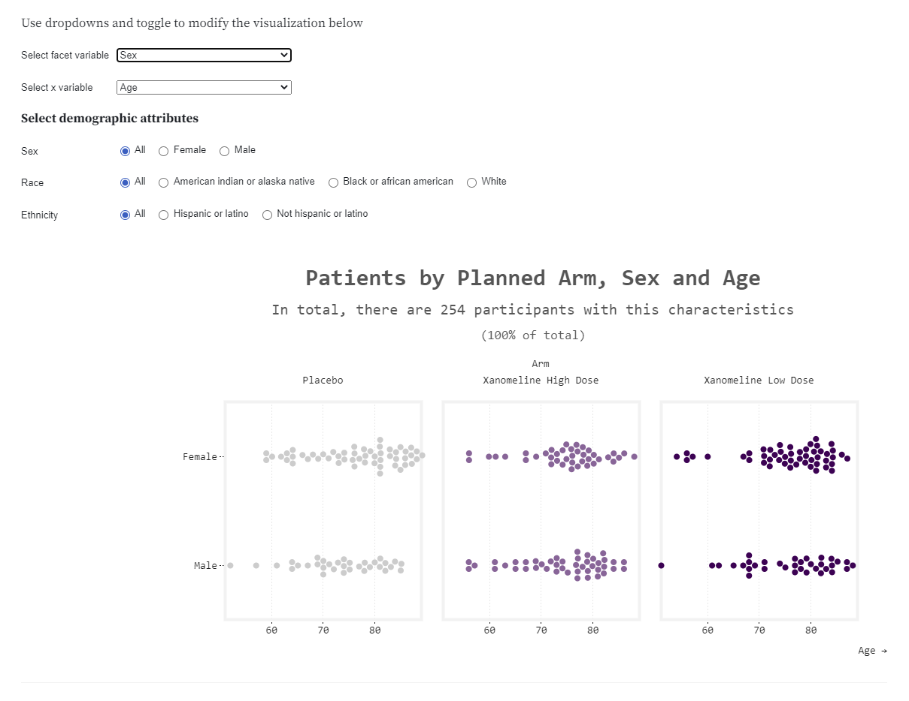
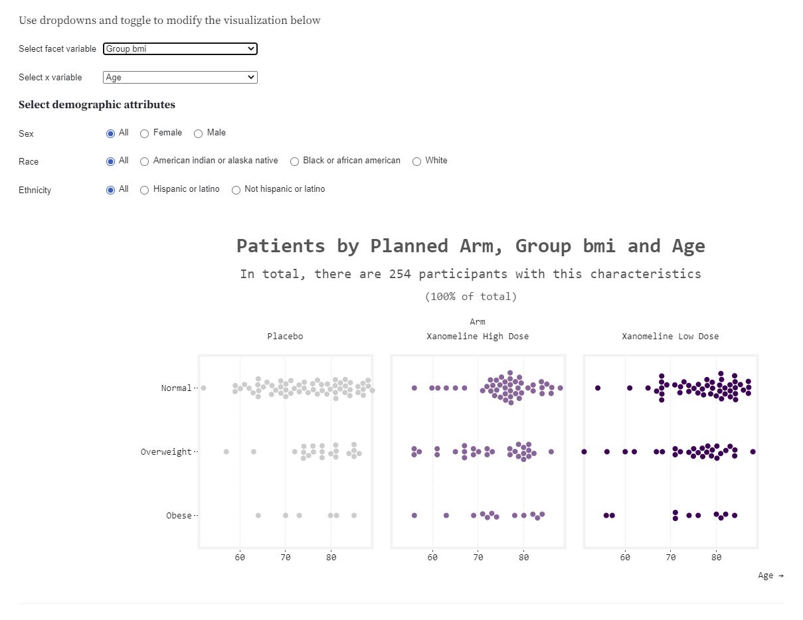

# Alzheimer data example
The data is a ADaM data set following the CDISC standard. We will focus on the ADSL (subject level) data.


<a id="example1"></a>

## Example 1. Beeswarm (Observable)

  
  
  
[high resolution image](./images/beeswarm_sex_age_ita - Irene De la Torre Arenas.png)  
[high resolution image](./images/beeswarm_race_age_ita - Irene De la Torre Arenas.png)  
[high resolution image](./images/beeswarm_bmi_age_ita - Irene De la Torre Arenas.png)  
The app can be found [here](https://observablehq.com/@irenedelatorre/beeswarm-in-plot-for-demographic-data).


(A summary of the discussion will be added shortly.)

[link to code](#example1 code)


<a id="example2"></a>

## Example 2. Scatter Plots and Densities

  
[high resolution image](./images/baseline_SM - Steve Mallett.png)  

(A summary of the discussion will be added shortly.)

[link to code](#example2 code)

<a id="example3"></a>

## Example 3. Interactive Table / Describer package

  
The app can be found here[here](./images/adsl_describer - Agustin Calatroni.html).  

(A summary of the discussion will be added shortly.)

[link to code](#example3 code)

<a id="example4"></a>

## Example 4. Html Summaries

  


The html file can be found [here](./images/Huw_Wilson_Wonderful_Wednesdays_Nov21.html).

(A summary of the discussion will be added shortly.)

[link to code](#example4 code)


<a id="example5"></a>

## Example 5. Boxplots

  
[high resolution image](./images/Distribution - Sarah Robson.png)  

(A summary of the discussion will be added shortly.)

[link to code](#example5 code)


# Code

<a id="example1 code"></a>

## Example 1. Beeswarm (Observable)

See the following URL:
https://observablehq.com/@irenedelatorre/beeswarm-in-plot-for-demographic-data


[Back to blog](#example1)


<a id="example2 code"></a>

## Example 2. Scatter Plots and Densities

```{r, echo = TRUE, eval=FALSE}
library(haven)
library(dplyr)
library(tidyr)
library(ggplot2)
library(grid)
library(gridExtra)
library(readxl)
library(cowplot)

# Placebo

bl0 <- read_excel("/shared/175/arenv/arwork/gsk1278863/mid209676/present_2020_01/code/baseline/baseline.xlsx") %>%
  filter(TRT01PN == 0)

base0 <- ggplot(bl0) +
  geom_jitter(aes(x=AGE, y=as.numeric(BMIBL), color=factor(RACE)),  size=4, width=0.03, height=0, alpha=0.8) +
  scale_x_continuous(limits=c(50, 90), breaks=c(50, 55, 60, 65, 70, 75, 80, 85, 90)) +
  scale_y_continuous(limits=c(12, 42), breaks=c(15, 20, 25, 30, 35, 40, 45)) +
  scale_color_manual("Race", values=c("#d95f02", "#7570b3")) +
  ylab("BMI at Baseline (kg/m^2)") +
  xlab("Age (yrs)") +
  ggtitle("Placebo") +
  theme_minimal() +
  theme_linedraw() +
  theme(text = element_text(size=12)) +
  theme(legend.position = "none")

xdens0 <- axis_canvas(base0, axis="x") +
  geom_density(data=bl0, aes(AGE))

ydens0 <- axis_canvas(base0, axis="y", coord_flip = TRUE) +
  geom_density(data=bl0, aes(as.numeric(BMIBL))) +
                 coord_flip()
               
p10 <- insert_xaxis_grob(base0, xdens0, position="top")
p20 <- insert_yaxis_grob(p10, ydens0, position="right")

#############################################################################
# Low Dose

bl_lo <- read_excel("/shared/175/arenv/arwork/gsk1278863/mid209676/present_2020_01/code/baseline/baseline.xlsx") %>%
  filter(TRT01PN == 54)

base_lo <- ggplot(bl_lo) +
  geom_jitter(aes(x=AGE, y=as.numeric(BMIBL), color=factor(RACE)),  size=4, width=0.03, height=0, alpha=0.8) +
  scale_x_continuous(limits=c(50, 90), breaks=c(50, 55, 60, 65, 70, 75, 80, 85, 90)) +
  scale_y_continuous(limits=c(12, 42), breaks=c(15, 20, 25, 30, 35, 40, 45)) +
  scale_color_manual("Race", values=c("#d95f02", "#7570b3")) +
  ylab("BMI at Baseline (kg/m^2)") +
  xlab("Age (yrs)") +
  ggtitle("Xanomeline Low Dose") +
  theme_minimal() +
  theme_linedraw() +
  theme(text = element_text(size=12)) +
  theme(legend.position = "none")

xdens_lo <- axis_canvas(base_lo, axis="x") +
  geom_density(data=bl_lo, aes(AGE))

ydens_lo <- axis_canvas(base_lo, axis="y", coord_flip = TRUE) +
  geom_density(data=bl_lo, aes(as.numeric(BMIBL))) +
  coord_flip()

p1_lo <- insert_xaxis_grob(base_lo, xdens_lo, position="top")
p2_lo <- insert_yaxis_grob(p1_lo, ydens_lo, position="right")
#############################################################################
# High Dose

bl_hi <- read_excel("/shared/175/arenv/arwork/gsk1278863/mid209676/present_2020_01/code/baseline/baseline.xlsx") %>%
  filter(TRT01PN == 81)

base_hi <- ggplot(bl_hi) +
  geom_jitter(aes(x=AGE, y=as.numeric(BMIBL), color=factor(RACE)),  size=4, width=0.03, height=0, alpha=0.8) +
  scale_x_continuous(limits=c(50, 90), breaks=c(50, 55, 60, 65, 70, 75, 80, 85, 90)) +
  scale_y_continuous(limits=c(12, 42), breaks=c(15, 20, 25, 30, 35, 40, 45)) +
  scale_color_manual("Race", labels=c("AMERICAN INDIAN", "BLACK OR AFRICAN AMERICAN","WHITE"),values=c("#1b9e77", "#d95f02", "#7570b3")) +
  ylab("BMI at Baseline (kg/m^2)") +
  xlab("Age (yrs)") +
  ggtitle("Xanomeline High Dose") +
  theme_minimal() +
  theme_linedraw() +
  theme(text = element_text(size=12)) +
  theme(legend.position = "bottom") +
  theme(legend.title=element_blank())

xdens_hi <- axis_canvas(base_hi, axis="x") +
  geom_density(data=bl_hi, aes(AGE))

ydens_hi <- axis_canvas(base_hi, axis="y", coord_flip = TRUE) +
  geom_density(data=bl_hi, aes(as.numeric(BMIBL))) +
  coord_flip()

p1_hi <- insert_xaxis_grob(base_hi, xdens_hi, position="top")
p2_hi <- insert_yaxis_grob(p1_hi, ydens_hi, position="right")


#############################################################################

p <- grid.arrange(arrangeGrob(p20, ncol=1, nrow=1),
                  arrangeGrob(p2_lo, ncol=1, nrow=1),
                  arrangeGrob(p2_hi, ncol=1, nrow=1),
                  heights = c(1,1.1))

title <- ggdraw() + draw_label("BMI, Age and Race are Well Balanced Between Treatment Groups. \nParticipants Were Predominantly White.\n", size = 18)

p2 <- plot_grid(title, p, ncol=1, rel_heights = c(1, 10)) 

ggsave("/shared/175/arenv/arwork/gsk1278863/mid209676/present_2020_01/code/baseline/baseline_SM.png", p2, width=12, height=8, dpi=300)
```


[Back to blog](#example2)


<a id="example3 code"></a>

## Example 3. Interactive Table / Describer package

The rmd file can be found [here](./code/adsl_describer - Agustin Calatroni.rmd).

[Back to blog](#example3)


<a id="example4 code"></a>

## Example 4. Html Summaries

The Rmd file can be found [here](./code/Huw_Wilson_Wonderful_Wednesdays_Nov21.Rmd)

[Back to blog](#example4)


<a id="example5 code"></a>

## Example 5. Boxplots
No code has been submitted.

[Back to blog](#example5)