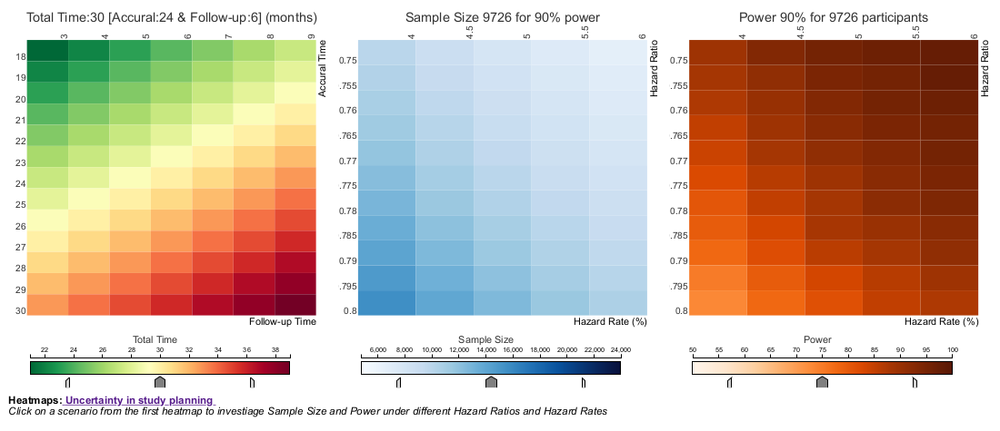

# Uncertainty in study planning
A phase III cardiovascular superiority study is planned with the following assumptions (simplified, no lost-to-FU, no treatment discontinuation, no non-CV death):

* Hazard rate of active comparator 5% per year
* Hazard ratio 0.775
* Accrual time 24 months, total duration 30 months

Statistical settings:

* Logrank test for superiority in time to first MACE event (CV death, MI, stroke)
* Alpha 5%, Power 90%
* A sample size of about 9900 patients would be needed aiming for 650 patients experiencing a MACE event to show superiority of the new treatment over the comparator in reducing MACE events.

The challenge is about how uncertainty can be displayed with regard to total study duration if the assumptions are not exactly met, i.e. comparator hazard rate between 4% and 6% (and hazard ratio between 0.75 and 0.8).

## Example 1. Animated dotplot

  
[high resolution image](./images/animated_dotplot.gif)  

(A summary of the discussion will be added shortly.)

[link to code](#example1 code)

## Example 2. Linked heatmaps

  
[high resolution image](./images/heatmaps_rlc - Agustin Calatroni.pdf)  

(A summary of the discussion will be added shortly.)

[link to code](#example2 code)

# Code

## Example 1. Animated dotplot
Please see the [Rmd file](./code/Bericht.Rmd), the [R file](./code/optim_duration.R), and the [bib file](./code/references.bib).

[Back to blog](#example1)

## Example 2. Linked heatmaps

Please see [instructions](./code/Interactive_linked_heatmaps - Agustin Calatroni.docx) and the [GitHub repository](https://github.com/agstn/heatmaps_rlc).

[Back to blog](#example2)