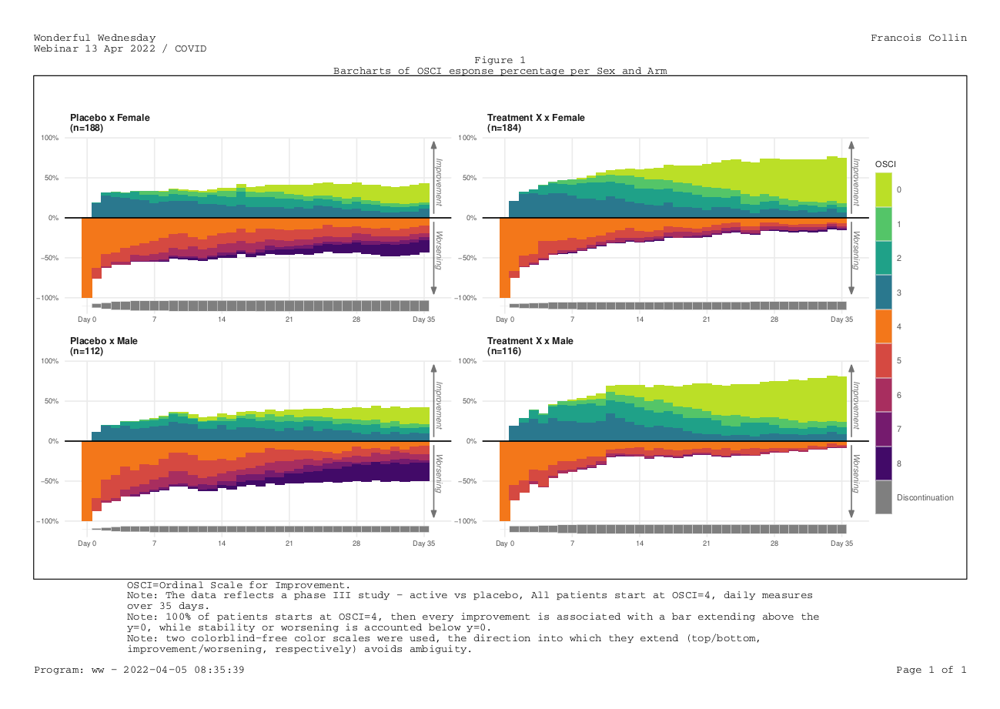

# COVID OSCI over time
As described above, the challenge was to describe the treatment effect specifically taking into account the number and timing of patients who died, left the hospital or fully recovered.

## Example 1. Lasagna plots

  
[high resolution image](./images/covid_combined - Agustin Calatroni.pdf)  

(A summary of the discussion will be added shortly.)

[link to code](#example1 code)

## Example 2. Barcharts

  
[high resolution image](./images/ww_fcollin - francois collin.pdf)  

(A summary of the discussion will be added shortly.)

[link to code](#example2 code)

## Example 3. Shiny app

  
The shiny app can be found [here](https://bonorico.shinyapps.io/oscicovid)  

(A summary of the discussion will be added shortly.)

[link to code](#example3 code)

# Code

## Example 1. Lasagna plots

All code & reshaped data to reproduce this example can be found at:
https://github.com/agstn/WW/tree/main/2022-03-09  
Any questions let me know,
Agustin Calatroni
acalatroni@gmail.com

[Back to blog](#example1)

## Example 2. Barcharts

No code has been submitted.

[Back to blog](#example2)

## Example 3. Shiny app

No code has been submitted.

[Back to blog](#example3)