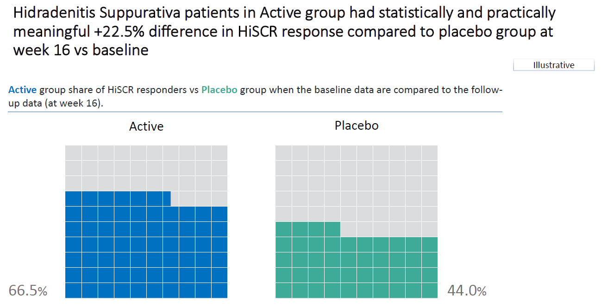
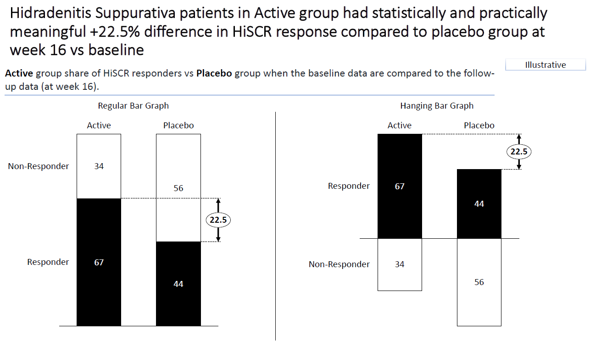
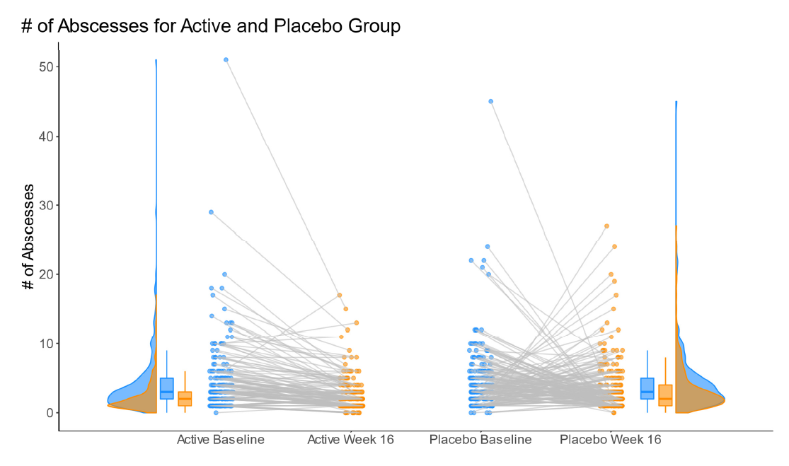
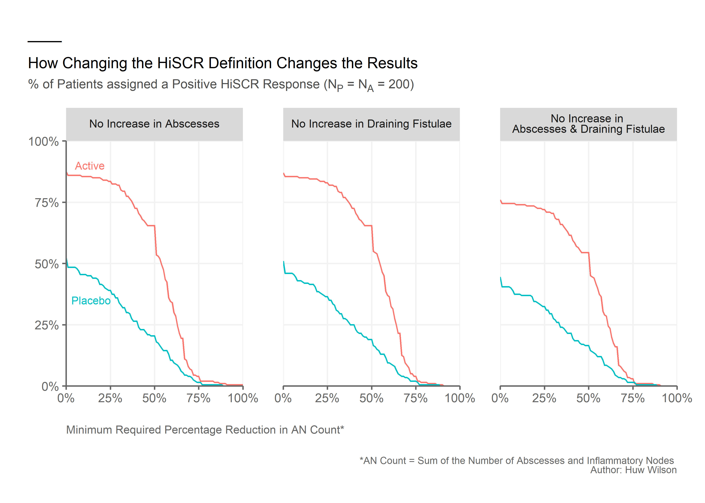
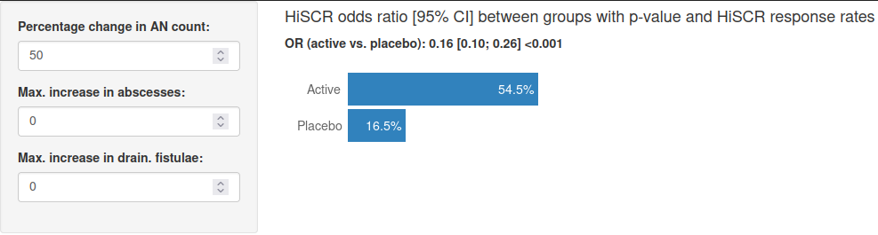
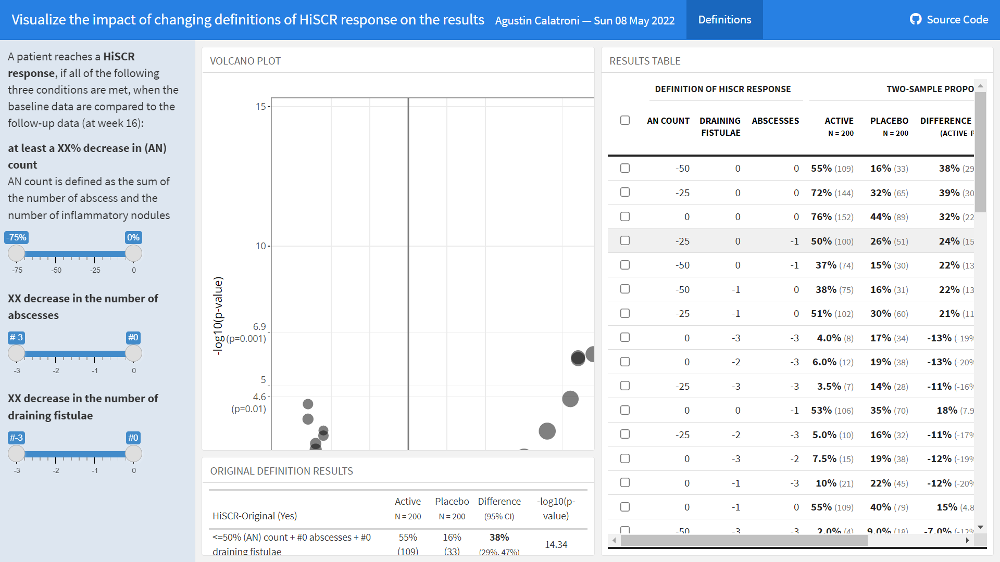

# HiSCR data example
In a phase III study with patients suffering from hidradenitis suppurativa, an active drug was compared to placebo. There were 200 subjects in each group and the endpoint was the HiSCR which is a binary endpoint. This endpoint is based on three continuous components:

- number of abscess
- number of draining fistulae
- number of inflammatory nodules

A patient reaches a HiSCR response, if all of the following three conditions are met, when the baseline data are compared to the follow-up data (at week 16):

- at least a 50% decrease in (AN) count; AN count is defined as the sum of the number of abscess and the number of inflammatory nodules
- no increase in the number of abscesses
- no increase in the number of draining fistulae

The aim of the study was to compare the two treatment arms in regards to HiSCR response.

The challenge is to visualize the impact of changing the definition of HiSCR response on the results. The idea is to change, for example, the first condition and assume that a decrease of 25% or 75% is needed to reach HiSCR response. The second and third condition can be changed separately, or a mix of changes to two or all conditions can be applied. How does this impact the results?

<a id="example1"></a>

## Example 1. Waffle plot, bar chart, line plot

  
  
  
  

In the first visualization, we can see a waffle plot where the original HiSCR definition is being used. Therefore, it is not focusing on the impact of changing the definition, but it is a very good starting point to get an overview of the data. The graph is easy to understand and interpret. Furthermore, it has a clear title. In this title, the colors of the subgroups are used as font colors which is a very nice detail. An alternative way to use such a waffle plot would be to combine both groups into one visualization by using a "stacked waffle plot" to highlight the difference between the two groups. Another option would be to present a bar chart instead of a waffle plot, but it depends on the purpose of the graph. Overall, it is a very nice and neat visualization of the data.

In the second visualization, another waffle plot is being shown, but the arrangement is a little different. Basically, the same comments apply as above. Some may find it easier to compare the groups using this arrangement, others may like the first one better.

In the third visualization, a we see two bar charts. On the left-hand side, we see a stacked bar chart with numbers showing the percentage of responders. Furthermore, it shows the difference in the percentage between the two groups. On the right-hand side, a hanging bar charts is shown. The nice thing here is that you have a meaningful "zero line" for non-responders and responders. Numbers are included in this graph as well which helps the reader to get the message right away. In both graphs, only black and white is being used as colors. Overall, it is a very clean and clear visualization. It drops all unnecessary details (the nice things are the ones that you don't see here).

In the fourth visualization, a line graph is being shown. Actually, there are two of them within one figure. On the left-hand side, the active group is shown. On the right-hand side, the placebo group is presented. For both groups, the change from baseline in the number of abscesses is being shown. Furthermore, even though it is not labeled accordingly, colors are used to differentiate between the two time points (baseline and Week 16) and some jittering is added to the dots. In addition, (half) violin plots (or density plots) are shown to present the distribution of the data. Since patient level data is being presented, this shows you the data from a different angle.

The slide deck can be found [here](./images/slide_2.pdf).  

(A summary of the discussion will be added shortly.)

[link to code](#example1 code)


<a id="example2"></a>

## Example 2. Line plots based on reduction in AN count

  
[high resolution image](./images/Huw_Wilson_APR2022 - Huw Wilson.png)  

This visualization shows nicely that the difference between the groups is rather small, if the percentage change to be reached is large (focusing on the first part of the HiSCR responder definition). This is done by presenting a line plot for both groups using two different colors. There are three graphs. Each one of them keeps the second and/or the third part of the definition of a HiSCR responder fixed.
Overall, it is a very clean visualization which very nicely tackles the challenge of showing the impact of chaning the definition of HiSCR response. One comment by the panel was that, instead of presenting the response rate per arm, the difference between the two arms could have been visualized.

[link to code](#example2 code)

<a id="example3"></a>

## Example 3. Report and app

  
The whole report can be found [here](./images/<filename>).  
The app can be found [here](https://bonorico.shinyapps.io/HiSCR/?_ga=2.91645274.1120831357.1651571388-1024467400.1644592220).  

This visualization shows on the y-axis the inverse of the risk ratio and on the x-axis the threshold for the percentage decrease in AN count. It is actually an animation showing the impact of changing the threshold for the change of abscesses from baseline.
This is a very useful graph to visualize what happens if you change different aspects of the definition. There is not only a report, but also an app which allows you to focus on different aspects of (changing) the HiSCR definition.

[link to code](#example3 code)

<a id="example4"></a>

## Example 4. Simple bar chart app

  

The app can be found [here](https://louh.shinyapps.io/HiSCR/).

This is a very simple app which allows you to change the definition of the HiSCR definition (on the left-hand side) to see what happens in the results (on the right-hand side).


[link to code](#example4 code)

<a id="example5"></a>

## Example 5. Advanced app

  
The app can be found [here](./images/HiSCR_fig - Agustin Calatroni.html).  

This is a very advanced app which shows a volcano plot in the main panel and it shows what happends in the results when you change the definition on the left-hand side. On the right-hand side, you see a table with additional results based on different HiSCR definitions. The panel thinks that it is a not necessarily straightforward to see what is being shown here. However, it is still a very insightful and useful app to understand the impact of changing the definition of HiSCR.

[link to code](#example5 code)


# Code

<a id="example1 code"></a>

## Example 1. Waffle plot, bar chart, line plot

No code has been submitted.

[Back to blog](#example1)


<a id="example2 code"></a>

## Example 2. Line plots based on reduction in AN count

```{r, echo = TRUE, eval=FALSE}
# Clear environment, read in libraries and data
rm(list = ls())

library(tidyverse)
library(ggtext)

df <- read.csv("./HiSCR_dat.txt")

# Create required variables for graph
df_new <- df %>%
          mutate(
            
            # If abscesses increase
            abscesses.incr = if_else(
              condition = abscesses.w16 > abscesses.base,
              true = "Yes",
              false = "No",
              missing = NA_character_
            ),
            
            # If draining fistulae increase
            drain.fist.incr = if_else(
              condition = drain.fist.w16 > drain.fist.base,
              true = "Yes",
              false = "No",
              missing = NA_character_
            ),
            
            # If abscesses and draining fistulae increase
            drain.fist.abscesses.incr = if_else(
              condition = abscesses.incr == "No" & drain.fist.incr == "No",
              true = "No",
              false = "Yes",
              missing = NA_character_
            ),
            
            an.count.base = abscesses.base + infl.nod.base,
            an.count.w16 = abscesses.w16 + infl.nod.w16,
            
            # Percentage change in AN count
            an.count.change = (an.count.w16 - an.count.base)/an.count.base*100
          ) %>%
  
         select(c(TRT, abscesses.incr, drain.fist.incr,
                  drain.fist.abscesses.incr, an.count.change))

active.df <- filter(df_new, TRT == "ACT")
placebo.df <- filter(df_new, TRT == "PBO")

results <- data.frame()

# Find the percentage assigned a positive HiSCR for each value of i
# where i is the minimum required percentage reduction.
for (i in 0:100){
  active.abscesses <- sum(active.df$an.count.change <= -i & active.df$abscesses.incr == "No")/nrow(active.df)*100
  active.drain.fist <- sum(active.df$an.count.change <= -i & active.df$drain.fist.incr == "No")/nrow(active.df)*100
  active.both <- sum(active.df$an.count.change <= -i & active.df$drain.fist.abscesses.incr == "No")/nrow(active.df)*100
  
  placebo.abscesses <- sum(placebo.df$an.count.change <= -i & placebo.df$abscesses.incr == "No")/nrow(placebo.df)*100
  placebo.drain.fist <- sum(placebo.df$an.count.change <= -i & placebo.df$drain.fist.incr == "No")/nrow(placebo.df)*100
  placebo.both <- sum(placebo.df$an.count.change <= -i & placebo.df$drain.fist.abscesses.incr == "No")/nrow(placebo.df)*100
  
  # Store results
  results <- rbind(results,
                   data.frame(percent = i,
                               active.abscesses,
                               active.drain.fist,
                               active.both,
                               placebo.abscesses,
                               placebo.drain.fist,
                               placebo.both))
}

# Create a row for each percentage reduction, treatment arm, and condition
# to get the data into the right form for the graph
graph_df <- results %>%
            pivot_longer(cols = -"percent") %>%
  
            mutate(
              # Extract treatment arm
              TRT = if_else(
                condition = str_detect(name, pattern = "active"),
                true = "Active",
                false = "Placebo",
                missing = NA_character_),
              
              # Extract condition (<br> is used to cause line break in subplot title)
              condition = case_when(
                str_detect(name, pattern = "abscesses") ~ "No Increase in Abscesses",
                str_detect(name, pattern = "fist") ~ "No Increase in Draining Fistulae",
                TRUE ~ "No Increase in <br>Abscesses & Draining Fistulae"
              )) %>%
  
            select(-name)

# Order conditions for the graph
graph_df$condition <- factor(graph_df$condition,
                             levels = c("No Increase in Abscesses",
                                        "No Increase in Draining Fistulae",
                                        "No Increase in <br>Abscesses & Draining Fistulae"))

# Annotation dataframe for the Placebo and Active labels
arm.ann <- data.frame(x = c(5, 3),
                      y = c(90, 35),
                      TRT = c("Active", "Placebo"),
                      condition = rep("No Increase in Abscesses", 2))

# Order condition variable to ensure labels appear in correct subplot.
arm.ann$condition <- factor(arm.ann$condition,
                             levels = c("No Increase in Abscesses",
                                        "No Increase in Draining Fistulae",
                                        "No Increase in <br>Abscesses & Draining Fistulae"))

axis.color <- "gray40"

# Create graph
ggplot(data = graph_df,
       aes(x = percent,
           y = value,
           group = TRT)) +

  # Add lines
  geom_line(aes(color = TRT)) +
  
  # Subplot by condition
  facet_wrap(~condition) +
  
  # Restrict plotting area
  coord_cartesian(expand = F) +
  
  # Add % labels to the axes ticks
  scale_x_continuous(labels = scales::percent_format(scale = 1)) +
  
  scale_y_continuous(limits = c(0, 100),
                     labels = scales::percent_format(scale = 1)) +
  
  # Add Active and Placebo labels
  geom_text(data = arm.ann,
            aes(x = x,
                y = y,
                group = condition,
                label = TRT,
                color = TRT),
            hjust = 0,
            size = 2.75) +

  # Define theme
  theme(panel.background    = element_rect(fill = "white"),
        axis.line           = element_line(color = axis.color),
        panel.grid.major    = element_line(color = "gray95"),
        axis.ticks          = element_line(color = axis.color),
        axis.text           = element_text(color = axis.color),
        axis.title          = element_text(color = axis.color,
                                           size = 8),
        axis.title.x        = element_text(hjust = 0,
                                           margin = margin(t = 15)),
        legend.position     = 'none',
        plot.margin         = margin(20, 20, 20, 20),
        strip.text          = element_markdown(size = 8),
        panel.spacing       = unit(0.4, 'in'),
        plot.title.position = 'plot',
        plot.subtitle       = element_markdown(color = "gray30",
                                               size = 9,
                                               margin = margin(b = 10)),
        plot.title          = element_markdown(size = 11),
        plot.caption        = element_markdown(size = 7,
                                               color = axis.color,
                                               margin = margin(t = 15))) +
  
  # Define plot labels
  labs(x = "Minimum Required Percentage Reduction in AN Count*",
       y = NULL,
       subtitle = " % of Patients assigned a Positive HiSCR Response (N<sub>P</sub> = N<sub>A</sub> = 200)",
       title = "____ <br> <br> How Changing the HiSCR Definition Changes the Results",
       caption = "*AN Count = Sum of the Number of Abscesses and Inflammatory Nodes <br> Author: Huw Wilson")
```


[Back to blog](#example2)


<a id="example3 code"></a>

## Example 3. Report and app

No code has been submitted.

[Back to blog](#example3)


<a id="example4 code"></a>

## Example 4. Simple bar chart app
```{r, echo = TRUE, eval=FALSE}
ui <- shinyUI(fluidPage(
  sidebarLayout(
    sidebarPanel(
      numericInput("ANcount", "Percentage change in AN count:", min = -100, max = 100, value = 50),
      numericInput("incr.absc", "Max. increase in abscesses:", min = -10, max = 10, value = 0),
      numericInput("incr.dr", "Max. increase in drain. fistulae:", min = -10, max = 10, value = 0),
      width = 2
    ),
    
    mainPanel(
      h4("HiSCR odds ratio [95% CI] between groups with p-value and HiSCR response rates"),
      htmlOutput("OR"),
      plotOutput("rateplot"),
      width = 5
    )
  )
))


server <- function(input, output) {
  require(ggplot2)
  dat <- read.csv("HiSCR_dat.csv", header = T)
  hiscr.h <- function(TABSCS.base, TINFNC.base, TDRFSC.base,
                      TABSCS.fu, TINFNC.fu, TDRFSC.fu,
                      AN.decr = 50, incr.absc = 0, incr.dr = 0) {
    AN.base <- TABSCS.base + TINFNC.base
    AN.fu <- TABSCS.fu + TINFNC.fu
    hiscr <- (AN.fu <= (100 - AN.decr)/100 * AN.base & TABSCS.fu <= (TABSCS.base + incr.absc) &
                TDRFSC.fu <= (TDRFSC.base + incr.dr))
    return(hiscr)
  }
  f.r <- function(x, k = 1) format(round(x, k), nsmall = k)
  sum.yes <- function(x) length(which(x == "Yes")) / length(x) * 100
  dat.prep <- reactive({
    dat$HiSCR <- ifelse(hiscr.h(dat$abscesses.base, dat$infl.nod.base, dat$drain.fist.base,
                                dat$abscesses.w16, dat$infl.nod.w16, dat$drain.fist.w16,
                                input$ANcount, input$incr.absc, input$incr.dr), "Yes", "No")
    dat
  })
  output$rateplot <- renderPlot(height = 100, width = 500, {
    dat <- dat.prep()
    res <- aggregate(dat$HiSCR, list(dat$TRT), sum.yes)
    res$val.t <- paste0(f.r(res$x), "%")
    res$Group.1 <- factor(res$Group.1, levels = c("PBO", "ACT"))
    hjust.r <- ifelse(min(res$x) < 11, -0.1, 1.1)
    col.r <- ifelse(min(res$x) < 11, "black", "white")
    ggplot(res, aes(y=x, x=Group.1, width = 0.9)) + 
      geom_bar(stat="identity", fill = "#3182BD") +
      ylab("") + xlab ("") +
      ylim(-12, 100) +
      theme(panel.grid.major = element_blank(), panel.grid.minor = element_blank(),
            panel.background = element_blank(), axis.line = element_blank(),
            axis.ticks = element_blank(),# axis.text = element_text(size = 12),
            axis.text.x = element_blank(),
            axis.text.y = element_blank(),
            plot.margin = margin(0.2, 0.2, -0.3, -0.2, "in")) +
      annotate("text", x=1, y=-8, label= "Placebo", size = 5, color = "grey40") +
      annotate("text", x=2, y=-7, label= "Active", size = 5, color = "grey40") +
      geom_text(aes(label=val.t), vjust = 0.5, hjust = hjust.r, size = 5, position = position_dodge(.1),
                col = col.r) +
      coord_flip()
  })
  output$OR <- renderText({
    dat <- dat.prep()
    p.val <- chisq.test(table(dat$HiSCR, dat$TRT))$p.val
    if (p.val < 0.001) {
      p.val <- "<0.001"
    } else {
      p.val <- f.r(p.val, 3)
    }
    dat$HiSCR.num <- as.numeric(as.factor(dat$HiSCR)) - 1
    fit <- glm(HiSCR.num ~ TRT, data = dat, family = binomial)
    or.est <- f.r(exp(coef(summary(fit))[2, 1]), 2)
    ci.raw <- exp(confint.default(fit))
    ci.est <- paste0("[", f.r(ci.raw[2, 1], 2), "; ", f.r(ci.raw[2, 2], 2), "]")
    res <- HTML(paste("<b>", "OR (active vs. placebo): ", or.est, ci.est, p.val, "</b>"))
    res
  })
}


shinyApp(ui = ui, server = server)
```

[Back to blog](#example4)


<a id="example5 code"></a>

## Example 5. Advanced app
The rmd file can be found [here](./code/HiSCR_fig - Agustin Calatroni.rmd).

[Back to blog](#example5)