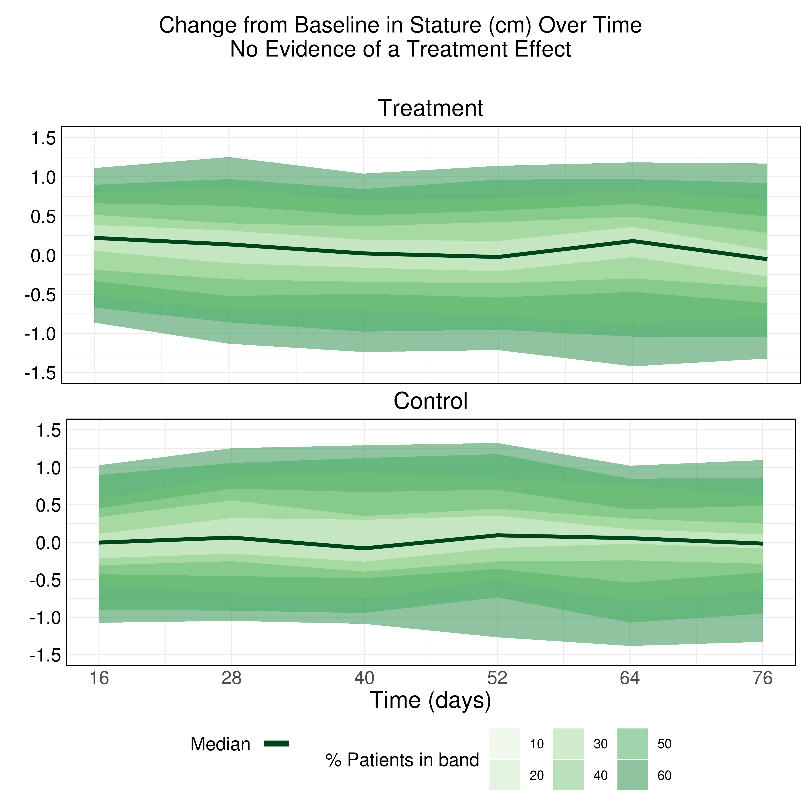
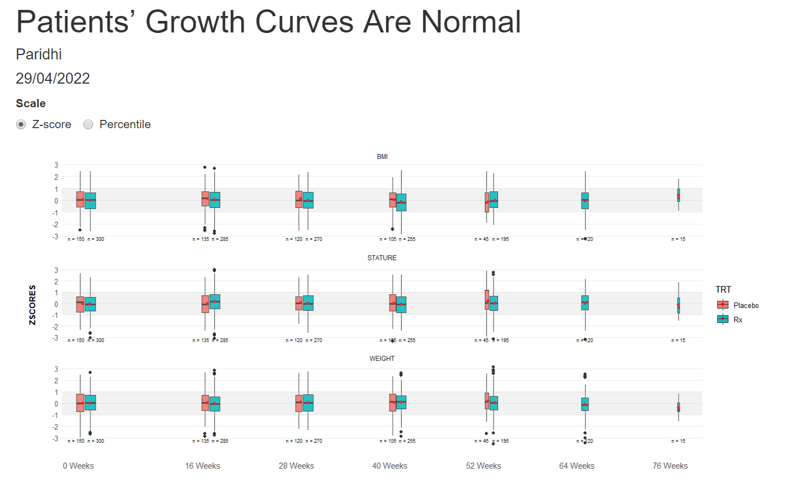

# <Overall title of the webinar>
This is a snapshot from a two-year clinical trial assessing the impact of a drug on growth measurements (stature, weight and BMI) in children as part of a regulatory commitment for a marketed drug. There is a placebo comparator arm that converts to active drug at 6 months and additional rescue medication is allowed.

The challenge is to use visualizations to assess if there is an adverse impact on children's growth due to taking a drug. To do so, participants had to display effects on development over time. Although the topic led to more exploratory visualizations, the organizers also encouraged participants to develop explanatory graphs.


<a id="example1"></a>

## Example 1. Change from baseline over time

  
[high resolution image](./images/growth - Steve Mallett.png)  

The first entry encoded the change from baseline in stature's distribution with
color. The area graph used contours and shades of green to highlight the
percentages of patients that had a specific shift from baseline over time.

The panelists liked the descriptive title. They also made a few suggestions to
improve the chart:

- Removing the opacity of the areas: the overlap of the shades made the bands
  hard to read.
- Using colors that highlight the highest percentages instead of the
  lowest ones. 
- Labeling de bands to better identify groupings.

[link to code](#example1 code)


<a id="example2"></a>

## Example 2. Animated Z-Score

  
[high resolution animation](./images/ZScore.gif)  

The second entry was an animated scatterplot and density plot: an exploratory
visualization that showed the data over time and let viewers draw their
conclusions.

The graph had four panels: 

- The top left panel showed the baseline distribution for the two groups
- The bottom right one displayed the change from the baseline distribution.
- The bottom left had a scatterplot showing the change from baseline and
  baseline for the two groups.
- The panel enjoyed the animations and highlighted its minimalistic design,
  where there are no duplicated elements, such as axis titles. A design change
  that would have made the entry even better would have been to increase the
  contrast between the dots and the trend lines in the scatterplot.  

[link to code](#example2 code)

<a id="example3"></a>

## Example 3. BMI - error bars

  
[high resolution image](./images/BMI.png)  

The third entry is a dot plot with whiskers showing confidence intervals and
trendlines connecting treatment values. The visualization displayed a lot of
data and how the treatments deviated.

The panelists made a few suggestions on how to improve the graph:

- The first step would be to consider which elements need to pick the audience's
  attention first and structure the visual hierarchy around them.
- Following that idea, those shapes -in this case, the dots- need to be the
  first thing they see.
- Everything else, the trendlines or the CIs (Confidence intervals), can be
  knocked back and made just supportive elements -by simplifying them or making
  them lighter-.

Another point that was mentioned was to make the textual elements more
descriptive. Having the abbreviations meaning, or writing down the unit of the
time axis, would have helped viewers understand the chart.

[link to code](#example3 code)

<a id="example4"></a>

## Example 4. Density plots

  


[high resolution image](./images/dist.png).

The fourth entry showed distributions over time. In this challenge, the
expectation was that most of the changes from baseline should be 0, which is
what this visualization highlights.

It’s an especially useful graph that lets you see the distributions over time.
It helps you see differences and find extreme values. It also includes the
quartiles that facilitate making comparisons between the two groups.

[link to code](#example4 code)


<a id="example5"></a>

## Example 5. Box plots

  
  
  
  
[high resolution image 1](./images/Wonderful-Wednesdays1 - P J_a.png)  
[high resolution image 2](./images/Wonderful-Wednesdays1 - P J_b.png)  
[high resolution image 3](./images/Wonderful-Wednesdays2 - P J_a.png)  
[high resolution image 4](./images/Wonderful-Wednesdays2 - P J_b.png)  

The last visualization is box plots over time. A shaded area highlights the band
[1, -1], which should fit around 50% of the data. The width of the box plots is
also proportional to the number of participants in each treatment group. The
X-Axis is also relative to the time points.
 
The panel liked all the little additions to make the box plots more
understandable and representative. They would have liked more separation between
the treatment groups to help make comparisons between them.

[link to code](#example5 code)


# Code

<a id="example1 code"></a>

## Example 1. Change from baseline over time

```{r, echo = TRUE, eval=FALSE, python.reticulate = FALSE}
library(haven)
library(dplyr)
library(tidyr)
library(ggplot2)
library(grid)
library(gridExtra)
library(readxl)
library(cowplot)

hgb1 <- read_excel("/.../growth.xlsx") %>%
  filter(MEASURE == "STATURE" & TRT == "Rx" & TIME != 0)

quant1 <- hgb1 %>% group_by(TIME) %>%
  do(quant = quantile(.$CFB, probs = seq(0.2,0.8,.05)), probs = seq(0.2,0.8,.05)) %>%
  unnest(cols=c(quant, probs)) %>%
  mutate(delta = 2*round(abs(.5-probs)*100)) %>% 
  group_by(TIME, delta) %>%
  summarize(quantmin = min(quant), quantmax= max(quant)) %>%
  filter(delta > 0)

# Derive median Hgb

hgb_med1 <- hgb1 %>% 
  group_by(TIME) %>% 
  summarise(hgb.median = median(CFB)) 

# Produce plot for group E

plot01 <- ggplot() +
  geom_ribbon(data = quant1, aes(x = TIME, ymin = quantmin, ymax = quantmax,
                                    group = reorder(delta, -delta), fill = factor(delta)),
              alpha = .5) +
  geom_line(data = hgb_med1, aes(x = TIME, y = hgb.median, color = "#00441b"), size = 2 ) +  
  scale_x_continuous("Time (days)",
                     breaks=c(16, 28, 40, 52, 64, 76),
                     limits=c(16, 76)) +
  scale_y_continuous(" ",
                     breaks=c(-1.5, -1.0, -0.5, 0, 0.5, 1.0, 1.5),
                     limits=c(-1.5, 1.5),
                     ) +
  scale_fill_manual("% Patients in band", values=c("#e5f5e0","#c7e9c0", "#a1d99b", "#74c476", "#41ab5d", "#238b45", "#006d2c")) +
  scale_color_identity(name = " ",
                       guide=legend,
                       labels = " ") + 
  theme_minimal() +
  theme(legend.position="none",
        axis.title.x=element_blank(),
        axis.text.x=element_blank(),
        axis.ticks.x=element_blank(),
        axis.text.y.left =  element_text(color = 'black'),        
        plot.title = element_text(hjust = 0.5, size = 25),
        text = element_text(size = 15),
        axis.text = element_text(size = 20),
        axis.title = element_text(size = 25),
        panel.border = element_rect(colour = "black", fill=NA, size=1),
        plot.margin=unit(c(1,0,0,0),"cm")) +
  ggtitle(label = "Treatment")

hgb2 <- read_excel("/.../growth.xlsx") %>%
  filter(MEASURE == "STATURE" & TRT == "Placebo"  & TIME != 0)


quant2 <- hgb2 %>% group_by(TIME) %>%
  do(quant = quantile(.$CFB, probs = seq(0.2,0.8,.05)), probs = seq(0.2,0.8,.05)) %>%
  unnest(cols=c(quant, probs)) %>%
  mutate(delta = 2*round(abs(.5-probs)*100)) %>% 
  group_by(TIME, delta) %>%
  summarize(quantmin = min(quant), quantmax= max(quant)) %>%
  filter(delta > 0)

hgb_med2 <- hgb2 %>% 
  group_by(TIME) %>% 
  summarise(hgb.median = median(CFB)) 

plot02 <- ggplot() +
  geom_ribbon(data = quant2, aes(x = TIME, ymin = quantmin, ymax = quantmax,
                                    group = reorder(delta, -delta), fill = factor(delta)),
              alpha = .5) +
  geom_line(data = hgb_med2, aes(x = TIME, y = hgb.median, color = "#00441b"), size = 2) + 
  geom_segment(x=17, y=1, xend=75, yend=1, color="black") +
  scale_x_continuous("Time (days)",
                     breaks=c(16, 28, 40, 52, 64, 76),
                     limits=c(16, 76)) +
  scale_y_continuous(" ",
                     breaks=c(-1.5, -1.0, -0.5, 0, 0.5, 1.0, 1.5),
                     limits=c(-1.5, 1.5),
  ) +
  scale_fill_manual("% Patients in band", values=c("#e5f5e0","#c7e9c0", "#a1d99b", "#74c476", "#41ab5d", "#238b45", "#006d2c")) +
  scale_color_identity(name = "Median",
                       guide=legend,
                       labels = " ") + 
  labs(fill = "Hgb (% patients in band)") +
  theme_minimal() +
  theme(legend.position="bottom",
        plot.title = element_text(hjust = 0.5, size = 25),
        text = element_text(size = 15),
        axis.text = element_text(size = 20),
        axis.title = element_text(size = 25),
        axis.text.y.left =  element_text(color = 'black'),
        legend.text=element_text(size=14),
        legend.title=element_text(size=20),
        legend.key.size = unit(1.2, "cm"),        
        panel.border = element_rect(colour = "black", fill=NA, size=1)) +
  guides(colour = guide_legend(override.aes = list(size=3))) +
  ggtitle(label = "Control")

p <- grid.arrange(arrangeGrob(plot01, ncol=1, nrow=1),
                  arrangeGrob(plot02, ncol=1, nrow=1),
                  heights = c(1,1.32))

title <- ggdraw() + draw_label("Change from Baseline in Stature (cm) Over Time\nNo Evidence of a Treatment Effect", size = 24)

p2 <- plot_grid(title, p, ncol=1, rel_heights = c(1, 10))  

gsave("/.../growth.png", p2, width=12, height=12, dpi=300)
```


[Back to blog](#example1)


<a id="example2 code"></a>

## Example 2. <Same title as above>

No code has been submitted.


[Back to blog](#example2)


<a id="example3 code"></a>

## Example 3. <Same title as above>

No code has been submitted.

[Back to blog](#example3)


<a id="example4 code"></a>

## Example 4. <Same title as above>

No code has been submitted.

[Back to blog](#example4)


<a id="example5 code"></a>

## Example 5. <Same title as above>
The rmd file for the graphs 1 and 3 can be found [here](./code/pedGrowth - P J_a.Rmd).  
The rmd file for the graphs 2 and 4 can be found [here](./code/pedGrowth - P J_b.Rmd).

[Back to blog](#example5)