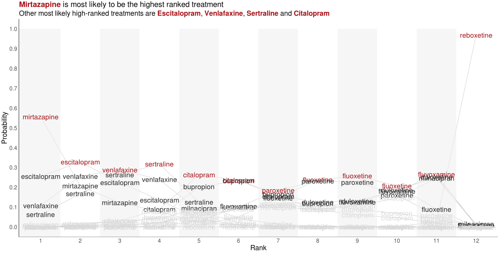
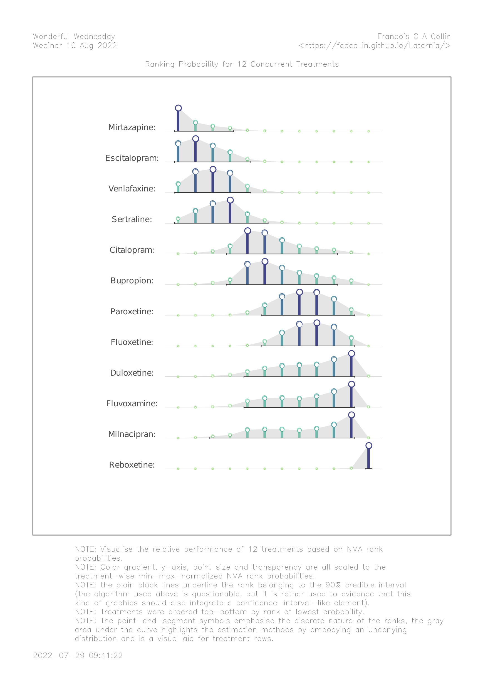
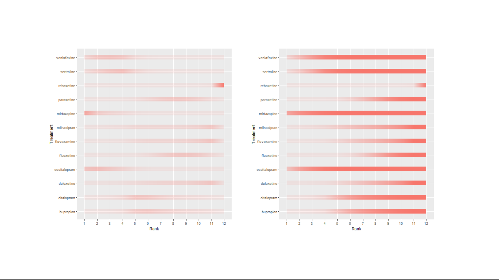
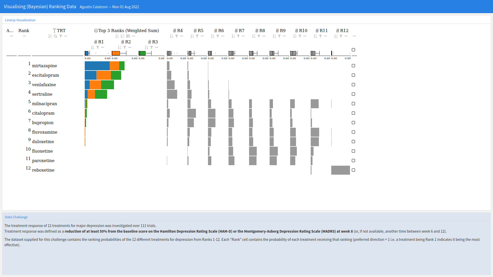

# Visualising Ranking Data
This month’s challenge was to visualise ranking data resulting from a network meta-analysis (NMA). The NMA synthesised the results of 11 trials comparing 12 treatments for major depression. The provided dataset consisted of the probabilities that each treatment ranked in each position from Rank 1 (best) to Rank 12 (worst).


<a id="example1"></a>

## Example 1. Line plot

  
[high resolution image](./images/NMA_ranks - Steve Mallett.PNG)  

In this first visualization, we see rank presented on the x-axis and probability on the y-axis, with a line graph plotted for each treatment. An informative title and subtitle have been added, emphasising the key takeaway from the plot. Colour has been used effectively to highlight key information of interest, with the treatment corresponding to the highest probability in each rank highlighted in red, the treatments with the second, third and fourth highest probabilities being coloured black, and all other treatments coloured in a light grey to push them to the background. The message is clear in the two extremes of the plot, where the treatments corresponding to the highest probabilities are nicely emphasised. The plot becomes slightly cluttered in the middle with lots of overlapping text, although this somewhat supports the message by highlighting that it is harder to distinguish treatments in this area. The use of alternating white and grey stripes in the background helps reinforce that we are considering discrete ranks, which may otherwise be confused in a line plot which in some sense interpolates between the observed probabilities. The visualization could be improved by having the red text in the forefront and the grey text in the background, which would help emphasise the red text in busy sections of the graph. The panel discussed existing R packages which can aid in pushing text into the background. Further, the plot could benefit from the addition of interactive elements, allowing the user to select and highlight a key treatment of interest.

[link to code](#example1 code)


<a id="example2"></a>

## Example 2. Lolly plot

  
[pdf file](./images/ww_aug_2022_fcacollin - francois collin.pdf)  

This plot uses lollipops to display the probability of a given treatment ranking in each position. Rank is again displayed on the x-axis and probability on the y-axis, although a separate sub-plot is now produced for each treatment and stacked vertically. The ordering of these subplots is logical, from the most effective treatment at the top to the least effective treatment at the bottom, allowing the reader to quickly establish the relative performance of each treatment. Lots of visual elements are utilised in the plot, with the colour-gradient, y-axis, point size and transparency all scaled to the treatment-wise min-max-normalised NMA rank probabilities. The panel suggested that this could result in some redundancy in the plot and that a subset of these visual elements could be used to display key probability scales of interest. Whilst the submitter acknowledges they have been produced by a somewhat questionable algorithm in this instance, the panel appreciated the inclusion of the credible intervals (shown by the horizontal black lines under the lollipops), which add useful information to such plots without adding significant clutter. Likewise, the inclusion of the shaded grey background nicely displays how underlying distributions can be displayed in such plots. The panel were extremely complimentary of the aesthetics of the plot and all the little details that had been considered to minimise clutter and produce an extremely clean display. The main suggestion for improvement was to incorporate the absolute probabilities somehow, perhaps with one of the several visual elements used. Whilst the current scaled display makes within-treatment comparison straightforward, it makes comparisons across treatments more difficult. For instance, the rank 12 lollipop for Reboxetine is of similar height to the Rank 11 lollipops for the three treatments above it, despite us knowing from submission 1 that this probability is clearly the largest observed for any treatment/rank.

[link to code](#example2 code)


<a id="example3"></a>

## Example 3. Use of color intensity

  
  

The pptx file can be found [here](./images/wwrank.pptx).

This submission consists of two different pairs of visualisations, displaying the same information in two different ways. In the first, rank is displayed on the x-axis and treatment on the y-axis, with the intensity of the colour used to display the probability (ranging from 0=white to 1=red). The left-hand plot displays absolute probability, whilst the right displays cumulative probability. The panel appreciated the two different probabilities each being displayed, suggesting they compliment one another. The cumulative probability plot gives an area-under-the-curve like interpretation, providing a notion of overall performance of the treatment. This could be further enhanced by a logical ordering of the treatments, like seen in submission 2. Similarly, some of the ‘cleaning’ seen in submission 2 would help remove clutter from this plot, such as the background and gridlines. Whilst aesthetically pleasing, the use of a colour gradient could cause confusion as to the discrete nature of the ranks, since a smooth gradient is displayed between each successive rank’s colour. This could be circumvented with the use of a heatmap style display, with a distinct cell displayed for each treatment and rank. The second half of the submission displays the same information, but rather than having rank on the x-axis, each rank corresponds to a concentric ring (with faceting applied to distinguish treatments). This gives an aesthetically pleasing plot that would be great for grabbing attention, although the interpretation is less obvious than the previous plots. That being said, the cumulative probability plots once again provide an area-under-the-curve like interpretation which helps in assessing relative performance (although once more a logical ordering of treatments would support this). The panel highlighted that the main challenge with such plots is that outer rings occupy much more space than inner ones. This makes the worst performing treatment Reboxetine stand out far more on the left-hand plot than the best performing Mirtazapine. Inverting the ring ordering could be considered if wanting to emphasise the best performing treatment. The submitter noted that they had used this challenge as an opportunity to test a different type of visualization and the panel applauded the creativity.

[link to code](#example3 code)


<a id="example4"></a>

## Example 4. Treatment Ranking Dashboard

  
The app can be found [here](https://huw-wilson.shinyapps.io/RankingDashboard/)  

This is the first of two interactive dashboards submitted for this challenge. On the left-hand side, a horizontal bar chart is displayed, representing the SUCRA (surface under the cumulative ranking). A description of this metric is provided, and this metric is used consistently throughout to order plots for individual treatments from best to worst, which the panel complimented. The user can select a treatment of interest from a drop-down box, and this treatment is highlighted in blue in all plots, with other treatments displayed in grey and pushed to the background. This nicely highlights a treatment of interest in a way that could be considered for enhancing submission 1. On the right-hand side of the app, the user can explore a range of plots. The first are line graphs and the user can select to display either absolute or cumulative probabilities. By hovering over the plot, the user can view the probability that each treatment ranks in each position, meaning the entire underlying dataset can be recovered. This feature can also be used to identify an interesting treatment from the plot and subsequently select it from the drop-down box. The user can either view all lines on a single plot select to display faceted plots by treatment to make it easier to follow the line for a given treatment. More could be done on these plots to emphasise the discrete nature of the ranks, although the ability to hover and see the discrete probabilities does go some way towards doing this. The user can also select to view bar charts. These have probability on the x-axis and allow the user to display whether to stack by treatment or by rank. Depending on this selection, either treatment or rank is displayed on the y-axis, with the other used to fill the stacked bars. This better emphasises the discrete nature of the ranks than the line graphs and allows the user to make both treatment-wise and rank-wise comparisons. Small updates could further enhance this submission, such as widening the extremes of the colour gradient on the bar charts. This would make individual sections of the stacked bars easier to distinguish in the presence of many treatments/ranks. Similarly, the consistent use of colouring applied throughout the plots (blue for the selected treatments, grey for the others), could be extended to legends and labels to further strengthen the connection.

[link to code](#example4 code)


<a id="example5"></a>

## Example 5. App -- (Bayesian) Ranking Data

  
The app can be found [here](./images/bayesian_ranking - Agustin Calatroni.html)  

This second dashboard comes with a range of interactive features to help the user drive the display. Again, treatments are displayed on the ‘y-axis’ and ranks on the ‘x-axis’. Bars are displayed to indicate the corresponding probability and are presented in such a way to emphasise the discrete nature of the ranks. For the top 3 ranks, the probability is displayed as a weighted sum. Although this may not be of the most interest for this example and the choice of top 3 is somewhat arbitrary here, one can easily imagine use cases where this would be an extremely useful feature. Further, the user can assign the weights used in computing this weighted sum (again, not the most directly relevant here but certainly relevant in other use cases). Here, the weighted sum shows an interesting message that a treatment could have a much higher probability of being 1st specifically, but not necessarily have any/much higher probability of being ranked in say the top 3. This can be seen somewhat in cumulative probability plots from other submissions but is most easily identified here. In addition to the bars, box plots are displayed at the top of each column, displaying the distribution within each rank. These highlight the contrasting behaviour of the extreme and intermediate ranks, as seen in submission 1. Like the previous dashboard, this one allows the user to view each individual probability by hovering and goes further in providing selection boxes which can be used to keep these probabilities displayed at all times. The app allows the user to search for a treatment of interest and to sort the visualization within/across ranks. This not only allows for a logical ordering of treatments but allows the user to determine which ordering they consider to be the most logical and display the visualization that way.

[link to code](#example5 code)


# Code

<a id="example1 code"></a>

## Example 1. Line plot

```{r, echo = TRUE, eval=FALSE, python.reticulate = FALSE}
library(haven)
library(ggplot2)
library(ggtext)

data <- read_sas("/.../data.sas7bdat")

ggplot(data=data) +
  geom_line(data=data, aes(x=Rank, y=Prob, group=Treatment), color="#cccccc") +
  geom_rect(data=data[1,], xmin=0, ymin=-0.05, xmax=1.5, ymax=1, fill = alpha("#eeeeee", .5)) +
  geom_rect(data=data[1,], xmin=2.5, ymin=-0.05, xmax=3.5, ymax=1, fill = alpha("#eeeeee", .5)) +
  geom_rect(data=data[1,], xmin=4.5, ymin=-0.05, xmax=5.5, ymax=1, fill = alpha("#eeeeee", .5)) +
  geom_rect(data=data[1,], xmin=6.5, ymin=-0.05, xmax=7.5, ymax=1, fill = alpha("#eeeeee", .5)) +
  geom_rect(data=data[1,], xmin=8.5, ymin=-0.05, xmax=9.5, ymax=1, fill = alpha("#eeeeee", .5)) +
  geom_rect(data=data[1,], xmin=10.5, ymin=-0.05, xmax=11.5, ymax=1, fill = alpha("#eeeeee", .5)) +
  geom_text(aes(x=Rank, y=Prob, label=Treatment, color=factor(flag)), show.legend=FALSE, size=7) +
  scale_x_continuous(limits=c(1, 12), breaks=c(1,2,3,4,5,6,7,8,9,10,11,12)) +
  scale_y_continuous("Probability", limits=c(0, 1), breaks=c(0,.1,.2,.3,.4,.5,.6,.7,.8,.9,1)) +
  scale_color_manual(" ", values=c("#a50f15", "#252525", "#d9d9d9")) +
  theme_minimal() +
  theme(text = element_text(size=20),
        plot.title = element_text(size = 22),
        plot.subtitle = element_text(size = 20),
        legend.title=element_blank(),
        panel.border = element_blank(),
        panel.grid.major = element_blank(),
        panel.grid.minor = element_blank(), 
        axis.line = element_line(colour = "black"),
        axis.line.x=element_line(size=0.25)) +
labs (title ="<b style='color:#a50f15'>Mirtazapine</b> is most likely to be the highest ranked treatment",
      subtitle="Other most likely high-ranked treatments are <b style='color:#a50f15'>Escitalopram</b>, <b style='color:#a50f15'>Venlafaxine</b>,  <b style='color:#a50f15'>Sertraline</b> and  <b style='color:#a50f15'>Citalopram</b>")+
theme(plot.title = element_markdown(),
      plot.subtitle = element_markdown())
```


[Back to blog](#example1)


<a id="example2 code"></a>

## Example 2. Lolly plot

```{r, echo = TRUE, eval=FALSE}
library(dplyr)
library(tidyr)
library(ggplot2)

alpha <- 0.10
dta <- file.path(
  "https://raw.githubusercontent.com/VIS-SIG/Wonderful-Wednesdays",
  "master/data/2022/2022-07-13/bayesian_ranking.csv"
) %>%
  read.csv() %>%
  pivot_longer(cols = -"Treatment") %>%
  mutate(
    rank = gsub("^Rank(.*)$", "\\1", name),
    rank = factor(rank, levels = unique(rank[order(as.numeric(rank))])),
    rankx = as.numeric(rank)
  ) %>%
  group_by(Treatment) %>%
  mutate(
    lci = cumsum(value) >= !!alpha / 2,
    uci = rev(cumsum(rev(value))) >= !!alpha / 2,
    raw_value = value,
    value = (function(x) (x - min(x)) / (max(x) - min(x)))(value)
  ) %>%
  mutate(avg = as.numeric(rank)[which.max(value)]) %>%
  ungroup() %>%
  mutate(
    Treatment = paste0(stringr::str_to_title(Treatment), ":"),
    Treatment = factor(Treatment, levels = unique(Treatment[order(avg)]))
  )

ci <- dta %>%
  group_by(Treatment) %>%
  summarise(min = min(rankx[lci]), max = max(rankx[uci])) %>%
  ungroup()

gg <- ggplot(
  dta,
  aes(rankx, value, color = value, alpha = value, size = value)
) +
  geom_ribbon(
    aes(ymin = 0, ymax = value),
    fill = "gray90", color = "transparent", alpha = 1, size = 1
  ) +
  geom_hline(yintercept = 0, color = "gray80", lwd = .1) +
  geom_segment(aes(xend = rankx, yend = 0), lwd = 1) +
  geom_point(shape = 21, fill = "white", stroke = .5) +
  geom_point(shape = 21, fill = "white", stroke = 0, alpha = 1) +
  geom_segment(
    data = ci,
    mapping = aes(x = min - 0.2, xend = max + 0.2, y = 0, yend = 0),
    color = "gray20",
    alpha = 1,
    size = .25,
    arrow = arrow(angle = 90, ends = "both", length = unit(0.1, "lines"))
  ) +
  scale_color_viridis_c(direction = -1, option = "D", begin = .2, end = .8) +
  scale_x_continuous(breaks = 1:12) +
  scale_alpha_continuous(range = c(.3, 1)) +
  scale_size_continuous(range = c(.5, 2)) +
  xlab("Ranks") +
  facet_grid(Treatment ~ ., switch = "y", scales = "free") +
  coord_cartesian(clip = "off") +
  guides(color = "none", alpha = "none", size = "none") +
  theme_minimal() +
  theme(
    panel.grid = element_blank(),
    strip.text.y.left = element_text(
      margin = margin(b = 2, r = 5),
      angle = 0, vjust = 0,
      face = "bold",
      color = "gray30",
      size = 7
    ),
    panel.spacing.y = unit(.5, "lines"),
    axis.text.y = element_blank(),
    axis.text.x = element_text(margin = margin(t = 5, b = 5), size = 7),
    axis.title.x = element_text(color = "gray40", size = 9),
    axis.title.y = element_blank()
  )

gg

if (require(dm.utils)) {
  library(dm.utils)
  p <- clean_slate(
    margin = margin(1, 1, 1, 1, unit = "cm"),
    gp = grid::gpar(
      lineheight = 1.1, fontfamily = "HersheySans", fontsize = 7,
      col = "gray50"
      )
  ) %>%
    add_figure(gg, width = .7, guide = TRUE, height = .9) %>%
    add_header(
      c("Wonderful Wednesday", "Webinar 10 Aug 2022"),
      c("Francois C A Collin", "<https://fcacollin.github.io/Latarnia/>")
    ) %>%
    add_title(c(
      "",
      "Ranking Probability for 12 Concurrent Treatments",
      ""
    )) %>%
    add_note(c(
      "",
      "NOTE: Visualise the relative performance of 12 treatments based on NMA
    rank probabilities.",
      "NOTE: Color gradient, y-axis, point size and transparency are all scaled
    to the treatment-wise min-max-normalized NMA rank probabilities.",
      "NOTE: the plain black lines underline the rank belonging to the 90%
    credible interval (the algorithm used above is questionable, but it is
    rather used to evidence that this kind of graphics should also integrate
    a confidence-interval-like element).",
      "NOTE: Treatments were ordered top-bottom by rank of lowest probability.",
      "NOTE: The point-and-segment symbols emphasise the discrete nature of the
    ranks, the gray area under the curve highlights the estimation methods by
    embodying an underlying distribution and is a visual aid for treatment
    rows."
    ),
    str_width = 90
    ) %>%
    add_footer(Sys.time(), "")
  
  show_slates <- function(slates, start_first_new_page = TRUE) {
    grid.draw(slates)
  }
  
  pdf_slates <- function(slates, file = "temp.pdf",
                         height = 8.3, width = 5.8,
                         landscape = TRUE) {
    if (landscape) pdf(file = file, width = width, height = height)
    else pdf(file = file, width = height, height = width)
    show_slates(slates, start_first_new_page = FALSE)
    dev.off()
    file
  }
  
  pdf_slates(p, file = "ww_aug_2022_fcacollin.pdf") %>%
    preview()
}
```


[Back to blog](#example2)


<a id="example3 code"></a>

## Example 3. Use of color intensity
```{r, echo = TRUE, eval=FALSE}
#/*****************************************************************************\
#         O
#        /
#   O---O     _  _ _  _ _  _  _|
#        \ \/(/_| (_|| | |(/_(_|
#         O
# ______________________________________________________________________________          
# Program: wwrank.R
# Purpose: Creates visualisations for treatment ranks
#_______________________________________________________________________________                            

#/*****************************************************************************\

# Clear environment and set working directory
rm(list = ls())
setwd("~/")

# Read in packages
library(tibble)
require(ggplot2)
require(gganimate)
library(tidyverse)
library(dplyr)
library("ggpubr")
library(modelr)
library(broom)
library(grid)
library(gridExtra)
library("transformr")
library(ggtext)
library('ggforce')
library("readxl")
library(stringr)

#data processing

# Set working directory using setwd()
rnk1 <- read_excel("rankdata.xlsx", sheet="rankdata")
rnk2<-tibble(rnk1)
rnk3 <- mutate(rnk2, rowid_to_column(rnk2, "ID"))

rnk4 <- rnk3 %>%
  pivot_longer(!c(Treatment,ID), names_to = "ranks", values_to = "prop")
rnk5 <- mutate(rnk4, ranker=str_replace_all(string=ranks, pattern="Rank", replacement="")) 
rnk6 <- mutate(rnk5, rnk=as.numeric(ranker), r1=rnk-0.5, r2=rnk+0.5, p2=prop*12, rnkr=1/rnk, clr=letters[4])
rnk <- rnk6 %>% group_by(Treatment) %>% mutate(cp=cumsum(prop))

#drawing

p<-
ggplot() +
  ggforce::geom_link2(data = rnk,
                      aes(x = rnk, y = Treatment, color=clr, alpha = prop, size=5)) +
  #scale_colour_manual(values = "green") +
  theme(legend.position="none") + 
  scale_x_discrete(name ="Rank", limits=c('1', '2', '3', '4', '5', '6', '7', '8', '9', '10', '11', '12'))
p
pdf("wwranklp.pdf")
print(p)     
dev.off()
png("wwranklp.png")
print(p)     
dev.off()

q<-
ggplot() +
  ggforce::geom_link2(data = rnk,
                      aes(x = rnk, y = Treatment, colour='green', alpha = cp, size=5))  +
  #scale_colour_manual(values = "green") +
  theme(legend.position="none") + 
  scale_x_discrete(name ="Rank", limits=c('1', '2', '3', '4', '5', '6', '7', '8', '9', '10', '11', '12'))
q
png("wwranklpc.png")
print(q)     
dev.off() 


r1 <- 
  ggplot(data = rnk, aes(x = factor(1), group=factor(rnkr), fill=p2)) +
  geom_bar(width = 1) +
  scale_fill_continuous(low='white', high='green1', guide="none") +
  facet_wrap(~Treatment, ncol=4) + theme(
    axis.title.x = element_blank(),
    axis.title.y = element_blank(),
  axis.text.x = element_blank(),
  axis.text.y = element_blank(),
  axis.ticks = element_blank())  
r1
r <- r1 + coord_polar(theta = "x")
r
png("wwrankcp.png")
print(r)     
dev.off() 

s1 <- ggplot(data = rnk, aes(x = factor(1), group=factor(rnkr), fill=cp)) +
  geom_bar(width = 1) +
  scale_fill_continuous(low='white', high='green1', guide="none") +
  facet_wrap(~Treatment, ncol=4) + theme(
    axis.title.x = element_blank(),
    axis.title.y = element_blank(),
    axis.text.x = element_blank(),
    axis.text.y = element_blank(),
    axis.ticks = element_blank())
s1
s<- s1 + coord_polar(theta = "x")
s
png("wwrankcpc.png")
print(s)     
dev.off() 
```


[Back to blog](#example3)


<a id="example4 code"></a>

## Example 4. Treatment Ranking Dashboard
```{r, echo = TRUE, eval=FALSE}
# Authors: Huw Wilson and Rhys Warham
# Creation Date: 02AUG2022

# Read in libraries
library(tidyverse)
library(shiny)
library(plotly)
library(rsconnect)

# Read in data and calculate cumulative probabilities
RankingData <- read.csv("./bayesian_ranking.csv") %>%
               pivot_longer(cols = -Treatment,
                            names_to = "Rank",
                            values_to = "Probability") %>%
               group_by(Treatment) %>%
               mutate(cumProbability = cumsum(Probability),
                      Rankn = as.numeric(str_extract(Rank, "[0-9]+")),
               SUCRAflag = if_else(
                          condition = Rankn %in% seq_len(n()-1),
                          true = "Y",
                          false = "N")) %>%
               ungroup()

# Calculate SUCRA and overall rank for each treatment
SUCRAvalues <- RankingData %>%
               group_by(Treatment, SUCRAflag) %>%
               mutate(SUCRA = sum(cumProbability)/(n())) %>%
               ungroup() %>%
               filter(SUCRAflag == "Y") %>%
               select(Treatment, SUCRA) %>%
               unique() %>%
               mutate(Order = as.numeric(reorder(Treatment, -SUCRA)))

# Merge SUCRA and overall rank onto the original dataset
df <- left_join(RankingData, SUCRAvalues, by = "Treatment") %>%
      select(-c(Rank, SUCRAflag))


# Define UI
ui <- fluidPage(
    
   h2("Treatment Ranking Dashboard"),
   p("Rhys Warham, Huw Wilson"),
   br(),

   column(5,
    selectInput("treatment",
                "Select a treatment",
                choices = unique(df$Treatment)),
    
    p("Surface Under the Cumulative Ranking (SUCRA) can be used to determine the overall ranking of a treatment. 
      It is calculated as the sum of cumulative rank probabilities up to T-1 divided by T-1. Higher values indicate higher overall ranking."),
    
    plotOutput("SUCRAplot", height = "500px")),
    
    column(width = 7,
           
           tabsetPanel(
               tabPanel("Line Graphs",
                        br(),
                        column(6,
                        selectInput("line_type",
                                    "Type",
                                    choices = c("Probability",
                                                "Cumulative Probability"),
                                    selected = "Cumulative Probability")),
                        column(6,
                               selectInput("facet",
                                           "Facet",
                                           choices = c("Yes", "No"),
                                           selected = "No")),
                        br(), br(), br(),
                        plotlyOutput("line_graph", height = "500px")),
               tabPanel("Bar Chart",
                        br(),
                        selectInput("stack_type",
                                    "Stack by",
                                    choices = c("Treatment", "Rank")),
                        plotOutput("bar_chart", height = "500px"))))

)

# Choose colors for graphs
chosen.trt.color <- "dodgerblue"
other.trt.color <- "gray70"

# Define server logic
server <- function(input, output) {
    
    # Reactive dataset that flags the selected treatment
    graph_df <- reactive({df %>%
                          mutate(ChosenTrt = if_else(
                              condition = Treatment == input$treatment,
                              "Y",
                              
                              "N"))})
    
    # Create the SUCRA plot
    output$SUCRAplot <- renderPlot({
        
        SUCRAdata <- graph_df() %>%
                     select(Treatment, SUCRA, ChosenTrt, Order) %>%
                     mutate(yLabel = paste0(sprintf("%2.0f", Order), ". ", Treatment)) %>%
                     unique()
        
        ggplot(data = SUCRAdata,
               aes(x = SUCRA,
                   y = reorder(yLabel, SUCRA),
                   fill = ChosenTrt)) +
            
            geom_col(width = 0.85) +
            
            scale_x_continuous(limits = c(0, 1)) +
            
            scale_fill_manual(values = c(other.trt.color, chosen.trt.color)) +
            
            theme(legend.position = 'none',
                  axis.title.y = element_blank(),
                  axis.text.y = element_text(hjust = 0),
                  axis.ticks.y = element_blank(),
                  panel.background = element_rect(fill = "white"),
                  axis.line = element_line(color = "black"),
                  axis.title.x = element_text(margin = margin(t = 15),
                                              size = 12),
                  axis.text = element_text(size = 12))
    })

    # Create the line graph
    output$line_graph <- renderPlotly({
        
        if (input$line_type == "Probability"){
            line_p <- geom_line(aes(y = Probability,
                                    text = paste0(Treatment, "<br>",
                                                  "Rank: ", Rankn, "<br>",
                                                  "Probability: ", sprintf("%0.4f", Probability))))}
        
        else if (input$line_type == "Cumulative Probability"){
            line_p <- geom_line(aes(y = cumProbability,
                                    text = paste0(Treatment, "<br>",
                                                  "Rank: ", Rankn, "<br>",
                                                  "Cumulative Probability: ", sprintf("%0.4f", cumProbability))))}
        
        if (input$facet == "Yes"){
            facet_p <- facet_wrap(~reorder(Treatment, -SUCRA))}
        else {
            facet_p <- geom_blank()}
        
        p <- ggplot(data = graph_df(),
                   aes(x = Rankn,
                       group = Treatment,
                       color = ChosenTrt,
                       size = ChosenTrt)) +
             line_p +
             facet_p +
            
             scale_size_manual(values = c(0.8, 1.2)) +
            
             scale_x_continuous(breaks = seq_len(nrow(SUCRAvalues)),
                               limits = c(1, nrow(SUCRAvalues)),
                               expand = c(0, 0)) +
            
             scale_y_continuous(limits = c(0, 1),
                               expand = c(0, 0)) +
            
             scale_color_manual(values = c(other.trt.color, chosen.trt.color)) +
            
             theme(legend.position  = 'none',
                   axis.title.y     = element_blank(),
                   panel.spacing.y  = unit(0.5, 'in'),
                   panel.spacing.x  = unit(0.1, 'in'),
                   panel.background = element_rect(fill = "gray98")) +

             labs(x = "Rank")
        
        ggplotly(p, tooltip = "text") %>%
        config(displayModeBar = F)
            
    })
    
    

    # Create the stacked bar charts
    output$bar_chart <- renderPlot({
        
        if (input$stack_type == "Rank"){
            
            # Stack by Rank (Treatment on y axis)
            ggplot() +
            geom_col(data = graph_df(),
                     aes(x = Probability,
                         y = reorder(Treatment, SUCRA),
                         alpha = reorder(Rankn, -Rankn),
                         fill = ChosenTrt)) +
                
                scale_fill_manual(values = c(other.trt.color, chosen.trt.color)) +
                
                theme(panel.background = element_rect(fill = "white"),
                      legend.position  = 'top',
                      axis.title.y     = element_blank(),
                      axis.ticks.y     = element_blank(),
                      axis.text        = element_text(size = 12),
                      axis.title.x     = element_text(size = 12),
                      axis.text.y      = element_text(margin = margin(r = -30)),
                      legend.text      = element_text(size = 12)) +
                
                guides(fill = 'none',
                       alpha = guide_legend(nrow = 1, reverse = T, title = NULL))
        }
        
        else if (input$stack_type == "Treatment"){
        
            # Stack by Treatment (Rank on y-axis)
            ggplot() +
            geom_col(data = graph_df(),
                     aes(x = Probability,
                         y = reorder(Rankn, -Rankn),
                         alpha = reorder(Treatment, SUCRA),
                         fill = ChosenTrt)) +
            scale_fill_manual(values = c(other.trt.color, chosen.trt.color)) +
            
            theme(panel.background = element_rect(fill = "white"),
                  legend.position  = 'top',
                  axis.title.y     = element_blank(),
                  axis.ticks.y     = element_blank(),
                  axis.text.y      = element_text(margin = margin(r = -30)),
                  legend.text      = element_text(size = 12),
                  axis.text        = element_text(size = 12),
                  axis.title.x     = element_text(size = 12)) +
                
            guides(fill = 'none',
                   alpha = guide_legend(nrow = 1, reverse = T, title = NULL))
        }
    })

}

# Run the application 
shinyApp(ui = ui, server = server)
```
The rmd file can be found [here](./code/<filename>).

[Back to blog](#example4)


<a id="example5 code"></a>

## Example 5. App -- (Bayesian) Ranking Data

[Interactive Figure](https://rpubs.com/acalatroni/929092)
[Reproducible Code](https://github.com/agstn/WW/tree/main/2022-07-13)

[Back to blog](#example5)