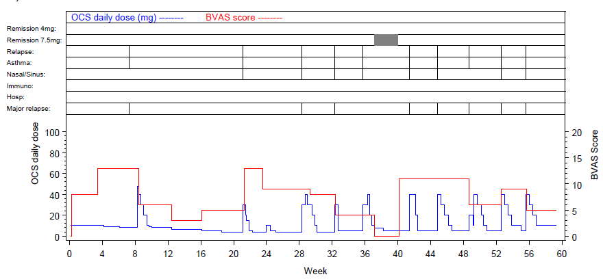

# Designing visual patient profiles
The visualisations below present patient level data in one plot or multiple aligned plots. Interactive visualisations are shown allowing to expand and collapse selected details. The use of color and pre-attentive attributes is supporting easy interpretation of the data.

## Example 1. One plot solution

  
[high resolution image](./images/David.png)  

This visualisations gives a time-aligned overview on study drug intake, adverse events, laboratory values and other information with very little clutter. Blood pressure is given as line plot with values. Color coding is used for abnormal values and AE severity.

[link to code](#example1 code)

## Example 2. D3 patient profile

  
[high resolution image](./images/WW-PatientProfiles-Irene de la Torre - Irene De la Torre Arenas.png)  

Multiple plots with aligned time axis are showing drug exposure, adverse events and concomitant medication. Lab values over time and changes are displayed in facet plots with highlighted abnormal values.

[link to code](#example2 code)

## Example 3. Grable

  
The app can be found [here](https://agstn.github.io/PatientProfiler/PatientProfiler.html).  

This table with embedded graphics is giving an overview over all subjects with the option to expand and collapse additional information. Demographic data are displayed in symbols, gauge charts, text, color coded bar charts, or color supported descriptive text respectively. Population ranges are given as gray background where possible.

[link to code](#example3 code)

## Example 4. Table-Graph-combination

  

[high resolution image](./images/David.png)  

This is an example out of the context of the challenge. It’s showing a possibility to include outcome values over time and dosing in addition to textual information.

[link to code](#example4 code)

# Code

## Example 1. One plot solution

No code has been submitted.

[Back to blog](#example1)

## Example 2. D3 patient profile

The code can be found [here](https://observablehq.com/@irenedelatorre/patient-profiles-wonderful-wednesdays-june-challenge).

[Back to blog](#example2)

## Example 3. Grable

No code has been submitted.

[Back to blog](#example3)

## Example 4. Table-Graph-combination
The code can be found [here](https://github.com/agstn/PatientProfiler).

[Back to blog](#example4)