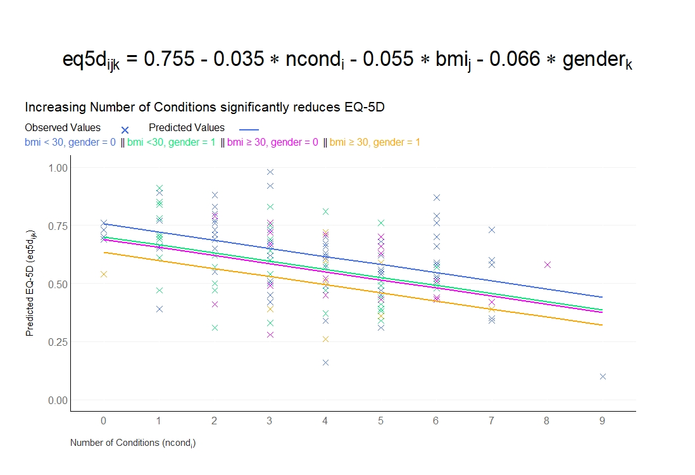

# Prediction of health status (EQ-5D)
The data is based on a study to assess the health status in patients with coronary heart diseases (see Ose et al., 2012). The research question was: what factors are associated with health status in usual primary care?

The original data included 2,656 patients with 14 (patient and practice) characteristics (with clustered data structure). The outcome was EQ-5D VAS scale (Health related quality of life; range: [0; 1]). The data set for this challenge is a sub-sample of patients and variables and it is simulated data.

This month's challenge was to fit a model for predicting the value of the EQ-5D Visual Analogue Scale (ranges from 'Worst imaginable health state' to 'Best imaginable health state'; higher scores correspond to higher quality of life) and then to produce a visualisation to display the results.

## Example 1. Regression model

  
[high resolution image](./images/EQ-5D - Sarah Robson.jpeg)  

The first visualisation displays the results of a model regressing EQ-5D on BMI, gender, and number of conditions. Number of conditions is identified as being a key predictor of quality of life, motivating the key takeaway (‘Increasing Number of Conditions significantly reduces EQ-5D’) which is nicely provided in the sub-title of the plot. This message could be made even stronger by using this key takeaway as the title itself, in place of the equation which is currently used as the title (the equation could instead be presented in a footnote or similar).
The plot presents both the observed (patient-level) data and the model-predicted values. Number of conditions is displayed on the x-axis, with four lines plotted in different colours to display the four pairwise combinations of gender and BMI (<30, >=30). 
The plot has a very nice ‘visual’ legend, allowing us to understand the symbols used for both observed and predicted values, as well as the colour used for each combination of BMI and gender. This could be even better understood if information was provided on the coding of gender (i.e., which gender is represented by the value 1) and the interpretation of the EQ-5D VAS (i.e., higher scores correspond to improved quality of life).
The plot displays a clear message of the impact of each predictor, nicely meeting the brief for this challenge. The overall display is clean, with minimal clutter and the gridlines displayed in a very light grey in the background. It’s also really nice to have the patient-level data and be able to compare the observed and predicted values. The only slight challenge with this is that it is hard to distinguish some of the selected colours on the plotted observed values.

[link to code](#example1 code)

## Example 2. Regression model - alternative

  
[high resolution image](./images/EQ-5D - updated.jpeg)  

During the webinar, the panellists displayed an alternative version of the first submission, highlighting how a few aesthetics could be modified. Some of the key features of the first visualisation are retained, such as the visual legend and the key takeaway, although this is now used as the main title with the equation itself deferred to a footnote.

To overcome the challenges with the colours from the previous submission, this plot splits the gender/BMI combinations out in to four facets. In each facet, the observed patient-level data and predicted values for the relevant group are displayed in colour, but the data for the other three groups is displayed in light grey and pushed to the background. This allows us to easily identify the data for each group while still being able to make comparisons with the other groups.

To maintain the clean aesthetic with these added facets, a single y-axis is presented to avoid duplication, with very light grey gridlines running across all facets. The ‘x’ symbol previously used for the observed data is replaced with a ‘-‘ to reduce overlap between data points.

Overall, the plot highlights how small tweaks can be made to an already impressive visualisation to produce another great plot that presents the same information in an alternative display. Again, the reader could be further helped here by additional information on the decoding of the gender variable and the interpretation of EQ-5D VAS scores.

[link to code](#example2 code)

## Example 3. Displaying predictors

  
high resolution image:
[pdf](https://github.com/agstn/WW/blob/main/2022-08-10/ed5d_relaimpo.pdf)
[png](https://github.com/agstn/WW/blob/main/2022-08-10/ed5d_relaimpo.png)

The final submission changed focus from the first two. Whereas previous submissions look to present model results (i.e., predicted outcomes at different values of the predictors), the final submission focused on graphically displaying which predictors are the most important in determining the EQ-5D VAS value.

The submission is split into two. On the left-hand side, there is a graphical depiction of the predictors included in a final model selected through a combination of forward selection and backward elimination. Solid lines indicate those variables included in the model as a main effect, whereas dashed lines display the interactions included in the model. Please note, a small issue caused several solid lines to be displayed from certain predictors.

The right-hand side of the plot displays the relative importance of the included predictors, as determined by the LMG metric. The contribution of each included predictor and each included interaction is presented by a bar. Each subsequent bar starts where the previous finishes, very nicely making it extremely clear that these are individual contributions to the overall R-squared, which is presented at the bottom. Within the main effects and two-way interaction displays, the predictors are logically ordered based on their relative importance. This drives home the same message that was given as a key takeaway in the previous submissions: number of conditions is the most important predictor in determining EQ-5D VAS score. Throughout all aspects of the submission, each predictor is consistently coloured, making each occurrence very easy to identify.

Within the right-hand panel, an arrow is displayed on top of each bar. In this instance, this is somewhat redundant since relative importance will always be non-negative and thus the arrows will always point to the right. Whilst not the focus of this submission (which very nicely achieves its goal of presenting the most influential predictors), we do not have any information here on the direction of effect of each predictor (i.e., we know that it is important, but does it increase or decrease quality of life?).

[link to code](#example3 code)

This month’s webinar nicely highlights how different visualisations can be utilised to achieve different goals. In fact, the submissions this month nicely compliment one another and together provide a holistic overview of the challenge at hand. The final submission nicely emphasises the key variables which influence the outcome; the other submissions nicely display the impact and direction of effect of key variables on the outcome

# Code

## Example 1. Regression model

No code has been submitted.

[Back to blog](#example1)

## Example 2. Regression model - alternative

No code has been submitted.

[Back to blog](#example2)

## Example 3. Displaying predictors

The code can be found [here](https://github.com/agstn/WW/tree/main/2022-08-10).

[Back to blog](#example3)