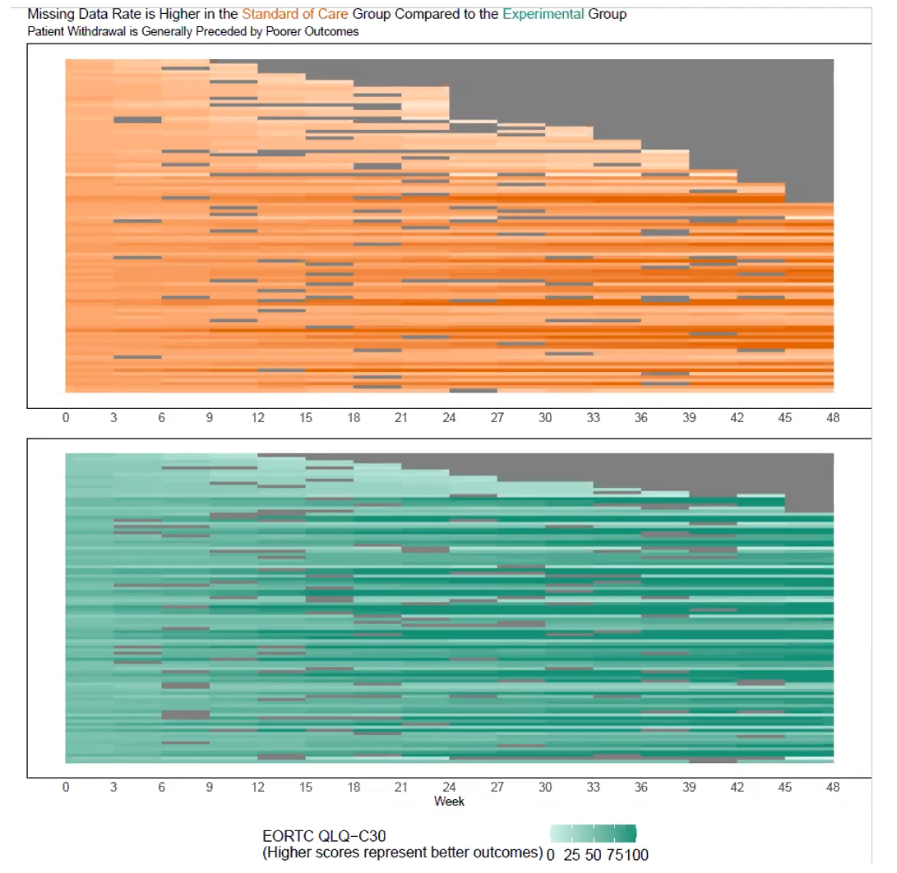
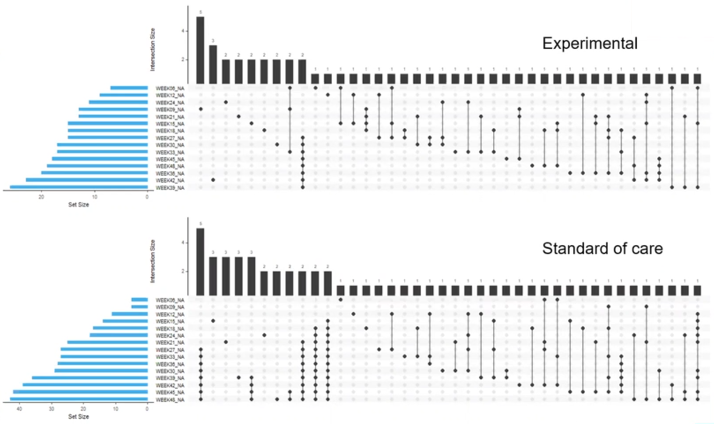
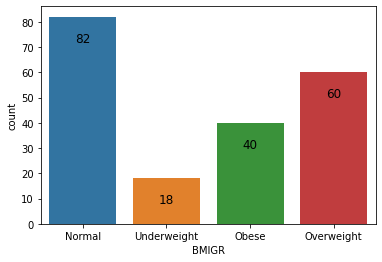
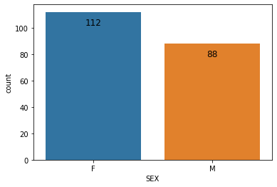

# Quality of life outcomes in a cancer trial: dealing with missing data

The EORTC QLQ-C30 is a 30-item questionnaire that has been designed for use in a wide range of cancer patient populations and is a reliable and valid measure of the quality of life in cancer patients. It includes a number of different scales, but this challenge is focussed on the global health and quality of life scale (QL).

A recording of the session can be found [here](https://www.psiweb.org/vod/item/psi-vissig-wonderful-wednesday-33-missing-data-in-quality-of-life).

<a id="example1"></a>

## Example 1.

  
[high resolution image](./images/line_plot - Paolo Eusebi.png)  


[link to code](#example1 code)


<a id="example2"></a>

## Example 2.

  
[high resolution image](./images/Heatmap_L_Gakava.pdf)  


[link to code](#example2 code)

<a id="example3"></a>

## Example 3.

  
[high resolution image](./images/lasagna_plot.png)  

[link to code](#example3 code)

<a id="example4"></a>

## Example 4.

  

[high resolution image](./images/sankey_chart - Paolo Eusebi.png)  


[link to code](#example4 code)


<a id="example5"></a>

## Example 5.

  
[high resolution image](./images/pattern.png)  


[link to code](#example5 code)

<a id="example6"></a>

## Example 6.

  
  
  
  
  
[high resolution image](./images/Age_Zara.png)  
[high resolution image](./images/BMI_Zara.png)  
[high resolution image](./images/Count_BMIGR_Zara.png)  
[high resolution image](./images/Count_Gender_Zara.png)  
[high resolution image](./images/MissingValues_Zara.png)  


[link to code](#example6 code)


# Code

<a id="example1 code"></a>

## Example 1.

```{r, echo = TRUE, eval=FALSE}
library(dplyr)
library(tidyr)
library(ggplot2)
library(forcats)
library(scales)

d0 <- read.csv2("ww eortc qlq-c30 missing.csv", sep=",") %>%
  as_tibble() 
d0
d1 <- df %>%
  pivot_longer(cols=starts_with("WEEK"), names_to = "AVISIT", values_to = "AVAL") %>%
  mutate(AVAL=as.numeric(AVAL)) %>%
  select(USUBJID, ARM, LASTVIS, AGE:AVAL)
d1  

d2 <- d1 %>%
  group_by(ARM, LASTVIS, AVISIT) %>%
  summarize(AVAL = mean(AVAL, na.rm=TRUE)) %>%
  mutate(LASTVISC=as.factor(paste("Week", sprintf("%02.f", LASTVIS))),
         AVISITN = as.numeric(gsub("WEEK","",AVISIT))) %>%
  mutate(LASTVISC=fct_reorder(LASTVISC, LASTVIS))


cc <- scales::seq_gradient_pal("yellow", "blue", "Lab")(seq(0,1,length.out=14))
show_col(cc)

breaks <- sort(names(table(df_2$LASTVISC)))
labels <- breaks

ggplot(data=d2, aes(x=AVISITN, y=AVAL, group=LASTVISC, color=LASTVISC)) +
  geom_line() +
  geom_point() +
  scale_y_continuous(breaks = round(seq(0, 100, 8.333333333),2),
                     limits = c(0, 100)) +
  scale_x_continuous(breaks = seq(0, 48, 3), labels = paste("Wk", seq(0, 48, 3))) +

  scale_color_manual(values = cc, labels=labels, breaks=breaks) +
  facet_grid(cols=vars(ARM)) +
  labs(title = "Dropout is associated with worsening in quality of life",
     y = "EORTC QLQ-C30 QL [0-100]",
     x = "Week on treatment") +
  theme(plot.background = element_rect(fill="black"),
        panel.background = element_rect(fill="black"),
        legend.background = element_rect(fill="black"),
        legend.box.background = element_rect(fill="black"),
        legend.key = element_blank(),
        legend.text = element_text(colour="grey"),
        panel.grid = element_line(colour="grey5"),
        panel.grid.minor = element_blank(),
        strip.background = element_blank(),
        plot.title=element_text(colour = "grey", size = 14, face = "bold"),
        strip.text = element_text(colour = "grey50", size = 10),
        axis.text = element_text(angle = 90))

ggsave(filename = "line_plot.png", device = "png", width = 12, height = 6)
```


[Back to blog](#example1)


<a id="example2 code"></a>

## Example 2. <Same title as above>

No code has been submitted.


[Back to blog](#example2)


<a id="example3 code"></a>

## Example 3.

No code has been submitted.

[Back to blog](#example3)


<a id="example4 code"></a>

## Example 4.
```{r, echo = TRUE, eval=FALSE}
library(dplyr)
library(tidyr)
library(ggplot2)
library(forcats)
library(scales)
library(ggalluvial)
library(RColorBrewer)

df <- read.csv2("ww eortc qlq-c30 missing.csv", sep=",") %>%
  as_tibble() 
df
df_1 <- df %>%
  pivot_longer(cols=starts_with("WEEK"), names_to = "AVISIT", values_to = "AVAL") %>%
  select(USUBJID, ARM, LASTVIS, AGE:AVAL) %>%
  mutate(AVAL=as.factor(if_else(AVAL=="", "Missing", AVAL)))
df_1  
levels(df_1$AVAL) <- c(as.character(rev(round(seq(0, 100, 8.333333333), 1))), "Missing")

cc <- scales::div_gradient_pal(low = "#a50026", mid="#ffffbf", high = "#313695", "Lab")(seq(0,1,length.out=13))

colors <- c(cc, "#D3D3D3")
show_col(colors)

ggplot(df_1,
       aes(
         x = AVISIT,
         stratum = AVAL,
         alluvium = USUBJID,
         fill = AVAL,
         label = AVAL
       )) +
  scale_fill_manual(values = colors) +
  scale_x_discrete(labels = paste("Wk", seq(0, 48, 3))) +

  geom_flow(stat = "alluvium", 
            lode.guidance = "frontback",
            color = "darkgray") +
  geom_stratum() +
  labs(title = "Quality of Life - Missing data depends on age and treatment received") +
  facet_wrap(AGEGR~ARM, nrow = 4, scales = "free_y", strip.position = c("left")) +
  # facet_grid(cols = vars(ARM), rows = vars(AGEGR), scales = "free") +
  theme_bw() +
  guides(fill = guide_legend(nrow = 1, reverse = T)) +
  theme(
    #panel.background = element_blank(),
    #axis.text.y = element_blank(),
    legend.title = element_blank(),
    axis.title.x = element_blank(),
    legend.position = "bottom",
    strip.text = element_text(size = 12),
    axis.text = element_text(angle = 90),
    legend.direction = "horizontal"
  ) 

ggsave(filename = "sankey_chart.png", device = "png", width = 16, height = 9)
```

[Back to blog](#example4)


<a id="example5 code"></a>

## Example 5.

No code has been submitted.

[Back to blog](#example5)

<a id="example6 code"></a>

## Example 6.

No code has been submitted.

[Back to blog](#example6)