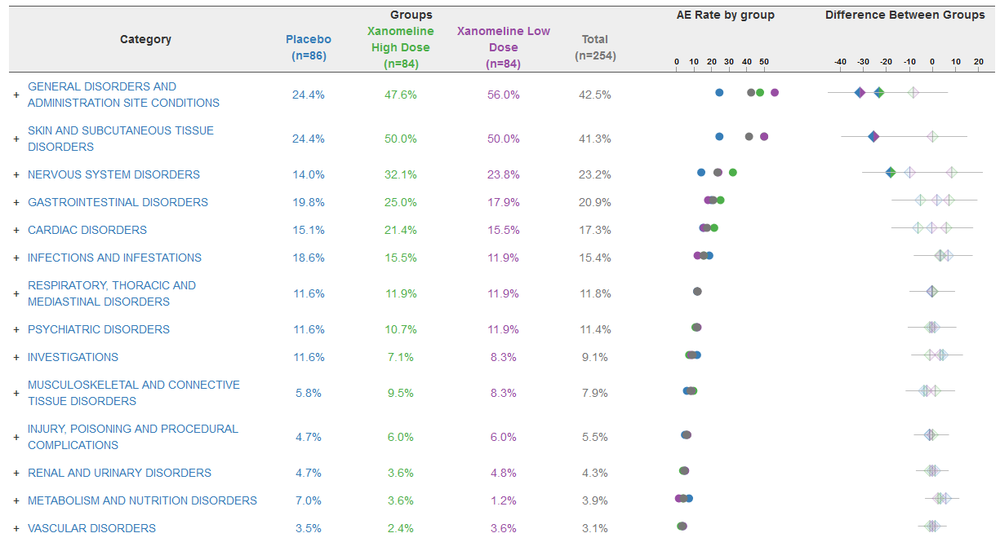

# Adverse Event data of COVID-19 vaccination in 2021
The data is an excerpt of the official VAERS data created by US Food and Drug Administration (FDA) and Centers for Disease Control and Prevention (CDC) that may be associated with vaccines.

The challenge is to display the advers event profile of the different vaccines. The visualisation should allow to detect differences in the incidence of adverse events. You may concentrate on the most frequently reported events.

ps: some of the variables needed to be deleted due to file size constrains.

A recording of the session can be found [here](https://www.psiweb.org/vod/item/psi-vissig-wonderful-wednesday-34-vaccine-adverse-event-reporting-system).

## Example 1.

  
[high resolution image](./images/barplot.png)  

[link to code](#example1 code)

## Example 2.

  
[high resolution image](./images/double_dot_plot.png)  

[link to code](#example2 code)

## Example 3.

  
[high resolution image](./images/AEexplorer.png)  

[link to code](#example3 code)

# Code

## Example 1. <Same title as above>

No code available.

[Back to blog](#example1)

## Example 2. <Same title as above>

No code available.

[Back to blog](#example2)

## Example 3. <Same title as above>

No code available.

[Back to blog](#example3)