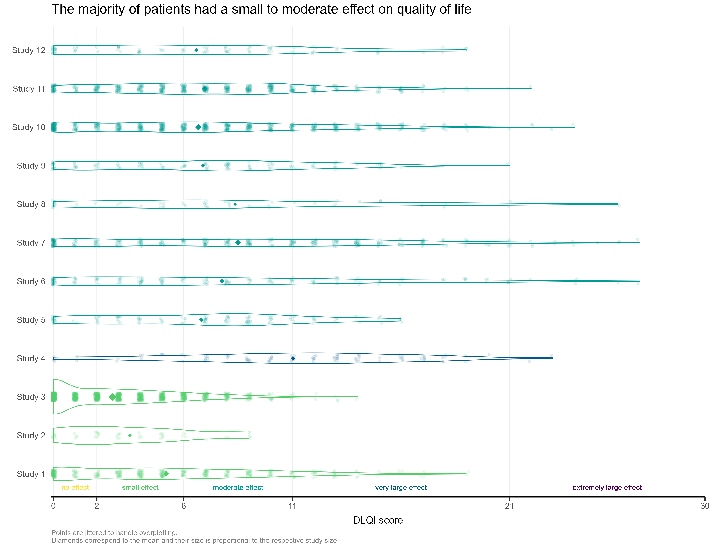
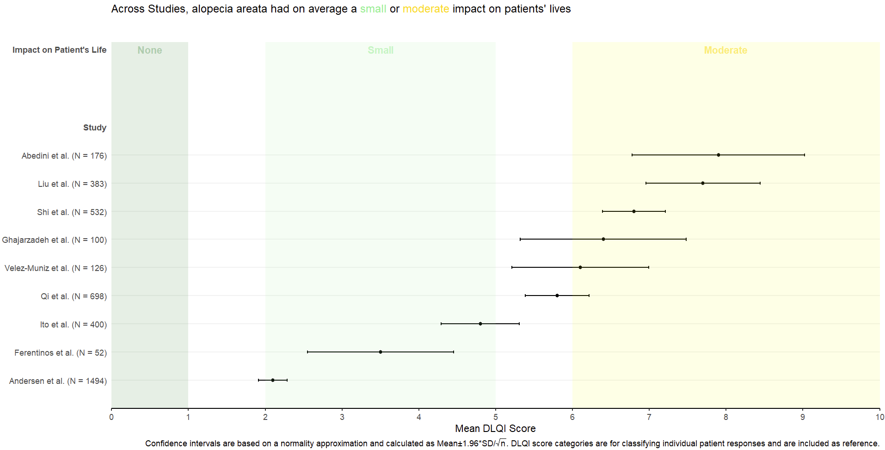
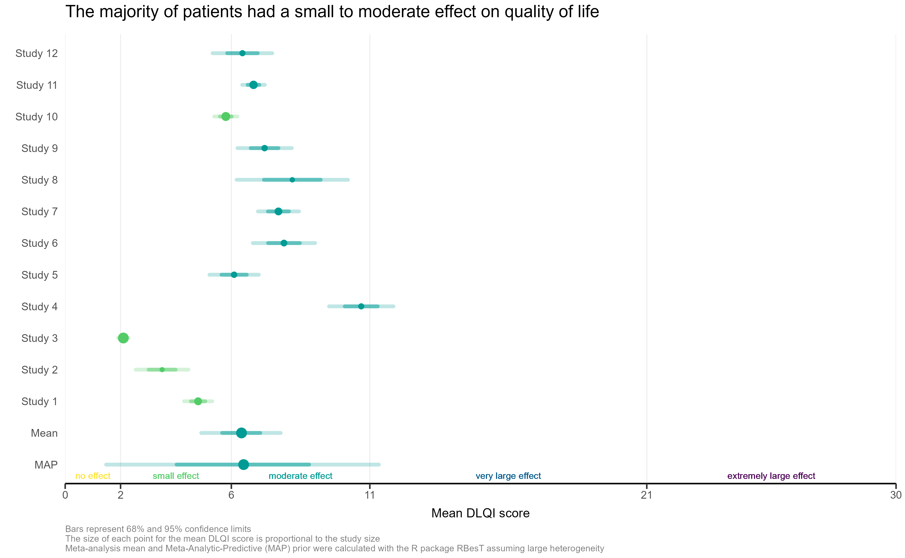
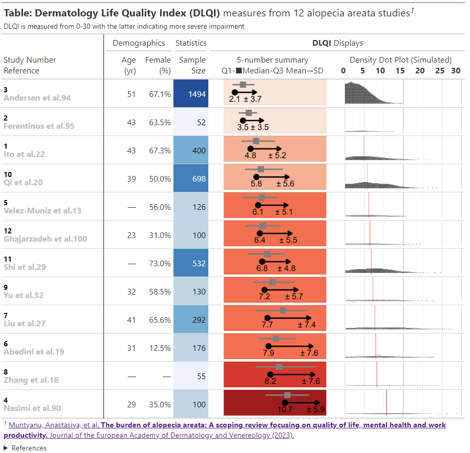

# DLQI data
This month’s challenge was to improve a published visualisation. The visualisation displayed the mean (and SD) Dermatology Life Quality Index (DLQI) score for 12 studies on alopecia areata. The publication had visualised these using ‘dynamite plots’, a type of visualisation which has received criticism in the past.

A recording of the session can be found [here](https://www.psiweb.org/vod/item/psi-vissig-wonderful-wednesday-37-dlqi-meta-analyses).

<a id="example1"></a>

## Example 1.

  
[high resolution image](./images/DLQI_individual - Benjamin Lang.png)  

The first visualisation had simulated the DLQI scores of individual patients, to provide mean and standard deviations equal to those published for each of the studies. These individual data points are then plotted for each of the studies, with the corresponding densities displayed. This nicely highlights, in this case, how a simple presentation of mean and standard deviation may not capture the experience of many of the individual patients within the studies. The mean for each study is still displayed as a diamond, and has its size set proportional to the sample size for the respective study. Such a display is effectively used in some of the other submissions from this webinar, but here does sometimes cause the mean to be somewhat difficult to spot, particularly for small studies with a mean value close to an integer score (where it overlaps with individual data points – see for instance, study 11). Reference lines are added to display the meaningful score categories which exist for DLQI total score at a patient level. These in turn dictate the colours used for each study, with a telling title added to provide an interpretation of the overall patient experience. A more convincing message could have been delivered by applying a logical sorting based on e.g. mean score, rather than study number.

[link to code](#example1 code)


<a id="example2"></a>

## Example 2.

  
[high resolution image](./images/pointandCI.png)  

This is a simple, but clean visualisation with logical ordering of studies based on mean DLQI score. As per some of the other submissions, the axes have been flipped here compared to the original, published visualisation. This allows for the author name and sample size to be displayed on the label, as well as sample size. However, sample size could more effectively be encoded within the plot itself, to save the reader from having to study the axis labels at length. There is a telling title added with colours nicely included to link the title to the plot itself. Additional information is deferred to a footnote, and here shading is used to display the meaningful DLQI categories (again, these categories are for DLQI scores at a total level). These categories motivate a panel discussion on how useful it is to display these categories, corresponding to individual patients, for a presentation of the mean. The issue here is that, due to DLQI only taking integer scores for each patient, the meaningful categories have gaps between their extremes. The author has chosen to leave these as blank space in the plot, which could be confusing for a reader who is not familiar with DLQI scores or the categories. An alternative would be to use the midpoints (1.5 and 5.5 for the displayed categories) as the values to change the shading at. This submission also lead to a nice discussion on minimising white space, while avoiding confusion. The user only takes the x-axis as far as a score of 10, which captures all the observed data, while presenting it in the maximum amount of space to allow comparison between the categories. However, it could mislead the reader that several studies have a mean DLQI score close to the upper limit of those which can be taken by the tool (which is not the case, DLQI scores can be as high as 30). Taking the x-axis as far as 30 here would give an easier interpretation of the overall experience of patients with alopecia areata, compared with what is possible.

[link to code](#example2 code)

<a id="example3"></a>

## Example 3.

  
[high resolution image](./images/DLQI_summary - Benjamin Lang.png)  

This is a very similar submission to the previous one. The two each address some of the disadvantages of one another, and a visualisation which takes the best elements from both could be extremely effective here. This submission again has a telling title, with additional information deferred to the footnotes. The overall presentation is again clean, with reference lines added to show the meaningful score categories which exist for DLQI total score at a patient level (unlike the previous submission, the author has chosen to set the ‘cut-points’ between pairs of adjacent categories at the lower extreme of the higher category (scores of 2, 6 etc.). By taking the x-axis as far as 30 here, we get a better impression of the experience of patients compared to the range of possible values. The sample size is again nicely encoded here by scaling the size of the point to be proportional to this sample size. While this would be aided by a legend so we know what each size of point represents, one panellist did make the observation that the largest study has the lowest mean score, so actually overall (across studies) we do have a large number of patients with lower DLQI scores. Two sets of error bounds (68% and 95% confidence limits) are displayed usual different levels of shading, allowing additional information to be adding while retaining a clean presentation with minimal clutter. However, the visualisation could again benefit based on a more logical sorting, such as by mean DLQI score (per the previous submission), or possibly based on the sample size of the study?

[link to code](#example3 code)

<a id="example4"></a>

## Example 4.

  

[high resolution image](./images/Huw_Wilson_Submission.png).

This submission opted to display data for their own simulated studies, rather than use the summary stats given from the published visualisation (which is completely fine to do for our webinars!). It had a striking appearance with the dark background vibrant plotting colours, which we can imagine standing out from a crowd in e.g. a busy conference hall. The plot itself present different panels for different studies, with individual data points shown and lines connecting the means of the data points. This allows a lot of information (different studies, with different treatments and numbers of treatments, different assessment schedules, etc.) to be displayed in a single plot. Clutter is minimal, with a single x-axis common to the four panels, although there is probably a maximum number of studies we could probably plot before the panels become too small to easily read. The combination of individual data points and means is nice, as per submission 1, for given a better overview of the experiences of individual patients (many of whom will not be accurately reflected by summary stats alone). One challenge with this plot is the need for jittering of the arms (so as to make them readable). To a lesser extent, this causes a challenge that some arms are not displayed at the correct position on the x-axis (the jittering makes the final assessment for Study 2, Treatment C to appear to be later than or at a similar time to the Placebo assessment for Study 1 which is plotted above, which is not the case). However, the reader intuitively interprets the timepoint of the assessment is the midpoint of the times of the different arms for a given study, so this issue is not critical. However, the fact that the lines, connecting the means, connect to points which are plotted at different points on the x-axis causes a challenge (because moving the position of the mean relative to the x-axis changes the slopes of the connecting lines and how quickly they reach the means for the different arms).

[link to code](#example4 code)


<a id="example5"></a>

## Example 5.

  
The html file can be found [here](./images/DLQI_for_AA_by_study - Agustin Calatroni.html)  

This is an informative submission which can be broken down into its different panels. These panels are supplemented by additional links and informative subheadings to aid understanding. The user is first presented with some general information about the studies (demographics, as well as sample size). The cells presenting sample size are shaded in accordance with the sample size, and these sample sizes are used to provide a logical ordering of the studies. The choice of the intense shade for the largest sample size immediately draws our attention to that study. The next panel then displays small  5-number summaries for the total DLQI in each study (presenting mean, medians, quartiles and SD). One panellist did pick out that the choice of display for the median and quartiles could confuse a reader who does not take care to read the legend, as they could interpret the display as a boxplot (which would have the quartiles displayed differently). A shaded is applied within this column, which is intuitive with ‘clearance’ of issues and the intense, dark red shade depicting the largest (negative) impact. It could be argued that the select shades should be based on the DLQI score range of 0 to 30, as opposed to the observed means for the selected studies (could mislead that the highest mean of 10.7, here, is towards the upper extreme of possible DLQI scores). The final panel presents density dot plots for simulated patient level data. While the individual points are a little small to make out (meaning we don’t see a lot for some of the smaller studies), this nicely highlights how summary stats may not capture the experience of many patients, per other submissions which have presented simulated patient level data. The mean is added as a reference line to aid interpretation, and the x-axis presents the full range of 0 to 30 here, indicating that across studies, the bulk of patients have DLQI scores towards the lower end of the DLQI range (mitigating against misunderstanding which could have been caused by the shading in the previous panel, as well as driving home just how different some of the sample sizes are)

[link to code](#example5 code)

<a id="example6"></a>

## Example 6.

  

[high resolution image](./images/panel.png).  

# Code

<a id="example1 code"></a>

## Example 1.

The code can be found in this [zip file](./code/2023-02-DLQI-lang-benjamin - Benjamin Lang.zip).

[Back to blog](#example1)


<a id="example2 code"></a>

## Example 2.

No code is available.

[Back to blog](#example2)


<a id="example3 code"></a>

## Example 3.

The code can be found in this [zip file](./code/2023-02-DLQI-lang-benjamin - Benjamin Lang.zip).

[Back to blog](#example3)


<a id="example4 code"></a>

## Example 4.
```{r, echo = TRUE, eval=FALSE}
#----------------------------------------------------
# PSI Wonderful Wednesdays Challenge February 2023
#----------------------------------------------------

# Clear environment and read in libraries
rm(list = ls())
library(tidyverse)
library(scales)
library(ggtext)

# Simulate 4 studies with different treatments/sample sizes
subjects <- as.character(seq(1, 850))

trts <- c(sample(c('Placebo', 'A', 'B'),
                 size = 300, replace = T),
          sample(c('Placebo', 'C'),
                 size = 100, replace = T),
          sample(c('B', 'C'),
                 size = 300, replace = T),
          sample(c('B', 'D'),
                 size = 150, replace = T))

studies <- c(rep('Study 1', 300),
             rep('Study 2', 100),
             rep('Study 3', 300),
             rep('Study 4', 150))

visits <- c(rep(seq(0, 100, length.out = 10), each = 300),
            rep(seq(0, 75,  length.out  = 8), each = 100),
            rep(seq(0, 100, length.out = 10), each = 300),
            rep(seq(0, 50,  length.out = 6),  each = 150))

# Random study effects
study_effs <- c(rep(rnorm(1, sd = 3), 300),
                rep(rnorm(1, sd = 3), 100),
                rep(rnorm(1, sd = 3), 300),
                rep(rnorm(1, sd = 3), 150))

# Random subject effects
sub_effs <- rnorm(850, 0, 3)

# Repeat values for each visit e.g. in study 1, each subject needs 10 records
split <- function(vec){
  return(
    c(rep(vec[1:300], 10),
      rep(vec[301:400], 8),
      rep(vec[401:700], 10),
      rep(vec[701:850], 6)))
}

# Create study dataframe
df <- data.frame(subject   = split(subjects),
                 study     = split(studies),
                 trt       = split(trts),
                 study_eff = split(study_effs),
                 sub_eff   = split(sub_effs),
                 time      = as.character(round(visits, 0)))

# Find each subject/treatment combo - will need to merge this on later
subject_df <- df %>%
              select(subject, trt) %>%
              mutate(trt = if_else(trt != 'Placebo',
                                   paste0('Treatment ', trt),
                                   trt)) %>%
              unique()

# Coefficients for treatment variables
beta0 <- 15
betaA <- 0.2
betaB <- -0.1
betaC <- 0.1
betaD <- 0.05

# Coefficients for interaction variables
gamma <- 0.01
gammaA <- 0.025
gammaB <- -0.1
gammaC <- 0.0001
gammaD <- -0.05


# Find DLQI score for each 
dlqi_calc <- function(n, A, B, C, D, time, study_eff, sub_eff){
  
  dlqi <- beta0 + betaA*A + betaB*B +
          betaC*C + betaD*D + 
          gamma*time + gammaA*A*time + gammaB*B*time +
          gammaC*C*time + gammaD*D*time +
          sub_eff + study_eff
  
  return(rnorm(n, dlqi, 3))
}


dlqi_df <- df %>%
  
           # Create variables needed for dlqi_calc
           pivot_wider(id_cols = c(subject, study, study_eff, sub_eff, time),
                       names_from = trt,
                       values_from = trt,
                       values_fn = length,
                       values_fill = 0) %>%
           mutate(time = as.numeric(time),
                  dlqi = dlqi_calc(n(), A, B, C, D, time, study_eff, sub_eff),
                  
                  # Apply cut-off thresholds
                  dlqi = case_when(
                                   dlqi < 0 ~ 0,
                                   dlqi > 30 ~ 30,
                                   T ~ dlqi)) %>%
           left_join(subject_df, by = 'subject') %>%
           group_by(trt, study, time) %>%
           mutate(mean = mean(dlqi),
                  
                  # Add some jitter so plot points are not over-layed
                  time = case_when(study == 'Study 1' & trt == 'Placebo' ~ time - 2,
                          study == 'Study 1' & trt == 'Treatment B' ~ time + 2,
                          study == 'Study 2' & trt == 'Placebo' ~ time - 1,
                          study == 'Study 2' & trt == 'Treatment C' ~ time + 1,
                          study == 'Study 3' & trt == 'Treatment B' ~ time - 1,
                          study == 'Study 3' & trt == 'Treatment C' ~ time + 1,
                          study == 'Study 4' & trt == 'Treatment D' ~ time + 1,
                          study == 'Study 4' & trt == 'Treatment B' ~ time - 1,
                          T ~ time))
  
# Color the subscript treatment labels
color_label <- function(color, trt){
    paste0("N",
    "<sub><span style = 'color:", color, ";'>", trt, "</span></sub></span>")
}

nP <- color_label(hue_pal()(5)[1], 'P')
nA <- color_label(hue_pal()(5)[2], 'A')
nB <- color_label(hue_pal()(5)[3], 'B')
nC <- color_label(hue_pal()(5)[4], 'C')
nD <- color_label(hue_pal()(5)[5], 'D')

# Create the desired facet labels
study.labs <- c(paste0('Study 1 <br><br>',
                       nP, ' = ', nA, ' = ', nB, ' = 100'),
                paste0('Study 2 <br><br>' ,
                       nP, ' = ', nC, ' = ', '50'),
                paste0('Study 3 <br><br>',
                       nB, ' = ', nC, ' = ', '100'),
                paste0('Study 4 <br><br>',
                       nB, ' = ', nD, ' = ', '75'))

names(study.labs) <- c('Study 1', 'Study 2', 'Study 3', 'Study 4')

# Create the plot
png("plot.png", res = 500, height = 5, width = 7, units = 'in')

ggplot(data = dlqi_df) +
  
  geom_point(aes(x = time,
                 y = dlqi,
                 color = trt), alpha = 0.1, size = 0.3) +
  
  facet_wrap(~study, ncol = 1, strip.position = 'right',
             labeller = labeller(study = study.labs)) +
  
  geom_line(aes(x = time,
                y = mean,
                group = trt,
                color = trt),
            size = 0.5, alpha = 0.75) +
  
  theme(panel.background       = element_rect(fill = 'gray10'),
        panel.border           = element_rect(color = 'gray20', 
                                              size  = unit(1, 'in'), 
                                              fill  = NA),
        plot.margin            = margin(20, 20, 20, 20),
        panel.grid.minor       = element_blank(),
        plot.background        = element_rect(fill  = 'gray10', 
                                              color = 'gray10'),
        panel.grid.major       = element_line(color ='gray13'),

        legend.position        = c(0.43, 1.17),
        legend.justification   = 'top',
        legend.background      = element_rect(fill = 'gray10'),
        legend.title           = element_blank(),
        legend.key             = element_rect(fill = 'gray10'),
        legend.text.align      = 0,
        legend.text            = element_text(color = 'gray90',
                                              size = 8),
        
        strip.background       = element_rect(fill = 'gray20'),
        panel.spacing          = unit(0.15, 'in'),
        strip.text.y           = element_markdown(angle = 0, 
                                                  color = 'white',
                                                  face  = 'bold', 
                                                  size  = 8),

        axis.text             = element_text(color = 'gray70'),
        axis.title.x          = element_text(hjust  = 0, 
                                             color  = 'white',
                                             face   = 'bold',
                                             margin = margin(t = 12.5),
                                             size   = 8),
        plot.title            = element_text(color = 'white', 
                                             hjust = 0,
                                             face = 'bold',
                                             margin = margin(b = 7),
                                             size = 12),
        plot.subtitle         = element_text(color = 'gray90', 
                                             face = 'italic',
                                             size = 7, 
                                            margin = margin(b = 32)),
        plot.title.position   = 'plot',
        plot.caption.position = 'plot',
        plot.caption          = element_text(size = 7, 
                                             color = 'white', 
                                             face = 'bold.italic')) +
  
  
  coord_cartesian(ylim = c(0, 30), clip = 'off') +
  
  guides(color = guide_legend(nrow = 1)) +
  
  labs(x        = 'Relative Day',
       y        = NULL,
       title    = 'Mean DLQI Score over Time for Four Different Studies',
       caption  = 'Huw Wilson',
       subtitle = 'Lower DLQI scores indicate less severe symptoms.')

dev.off()
```

[Back to blog](#example4)


<a id="example5 code"></a>

## Example 5.

```{r, echo = TRUE, eval=FALSE}
# PACKAGES
pacman::p_load(tidyverse, rio)
pacman::p_load(gtsummary, gt, gtExtras)
pacman::p_load(unglue)
pacman::p_load(msm)
pacman::p_load(scales, ggdist)

# options
setwd(dirname(rstudioapi::getActiveDocumentContext()$path))
set.seed(123)

# DATA MANUSCRIPT
dlqi <- import('DLQI_for_AA_by_study.xlsx') %>% 
   janitor::clean_names(case = 'old_janitor') %>% 
   mutate(unglue_data(mean_sd, "{mean_m} ({sd_m})", convert = TRUE) ) %>%
   mutate(study_number = factor(study_number) %>% fct_reorder(mean_m)) %>% 
   rowwise() %>% 
   mutate(sim = data.frame(
      rtnorm = rtnorm(n, mean_m, sd_m, lower = 0, upper = 30),
      rnorm  = rnorm(n, mean_m, sd_m)) %>% list(),
      mean_s = mean(sim$rnorm),
      sd_s   = sd(sim$rnorm)) %>% 
   arrange(study_number)

# Nomenclature
# _f figure
# _m manuscript
# _s simulated

# COLOR
# RColorBrewer::brewer.pal(9,'Reds')
# col_numeric("Reds", domain = 2:11) (dlqi_gt$mean_m) %>% show_col()
#     col_bin("Reds", domain = 2:11, bins = 4) (dlqi_gt$mean_m) %>% show_col()
# col_quantile("Reds", domain = 2:11, n = 4) (dlqi_gt$mean_m) %>% show_col()

# GENERATE GGPLOT
dlqi_gt <- dlqi %>% 
   mutate(
      data = data.frame( 
         mean_f = mean_f, sd_f   = sd_f,
         mean_m = mean_m, sd_m   = sd_m,
         mean_s = mean_s, sd_s   = sd_s) %>% list() ) %>% 
   ungroup() %>%
   mutate(mean_col = col_bin("Reds", domain = 2:11, bins = 4) (.$mean_m) ) %>%
   rowwise() %>%
   mutate(gg_mean = list(
      
      ggplot(data = data,
             aes(x = mean_m, y = '1' )) +
         
         geom_point(size = 40) +
         
         geom_segment(aes(xend = mean_m + sd_m,
                          yend = '1'),
                      linewidth = 10,
                      arrow = arrow( type = 'closed',
                                     length = unit(0.8, "inches") ) ) +
         
         geom_pointrange(data = sim,
                         aes(x = rtnorm, y = '1'),
                         stat = "summary",
                         fun.min = function(z) {quantile(z,0.25)},
                         fun.max = function(z) {quantile(z,0.75)},
                         fun = median,
                         shape = 15,
                         linewidth = 10,
                         size = 10,
                         color = 'gray50',
                         position = position_nudge(y = 0.60) ) +
         
         geom_text(size = 40,
                   nudge_y = -.5,
                   #hjust = 0.05,
                   aes(label = style_number(mean_m, digits = 1)) ) +
         
         geom_text(size = 40,
                   nudge_y = -.5,
                   hjust = 0.7,
                   aes(x = mean_m + sd_m,
                       label = str_glue("\u00B1 {style_number(sd_m, digits = 1)}") ) ) +
         
         coord_cartesian(xlim = c(1, 17)) + 
         
         scale_y_discrete(expand = expansion(add = c(-1, -1) ) ) +
         
         theme_void() +
         
         theme(aspect.ratio = 0.25,
               plot.margin = unit(c(0, 0, 0, 0), 'cm'),
               panel.background = element_rect(fill = mean_col)
         )
   ) ,
   ggplot_mean = NA
   ) %>% 
   mutate(gg_dist = list(
      ggplot( data = sim ,
              aes(y = '1',
                  x = rtnorm      
              ) ) +
         
         geom_vline(xintercept = mean_m,
                    linewidth = 3,
                    color = mean_col) +
         
         geom_dots(smooth = "bounded", layout = "weave",
                   slab_linewidth = 0,
                   slab_colour = 'transparent',
                   binwidth = 0.15,
                   slab_fill = 'gray25',
                   na.rm = TRUE) +
         
         geom_vline(xintercept = c(0, 5, 10, 15, 20, 25, 30),
                    color = 'gray15') +
         
         geom_vline(xintercept = c(0, 5, 10, 15, 20, 25, 30),
                    color = 'gray15') +
         
         scale_x_continuous(breaks = c(0, 6, 10, 20, 30),
                            limits = c(0, 30)) +
         
         scale_y_discrete(expand = expansion(add = c(-30, -2) ) ) +
         
         theme_void() +
         
         labs(x = NULL,
              y = NULL) +
         
         theme(panel.grid.minor.x = element_blank(),
               panel.grid.major.y = element_blank(),
               legend.position="none",
               aspect.ratio = 0.20)
   )
   ) %>%
   mutate(ggplot_dist = NA)


# TABLE 
dlqi_gt %>% 
   select(-sim,
          -whiskers,
          -scale,
          -mean_m,
          -mean_col,
          -mean_sd,
          -ends_with("_f"),
          -ends_with("_s")) %>%
   
   gt() %>% 
   
   gt_add_divider(study_number) %>% 
   
   gt_merge_stack(col1 = study_number, 
                  col2 = reference,
                  font_size = c("14px", "16px")) %>%
   
   data_color(n,      
              colors = scales::col_quantile(
                 palette = "Blues",
                 domain = c(50, 100, 250, 500, 750, 1500),
                 n = 5
              ) ) %>% 
   
   sub_missing() %>% 
   
   fmt_number(columns = age, decimals = 0) %>%
   
   fmt_percent(columns = females, decimals = 1, scale_values = FALSE) %>% 
   
   text_transform(
      locations = cells_body(columns = ggplot_mean),
      fn = function(x) {
         dlqi_gt$gg_mean %>%
            ggplot_image(height = 50, aspect_ratio = 5)
      }
   ) %>%
   text_transform(
      locations = cells_body(columns = ggplot_dist),
      fn = function(x) {
         dlqi_gt$gg_dist %>%
            ggplot_image(height = 50, aspect_ratio = 5)
      }
   ) %>%
   
   cols_align(columns = study_number, align = 'left') %>% 
   
   cols_hide(columns = c(data, sd_m, gg_mean, gg_dist)) %>% 
   
   cols_move(columns = c(age, females), after = study_number) %>% 
   
   cols_label(study_number = md('Study Number<br>Reference'),
              age     = md("Age<br>(yr)"),
              females = md("Female<br>(%)"),
              n       = md("Sample<br>Size"),
              ggplot_mean = html('5-number summary<br>Q1-&#9632;Median-Q3 Mean&rarr;SD'),
              ggplot_dist = md('Density Dot Plot (Simulated)<br>
                               <b>0&emsp;&ensp;
                               5&emsp;
                               10&emsp;
                               15&emsp;
                               20&emsp;
                               25&ensp;
                               30</b>')) %>%
   
   cols_width( study_number ~ px(200),
                    age     ~ px(68),
                    females ~ px(68),
                    n       ~ px(68),
               ggplot_mean ~ px(250),
               ggplot_dist ~ px(250)) %>% 
   tab_spanner(label = "Demographics", columns = c(age, females) ) %>%
   tab_spanner(label = "Statistics",   columns = c(n)) %>%
   tab_spanner(label = md("**DLQI** Displays"), columns = c(ggplot_mean, ggplot_dist)) %>% 
   tab_header(
      title  = md("**Table: Dermatology Life Quality Index (DLQI)** measures from 12 alopecia areata studies"),
      subtitle = md("DLQI is measured from 0-30 with the latter indicating more severe impairment")
   ) %>% 
   tab_footnote(
      footnote =  html(
         "<a href='https://onlinelibrary.wiley.com/doi/abs/10.1111/jdv.18926'> Muntyanu, Anastasiya, et al. <b>The burden of alopecia areata: A scoping review focusing on quality of life, mental health and work productivity.</b>
         Journal of the European Academy of Dermatology and Venereology (2023).</a>"),
      locations = cells_title(groups = "title")
   ) %>% 
   tab_source_note(
      source_note =  html(
         "<details> <summary>References</summary>
<b>94.</b> Andersen YMF, Nymand L, DeLozier AM, et al. Patient characteristics and 
disease burden of alopecia areata in the Danish Skin Cohort. BMJ Open 2022; 12: e053137.
<br>
<b>95.</b> Ferentinos P, Kalogeropoulou E, Pappa G, et al. Assessing the role of 
stressful life events in the induction and recurrence of alopecia areata: 
A case-control study. J Am Acad Dermatol. Epub ahead of print 24 March 2022. 
DOI: 10.1016/j.jaad.2022.03.036.
<br>
<b>22.</b> Ito T, Kamei K, Yuasa A, et al. Health-related quality of life in 
patients with alopecia areata: Results of a Japanese survey with norm-based 
comparisons. J Dermatol 2022; 49:584-593.
<br>
<b>20.</b> Qi S, Xu F, Sheng Y, et al. Assessing quality of life in Alopecia 
areata patients in China. Psychol Health Med 2015; 20: 97-102.
<br>
<b>13.</b> V?lez-Mu?iz R d. C, Peralta-Pedrero ML, Jurado-Santa Cruz F, et al. 
Psychological Profile and Quality of Life of Patients with Alopecia Areata. 
Skin Appendage Disorders 2019; 5:293-298.
<br>
<b>100.</b> Ghajarzadeh M, Ghiasi M, Kheirkhah S. Associations between skin 
diseases and quality of life: a comparison of psoriasis, vitiligo, and alopecia 
areata. Acta Med Iran 2012; 50:511-515.
<br>
<b>29.</b> Shi Q, Duvic M, Osei JS, et al. Health-Related Quality of Life (HRQoL) 
in Alopecia Areata Patients-A Secondary Analysis of the National Alopecia Areata 
Registry Data. J Investig Dermatol Symp Proc 2013; 16: S49-S50.
<br>
<b>32.</b> Yu N-L, Tan H, Song Z-Q, et al. Illness perception in patients with 
androgenetic alopecia and alopecia areata in China. Journal of Psychosomatic 
Research 2016; 86: 1-6.
<br>
<b>27.</b> Liu LY, Craiglow BG, King BA. Successful treatment of moderate-to-severe 
alopecia areata improves health-related quality of life. J Am Acad Dermatol 
2018; 78: 597-599.e2.
<br>
<b>19.</b> Abedini R, Hallaji Z, Lajevardi V, et al. Quality of life in mild 
nd severe alopecia areata patients. Int J Womens Dermatol 2018; 4: 91-94.
<br>
<b>16.</b> Zhang M, Zhang N. Quality of life assessment in patients with alopecia 
areata and androgenetic alopecia in the People's Republic of China. Patient 
Prefer Adherence 2017;11: 151-155.
<br>
<b>90.</b> Nasimi M, Ghandi N, Torabzade L, et al. Alopecia Areata-Quality of 
Life Index Questionnaire (Reliability and Validity of the Persian Version) in 
Comparison to Dermatology Life Quality Index. Int J Trichology 2020; 12: 227-233.
</a></details>")
   ) %>% 
   tab_options( data_row.padding = px(0)) %>% 
   opt_align_table_header(align = 'left') %>% 
   gtsave(filename = "DLQI_for_AA_by_study.html")
```

[Back to blog](#example5)


<a id="example6 code"></a>

## Example 6.

No code is available.

[Back to blog](#example6)
