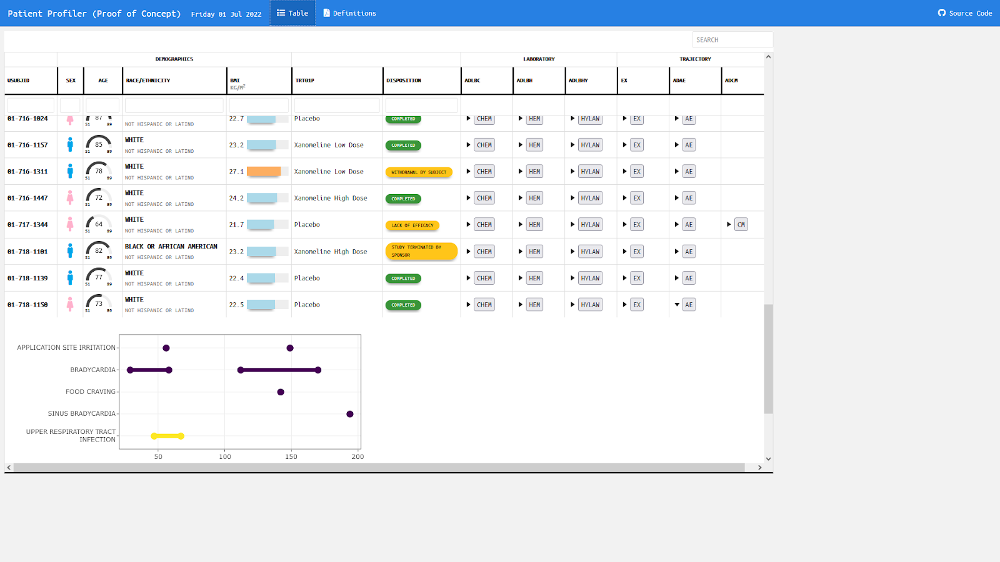
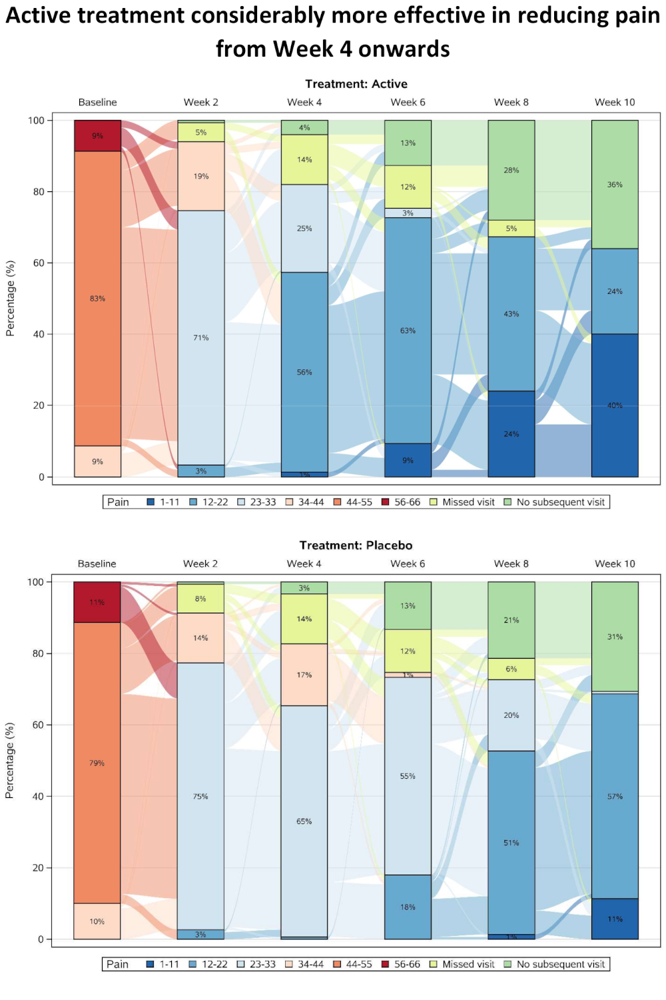

# Visualisation SIG Showcase
In this entry, you can find the visualisations presented on our poster at the PSI conference 2023 together with a summary of the discussion we had when the visualisations were presented in our Wonderful Wednesday Webinars and the programming code.

<a id="example1"></a>

## Example 1. Grable

  
The app can be found [here](https://agstn.github.io/PatientProfiler/PatientProfiler.html).  

This table with embedded graphics is giving an overview over all subjects with the option to expand and collapse additional information. Demographic data are displayed in symbols, gauge charts, text, color coded bar charts, or color supported descriptive text respectively. Population ranges are given as gray background where possible.

[link to code](#example1 code)


<a id="example2"></a>

## Example 2. Distribution plot by category I

  
[high resolution image](./images/reliable_clinical_change_plot_red_green_v0_2 - Mike Greenwood.png)  

This graph includes stacked density plots, sometimes known as a ridgeline plot. This graph type is useful where there are approximately 4-8 categories with a natural ordering, which is the case in this example. The graph is also showing patient level data as transparent dots on the X axis, and reference lines have been added. There is a lot of overplotting of the dots, so the opacity of dots is representing the data density at each value on the X-axis.

A title has been added to give a clear interpretation of the overall message.

[link to code](#example2 code)

<a id="example3"></a>

## Example 3. Dashboard Trelliscope


The app can be found [here](https://agstn.github.io/CGM/)  

This is a lot more than just a visualization. It is a very comprehensive tool to do an exhaustive exploratory analysis of the data.

In the first tab ("AGP"), we see individual patient data including individual profile plots over time. This is very helpful if you want to focus on specific patients. The level of information increases from top to bottom. In the first row, we see a summary over all data for this patient. The next row shows a summary over all days. And the last rows provides the user with individual patient profile plots.

In the second tab ("MODEL RESULTS"), we see a visualization of model results to detect clusters in the CGM values. The goal was to detect differences between clusters in regards to the time spent in the standardized glycemic ranges. The visualization helps the user to easily understand the results.

The last tab ("OTHER METRICS") follows a similar idea as the second tab. The clustering can be done based on other variables in a flexible way. This makes this a very powerful tool with many options.

The whole tool comes with a lot of explanations and with clickable references.

The panel thinks that this is a great and very powerful app to do a thorough exploratory data analysis.

[link to code](#example3 code)


<a id="example4a"></a>

## Example 4a. Histograms

  

[high resolution image](./images/Histogram - Samah Abdelaal.jpeg)  

This example shows four histograms which nicely display the distributions of responses for the different treatment groups and the different time points. Overall it is a very clean design with minimal clutter, no unnecessary tick-marks and the gridlines very much in the background. Again, this example makes it easy to get an impression of the treatment effect, with a clear 'shift' between time points for the active treatment.

Whilst the current layout with the columns corresponding to treatment and rows corresponding to time allows us to easily see this shift, it goes against our intuition which is to think of changes in time happening along the horizontal axis. Switching the rows and columns may be more in line with what we naturally expect to see.

There are a couple of issues with this example that the group felt could be easily addressed. Firstly, given that DLQI scores can only be equal to natural numbers, a bin width of one would be more suitable. Otherwise, as is the case with the current bin width, some bars correspond to only one DLQI score whereas others correspond to more than one. This results in the misleading 'up and down' nature of the histograms. Further, there should be more consistency between the y-axes on the top and bottom panels. The change in axes in the current example gives an impression of 'squashing' for placebo when actually there was not a great deal of change.

Overall, the group felt that this example only needed some easily implemented changes to become a really nice visualisation, and thought this was a great opportunity to highlight how some of these changes may look, as displayed in the next example.

[link to code](#example4a code)


<a id="example4b"></a>

## Example 4b. Histograms updated

  

[high resolution image](./images/hysto2c.png)  

Here we see a really effective visualisation which has been produced with only minimal additional work to the previous example. Firstly, we see that a more appropriate and telling title has been used and a footnote has been added to aid in interpretation for those individuals who are unfamiliar with the DLQI. We also see that the layout has been changed with changes in time occurring horizontally as we expect to see.

Different colours have also been used to allow the two treatment groups to be easily distinguished, and the titles have been coloured accordingly. Consistent spacing has been used on the vertical axes to allow for easy comparisons, and these axes now represent percentages rather than counts to allow for more meaningful comparison between the imbalanced treatment groups. There was some discussion amongst the group regarding the fact that lower panel is shorter, but there were no strong feelings about this given that the spacing on the vertical axes is consistent.

Probably the biggest improvement here, though, is that a bin width of one has now been used. This simple change allows the histograms to be interpreted in a much more meaningful way for a score that can only take values in the natural numbers.


[link to code](#example4b code)


<a id="example5"></a>

## Example 5. Upset Plot


[high resolution image](./images/plot04.png)  

This is a useful plot for displaying frequency counts where there is interest in the intersections of different categories, having a similar function to a Venn diagram but being much more practical where there are more than three categories. (It will always be possible to produce an Upset plot, regardless of the number of categories, whereas a Venn diagram quickly becomes impossible to produce or interpret beyond 4 or 5 categories.) The vertical bar chart shows the size of the various intersections (which is highlighting that Nausea and Vomiting is the most frequently-occurring pair of terms), and the horizontal bar chart shows the frequency of each individual category (showing that overall, Nasopharyngitis, Nausea and Vomiting are the most frequent, with a dramatic drop-off in the frequencies of other terms).

The plot requires a fair amount of explanation, and would work well with stakeholders who are already familiar with the format. It wouldn't work so well at a conference, for example, where there isn't the opportunity to explain the graph. Improved labelling (e.g. interpretation of "Intersection Size") would make the graph easier to understand.

Where there is a large number of categories (as in this example), displaying all of the combinations of categories is limited by the display area of the plot. In this case a "cut-off" has been applied to limit to an intersection size of 20. Ideally the graph would include interactivity, to allow the user to define which categories are displayed. In addition, the aspect ratio is challenging to display in a landscape screen, so flexibility in the layout of the various charts would be useful.


[link to code](#example5 code)


<a id="example6"></a>

## Example 6. Sankey Diagram

  
The pdf file can be found [here](./images/Missing Sankey - David Carr.pdf).

This plot presents pain scores, which have been categorised and summarised over time separately for the two treatment groups. Categorisation allows missing data categories to also be included alongside the efficacy data, with separate categories for single missing visits and monotone missing values (dropouts). A Sankey Diagram is effective in showing shifts between categories at the individual patient level, and in this case a subset of visits has been included to allow the flows to be seen more easily (although this has also created some issues with interpreting the “no subsequent visit” category).

As well as showing overall trends, the graph provides insights into the pain scores that preceded withdrawal from the study. The results are showing a rapid improvement in both treatment groups at the start of the study, possibly due to regression to the mean resulting from study inclusion criteria selecting a cohort of patients with relatively high baseline pain score.


[link to code](#example6 code)


# Code

<a id="example1 code"></a>

## Example 1. Grable

No code has been submitted.


[Back to blog](#example1)


<a id="example2 code"></a>

## Example 2. Distribution plot by category I

```{r, echo = TRUE, eval=FALSE}
WW_data <- read.csv("WWW_example_minimal_clinical_improvement_stats.csv")

library(tidyverse)
library(ggplot2)
library(ggridges)
library(dplyr)
library(gt)
library(psych)

#####
#1 - calculate SEM 
#The Standard Error of Measurement (SEM) quantifies 
#the precision of the individual measurements 
#and gives an indication of the absolute reliability

#2 - calculate SDC
#The SEM can be used to calculate the Minimal Detectable Change (MDC)
#which is the minimal amount of change that a measurement 
#must show to be greater than the within subject variability
#and measurement error, also referred to as the sensitivity to change

pre_post <- WW_data[,c(1:2)]
sd_baseline <- sd(WW_data$total.score.baseline, na.rm = T)

icc <- ICC(pre_post)#0.032 - reliability for SEM

sem_baseline <- psychometric::SE.Meas(sd_baseline, 0.032)

#Smallest detectable change(SDC)/Minimal detectable change (MDC)
#SEM*1.92*sqrt(2)
sdc <- sem_baseline*1.96*sqrt(2)
sdc_comp <- sdc*-1

WW_data <- rename(WW_data, baseline = total.score.baseline, followup = total.score.follow.up, CGI = CGI.I)
WW_data <- within(WW_data, CHG <- followup-baseline)
WW_data <- within(WW_data, {
            CGI_cat <- NA
            CGI_cat[CGI==1] <- "Very much improved"
            CGI_cat[CGI==2] <- "Much improved"
            CGI_cat[CGI==3] <- "Minimally improved"
            CGI_cat[CGI==4] <- "No change"
            CGI_cat[CGI==5] <- "Minimally worse"
            CGI_cat[CGI==6] <- "Much worse"
            CGI_cat[CGI==7] <- "Very much worse"
            })

WW_data <- WW_data <- WW_data %>% 
  filter(!is.na(CGI_cat))

WW_data$CGI_cat <- factor(WW_data$CGI_cat, levels = c("Very much improved",
                                   "Much improved",
                                   "Minimally improved",
                                   "No change",
                                   "Minimally worse",
                                   "Much worse",
                                   "Very much worse"
                                   ))

gg <- ggplot(WW_data, aes(x = CHG, 
                    y = CGI_cat)) +
  stat_density_ridges(
    geom = "density_ridges_gradient",
    quantile_lines = TRUE,
    quantiles = 2, scale = 1, rel_min_height = 0.01,
    jittered_points = TRUE) +
  scale_x_continuous(breaks=seq(-40,40,10),
                     limits = c(-40,40)) +
  ylab("CGI-I Response") + xlab("Change in PRO Score") +
  labs(title = "Minimally Improved & Minimally Worse CGI-I Categories\nAre Not Differentiated From No change",
       subtitle = "Smoothed Distributions with Individual Patients (dots) and Means (|) \nReference Lines Display Smallest Detectable Change of PRO Score",
       caption = "Smallest Detectable Change defined by Standard Error of Measurement of PRO Score at Baseline") +
  theme(
    plot.title = element_text(color = "black", size = 15),
    plot.subtitle = element_text(color = "black", size = 10),
    plot.caption = element_text(color = "black", size = 8)
  )

#theme_ridges(font_size = 12)

#Build ggplot and extract data
d <- ggplot_build(gg)$data[[1]]

# Add geom_ribbon for shaded area
rcc <- gg +
  geom_ribbon(
    data = transform(subset(d, x >= sdc), CGI_cat = group),
    aes(x, ymin = ymin, ymax = ymax, group = group),
    fill = "red",
    alpha = 0.2, 
    show.legend = TRUE) +
  geom_ribbon(
    data = transform(subset(d, x <= sdc_comp), CGI_cat = group),
    aes(x, ymin = ymin, ymax = ymax, group = group),
    fill = "green",
    alpha = 0.2,
    show.legend = TRUE) +
  geom_vline(xintercept =sdc, linetype="dashed") +
  geom_vline(xintercept =sdc_comp, linetype="dashed")+
  annotate("segment", x = -15, xend = -35, y = 0.7, yend = 0.7, colour = "black", size=0.5, arrow=arrow(length = unit(0.03, "npc"))) +
  annotate("segment", x = 15, xend = 35, y = 0.7, yend = 0.7, colour = "black", size=0.5, arrow=arrow(length = unit(0.03, "npc"))) +
  geom_text(aes(x = -30, y = 0.45, label = "Improvement"), 
             hjust = 0, 
             vjust = 0,
             colour = "black", 
             size = 2.5) +
  geom_text(aes(x = 20, y = 0.45, label = "Deterioration"), 
            hjust = 0, 
            vjust = 0,
            colour = "black", 
            size = 2.5) + 
  ylab("CGI-I Response") + xlab("Change in PRO Score")
  
  
ggsave("reliable_clinical_change_plot_red_green_v0_2.png", plot = rcc, device = png)
```


[Back to blog](#example2)


<a id="example3 code"></a>

## Example 3. Dashboard Trelliscope

The Rmd file can be found [here](https://github.com/agstn/CGM/blob/main/index.rmd) and [here](./code/index - Agustin Calatroni.rmd).  
The full code can be found [here](https://github.com/agstn/CGM).

[Back to blog](#example3)


<a id="example4a code"></a>

## Example 4a. Histrograms
```{r, echo = TRUE, eval=FALSE}
# Load data
dql <- read.csv("ww2020_dlqi.csv")
attach(dql)
View(dql)
summary(dql)

# Load Library
library(tidyverse)
library(ggplot2)
library(ggthemes)
library(ggcharts)

# Select relevant variables
dql_renamed <-
  dql %>%
  select(
    TRT, VISIT, DLQI_SCORE
    )

# Rename treatment levels
dql_renamed$TRT[dql_renamed$TRT=="A"] <- "Placebo"
dql_renamed$TRT[dql_renamed$TRT=="B"] <- "Active Treatment"

# Seperate visits

# Baseline visit
totalbaseline <- 
  dql_renamed %>% 
  filter(VISIT=="Baseline")

# Construct a histogram for each treatment arm at baseline visit
(d <- 
  ggplot(
    data = totalbaseline,
    aes(
      x = DLQI_SCORE
      ))
  + geom_histogram(
    binwidth = 1.5,
    color = "grey",
    fill = "deeppink3"
    ) +
  facet_grid(~ TRT)
  + theme_ng(grid = "X")
  + labs(
    x = "DLQI Score",
    y = "Count",
    title = "Total DLQI Score",
    subtitle = "At Baseline",
    caption = "Samah Abdelaal")
  + theme(
    axis.title.x = element_blank(),
    plot.title = element_text(size = 20,
                              face = "bold"),
    plot.subtitle = element_text(size = 18),
    plot.caption = element_text(size = 15,
                                face = "bold.italic")
    ))


# Week 16 visit
totalweek16 <- 
  dql_renamed %>% 
  filter(VISIT=="Week 16")

(e <- 
  ggplot(
    data = totalweek16,
    aes(
      x = DLQI_SCORE
      )
    )
  + geom_histogram(
    binwidth = 1.5,
    color = "grey",
    fill = "deeppink3"
    ) +
  facet_grid(~ TRT)
  + theme_ng(grid = "X")
  + labs(
    x = "DLQI Score",
    y = "Count",
    subtitle = "At Week 16"
    ) +
  theme(
    plot.subtitle = element_text(size = 18)
    ))

# Compine plots
library(gridExtra)

gridExtra::grid.arrange(d, e, nrow = 2)
```

[Back to blog](#example4a)


<a id="example4b code"></a>

## Example 4b. Histrograms updated

```{r, echo = TRUE, eval=FALSE, python.reticulate = FALSE}
# Load data
dql <- read.csv("O:\\1_Global_Biostatistics\\Biostatistics Innovation Center\\BIC Project - Subgroup Analyses\\Screening\\R-Package\\Supports\\WW\\ww2020_dlqi.csv")
attach(dql)
View(dql)
summary(dql)

# Load Library
library(tidyverse)
library(ggplot2)
library(ggthemes)
library(ggcharts)

# Select relevant variables
dql_renamed <-
  dql %>%
  select(
    TRT, VISIT, DLQI_SCORE
    )

# Rename treatment levels
dql_renamed$TRT[dql_renamed$TRT=="A"] <- "Placebo"
dql_renamed$TRT[dql_renamed$TRT=="B"] <- "Active Treatment"

# Seperate treatments

# Active
totalB <- 
  dql_renamed %>% 
  filter(TRT=="Active Treatment")

# Construct a histogram for each treatment arm at baseline visit
(d <- 
  ggplot(
    data = totalB,
    aes(
      x = DLQI_SCORE
      ))
  + geom_histogram(
    binwidth = 1,
    color = "grey",
    fill = "deeppink3"
    ) +
  facet_grid(~ VISIT)
  + theme_ng(grid = "X")
  + labs(
    x = "Total DLQI Score",
    y = "Patients",
    title = "Improved Quality of life after 16 weeks of treatment",
    subtitle = "Active Treatment")
  + theme(
    axis.title.x = element_blank(),
    axis.text.x = element_blank(),
    plot.title = element_text(size = 17,
                              face = "bold"),
    plot.subtitle = element_text(size = 15, color = "deeppink3")
    ))


# Week 16 visit
totalA <- 
  dql_renamed %>% 
  filter(TRT=="Placebo")

(e <- 
  ggplot(
    data = totalA,
    aes(
      x = DLQI_SCORE
      )
    )
  + geom_histogram(
    binwidth = 1,
    color = "grey",
    fill = "green4"
    ) +
  facet_grid(~ VISIT)
  + theme_ng(grid = "X")
  + labs(
    x = "Total DLQI Score",
    y = "Patients",
    subtitle = "Placebo",
    caption = "Lower score equals better quality of life"
    ) +
  theme(
    strip.text.x = element_blank(),
    plot.subtitle = element_text(size = 15, color = "green4"),
    plot.caption = element_text(size = 12,
                                face = "italic")
    ))

# Compine plots
library(gridExtra)

gridExtra::grid.arrange(d, e, nrow = 2, heights = c(1.5,1))
```

[Back to blog](#example4b)


<a id="example5 code"></a>

## Example 5. Upset Plot

```{r, echo = TRUE, eval=FALSE}
# packages
pacman::p_load(tidyverse, rio)
pacman::p_load(labelled)
# devtools::install_github("krassowski/complex-upset")
library(ComplexUpset)

# import & recode ID & sort
ae <- import("https://raw.githubusercontent.com/VIS-SIG/Wonderful-Wednesdays/master/data/2020/2020-09-09/2020-09-09-fake-data_aes.csv") %>% 
   mutate(id = str_remove(Subject,"FAKE-DATA-") %>% 
             as.numeric(), 
          .after = Subject) %>% 
   arrange(id)

# 1 Duplicate
ae   %>% filter(id == 10084) %>% filter(`Adverse Event` == "Diarrhea")

# Remove Duplicate
ae <- ae %>% 
   distinct()

# export fixed file
ae %>% 
   export("C:/R/Wonderful-Wednesdays/2020-09-09/2020-09-09-fake-data_aes.csv.rds")

# extend to all days between adverse events
ae_l <- ae %>% 
   select(-Subject) %>% 
   pivot_longer(cols = 2:3,
                values_to = "day") %>% 
   group_by(id, `Adverse Event`, `Treatment`, System, Severity, Sex ) %>% 
   complete(day = seq(min(day), max(day), by = 1)) %>% 
   select(-name) %>% 
   ungroup() %>% 
   arrange(id, day)

# Add variables to wide data
ae_w2 <- ae_l %>% 
   select(id, day, Sex, Treatment, Severity, `Adverse Event`) %>%
   mutate(value = 1) %>%
   pivot_wider(id_cols = c("id","day","Treatment","Sex"),
               names_from = "Adverse Event",
               values_from = "value",
               values_fill	= 0) %>% 
   mutate(Treatment = factor(Treatment, labels = c("A","B")))
# You cannot do the analysis using severity because at each day there can be diverse severerities for
# different AE's overalapping

# Figure 2.1
upset(
   data = ae_w2,
   intersect = names(ae_w2)[-c(1:4)],
   min_size = 20,
   width_ratio = 0.25,
   height_ratio = 1,
   name  = NULL,
   queries=list(
      upset_query(
         intersect=c("Nausea","Vomiting"),
         color=  "#E41A1C",
         fill  =  "#E41A1C",
         
         only_components=c('intersections_matrix', 'Intersection size')
      )
   ),
   annotations = list(
      'Intersection Size\n(Treatment %)' = list(
         aes = aes(x=intersection, fill=Treatment ),
         geom = list(
            geom_bar(stat='count', position='fill'),
            geom_hline(yintercept = 0.5, col='gray90'),
            scale_y_continuous(labels=scales::percent_format()),
            scale_fill_brewer(palette = "Dark2")
         )
      ),
      'Intersection Size\n(Sex %)' = list(
         aes = aes(x=intersection, fill=Sex),
         geom = list(
            geom_bar(stat='count', position='fill'),
            geom_hline(yintercept = 0.5, col='gray90'),
            scale_y_continuous(labels=scales::percent_format()),
            scale_fill_manual(values = c("#E78AC3","#8DA0CB"))
         )
      )
   ),
   themes=upset_modify_themes(
      list('overall_sizes'= theme(axis.ticks.x = element_line()))
   )
) +
   labs(title = 'Co-Occurence of Daily AE Symptoms',
        caption = 'Symptoms with more than 20 days by Frequency: Total pool is 148 individuals for 2575 Daily AE Symptoms \n Lex, Alexander, et al. "UpSet: visualization of intersecting sets." IEEE transactions on visualization and computer graphics 20.12 (2014): 1983-1992.') +
   ggsave("C:/R/Wonderful-Wednesdays/2020-09-09/UpSet_plot.png",
          width = 11, height =10, units = "in")

```

[Back to blog](#example5)


<a id="example6 code"></a>

## Example 6. Sankey Diagram

The sas file can be found [here](./code/missing_sankey - David Carr.sas).

[Back to blog](#example6)