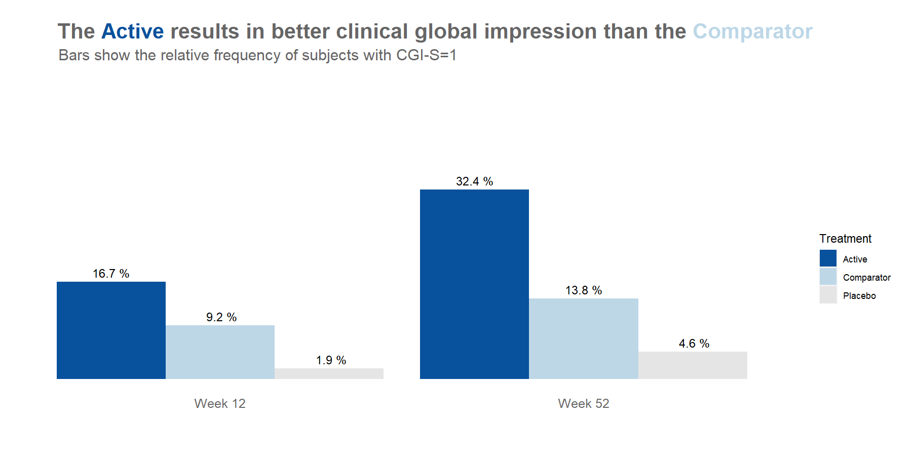
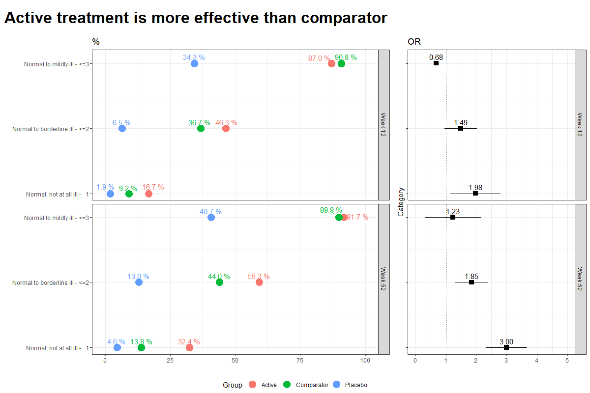
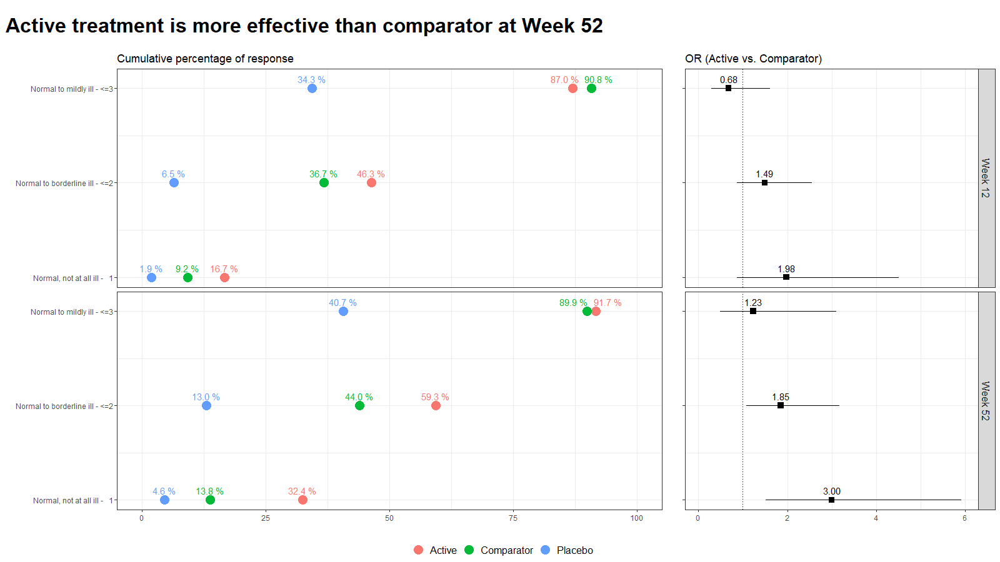

# Clinical Global Impression Data Challenge
The clinical global impression – severity scale (CGI-S) is a 7-point scale that requires the clinician to rate the severity of the patient's illness at the time of assessment, relative to the clinician's past experience with patients who have the same diagnosis. The challenge was to provide data visualisations to show this data and also to provide comparisons between the different groups (e.g. based on response differences or odds ratios for the different response categories) using Clinical Global Impression Data.

A recording of the session can be found [here](https://www.psiweb.org/vod/item/psi-vissig-wonderful-wednesday-39-cgi-s-categories).

<a id="example1"></a>

## Example 1. Barplot

  
[high resolution image](./images/barplot_1.png)  
  
[high resolution image](./images/barplot_2.png)  
  
[high resolution image](./images/barplot_3.png)  


[link to code](#example1 code)


<a id="example2"></a>

## Example 2. Line graphs

  
[high resolution image](./images/Visualisation Week12vs.52_Zara.png)  


[link to code](#example2 code)

<a id="example3"></a>

## Example 3. Cumulative distribution plot I

  
[high resolution image](./images/cdp.png)  


[link to code](#example3 code)

<a id="example4"></a>

## Example 4. Cumulative distribution plot II

  
[high resolution image](./images/CDF_Week12vs.52_Zara.png)  
  
[high resolution image](./images/CDF_Week12vs.52_Updated.png)  


[link to code](#example4 code)


<a id="example5"></a>

## Example 5. Lollipop/forest plot

  
[high resolution image](./images/lollipop_forest - Paolo Eusebi.png)  

  
[high resolution image](./images/dotplot - Paolo Eusebi.png)  


[link to code](#example5 code)


# Code

<a id="example1 code"></a>

## Example 1. Barplot

```{r, echo = TRUE, eval=FALSE}
plot.fun <- function(dat, name, v.just = 1.5, gci.s = "<=3", y.max = 100,
                     title.text = "The <span style = 'color: #08519C'>Active</span> and
         <span style = 'color: #BDD7E7'>Comparator</span> result in similar clinical global impression",
                     col.ann = c(rep(c("black", "black", "white"), 2)),
                     title.h.just = 0.6) {
  require(ggplot2)
  require(ggtext)
  ggplot(dat, aes(y=Value, x=VISITNUM, fill=Treatment)) + 
    geom_bar(position="dodge", stat="identity") +
    ylab("") + xlab ("") +
    ylim(-12, y.max) +
    theme(panel.grid.major = element_blank(), panel.grid.minor = element_blank(),
          panel.background = element_blank(), axis.line = element_blank(),
          axis.ticks = element_blank(),# axis.text = element_text(size = 12),
          axis.text.x = element_blank(),
          axis.text.y = element_blank(),
          plot.subtitle = element_text(size = 15, color = "grey40", hjust = 0.14),
          plot.caption = element_text(color = "grey60", size = 12, hjust = 0.85),
          plot.title = element_markdown(color = "grey40", size = 20,
                                        face = "bold", hjust = title.h.just),
          plot.margin = margin(0.3, 0.2, -0.38, -0.2, "in")) +
    annotate("text", x=1, y=-4, label= "Week 12", size = 4.25, color = "grey40") +
    annotate("text", x=2, y=-4, label= "Week 52", size = 4.25, color = "grey40") +
    # annotate("text", x=3, y=-4, label= "Week 24", size = 4.25, color = "grey40") +
    # annotate("text", x=2.27, y=-12,
    #          label= "Good glycemic control is defined as Glucose values within a range of 72 and 140 mg/dL.",
    #          size = 3.5, color = "grey60") +
    scale_fill_manual(breaks = c("Active", "Comparator", "Placebo"),
                      values = c(brewer.pal(n = 5, name = "Blues")[c(5, 2)], "grey90")) +
    geom_text(aes(label=val.t), vjust = v.just, size = 4, position = position_dodge(.9),
              col = col.ann) +
    labs(title = title.text,
         subtitle = paste0("Bars show the relative frequency of subjects with CGI-S", gci.s))#,
  # caption = "Good glycemic control is defined as Glucose values within a range of 72 and 140 mg/dL.")
  ggsave(name, width = 12, height = 6, units = "in", dpi = 150)
}

dat <- read.csv("CGI_S_3_groups_csv.csv")
dat$X1 <- (dat$X1 + dat$X2 + dat$X3) / dat$Total.sample.size * 100
# dat$X1 <- (dat$X1) / dat$Total.sample.size * 100
dat <- dat[, 1:3]
names(dat) <- c("VISITNUM", "Treatment", "Value")
dat$val.t <- paste(format(round(dat$Value, 1), nsmall = 1), "%")
dat$VISITNUM <- as.factor(dat$VISITNUM)
plot.fun(dat, "barplot_3.png")

dat <- read.csv("CGI_S_3_groups_csv.csv")
dat$X1 <- (dat$X1 + dat$X2) / dat$Total.sample.size * 100
# dat$X1 <- (dat$X1) / dat$Total.sample.size * 100
dat <- dat[, 1:3]
names(dat) <- c("VISITNUM", "Treatment", "Value")
dat$val.t <- paste(format(round(dat$Value, 1), nsmall = 1), "%")
dat$VISITNUM <- as.factor(dat$VISITNUM)
plot.fun(dat, "barplot_2.png", gci.s = "<=2", y.max = 70,
         title.text = "The <span style = 'color: #08519C'>Active</span> results
         in better clinical global impression than the
         <span style = 'color: #BDD7E7'>Comparator</span>",
         title.h.just = 1.25)

dat <- read.csv("CGI_S_3_groups_csv.csv")
dat$X1 <- (dat$X1) / dat$Total.sample.size * 100
# dat$X1 <- (dat$X1) / dat$Total.sample.size * 100
dat <- dat[, 1:3]
names(dat) <- c("VISITNUM", "Treatment", "Value")
dat$val.t <- paste(format(round(dat$Value, 1), nsmall = 1), "%")
dat$VISITNUM <- as.factor(dat$VISITNUM)
plot.fun(dat, "barplot_1.png", v.just = -0.5, gci.s = "=1", y.max = 50,
         title.text = "The <span style = 'color: #08519C'>Active</span> results
         in better clinical global impression than the
         <span style = 'color: #BDD7E7'>Comparator</span>",
         col.ann = c(rep(c("black", "black", "black"), 2)),
         title.h.just = 1.25)
```


[Back to blog](#example1)


<a id="example2 code"></a>

## Example 2. <Same title as above>

No code has been submitted.


[Back to blog](#example2)


<a id="example3 code"></a>

## Example 3. <Same title as above>

No code has been submitted.

[Back to blog](#example3)


<a id="example4 code"></a>

## Example 4. <Same title as above>

No code has been submitted.

[Back to blog](#example4)


<a id="example5 code"></a>

## Example 5. <Same title as above>

First image:
```{r, echo = TRUE, eval=FALSE}
library(RCurl)
library(dplyr)
library(tidyr)
library(ggplot2)
library(ggrepel)
library(cowplot)
x <-
  getURL(
    "https://raw.githubusercontent.com/VIS-SIG/Wonderful-Wednesdays/master/data/2023/2023-05-10/CGI_S_3_groups_csv.csv"
  )
y <- read.csv(text = x) %>%
  rename(Group = CGI)
y

l <- y %>%
  pivot_longer(cols = X1:X7,
               names_to = "Category",
               values_to = "n") %>%
  mutate(Category = as.numeric(gsub("X", "", Category))) %>%
  group_by(Week, Group) %>%
  arrange(Category) %>%
  mutate(
    CumN = cumsum(n),
    Week = paste("Week", Week),
    CumFreq = CumN / Total.sample.size,
    Freq = n / Total.sample.size,
    `Cumulative %` = round(CumFreq * 100, 1),
    `%` = round(Freq * 100, 1)
  ) %>%
  ungroup() %>%
  group_by(Week, Category) %>%
  arrange(Group, .by_group = T) %>%
  mutate(
    Odds = CumFreq / (1 - CumFreq),
    OR = ifelse(Group == "Active", round(Odds / Odds[2], 2), NA),
    seOR = ifelse(Group == "Active", sqrt(
      1 / CumN + 1 / (Total.sample.size - CumN) + 1 / CumN[2] + 1 / (Total.sample.size[2] -
                                                                       CumN[2])
    ), NA),
    ORlower95CI = ifelse(Group == "Active", round(OR - 1.96 * seOR, 2), NA),
    ORupper95CI = ifelse(Group == "Active", round(OR + 1.96 * seOR, 2), NA)
  )
l

k = 3
labs <- c("Normal, not at all ill -   1",
          "Normal to borderline ill - <=2",
          "Normal to mildly ill - <=3")

p1 <-
  ggplot(data = l[l$Category <= k,], aes(x = `Cumulative %`, y = Category, col =
                                           Group)) +
  geom_point(size = 5) +
  facet_grid(rows = vars(Week)) +
  labs(title = "Cumulative Percentage of response", y = "", x = "") +
  scale_y_continuous(breaks = 1:k, labels = labs) +
  scale_x_continuous(limits = c(0, 100)) +
  theme_bw() +
  theme(legend.position = "none") +
  labs(title = "%") +
  geom_text_repel(aes(label = paste(sprintf(
    "%.1f", `Cumulative %`
  ), "%")),
  nudge_y = 0.1)
p1

legend_b <- get_legend(p1 +
                         guides(color = guide_legend(nrow = 1)) +
                         theme(legend.position = "bottom"))


p2 <-
  ggplot(data = l[l$Category <= k &
                    !is.na(l$OR),], aes(x = OR, y = Category)) +
  geom_point(size = 3, pch = 15) +
  geom_linerange(aes(xmin = ORlower95CI, xmax = ORupper95CI)) +
  geom_vline(xintercept = 1, linetype = 3) +
  facet_grid(rows = vars(Week)) +
  scale_y_continuous(breaks = 1:k, labels = labs) +
  scale_x_continuous(limits = c(0, 5)) +
  theme_bw() +
  theme(legend.position = "none",
        axis.text.y = element_blank()) +
  labs(x = "", title = "OR") +
  geom_text_repel(aes(label = sprintf("%.2f", OR)),
                  nudge_y = 0.1)
p2

plot_row <- plot_grid(p1, p2, nrow = 1, rel_widths = c(2, 1))

title <- ggdraw() +
  draw_label(
    "Active treatment is more effective than comparator",
    fontface = 'bold',
    x = 0,
    hjust = 0,
    size = 24,
  ) +
  theme(plot.margin = margin(0, 0, 0, 7))

p <- plot_grid(title,
               plot_row,
               legend_b,
               ncol = 1,
               rel_heights = c(0.1, 1, 0.05))

p
```

Second image:
```{r, echo = TRUE, eval=FALSE}
library(RCurl)
library(dplyr)
library(tidyr)
library(ggplot2)
library(ggrepel)
library(cowplot)
library(ggtext)
x <-
  getURL(
    "https://raw.githubusercontent.com/VIS-SIG/Wonderful-Wednesdays/master/data/2023/2023-05-10/CGI_S_3_groups_csv.csv"
  )
y <- read.csv(text = x) %>%
  rename(Group = CGI)
y

l <- y %>%
  pivot_longer(cols = X1:X7,
               names_to = "Category",
               values_to = "n") %>%
  mutate(Category = as.numeric(gsub("X", "", Category))) %>%
  group_by(Week, Group) %>%
  arrange(Category) %>%
  mutate(
    CumN = cumsum(n),
    Week = paste("Week", Week),
    CumFreq = CumN / Total.sample.size,
    Freq = n / Total.sample.size,
    `Cumulative %` = round(CumFreq * 100, 1),
    `%` = round(Freq * 100, 1)
  ) %>%
  ungroup() %>%
  group_by(Week, Category) %>%
  arrange(Group, .by_group = T) %>%
  mutate(
    Odds = CumFreq / (1 - CumFreq),
    OR = ifelse(Group == "Active", round(Odds / Odds[2], 2), NA),
    selogOR = ifelse(Group == "Active", sqrt(
      1 / CumN + 1 / (Total.sample.size - CumN) + 1 / CumN[2] + 1 / (Total.sample.size[2] -
                                                                       CumN[2])
    ), NA),
    ORlower95CI = ifelse(Group == "Active", round(exp(log(OR) - 1.96 * selogOR), 2), NA),
    ORupper95CI = ifelse(Group == "Active", round(exp(log(OR) + 1.96 * selogOR), 2), NA)
  )
l

k = 3
labs <- c("Normal, not at all ill -   1",
          "Normal to borderline ill - <=2",
          "Normal to mildly ill - <=3")

p1 <-
  ggplot(data = l[l$Category <= k,], aes(x = `Cumulative %`, y = Category, col =
                                           Group)) +
  geom_point(size = 5) +
  facet_grid(rows = vars(Week)) +
  labs(title = "Cumulative percentage of response", y = "", x = "") +
  scale_y_continuous(breaks = 1:k, labels = labs) +
  scale_x_continuous(limits = c(0, 100)) +
  theme_bw() +
  theme(legend.position = "none",
        strip.text = element_blank()) +
  geom_text_repel(aes(label = paste(sprintf(
    "%.1f", `Cumulative %`
  ), "%")),
  nudge_y = 0.1)
p1

legend_b <- get_legend(p1 +
                         guides(color = guide_legend(nrow = 1)) +
                         theme(legend.position = "bottom",
                               legend.title = element_blank(),
                               legend.text = element_text(size = 12)))
p2 <-
  ggplot(data = l[l$Category <= k &
                    !is.na(l$OR),], aes(x = OR, y = Category)) +
  geom_point(size = 3, pch = 15) +
  geom_linerange(aes(xmin = ORlower95CI, xmax = ORupper95CI)) +
  geom_vline(xintercept = 1, linetype = 3) +
  facet_grid(rows = vars(Week)) +
  scale_y_continuous(breaks = 1:k, labels = labs) +
  scale_x_continuous(limits = c(0, 6)) +
  theme_bw() +
  theme(legend.position = "none",
        axis.text.y = element_blank()) +
  labs(x = "", y="", title = "OR (Active vs. Comparator)") +
  geom_text_repel(aes(label = sprintf("%.2f", OR)),
                  nudge_y = 0.1) +
  theme(strip.text = element_text(size=12))
p2

plot_row <- plot_grid(p1, p2, nrow = 1, rel_widths = c(2, 1))

title <- ggdraw() +
  draw_label(
    "Active treatment is more effective than comparator at Week 52",
    fontface = 'bold',
    x = 0,
    hjust = 0,
    size = 24,
  ) +
  theme(plot.margin = margin(0, 0, 0, 7))

p <- plot_grid(title,
               plot_row,
               legend_b,
               ncol = 1,
               rel_heights = c(0.1, 1, 0.05))
p
```
[Back to blog](#example5)