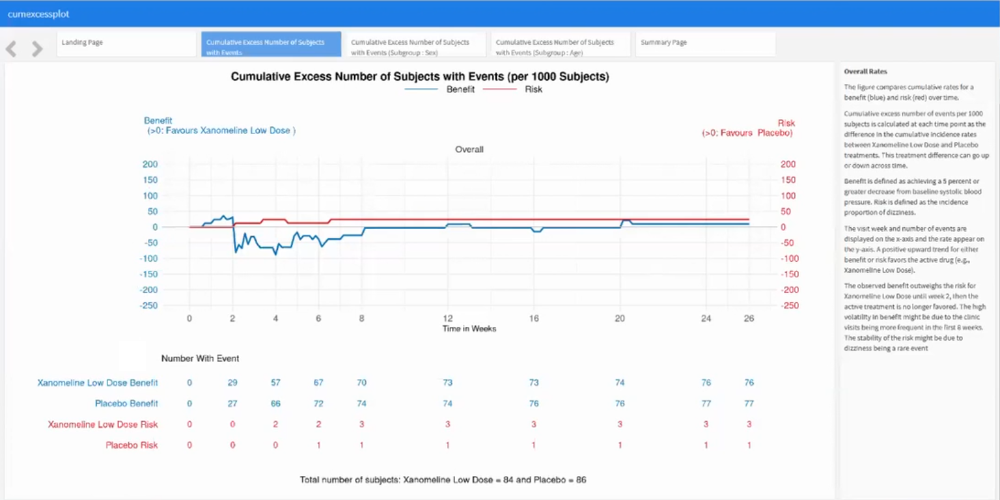

# Benefit-Risk Assessment

For a drug to be approved for marketing, regulatory authorities must determine that the drug is effective and that its expected benefits outweigh its potential risks to patients. An Alzheimer’s Disease drug might have a positive benefit-risk profile for lowering blood pressure. To generate a hypothesis, an exploratory benefit-risk assessment will be conducted.

A description of the challenge can be found [here](https://github.com/VIS-SIG/Wonderful-Wednesdays/tree/master/data/2023/2023-05-10).  
A recording of the session can be found [here](https://www.psiweb.org/vod/item/psi-vissig-wonderful-wednesday-41-benefit-risk-assessment).

## Example 1. <Add a short title>

  
[high resolution image](./images/app.png)  

[link to code](#example1 code)

# Code

## Example 1. <Same title as above>

No code is available.

[Back to blog](#example1)