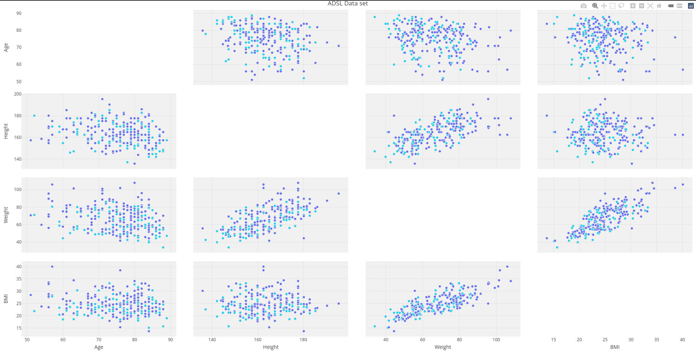
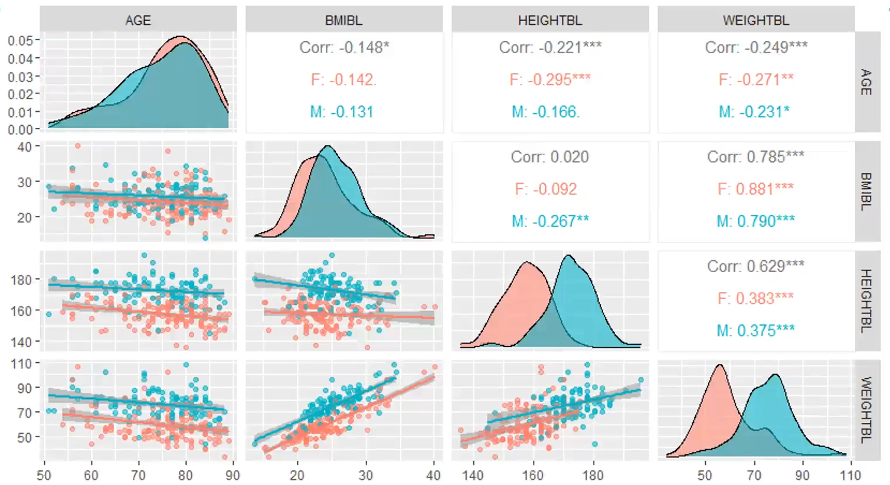
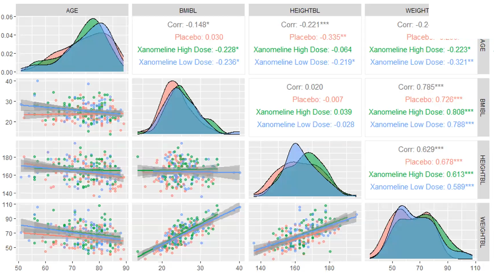

# Demographic data display

The challenge is based on CDISC data. It is a standard ADSL data set for subject level data (demographics and baseline)

A description of the challenge can be found [here](https://github.com/VIS-SIG/Wonderful-Wednesdays/tree/master/data/2023/2023-11-08).  
A recording of the session can be found [here](https://www.psiweb.org/vod/item/psi-vissig-wonderful-wednesday-45-demographic-data-display).

<a id="example1"></a>

## Example 1. Animated density plot

  
[high resolution gif](./images/WW_Dec23_SM01 - Steve Mallett.gif)  

[link to code](#example1 code)


<a id="example2"></a>

## Example 2. Interactive trellis plot (plotly)

  
[interactive version](./images/WW Dec2023b - Steve Mallett.html)  

[link to code](#example2 code)

<a id="example3"></a>

## Example 3. GGally 1

  
[high resolution image](./images/ggally_1.png)  

[link to code](#example3 code)

<a id="example4"></a>

## Example 4. GGally 2

  
[high resolution image](./images/ggally_2.png)  

[link to code](#example4 code)


# Code

<a id="example1 code"></a>

## Example 1. Animated density plot

```{r, echo = TRUE, eval=FALSE, python.reticulate = FALSE}
library(ggplot2)
library(dplyr)
library(tidyr)
library(haven)
library(emojifont)
library(ggtext)

adsl <- read_xpt("adsl.xpt")

adsl2 <- adsl %>%
  mutate(agegp2 = cut(AGE, quantile(AGE, c(0:6/6)))) %>%
  group_by(agegp2) %>%
  arrange(AGE) %>%
  select(agegp2, BMIBL, SEX, AGE) %>%
  mutate(id = as.numeric(substr(agegp2,2,3))) %>%
  drop_na(id)

# Create a vector containing unique values for age group identifier
id <- adsl2 %>%
  group_by(id) %>%
  slice(1) %>%
  select(id) %>%
  unlist() %>%
  as.vector()

for (i in id) {
  
  ADSLloop <- adsl2 %>%
    filter(id == i)
  
  plot <- ggplot(ADSLloop, aes(x = BMIBL, colour = SEX)) +
    geom_density(show.legend = FALSE) +
    geom_text(aes(x=25, y=0.19, label="Age Group:"), size=16, color="#7570b3") +
    geom_text(aes(x=28, y=0.19, label=agegp2), size=16, color="#7570b3") +
    scale_x_continuous("BMI", limits=c(15, 40)) +
    scale_y_continuous("Frequency", limits=c(0, 0.2)) +
    scale_color_discrete(type=c("#1b9e77", "#d95f02")) +
    theme(plot.title = element_markdown(colour = "#636363",
                                        size = 50),
          panel.background=element_rect(fill="white"),
          panel.grid.major=element_line(colour = "#f0f0f0",
                                        linewidth = 0.5,
                                        linetype = 1),
          axis.line=element_line(colour = "#bdbdbd",
                                 linewidth = 0.5,
                                 linetype = 1),
          axis.text=element_text(
            colour = "#636363",
            size = 28),
          axis.title=element_text(
            colour = "#636363",
            size = 32)) +
    labs(title="<b>Distribution of BMI by Sex (<span style='color:#1b9e77'>Female</span> and <span style='color:#d95f02'>Male</span>) and  <span style='color:#7570b3'>Age Group</span></b>") 

  ggsave(
    filename = paste0("frames/plot", sprintf("%03d", i) , ".png"),
    plot = plot,
    device = "png",
    height = 1500,
    width = 2757,
    units = "px"
  )
}

# Additional steps to create animated gif file:
# 1. Install ImageMagick
# 2. Open a command line
# 3. cd to the folder containing the *.png files 
# 4. Enter the following command:
#   magick convert -delay 150 -loop 0 *.png -scale 4800x2700 WW_Dec23_SM01.gif
```


[Back to blog](#example1)


<a id="example2 code"></a>

## Example 2. Interactive trellis plot (plotly)

```{r, echo = TRUE, eval=FALSE}
library(plotly)

adsl <- read_xpt("adsl.xpt")

pl_colorscale=list(c(0.0, '#19d3f3'),
                   c(0.333, '#19d3f3'),
                   c(0.333, '#e763fa'),
                   c(0.666, '#e763fa'),
                   c(0.666, '#636efa'),
                   c(1, '#636efa'))

fig <- adsl %>%
  plot_ly() 
fig <- fig %>%
  add_trace(
    type = 'splom',
    dimensions = list(
      list(label='Age', values=~AGE),
      list(label='Height', values=~HEIGHTBL),
      list(label='Weight', values=~WEIGHTBL),
      list(label='BMI', values=~BMIBL)
    ),
    text=~TRT01P,
    marker = list(
      color = as.integer(adsl$TRT01PN),
      colorscale = pl_colorscale,
      size = 7,
      line = list(
        width = 1,
        color = 'rgb(230,230,230)'
      )
    )
  ) 

fig <- fig %>%
  layout(
    title= 'ADSL Data set',
    plot_bgcolor='rgba(240,240,240, 0.95)'
  )

fig2 <-  fig %>% style(diagonal = list(visible = F))
htmlwidgets::saveWidget(as_widget(fig2), "WW Dec2023b.html")
```


[Back to blog](#example2)


<a id="example3 code"></a>

## Example 3. GGally 1

No code is available.

[Back to blog](#example3)


<a id="example4 code"></a>

## Example 4. GGally 2

No code is available.

[Back to blog](#example4)