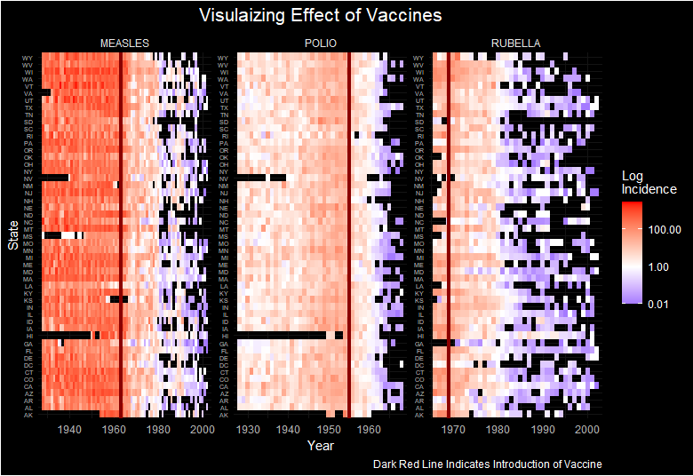
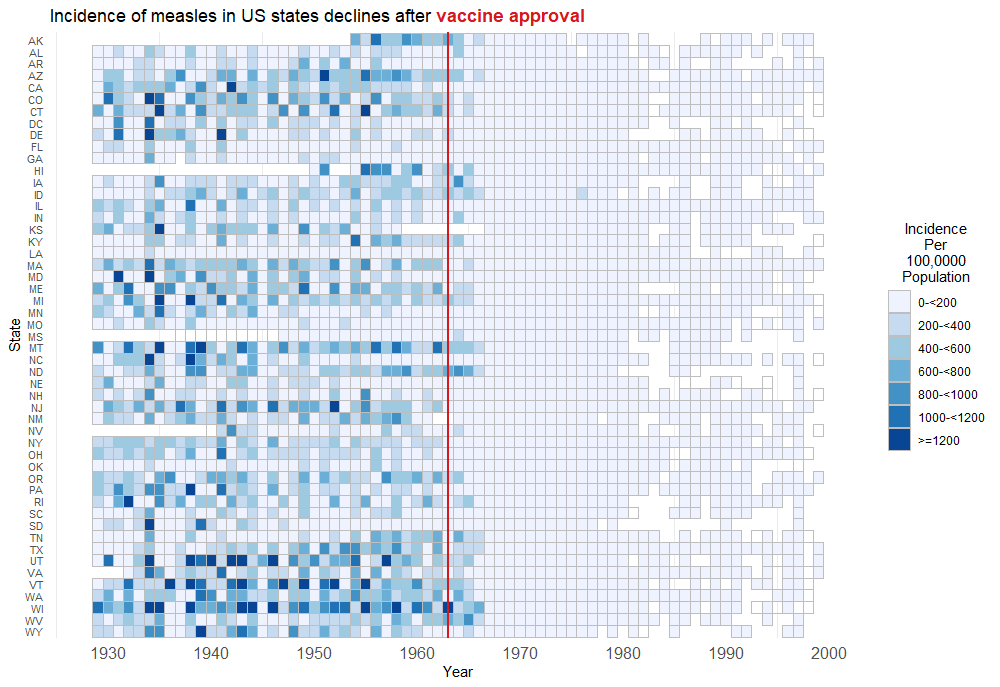

# US Disease Incidence

A description of the challenge can be found [here](https://github.com/VIS-SIG/Wonderful-Wednesdays/tree/master/data/2023/2023-05-10).  
A recording of the session can be found [here](https://www.psiweb.org/vod/item/psi-vissig-wonderful-wednesday-40-us-disease-data).

<a id="example1"></a>

## Example 1. Heatmap 1

  
[high resolution image](./images/USDisease - Naman Agrawal.png)  


[link to code](#example1 code)


<a id="example2"></a>

## Example 2. Heatmap 2

  
[high resolution image](./images/meas_inc - Bodo Kirsch.png)  


[link to code](#example2 code)

<a id="example3"></a>


# Code

<a id="example1 code"></a>

## Example 1. <Same title as above>

```{r, echo = TRUE, eval=FALSE, python.reticulate = FALSE}
library(tidyverse)
library(stringr)
library(lubridate)
library(gridExtra)
library(readr)
library(ggpubr)
library(grid)
library(plotly)
library(ggdark)

df <- read_csv("C:/Users/AW0204TU/Desktop/TidyTuesday/disease_data.csv")

# Records of the year for which each vaccine was introduced
vac_dat <- data.frame(disease = c("MEASLES", "POLIO", "RUBELLA"), 
                      Z = c(1963, 1955, 1969))

df %>%
  na.omit() %>%
  ggplot() +
  geom_tile(aes(x = year, y = state, fill = incidence)) +
  scale_fill_gradient2(trans = "log10", high = "red", low = "blue", 
                       mid = "white", midpoint = 0, na.value = "white") +
  scale_x_continuous(expand = c(0.02, 0.02)) +
  geom_vline(data = vac_dat, aes(xintercept = Z), linewidth = 1.5, color = "darkred") +
  facet_wrap(~disease, scales = "free") +
  dark_theme_minimal() +
  theme(axis.text.y =  element_text(size = 5), 
        plot.title = element_text(hjust = 0.5, size = 16)) +
  labs(y = "State", fill = "Log \nIncidence", x = "Year", 
       title = "Visulaizing Effect of Vaccines",
       caption = "Dark Red Line Indicates Introduction of Vaccine")
```


[Back to blog](#example1)


<a id="example2 code"></a>

## Example 2. <Same title as above>

```{r, echo = TRUE, eval=FALSE}
library(tidyverse)
library(ggtext)

inc <- read_csv('vaccine_data.csv') 

measles <- inc %>%
  filter(disease == "MEASLES") %>%
  mutate(inc_cat = cut(incidence, c(0, 200, 400, 600, 800, 1000, 1200, Inf))) %>%
  mutate(inc_fac = factor(inc_cat)) 

ggplot(data=measles) +
  geom_tile(aes(x=year, y=state, fill=inc_fac), color="gray") +
  scale_x_continuous("Year", breaks=seq(1930, 2010, by=10), limits = c(1928, 2000)) +
  scale_y_discrete("State", limits=rev) +
  geom_vline(xintercept = 1963, size = 1, color = "#d7191c") +
  scale_fill_brewer("Incidence\nPer\n100,0000\nPopulation", 
                    labels=c("0-<200", "200-<400", "400-<600", "600-<800", "800-<1000", "1000-<1200", ">=1200"),
                    na.value = 'white',
                    na.translate = F) +
  labs (title ="Incidence of measles in US states declines after <b style='color:#d7191c;'>vaccine approval</b>")+
  theme_minimal() +
  theme(legend.title.align = 0.5,
        axis.text.x = element_text(size = 12, color = "#525252"),
        axis.text.y = element_text(size = 8, color = "#525252"),
        axis.line.y = element_blank(),
        axis.ticks.y = element_blank(),
        panel.grid.major = element_blank(),
        plot.title = element_markdown())
```


[Back to blog](#example2)