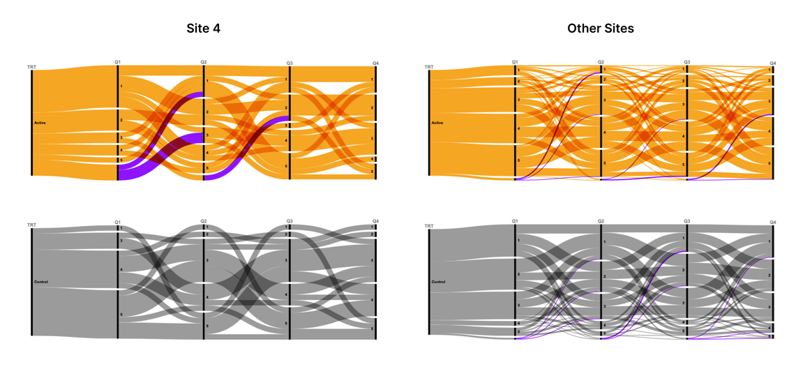
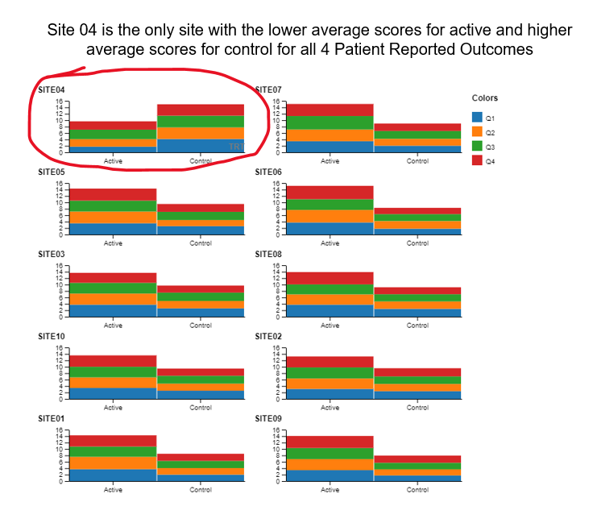

<!-- #renv::install("generics")
#library(generics)
#renv::install("png")
#library(png) -->

# Dirty Data 
  Leverage visual analytics to identify data issues.  Consider 4 questions on a Likert scale.   5 rating levels (Strongly disagree, Disagree, Neutral, Agree, Strongly Agree) coded as 1, 2, 3, 4 and 5, respectively.  The higher the number the better.  400 Subjects (200 active, 200 control).  
  
 --- # The data contains
  - USUBJID: Unique subject identifier to the 400 subjects
  - TRT: Either “Active” (200 patients) or “Control” (200 patients) 
  - Q1-Q4: results from 4 questionnaires evaluated on the Likert scale
  - AGE: age of the patient
  - SEX:  sex of the patient
  - SITE: there are 10 sites numbered accordingly

 --- # Use exploratory visual analytics to identify
 [data points that are not plausible, the SITE where patients were given the wrong instructions and they interpreted the scale wrong and score 1 as 5, 5 as 1, 2 as 4 and 4 as 2]

A recording of the session can be found here: [Link to PSI Video on Demand]
(https://psiweb.org/vod/item/psi-vissig-wonderful-wednesday-43-dirty-data)
<a id="example1"></a>

## Example 1. Alluvial Chart 

  
[high resolution image](./images/alluvial_plot.png)  

A paneled Alluvial plot was used to illustrate that Site 4 is different from the other sites. The panels are by site 4 vs all other sites and within each of these groups they are paneled by treatment:  'Active' and 'Control'.  The dimensions are the results from the 4 questionnaires:  Q1, Q2, Q3 and Q4.  We see that there are consistently higher scores in the Control group and consistently lower scores in the Active group for Site 4 and the pattern is the exact opposite for the other sites, grouped together.  In Site 4 you can see a thin band of scores from people that were consistently 1 across all questionnaires for the Active group and you can see a thing band of scores that were consistently 5 across all questionnaires for the Control group.  You see the exact opposite pattern for all other sites combined.  This is evidence that Site 4 was a visual outlier from the data.

The missing data is included as value in each of the dimensions which is misleading since the data for each result is ordered.  The "NA" at the bottom of the Active group for Site 4 makes it look like there are more answers for the higher numbers (the y-axis is sorted from high to low) when in reality these probably would have been lower scores if they were not missing.  

The data viz was created using a code free, open source, web-based software called [rawgraphs]( https://www.rawgraphs.io/ ) 

<a id="example2"></a>

## Example 2. Histograms 

  
[high resolution image](./images/Julian.png)  

The author correctly identified the site that had incorrect data for all questionnaire data, but it is still a mystery to the panelist how he got this insight since the treatment groups were combined and the difference Site 4 and the other sites essentially averaged out.  The author provided his R markdown code where you can see each site individually. It is still a mystery how he figured it out.

The author also discovered an inadvertent programming error in the program that was used to generate this data set.  Apparently all of the females were under 50 and all of the males were over 50.  See his R Markdown rendered HTML [link rendered R Markdown](.images/PSI---Julian.html)

<!-- [link to code](#example2 code) -->


<a id="example3"></a>

## Example 3. Notebook with Historgram and Side by Side Barchart 

  
This was an exploratory visual analytics example. The author did a histogram of the categorical questionnaire data with large bins.  Histograms are typically applied to continuous data, but for exploratory purposes this meets the needs.  One can clearly see that the data on the row labeled Site 4 is a visual outlier.  

The author finishes the entry by correcting the discovered error and the creating an explanatory data viz using a side by side bar chart visual idiom, which is more appropriate for this type of data.

<!--
The html file of the R Notebook can be found [here](.code/dirty_data.nb.html).


[link to code](#example3 code) -->

<a id="example4"></a>

## Example 4. Stacked Bar Chart 

  
[high resolution image](./images/stacked_bar_chart.png)  

The author uses annotation (circling Site 4 in red) and sorting (Site 4 in the upper left hand corner) to make clear that Site 4 is a visual outlier.  The visual idiom is a stacked bar chart, one color for each questionnaire.  Stacked barcharts are limited when comparing any of the components except the one on the bottom. For the purpose of this data viz challenge, it was only necessary to compare the totals, ie the heights of the stacked bars.  This is easy to do for the stacked bars from a visual perception point of view.  But the colors for the different components (Q1, Q2, Q3 and Q4) can be distracting.

The panelists suggested doing a slope plot to clearly see the difference in patterns between Site 4 and the other sites.

The data viz was created using a code free, open source, web-based software called [rawgraphs]( https://www.rawgraphs.io/ ) 


<a id="example5"></a>

## Example 5.  Slope Plots 

  
[high resolution image](./images/slopes.png)  

This plot was inspired at the live session on October 11th, 2023.  We can clearly see that Site 4 is a visual outlier.  The Active data for Site 4 looks like it belongs with the Control data from the other sites and likewise the Contorl data for Site 4 looks like it belo9ngs with the Active data from the other sites.  Color and a useful title are used to highlight the difference.

[link to code](#example5 code)

# Code

<!-- <a id="example2 code"></a>

 ## Example 2. <Same title as above>


The R Notebook file can be found [here](.code/PSI - Julian.Rmd)

[Back to blog](#example2) 


<a id="example3 code"></a>

## Example 3. <Same title as above>

The R Notebook file can be found [here](.code/dirty_data.Rmd)

[Back to blog](#example3)
-->

<a id="example5 code"></a>

## Example 5. Slope Plot 


```{r, eval=FALSE, echo=TRUE}
## do the slope data viz for active to control by site

#*********#
# DATA    #
# MUNGING #
#*********#
 

  PROdata.slopes <- PROdata.vert %>%
    group_by(SITE, TRT) %>%
    summarise(total.score=sum(result, na.rm=TRUE))
  

#************#
# CREATE THE #
# DATA VIZ   #
#************#

## apply a plot to a data set where this works

  library(ggrepel)

p <- ggplot(PROdata.slopes, aes(
  x = TRT,
  y = total.score,
  group = SITE 
)) +
  geom_line(
    size = 0.75,
    color = "grey" 
  ) +
  geom_point(
    size = 2.5,
    #color = unhcr_pal(n = 1, "pal_blue")
    color = "grey" 
  ) +
  labs(
    title = "Total Scores By Site",
    caption = "Site 04 is Visual Outlier"
  ) +
  geom_text_repel(
    data = PROdata.slopes |> filter(TRT=="Active"),
    aes(label = paste(SITE, TRT,"=", total.score)),
    size = 8 / .pt,
    hjust = 1,
    direction = "y",
    nudge_x = -0.3,
  ) + 
  geom_text_repel(
    data = PROdata.slopes |> filter(TRT=="Control"),
    aes(label = paste(SITE, TRT,"=", total.score)),
    size = 8 / .pt,
    hjust = 1,
    direction = "y",
    nudge_x = 0.5,
  ) +
 ## Make Site 04 appear in blue
  geom_line(
    data=PROdata.slopes |> filter(SITE=="SITE04"),
    size = 0.75,
    color = "blue" 
  ) +
  geom_point(
    data=PROdata.slopes |> filter(SITE=="SITE04"),
    size = 2.5,
    #color = unhcr_pal(n = 1, "pal_blue")
    color = "blue" 
  ) + 
  xlab("Treatment") + ylab("Total Scores (Q1 + Q2 + Q3 + Q4)")

  ggsave(plot=p, ofile("slopes.png"))
```


[Back to blog](#example5)