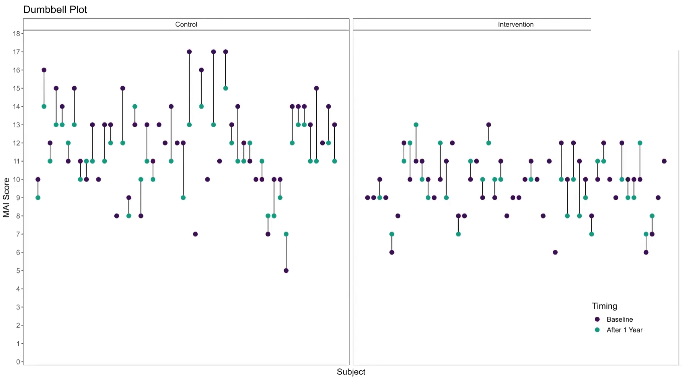
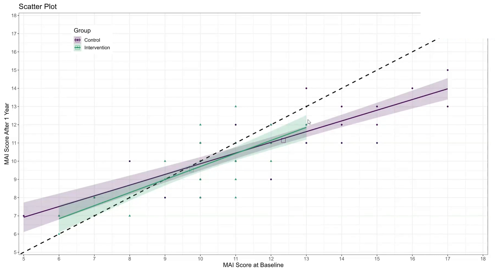
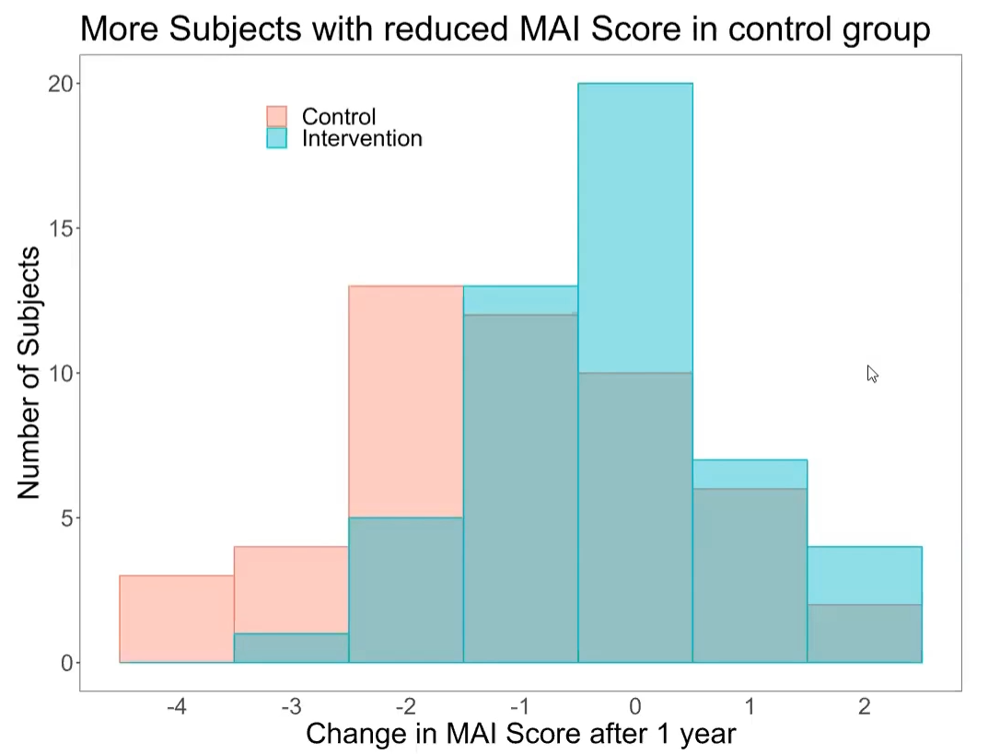

# Treatment effect
The PRIMUM study aimed to improve medication appropriateness in elderly patients with multimorbidity. A complex intervention involving general practitioners (GPs) and their healthcare assistants (HCA) was developed and compared to usual care. Check for a treatment effect on the MAI score after the intervention. Visualize the effect of adjusting the treatment effect for the MAI score at baseline.

A description of the challenge can be found [here](https://github.com/VIS-SIG/Wonderful-Wednesdays/blob/master/data/2023/2023-08-09).  
A recording of the session can be found [here](https://www.psiweb.org/vod/item/psi-vissig-wonderful-wednesday-42-medication-planning).

## Example 1. Line plot

  
[high resolution image](./images/example_1.png)  

[link to code](#example1 code)

## Example 2. Box plot

  
[high resolution image](./images/example_2.png)  

[link to code](#example2 code)

## Example 3. Dumbbell plot 1

  
[high resolution image](./images/example_3.png)  

[link to code](#example3 code)

## Example 4. Dumbbell plot 2

  
[high resolution image](./images/example_4.png)  

[link to code](#example4 code)

## Example 5. Scatter plot

  
[high resolution image](./images/example_5.png)  

[link to code](#example5 code)

## Example 6. Bar chart

  
[high resolution image](./images/example_6.png)  

[link to code](#example6 code)

# Code

## Example 1. Line plot

No code is available.

[Back to blog](#example1)

## Example 2. Box plot

No code is available.

[Back to blog](#example2)

## Example 3. Dumbbell plot 1

No code is available.

[Back to blog](#example3)

## Example 4. Dumbbell plot 2

No code is available.

[Back to blog](#example4)

## Example 5. Scatter plot

No code is available.

[Back to blog](#example5)

## Example 6. Bar chart

No code is available.

[Back to blog](#example6)