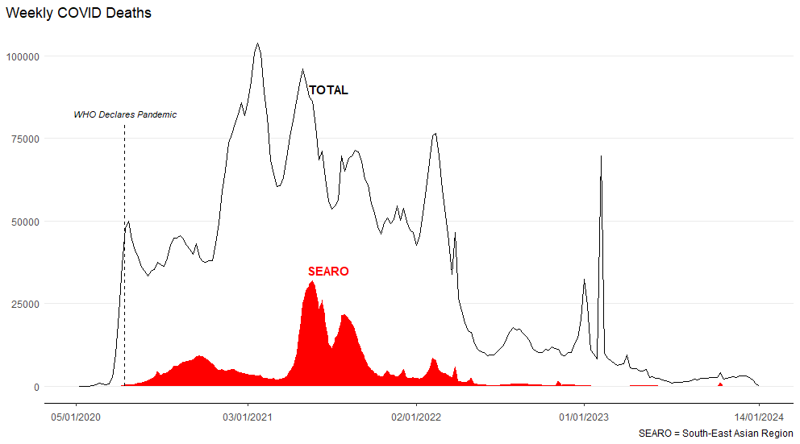
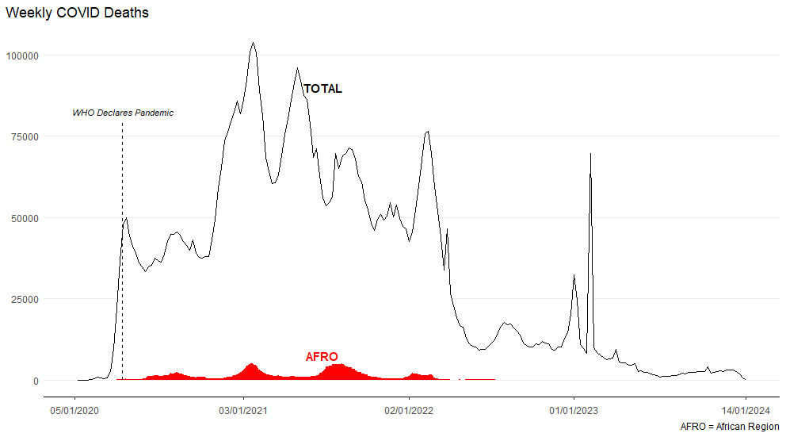
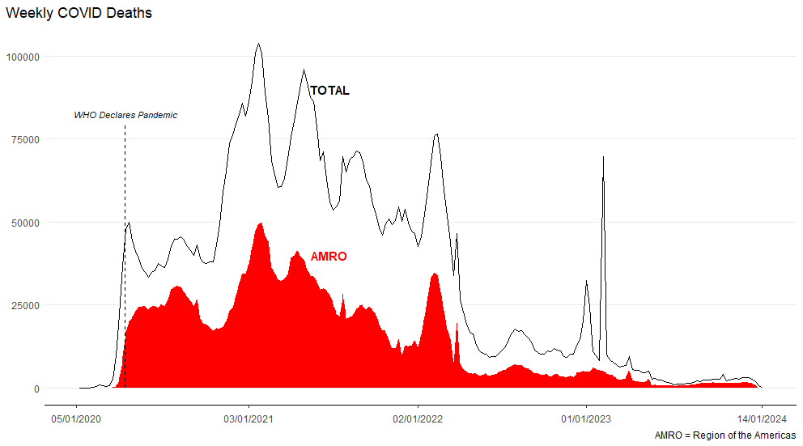
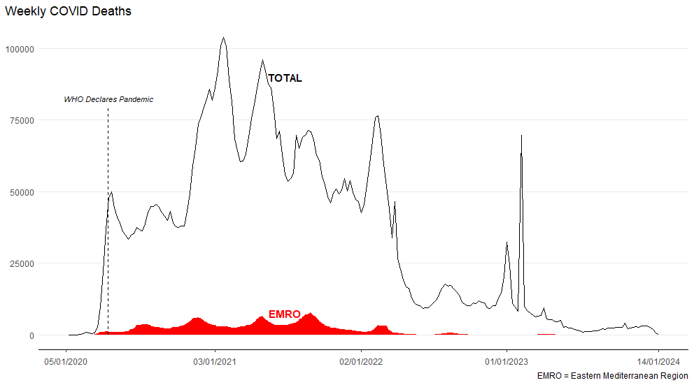
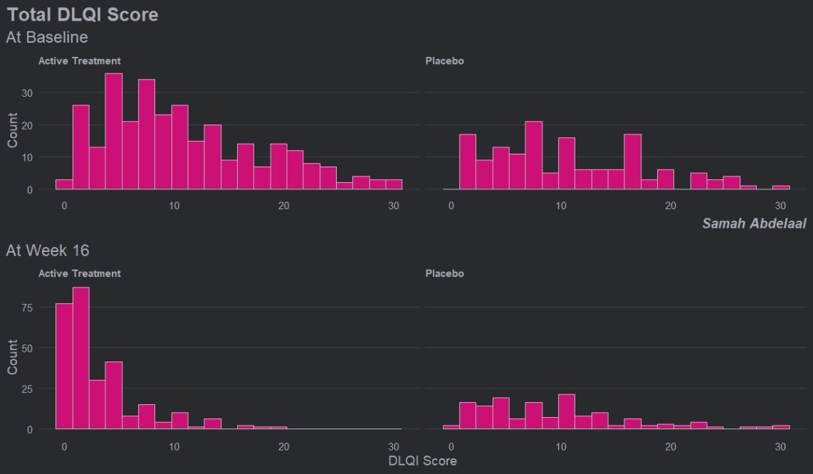
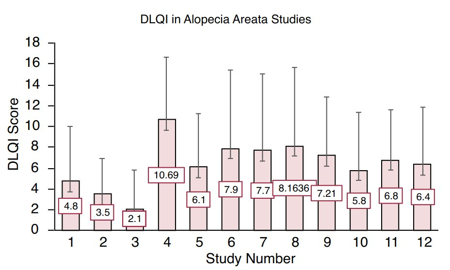

# Improving a plot
Find a plot in a healthcare related publication and improve the visual presentation with only the data available from the publication.

A description of the challenge can be found [here](https://github.com/VIS-SIG/Wonderful-Wednesdays/tree/master/data/2024/2024-01-10).  
A recording of the session can be found [here](https://psiweb.org/vod/item/psi-vissig-wonderful-wednesday-47-improving-a-plot).

<a id="example1"></a>

## Example 1. AEs

Original:

  
[high resolution image](./images/tendril_plot - Agustin Calatroni.png)  

Updated version:

  
The Shiny app can be found [here](https://steve-mallett.shinyapps.io/TendrilPlot/).

[link to code](#example1 code)


<a id="example2"></a>

## Example 2. COVID data

Original:

  
[high resolution image](./images/covid.png)  

Updated version:

  
  
  
  
  
  

The Shiny app can be found [here](https://steve-mallett.shinyapps.io/WWFeb24/).

<a id="example3"></a>

[link to code](#example2 code)


## Example 3. DLQI data I

Original:

  
[high resolution image](./images/dlqi_I.png)  

Updated version:

  
[high resolution image](./images/dlqi_I_updated.png)  

[link to code](#example3 code)


<a id="example4"></a>

## Example 4. DLQI data II

Original:

  

[high resolution image](./images/dlqi_II.png)  
Source: Figure 2 in Muntyanu A, Gabrielli S, Donovan J, Gooderham M, Guenther L, Hanna S, et al. The burden of alopecia areata: A scoping review focusing on quality of life, mental health and work productivity. J Eur Acad Dermatol Venereol. 2023; 37: 1490–1520. https://doi.org/10.1111/jdv.18926

Updated version 1:

  

[high resolution image](./images/dlqi_II_updated_1.png)  

Updated version 2:

  

[high resolution image](./images/dlqi_II_updated_2.png)  

<a id="example5"></a>

[link to code](#example4 code)


# Code


<a id="example1 code"></a>

## Example 1. AEs

No code available.

[Back to blog](#example1)

<a id="example2 code"></a>


## Example 2. COVID data

```{r, echo = TRUE, eval=FALSE}
library(tidyverse)
library(haven)
library(ggplot2)
library(readr)

### Bring in data

# Replacing missing counts with 0 assuming no deaths on dates where
# no deaths reported for purpose of this plot
# Also some negative numbers of deaths reported in plot, assuming
# the negative sign added in error for purpose of this plot
df_raw <- read_csv("WHO-COVID-19-global-data.csv") %>%
  select(Date_reported, WHO_region, New_deaths) %>%
  mutate(New_deaths = ifelse(is.na(New_deaths), 0, abs(New_deaths)))

# Numeric variable for dates in order
# Dataset contains 211 unique dates repeated across 240 countries
df_raw$date_n <- rep(c(1:211), times=240)

# Total counts by region and overall
df_reg <- aggregate(df_raw$New_deaths,
                    by=list(df_raw$date_n, df_raw$WHO_region),
                    FUN=sum)
df_total <- aggregate(df_raw$New_deaths,
                      by=list(df_raw$date_n),
                      FUN=sum) 

### Function for plot

covid_plot <- function(Region, text_y, cap_text){
  
  # Data for other regions - ggplot below will stack 
  # this and data for region to get overall counts
  # (Update - later fill these additional regions in white
  #  so now somewhat redundant)
  df_filt <- df_raw %>% filter(WHO_region != Region)
  
  df_other <- aggregate(df_filt$New_deaths,
                        by=list(df_filt$date_n),
                        FUN=sum) %>%
    mutate(Group.2 = "Other")
  
  # Data for region of interest
  df_red <- df_reg %>% filter(Group.2 == Region)
  
  df <- rbind(df_red, df_other) %>%
    mutate(Group.2_n = as.factor(if_else(Group.2 == "Other", 1, 2)))
  
  outplot <- 
    ggplot() +
    geom_area(data= df, aes(x = Group.1, y = x, 
                            group = Group.2_n, fill = Group.2_n)) + 
    scale_x_continuous(breaks = c(0, 53, 105, 157, 211),
                       labels=c("05/01/2020", "03/01/2021",
                                "02/01/2022", "01/01/2023", "14/01/2024")) +
    scale_fill_manual(values = c("white", "red")) +
    geom_line(data = df_total, mapping = aes(x = Group.1, y = x)) + 
    theme_bw() +
    theme(
      plot.title.position = "plot", 
      panel.border = element_blank(), 
      panel.grid.major.x = element_blank(), 
      panel.grid.minor.x = element_blank(),
      panel.grid.minor.y = element_blank(), 
      axis.line.x = element_line(colour = "black"), 
      axis.ticks.y = element_blank(),
      axis.text.x = element_text(margin = margin(t = 5, unit = "pt")),
      axis.title.x = element_blank(),
      axis.title.y = element_blank(),
      legend.position = "none"
    ) + 
    geom_segment(aes(x = 14+6/7, y = 0, xend = 14+6/7, yend = 80000),
                 linetype=2) +
    labs(title = "Weekly COVID Deaths",
         caption = cap_text) +
    annotate(geom="text", x=78, y=90000, label="TOTAL",
             size=4, fontface=2) +
    annotate(geom="text", x=78, y=text_y, label = Region,
             size=4, fontface=2, color = "red") +
    annotate(geom="text", x=14+6/7, y=82500, label=" WHO Declares Pandemic",
             size=3, fontface=3)
  
  return(outplot)
  
  
}

AFRO_plot <- covid_plot(Region = "AFRO", text_y = 7500,
           cap_text = "AFRO = African Region")

AMRO_plot <- covid_plot(Region = "AMRO", text_y = 40000,
           cap_text = "AMRO = Region of the Americas")

EMRO_plot <- covid_plot(Region = "EMRO", text_y = 7500,
           cap_text = "EMRO = Eastern Mediterranean Region")

EURO_plot <- covid_plot(Region = "EURO", text_y = 25000,
           cap_text = "EURO = European Region")

SEARO_plot <- covid_plot(Region = "SEARO", text_y = 35000,
           cap_text = "SEARO = South-East Asian Region")

WPRO_plot <- covid_plot(Region = "WPRO", text_y = 7500,
           cap_text = "WPRO = Western Pacific Region")
```

[Back to blog](#example2)


<a id="example3 code"></a>

## Example 3. DLQI data I

No code available.

[Back to blog](#example3)


<a id="example4 code"></a>

## Example 4. DLQI data II

No code available.

[Back to blog](#example4)