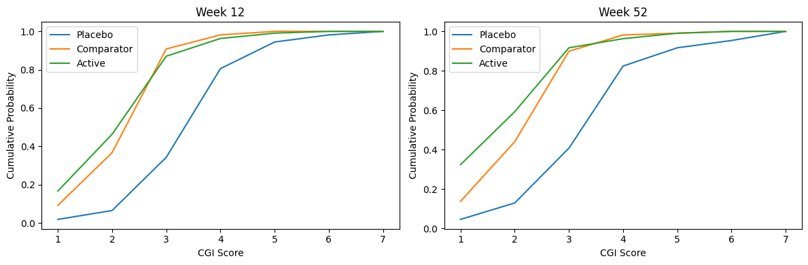
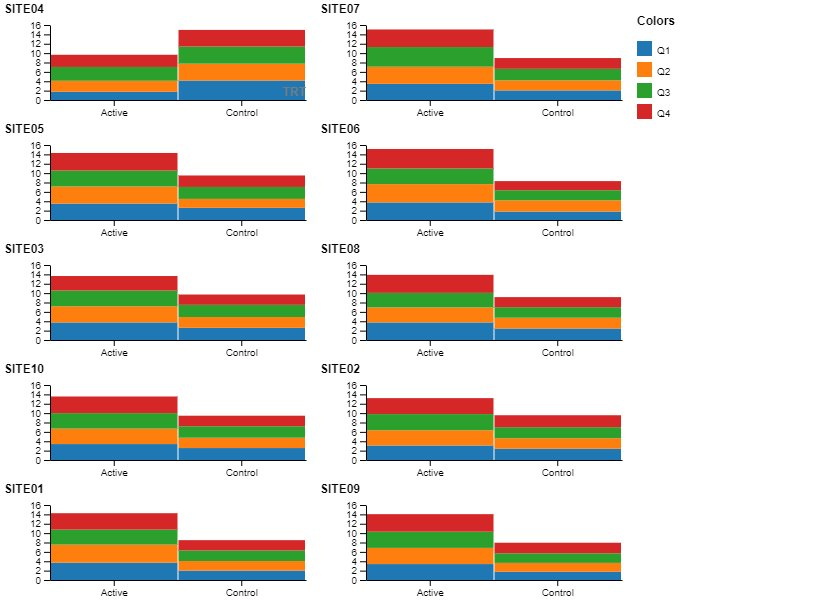
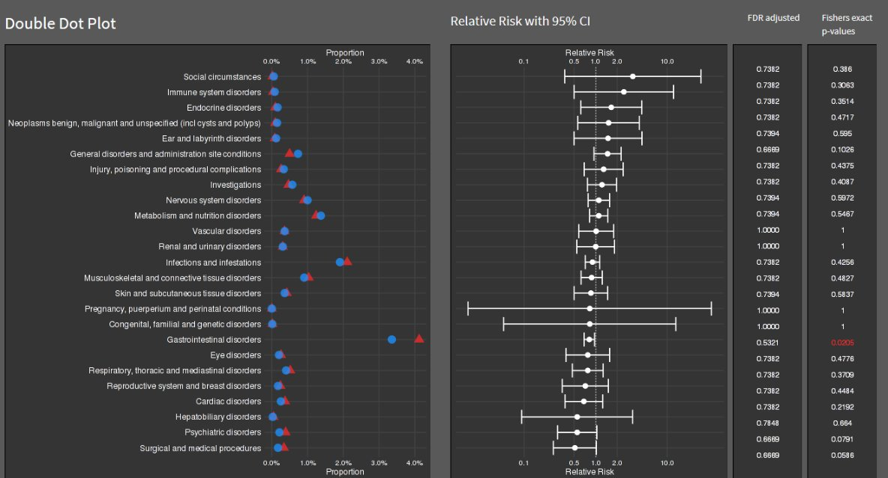

# Your favorite visualisation

Best of 2023

A description of the challenge can be found [here](https://github.com/VIS-SIG/Wonderful-Wednesdays/tree/master/data/2023/2023-12-13).  
A recording of the session can be found [here](https://psiweb.org/vod/item/psi-vissig-wonderful-wednesday-46-best-of-2023).

## Example 1. Cumulative distribution function

  
[high resolution image](./images/CDF_Week12vs.52_Zara - Steve Mallett.png)  

## Example 2. Vaccine efficiency

  
[high resolution image](./images/meas_inc - Bodo Kirsch - Steve Mallett.png)  

## Example 3. Dirty data I

  
[high resolution image](./images/dirty_data_1.png)  

## Example 4. Dirty data II

  

[high resolution image](./images/slopes.png)  

## Example 5. Dumbbell or lollipop plot

  
[high resolution image](./images/example_4.png)  

## Example 6. Double dot plot of DetectoR

  
[high resolution image](./images/double_dot_plot.png)  

# Code

The code can be found in the original posts.