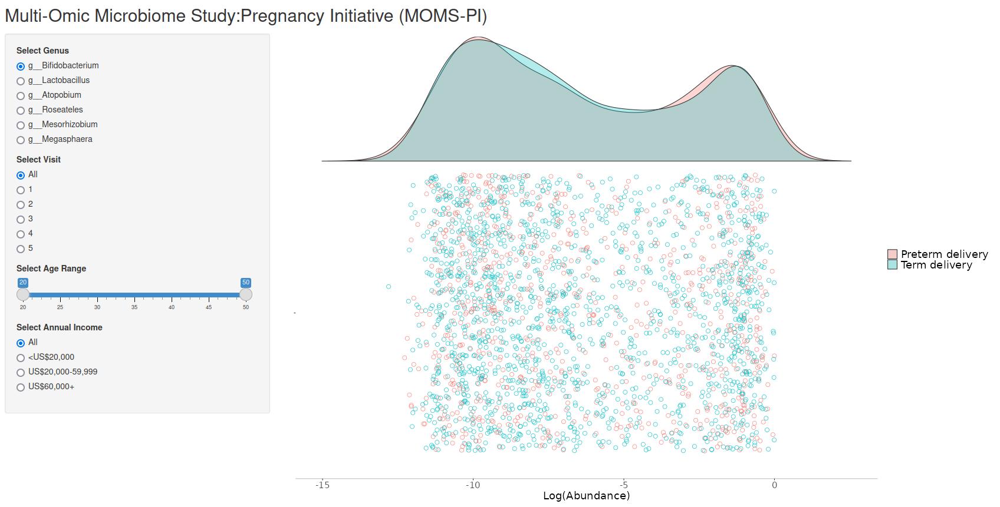
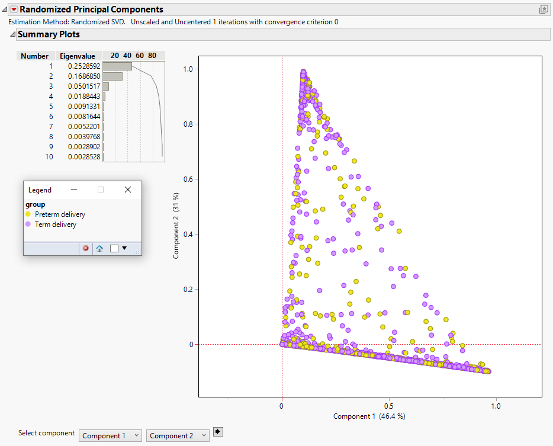
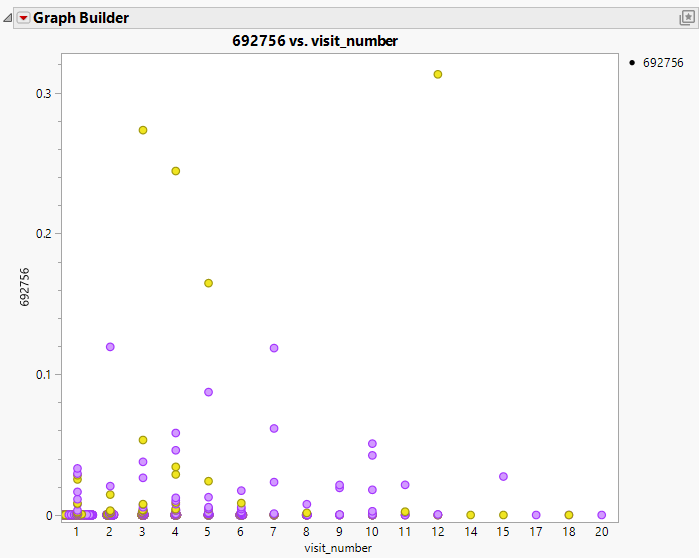

# Microbiome dataset

- Multi-Omic Microbiome Study:Pregnancy Initiative (MOMS-PI) is part of the longitudinal Human Microbiome Project (HMP)
- MOMS-PI Pre-Term Birth study dataset generated from a case-control study of 194 women predominantly of African ancestry, who delivered spontaneously preterm, and 388 case-matched women who delivered at term.
- Focus on vaginal microbiome profiles from pregnant women.

Challenge:

Produce data visualisation(s) providing insights into if the vaginal microbiome profiles can be associated with Pre-Term Birth.

- How do microbiome profiles change over time?
- What are the differences in microbiome profiles between Pre-Term Birth and Term Birth?


A description of the challenge can be found [here](https://github.com/VIS-SIG/Wonderful-Wednesdays/tree/master/data/2024/2024-02-14).  
A recording of the session can be found [here](https://psiweb.org/vod/item/psi-vissig-wonderful-wednesday-48-microbiom-data).

<a id="example1"></a>

## Example 1. Wheel charts

  
[high resolution image](./images/WW_Mar24_01 - Steve Mallett.png)  

Accessibility check:

  
[high resolution image](./images/WW_Mar24_colorblindness - Steve Mallett.png)  


[link to code](#example1 code)


<a id="example2"></a>

## Example 2. Raincloud Plot (App)

  
The app can be found [here](https://steve-mallett.shinyapps.io/Longitudinal_Microbiome_Project/)  

[link to code](#example2 code)

<a id="example3"></a>

## Example 3. Line plots

  
[high resolution image](./images/MOMSPI_20240228_microbiome_TomMarlow_2024-02-29 - T M.jpg)  

[link to code](#example3 code)

<a id="example4"></a>

## Example 4. Variance components


  
  
  
  
  


The pptx file can be found [here](./images/MOMS-PI Wolfinger - Russ Wolfinger.pptx).

[link to code](#example4 code)


# Code

<a id="example1 code"></a>

## Example 1. Wheel chart

```{r, echo = TRUE, eval=FALSE, python.reticulate = FALSE}
library(readr)
library(tidyr)
library(tidyverse)
library(ggplot2)
library(cowplot)
library(RColorBrewer)
library(paletteer)
library(colorspace)


################################################
# Combine abundance, taxonomy and clinical data

clin1 <- read_csv2("./Data/Metadata.csv") %>%
  arrange(subject_id, visit_number)

tax <- read_csv2("./Data/Taxonomy_info.csv")

abun1 <- read_csv2("./Data/Relative_abundance.csv") %>%
  gather(key = "sample_id", value = "Value", -taxID) %>%
  group_by(taxID, sample_id) %>%
  filter(Value>0)

abun3 <- left_join(clin1, abun1, by = "sample_id") 
abun4 <- left_join(tax, abun3, by = "taxID") %>% 
  arrange(subject_id, visit_number, taxID)

################################################
# Identify most prevalent taxIDs and subset data

num_gen <- 6

tax_prev <- abun4 %>% 
  group_by(genus) %>% 
  summarise(mn = mean(Value)) %>% 
  arrange(desc(mn)) %>% 
  select(genus) 

tax_prev2 <- tax_prev[1:num_gen,] %>% 
  as_vector()

abun5 <- abun4 %>% 
  filter(genus %in% tax_prev2)

################################################
# Groups subjects by most prevalent genus

overall_most.prev<- abun5 %>% 
  group_by(genus) %>% 
  summarise(sum = sum(Value)) %>% 
  arrange(desc(sum)) %>% 
  select(genus) %>% 
  mutate(sort.order = row_number())

################################################
# Create plots

myColors <- brewer.pal(num_gen,"Set1")
names(myColors) <- levels(overall_most.prev$genus)

make.plot <- function(gp, vs) {

  tmp <- abun5 %>% 
    filter(group == gp & visit_number == vs) %>% 
    group_by(subject_id, genus) %>% 
    summarise(sum = sum(Value)) %>% 
    arrange(subject_id, desc(sum))
  # select(subject_id, genus, Value)

  sub_most.prev <- tmp %>% 
    group_by(subject_id, genus) %>% 
    arrange(subject_id, desc(sum)) %>% 
    group_by(subject_id) %>%
    slice(1) %>% 
    select(subject_id, genus)
  
  sub_most.prev2 <- left_join(sub_most.prev, overall_most.prev, by = "genus") %>% 
    ungroup() %>% 
    select(subject_id, sort.order)
  
  tmp2 <- left_join(tmp, sub_most.prev2, by = "subject_id")
  
  subID <- tmp2 %>% 
    group_by(sort.order, subject_id) %>% 
    distinct(subject_id) %>% 
    arrange(sort.order) %>% 
    ungroup() %>% 
    mutate(new.subjid = row_number()) %>% 
    select(subject_id, new.subjid)
  
  tmp3 <- left_join(tmp2, subID, by = "subject_id") 
  
  ggplot(tmp3, aes(fill=genus, y=sum, x=new.subjid)) + 
    geom_bar(show.legend = TRUE,
             position="fill", stat="identity", width=1, color="black", linewidth=0.1) +
    coord_polar(theta="x") +
    scale_fill_manual(name = "genus", values = myColors) +
    scale_y_continuous(limits=c(-0.2, 1)) +
    theme(
      panel.background=element_rect(fill="white"),
      axis.text=element_blank(),
      axis.ticks=element_blank(),
      axis.title=element_blank(),
      legend.text=element_text(size=14),
      legend.title=element_text(size=14)
    ) +
    annotate("text", label = str_c("Visit ", vs), x = 0, y = -0.2, color = "black", size=5)
}

p1 <- make.plot("Preterm delivery", 1)
p2 <- make.plot("Preterm delivery", 2)
p3 <- make.plot("Preterm delivery", 3)
p4 <- make.plot("Preterm delivery", 4)
p5 <- make.plot("Term delivery", 1)
p6 <- make.plot("Term delivery", 2)
p7 <- make.plot("Term delivery", 3)
p8 <- make.plot("Term delivery", 4)

p_ptd <- plot_grid(
  p1 + theme(legend.position="none"),
  p2 + theme(legend.position="none"),
  p3 + theme(legend.position="none"),
  p4 + theme(legend.position="none"),
  align = 'vh',
  hjust = -1,
  ncol = 4,
  nrow = 1
)

p_td <- plot_grid(
  p5 + theme(legend.position="none"),
  p6 + theme(legend.position="none"),
  p7 + theme(legend.position="none"),
  p8 + theme(legend.position="none"),
  align = 'vh',
  labels = c("  ", " ", " ", " "),
  hjust = -1,
  ncol = 4,
  nrow = 1
)

################################################
# Formatting and output to file

title0 <- ggdraw() +
  draw_label("Longitudinal Human Microbiome Project (MOMS-PI Pre-Term Birth Study)\n", size = 20, color = "blue")

title1 <- ggdraw() +
  draw_label("Pre-Term Delivery", size = 22)

title2 <- ggdraw() + 
  draw_label("Term Delivery", size = 22)

legend <- get_legend(
  p2 + theme(legend.box.margin = margin(0, 0, 0, 12))
)

cap <- "How to read this chart: Each wheel represents a set of samples from the Pre-Term or Term Delivery cohort at a particular visit. Each spoke in the wheel represents a single participant in the study, with coloured segments representing the relative abundance
of bacteria types (genus) in the sample. For simplicity, only the most prevalent genus types and the first four visits are included. Approximately 75-80% of samples had Lactobacillus as the dominant genus, with no obvious difference between visits or cohorts."

caption <- ggdraw() + 
  draw_label(cap, size = 14)

ptd2 <- plot_grid(title1, p_ptd, ncol=1, rel_heights = c(1.7, 25), align = "v")  
td2 <- plot_grid(title2, p_td, ncol=1, rel_heights = c(1.7, 25), align = "v") 
all1 <- plot_grid(ptd2, td2, ncol=1, rel_heights = c(1, 1), align = "v") 
all2 <- plot_grid(all1, legend, rel_widths = c(3, 0.5))
all3 <- plot_grid(title0, all2, caption, ncol=1, rel_heights = c(8, 100, 5), align = "v") +
  theme(plot.background = element_rect(fill = "white", colour = "blue"))

ggsave("./WW_Mar24_01_OkabeIto.png", all3, width=24, height=12, dpi=300)

################################################


# Accessibility check:

library(readr)
library(tidyr)
library(tidyverse)
library(ggplot2)
library(cowplot)
library(RColorBrewer)
library(paletteer)
library(colorspace)
library(dichromat)

################################################
# Combine abundance, taxonomy and clinical data

clin1 <- read_csv2("./Data/Metadata.csv") %>%
  arrange(subject_id, visit_number)

tax <- read_csv2("./Data/Taxonomy_info.csv")

abun1 <- read_csv2("./Data/Relative_abundance.csv") %>%
  gather(key = "sample_id", value = "Value", -taxID) %>%
  group_by(taxID, sample_id) %>%
  filter(Value>0)

abun3 <- left_join(clin1, abun2, by = "sample_id") 
abun4 <- left_join(tax, abun3, by = "taxID") %>% 
  arrange(subject_id, visit_number, taxID)

################################################
# Identify most prevalent taxIDs and subset data

num_gen <- 6

tax_prev <- abun4 %>% 
  group_by(genus) %>% 
  summarise(mn = mean(Value)) %>% 
  arrange(desc(mn)) %>% 
  select(genus) 

tax_prev2 <- tax_prev[1:num_gen,] %>% 
  as_vector()

abun5 <- abun4 %>% 
  filter(genus %in% tax_prev2)

################################################
# Groups subjects by most prevalent genus

overall_most.prev<- abun5 %>% 
  group_by(genus) %>% 
  summarise(sum = sum(Value)) %>% 
  arrange(desc(sum)) %>% 
  select(genus) %>% 
  mutate(sort.order = row_number())

################################################
# Create plots

myColors <- brewer.pal(num_gen,"Set1")
protan <- dichromat(myColors , type = "protan")
deutan <- dichromat(myColors , type = "deutan")
tritan <- dichromat(myColors , type = "tritan")

names(myColors) <- levels(overall_most.prev$genus)

make.plot <- function(pal_lab,pal) {

  tmp <- abun5 %>% 
    filter(group == "Preterm delivery" & visit_number == 1) %>% 
    group_by(subject_id, genus) %>% 
    summarise(sum = sum(Value)) %>% 
    arrange(subject_id, desc(sum))
  # select(subject_id, genus, Value)

  sub_most.prev <- tmp %>% 
    group_by(subject_id, genus) %>% 
    arrange(subject_id, desc(sum)) %>% 
    group_by(subject_id) %>%
    slice(1) %>% 
    select(subject_id, genus)
  
  sub_most.prev2 <- left_join(sub_most.prev, overall_most.prev, by = "genus") %>% 
    ungroup() %>% 
    select(subject_id, sort.order)
  
  tmp2 <- left_join(tmp, sub_most.prev2, by = "subject_id")
  
  subID <- tmp2 %>% 
    group_by(sort.order, subject_id) %>% 
    distinct(subject_id) %>% 
    arrange(sort.order) %>% 
    ungroup() %>% 
    mutate(new.subjid = row_number()) %>% 
    select(subject_id, new.subjid)
  
  tmp3 <- left_join(tmp2, subID, by = "subject_id") 
  
  ggplot(tmp3, aes(fill=genus, y=sum, x=new.subjid)) + 
    geom_bar(show.legend = TRUE,
             position="fill", stat="identity", width=1, color="black", linewidth=0.1) +
    coord_polar(theta="x") +
    scale_fill_manual(name = "genus", values = pal) +
    scale_y_continuous(limits=c(-0.2, 1)) +
    theme(
      panel.background=element_rect(fill="white"),
      axis.text=element_blank(),
      axis.ticks=element_blank(),
      axis.title=element_blank(),
      legend.text=element_text(size=14),
      legend.title=element_text(size=14)
    ) +
    labs(title=pal_lab)
}

p1 <- make.plot("Original", myColors)
p2 <- make.plot("Protanopic", protan)
p3 <- make.plot("Deutanopic", deutan)
p4 <- make.plot("Tritanopic", tritan)

all <- plot_grid(p1, p2, p3, p4, 
  align = 'vh',
  hjust = -1,
  ncol = 2,
  nrow = 2
)


ggsave("./WW_Mar24_colorblindness.png", all, width=24, height=12, dpi=300)

################################################


```


[Back to blog](#example1)


<a id="example2 code"></a>

## Example 2. Raincloud Plot (App)

```{r, echo = TRUE, eval=FALSE}
library(shiny)
library(readr)
library(tidyr)
library(tidyverse)
library(ggplot2)
library(RColorBrewer)
library(introdataviz)

# Define UI for application that draws a histogram
num_gen <- 15
abun5 <- read_csv("./Data/abun5.csv")

genus_list <- abun5 %>% 
  group_by(genus) %>% 
  summarise(mn = mean(Value)) %>% 
  arrange(desc(mn)) %>% 
  select(genus) %>% 
  slice_head(n=num_gen) 

genus_list_v <- collect(select(genus_list, genus))[[1]]

ui <- fluidPage(
  
    titlePanel("Multi-Omic Microbiome Study:Pregnancy Initiative (MOMS-PI)"),

    sidebarLayout(
        sidebarPanel(
            radioButtons("genus_select", "Select Genus", genus_list_v),
            radioButtons("visit_select", "Select Visit", c("All", "1", "2", "3", "4" ,"5")),
            sliderInput("age_select", "Select Age Range", value = c(20, 50), step = 5, min = 20, max = 50, width=400),
            radioButtons("income_select", "Select Annual Income", c("All", "<US$20,000", "US$20,000-59,999", "US$60,000+")),
            width=3),

        mainPanel(
          shinycssloaders::withSpinner(
            plotOutput("myplot", width = "1200px", height = "800px")
          )
        )
    )
)

server <- function(input, output) {


  rain_height <- .5
  
    output$myplot <- renderPlot({

      if(input$visit_select == "All") {}
      else {
        abun5 <- abun5 %>% 
          filter(visit_number == input$visit_select)
      }
      
      if(input$income_select == "All") {}
      else {
        abun5 <- abun5 %>% 
          filter(subject_annual_income == input$income_select)
      }   
      
     abun5 <- abun5 %>% 
        filter(genus == input$genus_select) %>% 
        filter(subject_age > input$age_select[1], subject_age < input$age_select[2]) %>% 
        mutate(log_val = log(Value))
     
 # browser()
      ggplot(data=abun5, aes(x=" ", y=log_val)) +
        geom_flat_violin(aes(fill=group),
                         trim=FALSE, alpha = 0.3,
                         position = position_nudge(x = rain_height+.05)) +
        geom_point(aes(colour = group), shape = 1, size = 3, alpha = .9, show.legend = FALSE,
                   position = position_jitter(width = rain_height, height = 0)) +
        scale_y_continuous("Log(Abundance)") +
        # scale_color_brewer(palette = "Set1") +
        # scale_fill_brewer(palette = "Set1") +
        coord_flip() +
        theme(
          panel.background=element_blank(),
          axis.title.y=element_blank(),
          axis.text.x=element_text(size = 15),
          axis.line.x=element_line(color="grey"),
          axis.title.x=element_text(size = 18),
          legend.text=element_text(size = 18),
          legend.title=element_blank()
        )
      
    })
}

# Run the application 
shinyApp(ui = ui, server = server)
```


[Back to blog](#example2)


<a id="example3 code"></a>

## Example 3. Line plots

```{r, echo = TRUE, eval=FALSE}
# Microbiome Challenge

# WonderfulWednesday

library(tidyverse)
library(stringr)
library(scales)
library(RColorBrewer)
library(glue)
library(janitor)
library(readr)

root_dir <- here::here()
tues_dir <- file.path(root_dir,
                      "microbiome")
tt_theme <- "microbiome"
author_initials <- "TomMarlow"
azTidyTuesday_date <- "20240228"

# Relative abundance of each microbial community in each woman in pregnancy and the perinatal period
ra <- file.path(tues_dir, "202402_Collaboration_DataVizESIG-BiomarkersESIG_relative_abundance.csv")
# Taxonomy information of each microbial community
ti <- file.path(tues_dir, "202402_Collaboration_DataVizESIG-BiomarkersESIG_taxonomy_info.csv")
# Clinical information of each woman (simulated data)
sm <- file.path(tues_dir, "202402_Collaboration_DataVizESIG-BiomarkersESIG_simulated_metadata.csv")

rel_dat <- read.csv(ra, sep = ";")
sim_dat <- read.csv(sm, sep = ";")
tax_dat <- read.csv(ti, sep = ";")

rel_id <- rel_dat %>%
  pivot_longer(.,
               cols = 2:ncol(.),
               names_to = "id",
               values_to = "rel_abu",
               values_drop_na = TRUE) %>%
  mutate(sample_id = substr(id, 2, nchar(id))) %>%
  filter(rel_abu != 0)

# Merge to get audio characteristics

microb <- merge(x = rel_id, 
                y = sim_dat, 
              by.x = c("sample_id"), 
              by.y = c("sample_id"), 
              all.y = FALSE) 
        

# Taxonomy details

micro_tax <- merge(x = microb, 
                y = tax_dat, 
                by.x = c("taxID"), 
                by.y = c("taxID"), 
                all.y = FALSE) %>%
  mutate(abu = as.numeric(gsub(",", ".", rel_abu)))

table(micro_tax$phylum, micro_tax$group)
table(micro_tax$class, micro_tax$group)

table(sim_dat$subject_id)

msd_pat <- micro_tax %>%
  group_by(group, subject_id, visit_number, class) %>%
  summarise(suma = sum(abu)) %>%
  mutate(sump = suma * 100) %>%
  mutate(visits = if_else(visit_number >= 5, 5, visit_number)) %>%
  mutate(Class = gsub("c__", "", class))

unique(msd_pat$Class)

cls_avg <- msd_pat %>%
  group_by(Class) %>%
  summarise(mean = mean(sump)) %>%
  arrange(-mean)

cls_pop <- as.data.frame(table(msd_pat$Class)) %>%
  arrange(-Freq) %>%
  rename(Class = Var1)

msd_pat <- micro_tax %>%
  group_by(group, subject_id, visit_number, phylum) %>%
  summarise(suma = sum(abu)) %>%
  mutate(sump = suma * 100) %>%
  mutate(visits = if_else(visit_number >= 5, 5, visit_number)) %>%
  mutate(Phylum = gsub("p__", "", phylum))
write.csv(msd_pat, file.path(tues_dir, "pat.csv"))

phy_avg <- msd_pat %>%
  group_by(Phylum) %>%
  summarise(mean = mean(sump)) %>%
  arrange(-mean)

phy_pop <- as.data.frame(table(msd_pat$Phylum)) %>%
  arrange(-Freq) %>%
  rename(Phylum = Var1)

# Remove low frequency phylums / classes

phy_hi <- c(unlist(phy_pop$Phylum[phy_pop$Freq >= 20]))
cls_hi <- c(unlist(cls_pop$Class[cls_pop$Freq >= 1000]))


# Line plot

lin_dat <- msd_pat %>%
  group_by(Class, group, visit_number) %>%
  summarise(meanab = mean(sump)) %>%
  mutate(Class = factor(Class,
                         levels = cls_avg$Class,
                         labels = cls_avg$Class)) %>%
  filter(Class %in% cls_hi) 

line_fig <- ggplot() +
  geom_line(
    data = lin_dat, linewidth = 2,
    aes(
      x = visit_number, y = meanab, group = group,
      colour = group
    )
  ) +
  xlab("") +
  ylab(NULL) +
  labs(
    title = "Mean relative abundance by microbiome class, term and visit number",
    caption = "Multi-Omic Microbiome Study: Pregnancy Initiative (MOMS-PI) is part of the longitudinal Human Microbiome Project (HMP)",
    colour = "Term",
    x = "Visit number",
    y = "Mean abundance %"
  ) +
  theme_bw() +
  theme(
    strip.text.x = element_text(size = 10),
    axis.title = element_text(size = 10),
    axis.text.y = element_text(size = 8),
    axis.text.x = element_text(size = 8, angle = 0, hjust = .5),
    legend.position = "bottom"
  ) +
  scale_color_viridis_d(option = "viridis") +
  scale_fill_viridis_d(option = "viridis") +
  facet_wrap(. ~ Class)

line_fig

ggsave(
  plot = line_fig,
  filename = glue("{root_dir}/azTidyTuesday_{azTidyTuesday_date}_{tt_theme}_{author_initials}_{Sys.Date()}.jpg"),
  width = 16,
  height = 9)
```

[Back to blog](#example3)


<a id="example4 code"></a>

## Example 4. Variance components

The jmp file can be found [here](./code/variance_components_90 - Russ Wolfinger.jmp)

[Back to blog](#example4)


<a id="example5 code"></a>

## Example 5. <Same title as above>
The rmd file can be found [here](./code/<filename>).

[Back to blog](#example5)