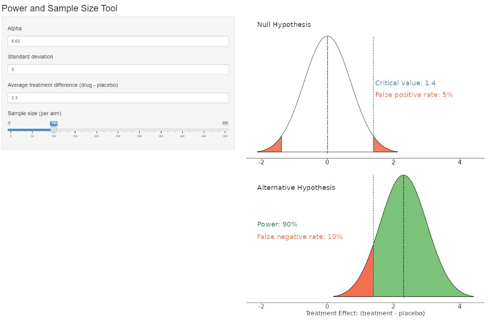
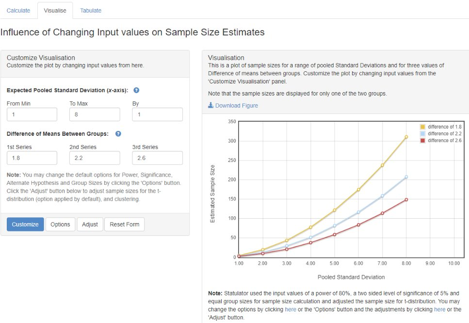
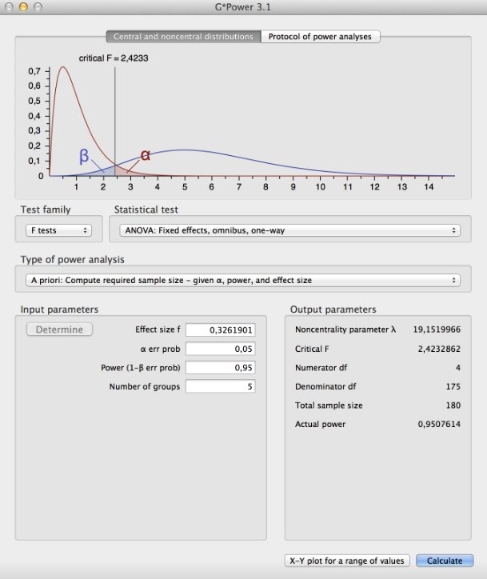
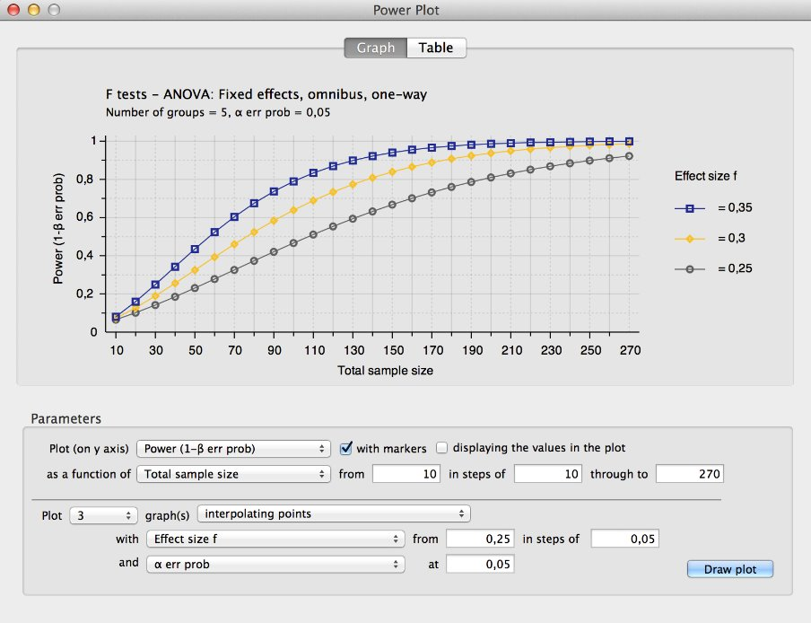

# Power and sample size calculations

Background:

As statisticians, we often have to deal with power or sample size calculations. It can be very beneficial to visualise the impact that different factors have on the sample size or power.

Challenge:

Produce data visualisation(s) or share tools that help your audience understand how power and sample size calculations work and what impacts the actual results of these calculations.

You can pick a design with

- any number of treatment groups
- a continuous, categorical/binary, or survival endpoint
- any kind of a null hypothesis (leading, for example, to a superiority or non-inferiority test)


A description of the challenge can be found [here](https://github.com/VIS-SIG/Wonderful-Wednesdays/tree/master/data/2024/2024-03-13).  
A recording of the session can be found [here](https://psiweb.org/vod/item/psi-vissig-wonderful-wednesday-49-explain-power).

<a id="example1"></a>

## Example 1. Shiny App

  
The app can be found [here](https://steve-mallett.shinyapps.io/WWApr24Power/).  

[link to code](#example1 code)


<a id="example2"></a>

## Example 2. Statulator Tool

  
The tool can be found [here](https://statulator.com/SampleSize/ss2M.html#/).  

[link to code](#example2 code)

<a id="example3"></a>

## Example 3. Trellised Power Curves

  
[high resolution image](./images/power - T M.jpg)  

[link to code](#example3 code)

<a id="example4"></a>

## Example 4. Power Analysis Software

  
  

The software can be found [here](https://www.psychologie.hhu.de/arbeitsgruppen/allgemeine-psychologie-und-arbeitspsychologie/gpower).

[link to code](#example4 code)


# Code

<a id="example1 code"></a>

## Example 1. Shiny App

```{r, echo = TRUE, eval=FALSE, python.reticulate = FALSE}
library(tidyverse)
library(cowplot)
library(ggtext)
library(stringr)

ui <- fluidPage(
  
  # Application title
  titlePanel("Power and Sample Size Tool"),
  
  # Sidebar with a slider input for number of bins 
  sidebarLayout(
    sidebarPanel(
      numericInput(inputId = "ALPHA",
                   label = h4("Alpha"),
                   value = 0.05, min = 0, max = 1),
      numericInput(inputId = "SD",
                  label = h4("Standard deviation"),
                  value = 50),
      numericInput(inputId = "TE",
                  label = h4("Average treatment difference (drug - placebo)"),
                  value = 15),
     sliderInput(inputId = "N",
                       label = h4("Sample size (per arm)"),
                       min = 0,
                       max = 500,
                       value = 200,
                       step=10),
    ),
   


    # Show a plot of the generated distribution
    mainPanel(
      plotOutput(outputId = "myPlot1"
                 , width = "800px", height = "1000px"))
    )
  )

server <- function(input, output, session) {

   output$myPlot1 <- renderPlot({

    n <- as.numeric(input$N)
    sd <- as.numeric(input$SD)
    alpha <- as.numeric(input$ALPHA)
    te <- as.numeric(input$TE)
    
    sides <- 1   
    se_diff = sqrt(2*(sd^2/n))
    power1 <- power.t.test(n = n, delta = te, sd = sd, sig.level = alpha,
                           power = NULL,
                           type = "two.sample",
                           alternative = "two.sided")
    powern <- power1$power
    powerc <-  paste0("Power: ", round(powern, 2)*100, "%")
 
    # Null   
    mu_null <- 0
    lower_null <- -3 * se_diff + mu_null 
    upper_null <- 3 * se_diff + mu_null 
    crit_null <- qnorm(1-alpha/2, mean = mu_null, sd = se_diff)
    crit <- paste0("Critical value: ", round(crit_null, 1))
    fpos <- paste0("False positive rate: ", round(alpha, 2)*100, "%")
    fneg <- paste0("False negative rate: ", round(1-powern, 2)*100, "%")
    x_null <- seq(lower_null, upper_null, length = 1000) 
    y_null <- dnorm(x_null, mu_null, se_diff)
    df_null <- data.frame(cbind(x_null, y_null))
    
    df_rej_null_r <- df_null %>% 
      filter(x_null > crit_null) %>% 
      arrange(desc(x_null))
    
    df_rej_null_l <- df_null %>% 
      filter(x_null < crit_null*-1) %>% 
      arrange(x_null)
    
    temp_r <- data.frame(x_null = crit_null, y_null = df_rej_null_r$y_null[1])
    temp_l <- data.frame(x_null = crit_null*-1, y_null = df_rej_null_l$y_null[1])
    df_rej_null_r <- rbind(temp_r, df_rej_null_r)
    df_rej_null_l <- rbind(temp_l, df_rej_null_l)
    
    # Alternative
    mu_alt <- te 
    lower_alt <- -3 * se_diff + mu_alt 
    upper_alt <- 3 * se_diff + mu_alt 
    x_alt <- seq(lower_alt, upper_alt, length = 1000) 
    y_alt <- dnorm(x_alt, mu_alt, se_diff)
    df_alt <- data.frame(cbind(x_alt, y_alt))
    
    df_rej_alt_l <- df_alt %>% 
      filter(x_alt < crit_null) %>% 
      arrange(x_alt)

    temp <- data.frame(x_alt = crit_null, y_alt = df_rej_alt_l$y_alt[1])
    df_rej_alt_l2 <- rbind(df_rej_alt_l, temp)
    
    df_rej_alt_r <- df_alt %>% 
      filter(x_alt > crit_null) %>% 
      arrange(desc(x_alt))
    
    temp <- data.frame(x_alt = crit_null, y_alt = df_rej_alt_r$y_alt[1])
    df_rej_alt_r2 <- rbind(temp, df_rej_alt_r)
    


 gnull <-  ggplot(df_null, aes(x = x_null, y = y_null)) +
      geom_polygon(data = df_null, color="black", fill="white") +
      geom_polygon(data = df_rej_null_r, color="black", fill="#fb6a4a", alpha=0.9) +
      geom_polygon(data = df_rej_null_l, color="black", fill="#fb6a4a", alpha=0.9) +
      geom_segment(x=crit_null, xend=crit_null, y=y_null[1], yend=y_null[500], color="#2b8cbe", linetype="dashed") +
      geom_segment(x=mu_null, xend=mu_null, y=0, yend=y_null[500], color="black", linetype="dotted") +
      scale_x_continuous(limits = c(lower_null, upper_alt)) +
      theme(plot.title = element_markdown(colour = "#636363", size = 12),
            panel.background=element_blank(),
            axis.line.x=element_line(color="black"),
            axis.line.y=element_blank(),
            axis.ticks.x=element_line(color="black"),
            axis.ticks.y=element_blank(),
            axis.title=element_blank(),
            axis.text.y=element_blank(),
            axis.text.x=element_text(color="black", size=20)) +
   annotate("text", x = lower_null, y = y_null[500]*1.1, color="#252525", label = "Null Hypothesis", hjust=0, size=8) +
   annotate("text", x = crit_null+upper_alt/80, y = y_null[500]*0.6, color="#2b8cbe", label = crit, hjust=0, size=8)  +
   annotate("text", x = crit_null+upper_alt/80, y = y_null[500]*0.5, color="#fb6a4a", label = fpos, hjust=0, size=8)
    
    galt <- ggplot(df_alt, aes(x = x_alt, y = y_alt)) +
      geom_polygon(data = df_alt, color="black", fill="white") +
      geom_polygon(data = df_rej_alt_r2, color="black", fill="#74c476") +
      geom_polygon(data = df_rej_alt_l2, color="black", fill="#fb6a4a") +
      geom_segment(x=crit_null, xend=crit_null, y=y_alt[1], yend=y_alt[500], color="#2b8cbe", linetype="dashed") +
      geom_segment(x=mu_alt, xend=mu_alt, y=0, yend=y_alt[500], color="black", linetype="dotted") +
      scale_x_continuous("Treatment Effect: (treatment - placebo)",
                         limits = c(lower_null, upper_alt)) +
       theme(panel.background=element_blank(),
            axis.line.x=element_line(color="#252525"),
            axis.line.y=element_blank(),
            axis.ticks.x=element_line(color="#252525"),
            axis.ticks.y=element_blank(),
            axis.title.x=element_text(color="#252525", size=20),
            axis.title.y=element_blank(),
            axis.text.y=element_blank(),
            axis.text.x=element_text(color="#252525", size=20)) +
      annotate("text", x = lower_null, y = y_null[500]*0.9, color="#252525", label = "Alternative Hypothesis", hjust=0, size=8) +
      annotate("text", x = lower_null, y = y_null[500]*0.6, color="#238b45", label = powerc, hjust=0, size=8) +
      annotate("text", x = lower_null, y = y_null[500]*0.5, color="#fb6a4a", label = fneg, hjust=0, size=8)
    
    
    title0 <- ggdraw() + draw_label("Test title", size = 22)
    plot_grid(gnull, galt, ncol=1, rel_heights = c(50, 50), align = "v")
    
     }) 

   output$myPlot2 <- renderPlot({
     
   df <- data.frame(matrix(nrow=1, ncol = 1))
   names(df) <- "percentage"
   df$percentage <- power
   df <- df %>% mutate(label = paste0(round(percentage, 2)*100, "%"))
   
   ggplot(data=df) +
     geom_rect(aes(ymax=1, ymin=0, xmax=2, xmin=1), fill ="#ece8bd") +
     geom_rect(aes(ymax = percentage, ymin = 0, xmax = 2, xmin = 1), fill = "#74c476") + 
     coord_polar(theta = "y",start=-pi/2) + xlim(c(0, 2)) + ylim(c(0,2)) +
     geom_text(aes(x = 0, y = 0, label = label), colour="#74c476", size=14) +
     # geom_text(aes(x=1.5, y=1.5), label="Power",  size=4.2) + 
     theme_void() +
     # scale_colour_manual(values = c("red"="#C9146C", "orange"="#DA9112", "green"="#129188")) +
     theme(strip.background = element_blank(),
           strip.text.x = element_blank()) 
   }) 
}

shinyApp(ui, server)
```


[Back to blog](#example1)


<a id="example2 code"></a>

## Example 2. Statulator Tool

No code available.


[Back to blog](#example2)


<a id="example3 code"></a>

## Example 3. Trellised Power Curves

```{r, echo = TRUE, eval=FALSE}
# Wonderful Wednesday
# Statistical Power

# by Tom Marlow


# T-test that shows poewr to detcet difference of 5 ot 8% in EF

# Assumptions

library(tidyverse)
library(pwr)

fn_pwr <- function(n, d) {
  power <- pwr.t.test(n = n,
                      d = d,
                      sig.level = 0.05,
                      alternative = "two.sided",
                      type = "two.sample")$power
  return(power * 100)
}

ssize = c(2:12)
msd <- tibble(effect = rep(c(6, 8, 10), each = 3),
              sd_inc = rep(c(1, 1.25, 1.5), 3)) %>%
  mutate(sd = 4 * sd_inc) %>%
  mutate(delta = effect / sd)

pwr_tab <- tibble(effect = factor(rep(msd$effect, each = length(ssize)),
                                  levels = c(6, 8, 10),
                                  labels = c("6%", "8%", "10%")),
                  sd_inc = as.factor(rep(msd$sd_inc, each = length(ssize))),
                  n = rep(ssize, length(msd$delta)),
                  d = rep(msd$delta, each = length(ssize))) %>%
  mutate(power = fn_pwr(n, d)) 

pwr_fig <- ggplot(data = pwr_tab,
                  aes(x = n, y = power, colour = sd_inc)) +
  geom_line() +
  geom_hline(yintercept = 80) +
  geom_line(linewidth = 1) +
  scale_x_continuous(breaks = ssize, name = "Sample size") +
  scale_y_continuous(breaks = seq(0, 100, by = 20)) +
  labs(
    y = "Power (%)",
    title = "Power to detect deltas of 6, 8 and 10% in ejection fraction",
    subtitles = "Two-sided, two-sample t-test, alpha=0.05, sd=4",
    colour = "SD increase"
  ) +
  geom_point(size = 2, shape = 21, fill = "white") +
  theme_bw() +
  theme(
    axis.text = element_text(size = 10),
    axis.title = element_text(size = 12),
    panel.grid.minor = element_blank(),
    legend.position = "bottom") +
  scale_colour_viridis_d() +
  facet_wrap(effect ~ .)

pwr_fig
```

[Back to blog](#example3)


<a id="example4 code"></a>

## Example 4. Power Analysis Software

No code available.

[Back to blog](#example4)