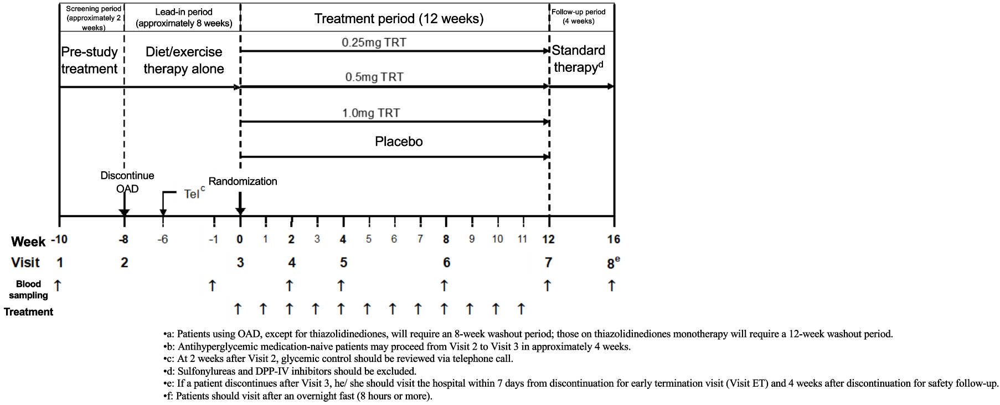
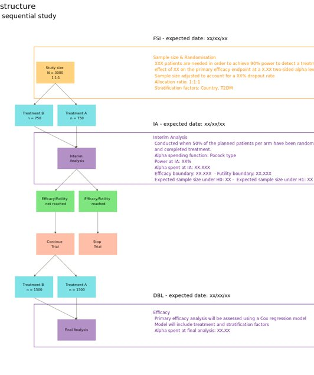
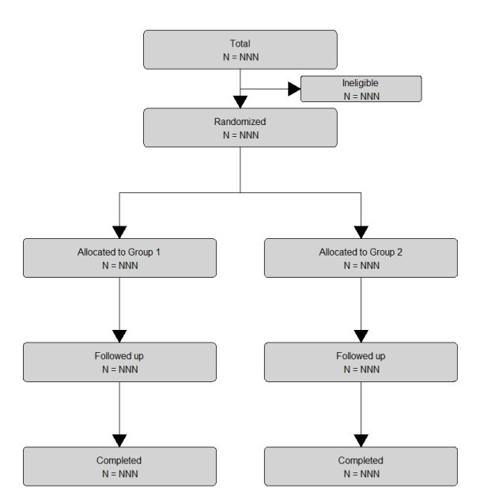
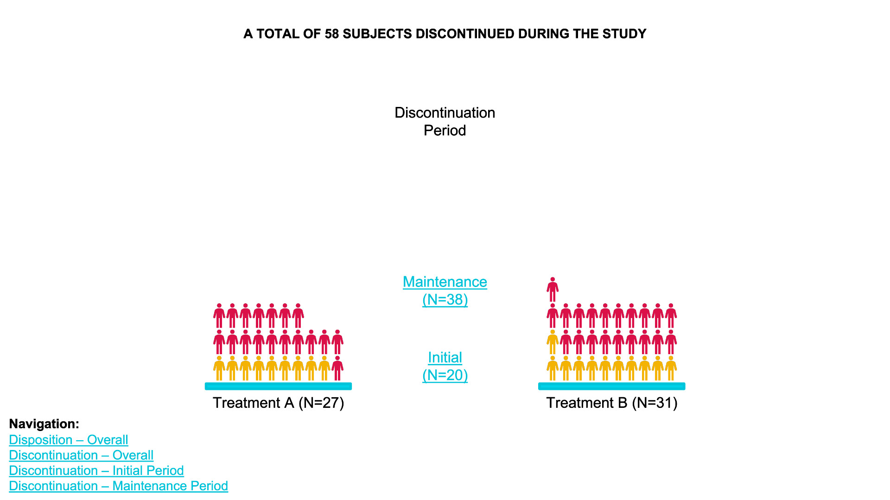
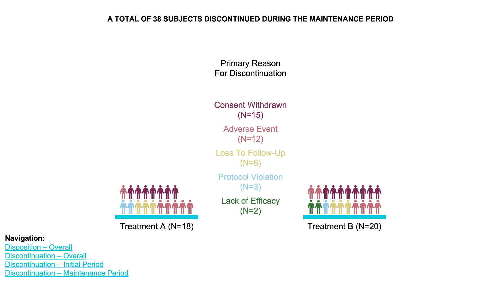
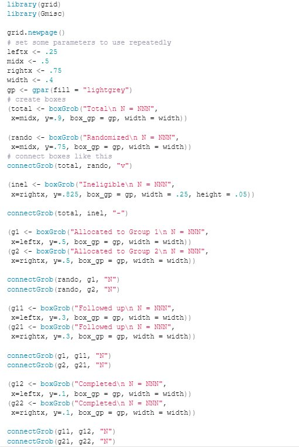

# Study flow charts

In almost every study there is a flow chart to present the patient's path through the trial. What could the next level of study flow charts look like? Sandard study flow charts are basically organised lookup tables. A true visualisation can do much more. For example colour coding or indenting boxes can help organising. Also additional information can be embedded. This can easily done in R. For patient disposition Sankey diagrams can be extremely useful. This is even more powerful if used interactively. People charts even go without explanation.

A description of the challenge can be found [here](https://github.com/VIS-SIG/Wonderful-Wednesdays/tree/master/data/2024/2024-05-08).  
A recording of the session can be found [here](https://psiweb.org/vod/item/psi-vissig-wonderful-wednesday-50-study-flow-charts).

## Example 1. Typical Study Flow Diagram

  
[high resolution image](./images/image1.png)  

[link to code](#example1 code)

## Example 2. Novel Study Flow Chart

  
[high resolution image](./images/image2.jpg)  

[link to code](#example2 code)

## Example 3. Typical Study Disposition Chart

  
[high resolution image](./images/image3.jpg)  

[link to code](#example3 code)

## Example 4. Automate in R

  

[high resolution image](./images/image4.jpg)  

[link to code](#example4 code)

## Example 5. Novel Study Disposition Chart

  
[high resolution image](./images/Sankey - SNZ Skrivanek.png)  

(A summary of the discussion will be added shortly.)

[link to code](#example5 code)

## Example 6. Individual subjects

  
[high resolution image](./images/image6_1.jpg)  

  
[high resolution image](./images/image6_2.jpg)  

  
[high resolution image](./images/image6_3.jpg)  

  
[high resolution image](./images/image6_4.jpg)  

[link to code](#example6 code)

# Code

## Example 1. Typical Study Flow Diagram

No code available.

[Back to blog](#example1)

## Example 2. Novel Study Flow Chart

No code available.

[Back to blog](#example2)

## Example 3. Typical Study Disposition Chart

No code available.

[Back to blog](#example3)

## Example 4. Automate in R

[Back to blog](#example4)

## Example 5. Novel Study Disposition Chart

No code available.

[Back to blog](#example5)

## Example 6. Individual subjects

No code available.

[Back to blog](#example6)