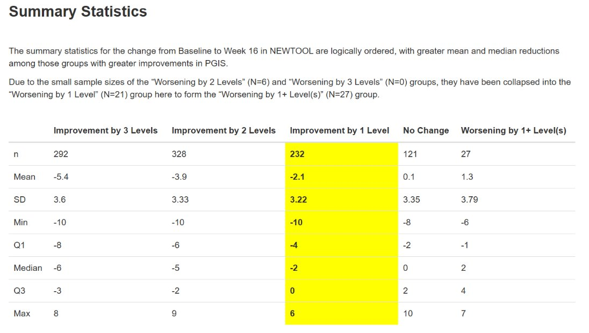
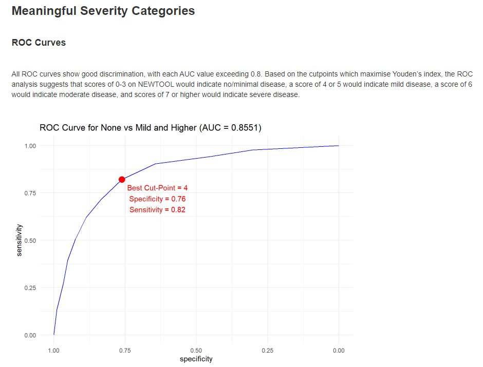
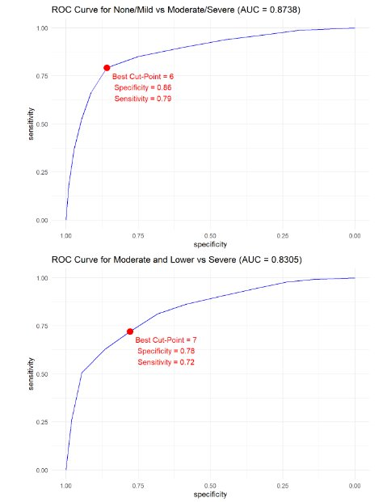
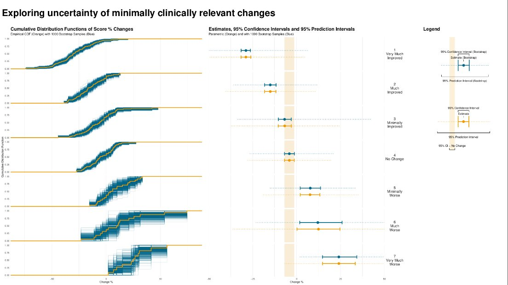
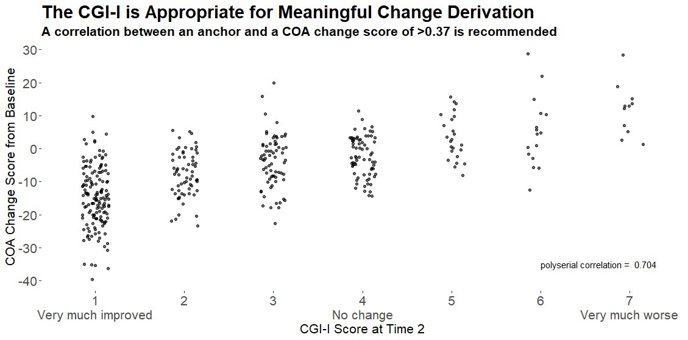

# Responder definition
When a new patient-reported outcome (PRO) is developed, there is interest in deriving the following, to support interpretation of data collected using the new tool: Minimal Clinically Important Difference (MCID) / Responder Definition (RD), Meaningful Between-Group Difference, Meaningful Score Categories. These are usually derived by using an existing, validated measure as the ‘gold standard’ to quantify e.g. disease status.

Challenge: Use visualisations to support in the derivation in any or all of the following:

- MCID
- Meaningful between-group difference
- Meaningful score categories

A description of the challenge can be found [here](https://github.com/VIS-SIG/Wonderful-Wednesdays/tree/master/data/2024/2024-07-10).  
A recording of the session can be found [here](https://psiweb.org/vod/item/psi-vissig-wonderful-wednesday-53-responder-definition-derivation).

## Example 1. Part 1

  
[high resolution image](./images/summary_statistics.png)  

  
[high resolution image](./images/improvement.png)  

  
[high resolution image](./images/pdf_curves.png)  

  
[high resolution image](./images/additional_summary_statistics.png)  

[link to code](#example1 code)

## Example 2. Part 2

  
[high resolution image](./images/meaningful_severity.png)  

  
[high resolution image](./images/roc_curves.png)  

[link to code](#example2 code)

## Example 3. November 2021

  
[high resolution image](./images/uncertainty.png)  

  
[high resolution image](./images/minimally_improved.png)  

  
[high resolution image](./images/cgi-i.png)  

  
[high resolution image](./images/threshold.png)  

  
[high resolution image](./images/cgi-i_rating.jpg)  

  
[high resolution image](./images/baseline_follow-up_change.png)  

[link to code](#example3 code)

# Code

## Example 1. <Same title as above>

No code has been submitted.

[Back to blog](#example1)

## Example 2. <Same title as above>

No code has been submitted.

[Back to blog](#example2)

## Example 3. <Same title as above>

No code has been submitted.

[Back to blog](#example3)