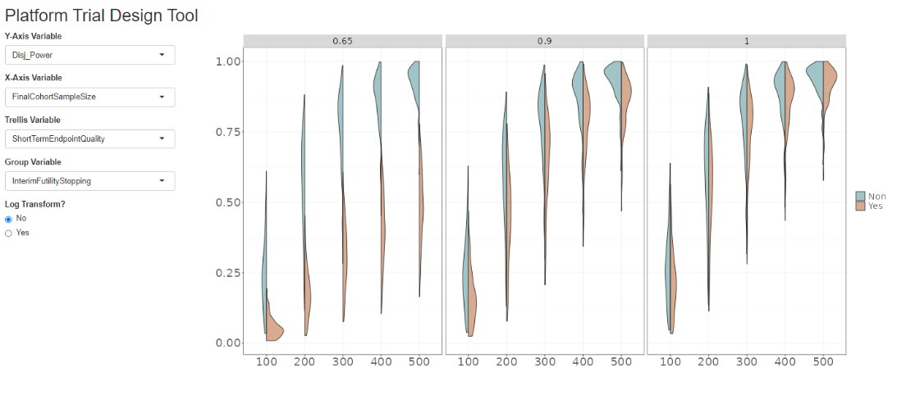

# Platform Trial Design II

It is known that sometimes at the design stage of a clinical trial, simulations are conducted to better understand the operating characteristics of the design. In a [recently published paper](https://www.ncbi.nlm.nih.gov/pmc/articles/PMC9304586/), a simulation study was conducted for a platform trial design in the context of NASH (Non-Alcoholic Steatohepatitis). Different assumptions regarding e.g. treatment effect and correlation between the surrogate interim endpoint and the final endpoint, as well as design choices such as sample size and maximum number of cohorts allowed in the platform were investigated.

A description of the challenge can be found [here](https://github.com/VIS-SIG/Wonderful-Wednesdays/tree/master/data/2024/2024-06-12).  
A recording of the session can be found [here](https://psiweb.org/vod/item/psi-vissig-wonderful-wednesday-52-platform-trial-design-ii).

<a id="example1"></a>

## Example 1. Shiny App - Gareth

  
[high resolution image](./images/shiny_app_Gareth.png)  


[link to code](#example1 code)


<a id="example2"></a>

## Example 2. Exploratory visualisation

  
The app can be found [here](https://steve-mallett.shinyapps.io/WW_Jul_2024/)  
Author: Steve Mallett


[link to code](#example2 code)

<a id="example3"></a>

## Example 3. Explanatory visualisation

  
[high resolution image](./images/WW_Jul24_03 - Steve Mallett.png)  


[link to code](#example3 code)


# Code

<a id="example1 code"></a>

## Example 1. Shiny App - Gareth

No code has been submitted.


[Back to blog](#example1)


<a id="example2 code"></a>

## Example 2. Exploratory visualisation

```{r, echo = TRUE, eval=FALSE}
library(shiny)
library(tidyverse)
library(ggplot2)
library(ggbeeswarm)
library(introdataviz)
library(ggforce)


max_c <- c("All", "3", "5", "7")
cir <- c("All", "0.01", "0.03")
seq <- c("All", "0.065", "0.9", "1")
yn <- c("No", "Yes")
varlist1 <- c("Avg_Pat", "Avg_Pat_First_Suc", "Avg_Perc_Pat_Sup_Plac", "Avg_Cohorts", "FDR", "PTP", "PTT1ER","FWER", "FWER_BA",  "Disj_Power", "Disj_Power_BA")
varlist2 <- c("ShortTermEndpointQuality", "Maximumnumberofcohorts", "TypeofDataSharing", "CohortInclusionRate", "FinalCohortSampleSize", "InterimFutilityStopping", "TreatmentEfficacySetting")
varlist3 <- c("None", "ShortTermEndpointQuality", "Maximumnumberofcohorts", "TypeofDataSharing", "CohortInclusionRate", "FinalCohortSampleSize", "InterimFutilityStopping", "TreatmentEfficacySetting")
varlist4 <- c("None", "CohortInclusionRate", "InterimFutilityStopping")

my_lgrey <-"#f0f0f0" 
my_dgrey <- "#636363"
my_green <- "#639CA4FF"
my_orange <- "#BE7245FF"
fill_cols <- c(my_green, my_orange)

my_theme <- theme(text=element_text(
  colour = my_dgrey,
  size = 20),
  panel.background=element_rect(fill="white"),
  panel.border=element_rect(fill=NA),
  panel.grid=element_line(colour = my_lgrey,
                          linewidth = 0.5,
                          linetype = 1),
  axis.line=element_line(colour = my_dgrey,
                         linewidth = 0.5,
                         linetype = 1),
  axis.text=element_text(
    colour = my_dgrey,
    size = 20),
  axis.title=element_blank(),
  plot.caption = element_text(hjust = 0, face= "italic"),
  legend.title = element_blank()
) 

ui <- fluidPage(
  titlePanel("Platform Trial Design Tool"),
fluidRow(
  column(2,
         selectInput("yvar", "Y-Axis Variable", varlist1, selected="Disj_Power"),
         selectInput("xvar", "X-Axis Variable", varlist2, selected="FinalCohortSampleSize"),
         selectInput("trelvar", "Trellis Variable", varlist3),
         selectInput("groupvar", "Group Variable", varlist4),
         radioButtons("lg", "Log Transform?", yn),
         ),
 column(5,
        plotOutput("distPlot", width = "1200px", height = "1000px"))
))

server <- function(input, output) {

  
  mydata <- read_csv("./data/ExampleDataNASH.csv") 

    output$distPlot <- renderPlot({
  
      mydata <- mydata %>%
        mutate(
          yv = get(input$yvar),
          xv = factor(get(input$xvar)))
      
      if(input$trelvar != "None") {
        mydata <- mydata %>%
          mutate(
            rv = factor(get(input$trelvar)))
      }

      if(input$groupvar != "None") {
        mydata <- mydata %>%
          mutate(
            gv = factor(get(input$groupvar)))
      }      

     if(input$groupvar == "None") {
        my_plot <- ggplot() +
          geom_violin(data=mydata, aes(x=xv, y=yv, group = xv),
                      fill=my_green, alpha=0.6, trim=FALSE)
      }      
      else{
          my_plot <- ggplot(mydata, aes(x=xv, y=yv, 
                                        group = interaction(gv, xv),
                                        fill = gv)) +
            geom_split_violin(alpha=0.6, trim=FALSE) +
            scale_fill_manual(values=fill_cols)
          
      }
      if(input$trelvar != "None") {
        
        my_plot <- my_plot +
          facet_wrap(~rv)

      }

       if(input$lg == "Yes") {
        
        my_plot <- my_plot +
          scale_y_log10()
        
      }
      else {}
      my_plot <- my_plot + my_theme
      my_plot
    })
}

# Run the application 
shinyApp(ui = ui, server = server)
```


[Back to blog](#example2)


<a id="example3 code"></a>

## Example 3. Explanatory visualisation

```{r, echo = TRUE, eval=FALSE}
library(shiny)
library(tidyverse)
library(ggplot2)
library(introdataviz)
library(stringr)
library(ggforce)

my_lgrey <-"#f0f0f0" 
my_dgrey <- "#636363"
my_green <- "#639CA4FF"
my_orange <- "#BE7245FF"
fill_cols <- c(my_green, my_orange)

my_theme <- theme(text=element_text(
  colour = my_dgrey,
  size = 14),
  panel.background=element_rect(fill="white"),
  panel.border=element_rect(fill=NA),
  panel.grid=element_line(colour = my_lgrey,
                          linewidth = 0.5,
                          linetype = 1),
  axis.line=element_line(colour = my_dgrey,
                         linewidth = 0.5,
                         linetype = 1),
  axis.text=element_text(
    colour = my_dgrey),
  axis.title=element_text(colour = my_dgrey),
  plot.caption = element_text(hjust = 0, face= "italic"),
  legend.title = element_text(colour = my_dgrey,
                              size = 12),
    plot.title = element_text(colour = my_dgrey)
) 
# my_title <- "When the therapy is effective, inclusion of interim futility stopping rules reduces the disjunctive power when the short term endpoint quality is poor.\n"
  my_cap <- "Treatment effect scenario: Both monotherapies are superior to SoC and combination therapy is better than monotherapies."
  
  mydata <- read_csv("./data/ExampleDataNASH.csv") %>%
    mutate(tes = if_else(TreatmentEfficacySetting==6, "Monotherapies > SoC. Combination > monotherapies", "Null Hypothesis")) %>%
    mutate(steq = paste0("Short Term Endpoint Quality: ", ShortTermEndpointQuality)) %>%
    filter(TreatmentEfficacySetting %in% c(1)) %>%
    filter(ShortTermEndpointQuality %in% c(0.65, 1)) %>%
    filter(FinalCohortSampleSize %in% c(100, 300, 500))
    
      my_plot <- ggplot(mydata, aes(x=factor(FinalCohortSampleSize), y=Disj_Power, 
                                    group = interaction(InterimFutilityStopping, factor(FinalCohortSampleSize)),
                                    fill = InterimFutilityStopping)) +
        geom_sina(alpha=0.6, size=3, shape=21) +
        # scale_fill_manual(values=fill_cols) +
        scale_fill_manual("Interim\nFutility\nStopping?\n", values=fill_cols) +
        scale_y_continuous("Disjunctive Power\n") +
        scale_x_discrete("Final Cohort Sample Size\n") +
        facet_wrap(~steq) +
        labs(
          # title = str_wrap(my_title, 200),
             caption = str_wrap(my_cap, 100))  + 
        my_theme

ggsave("./WW_Jul24_03.png",  my_plot, width=1250, height=900, units="px", dpi=150)
```

[Back to blog](#example3)