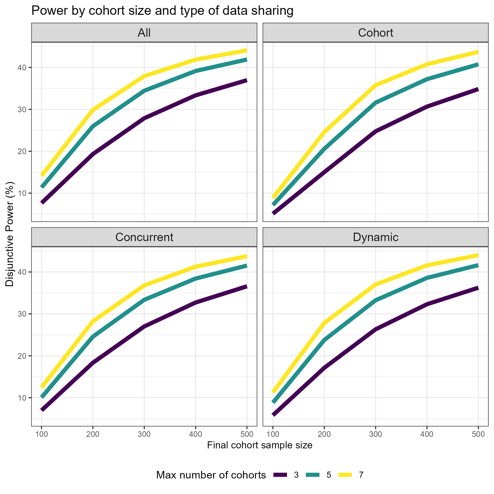
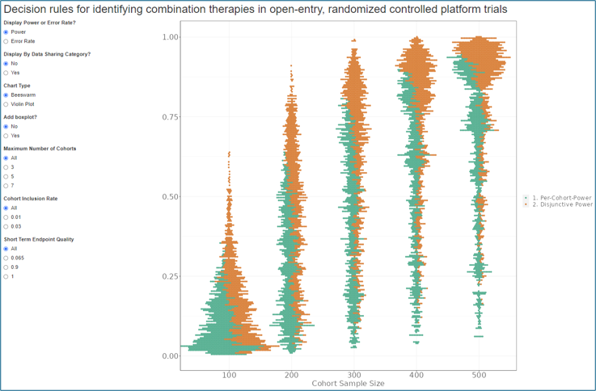

# Platform Trial Design I

It is known that sometimes at the design stage of a clinical trial, simulations are conducted to better understand the operating characteristics of the design. In a [recently published paper](https://www.ncbi.nlm.nih.gov/pmc/articles/PMC9304586/), a simulation study was conducted for a platform trial design in the context of NASH (Non-Alcoholic Steatohepatitis). Different assumptions regarding e.g. treatment effect and correlation between the surrogate interim endpoint and the final endpoint, as well as design choices such as sample size and maximum number of cohorts allowed in the platform were investigated.

A description of the challenge can be found [here](https://github.com/VIS-SIG/Wonderful-Wednesdays/tree/master/data/2024/2024-05-08).  
A recording of the session can be found [here](https://psiweb.org/vod/item/psi-vissig-wonderful-wednesday-51-platform-trial-design-i).

<a id="example1"></a>

## Example 1. Power by Cohort Size/Data Sharing

  
[high resolution image](./images/power_TomMarlow_2024-06-04 - T M.jpg)  


[link to code](#example1 code)


<a id="example2"></a>

## Example 2. Shiny App

  
The app can be found [here](https://steve-mallett.shinyapps.io/WW_Jun24/)  
Author: Steve Mallett

[link to code](#example2 code)

<a id="example3"></a>

## Example 3. Power/Error Rate by Number of Cohorts/Data Sharing (from paper)

  
[high resolution image](./images/power_error_paper.png)  

[link to code](#example3 code)

<a id="example4"></a>

## Example 4. Power by Cohort Sample Size and Cohort Number and Inclusion Rate​

  
[high resolution image](./images/power_by_cohort.png)  


[link to code](#example4 code)


# Code

<a id="example1 code"></a>

## Example 1. Power by Cohort Size/Data Sharing

```{r, echo = TRUE, eval=FALSE, python.reticulate = FALSE}
# Microbiome Challenge

# WonderfulWednesday

library(tidyverse)
library(stringr)
library(scales)
library(RColorBrewer)
library(glue)
library(janitor)
library(readr)

root_dir <- here::here()
weds_dir <- file.path(root_dir,
                      "PlatformTrials")
tt_theme <- "power"
author_initials <- "TomMarlow"

ed <- file.path(weds_dir, "ExampleDataNASH.csv")

ed_dat <- read.csv(ed, sep = ",")

pt_avg <- ed_dat %>%
  filter(!is.na(Disj_Power_BA)) %>%
  group_by(FinalCohortSampleSize, Maximumnumberofcohorts, TypeofDataSharing) %>%
  summarise(mean = mean(Disj_Power_BA)) %>%
  mutate(power = mean * 100)

fig1 <- ggplot(pt_avg,
               aes(x = FinalCohortSampleSize,
                   y = power,
                   colour = as.factor(Maximumnumberofcohorts))) +
  geom_line(linewidth = 2) +
  labs(title = "Power by cohort size and type of data sharing",
       colour = "Max number of cohorts") +
  xlab("Final cohort sample size") +
  ylab("Disjunctive Power (%)") +
  theme_bw() +
  theme(axis.title.x = element_text(size = 10),
        strip.text =  element_text(size = 12),
        panel.grid.minor.x = element_blank(),
        axis.text = element_text(size = 8),
        legend.position = "bottom") +
  scale_colour_viridis_d() +
  scale_fill_discrete(name = "Cohort Size") +
  facet_wrap(str_to_sentence(TypeofDataSharing) ~ .)

fig1

ggsave(
  plot = fig2,
  filename = glue("{root_dir}/{tt_theme}_{author_initials}_{Sys.Date()}.jpg"))
```


[Back to blog](#example1)


<a id="example2 code"></a>

## Example 2. Shiny App

```{r, echo = TRUE, eval=FALSE}
library(shiny)
library(tidyverse)
library(ggplot2)
library(ggbeeswarm)

max_c <- c("All", "3", "5", "7")
cir <- c("All", "0.01", "0.03")
seq <- c("All", "0.065", "0.9", "1")
ds <- c("No", "Yes")
vp <- c("Beeswarm", "Violin Plot")
pe <- c("Power", "Error Rate")
# tes <- c("All", "1", "2", "3", "4", "5", "6", "7", "8", "9", "10", "11", "12", "13", "14")

cohort_text <- "all: At interim/final analysis, all SoC and backbone monotherapy data available from all cohorts; 
cohort: No sharing occurs; 
concurrent: At interim/final analysis, all SoC and backbone monotherapy data that was collected during the active enrollment time of the cohort under investigation are used; 
dynamic: Whenever in any cohort an interim or final analysis is performed, the degree of data sharing of SoC and backbone monotherapy data from
other cohorts increases with the homogeneity of the observed response rate of the respective arms"
my_lgrey <-"#f0f0f0" 
my_dgrey <- "#636363"

ui <- fluidPage(
  titlePanel("Decision rules for identifying combination therapies in
open-entry, randomized controlled platform trials"),
fluidRow(
  column(2,
         radioButtons("pe", "Display Power or Error Rate?", pe),
         radioButtons("ds", "Display By Data Sharing Category?", ds),
         radioButtons("vp", "Chart Type", vp),
         radioButtons("mc", "Maximum Number of Cohorts", max_c),
         radioButtons("cir", "Cohort Inclusion Rate", cir),
         radioButtons("seq", "Short Term Endpoint Quality", seq)


         ),
 column(5,
        plotOutput("distPlot", width = "1200px", height = "1000px"))
))

server <- function(input, output) {

  
  data1 <- read_csv("./data/ExampleDataNASH.csv") %>%  
    mutate(PTT1ER = log10(PTT1ER)) %>%
    mutate(FWER = log10(FWER))
    # arrange(FinalCohortSampleSize) %>%
    # select(FinalCohortSampleSize, PTP, Disj_Power, TypeofDataSharing) %>%
    # filter(!is.na(PTP))
 
    output$distPlot <- renderPlot({
 
      temp <- data1
      
      if(input$mc == "All") {}
      else {
        temp <- temp %>% 
          filter(Maximumnumberofcohorts == as.numeric(input$mc))
      }
      if(input$cir == "All") {}
      else {
        temp <- temp %>% 
          filter(CohortInclusionRate == as.numeric(input$cir))
      }
      if(input$seq == "All") {}
      else {
        temp <- temp %>% 
          filter(ShortTermEndpointQuality == as.numeric(input$seq))
      }

      if(input$pe == "Power") {
        ptp <- temp$PTP
        disj <- temp$Disj_Power
        t <- c(ptp, disj)
        t2 <- rep("Per-Cohort-Power", length(ptp))
        t3 <- rep("Disjunctive Power", length(disj))
      }
      else {
        ptt1er <- temp$PTT1ER
        fwer <- temp$FWER
        t <- c(ptt1er, fwer)
        t2 <- rep("Per-Cohort-Type 1 Error (log)", length(ptt1er))
        t3 <- rep("FWER (log)", length(fwer))
      }
      
      ss <- temp$FinalCohortSampleSize  
      ds <- paste0("Data Sharing: ", temp$TypeofDataSharing)
      
      ss2 <- rep(ss, 2)
      ds2 <- rep(ds,2)
      

      t4 <- c(t2, t3)
      new <- cbind(ss2, ds2, t, t4) %>%
        as.data.frame() %>%
        mutate(tn = as.numeric(t))
      
      my_plot <- ggplot(new, aes(x=ss2, y=tn, color=factor(t4))) +
        scale_x_discrete("Cohort Sample Size") +
        scale_y_continuous(" ") +
        scale_color_manual(" ", 
                           values = c("#1b9e77", "#d95f02")) +
        theme(text=element_text(
          colour = my_dgrey,
          size = 20),
          panel.background=element_rect(fill="white"),
          panel.border=element_rect(fill=NA),
          panel.grid=element_line(colour = my_lgrey,
                                  linewidth = 0.5,
                                  linetype = 1),
          axis.line=element_line(colour = my_dgrey,
                                 linewidth = 0.5,
                                 linetype = 1),
          axis.text=element_text(
            colour = my_dgrey,
            size = 20),
          axis.title=element_text(
            colour = my_dgrey,
            size =20),
          plot.caption = element_text(hjust = 0, face= "italic")
        )          
      
      if(input$ds == "Yes") {
        
        my_plot <- my_plot +
          facet_wrap(~ds2)

      }
      else {}
      
      if(input$vp == "Violin Plot") {
        my_plot <- my_plot +
          geom_violin()
      }
      else {
        my_plot <- my_plot +
          geom_beeswarm(cex=0.5, method="hex") 
        }
      my_plot
    })
}

# Run the application 
shinyApp(ui = ui, server = server)
```


[Back to blog](#example2)


<a id="example3 code"></a>

## Example 3. Power/Error Rate by Number of Cohorts/Data Sharing (from paper)

No code has been submitted.

[Back to blog](#example3)


<a id="example4 code"></a>

## Example 4. <Same title as above>

No code has been submitted.

[Back to blog](#example4)


## Additional code

```{r, echo = TRUE, eval=FALSE}
library(tidyverse)
library(ggplot2)
library(ggbeeswarm)

### Simulation setup (default) ###

# Maximumnumberofcohorts (7) : Max number of cohorts allowed to enter the platform
# CohortInclusionRate (0.03) : Rate at which new cohorts enter the platform (higher levels indicate faster entry)
# TreatmentEfficacySetting (1) " Treatment effect scenario
# FinalCohortSampleSize (500)
# TypeofDataSharing : How is data shared across cohorts
# InterimFutilityStopping :  Binding early futility stopping yes/no

### Other variables ###

# ShortTermEndpointQuality : Correlation between surrogate interim and final endpoint

### Output (operating characteristics) ###

# PTP : per cohort power
# PTT1ER : per cohort type I error
# FWER 
# FWER_BA : ignores sims where only efficacious cohorts
# FDR : false discovery rate
# Disj_Power : disjoint power
# Disj_Power_BA : ignores sims where no efficacious cohorts 

### Other output
# Avg_Pat = Average number of participants enrolled in the trial

indata <- read_csv("./ExampleDataNASH.csv")
derived <- indata %>%
  mutate(PTT1ER_log = log10(PTT1ER)) %>%
  mutate(FWER_log = log10(FWER))

default <- derived %>%
  filter(TreatmentEfficacySetting == 1) %>%
  filter(Maximumnumberofcohorts == 7) %>% 
  filter(CohortInclusionRate == 0.03) %>%
  filter(FinalCohortSampleSize == 500)

### Q1: How can we best show the effect of sample size on the power/type 1 error?

ggplot(derived, aes(x=factor(FinalCohortSampleSize), y=Disj_Power)) +
  geom_violin() +
  geom_beeswarm(cex=0.3) 

ggplot(derived, aes(x=factor(FinalCohortSampleSize), y=FWER)) +
  # geom_violin() +
  geom_beeswarm(cex=0.3, method="square") +
  facet_wrap(~TypeofDataSharing)

### Q2: Does sample size affect PTP and Disj_Power in the same way? 
# How about in interaction with the type of data sharing?

temp <- derived %>%
  arrange(FinalCohortSampleSize) %>%
  select(FinalCohortSampleSize, PTP, Disj_Power, TypeofDataSharing) %>%
  filter(!is.na(PTP))

ss <- temp$FinalCohortSampleSize  
ptp <- temp$PTP
disj <- temp$Disj_Power
ds <- temp$TypeofDataSharing

ss2 <- rep(ss, 2)
ds2 <- rep(ds,2)

t <- c(ptp, disj)
t2 <- rep("PTP", length(ptp))
t3 <- rep("DISJ", length(disj))
t4 <- c(t2, t3)
new <- cbind(ss2, ds2, t, t4) %>%
  as.data.frame() %>%
  mutate(tn = as.numeric(t))

my_lgrey <-"#f0f0f0" 
my_dgrey <- "#636363"

cohort_text <- "all: At interim/final analysis, all SoC and backbone monotherapy data available from all cohorts; 
cohort: No sharing occurs; 
concurrent: At interim/final analysis, all SoC and backbone monotherapy data that was collected during the active enrollment time of the cohort under investigation are used; 
dynamic: Whenever in any cohort an interim or final analysis is performed, the degree of data sharing of SoC and backbone monotherapy data from
other cohorts increases with the homogeneity of the observed response rate of the respective arms"
ggplot(new, aes(x=ss2, y=tn, color=factor(t4))) +
  geom_beeswarm(cex=0.6, alpha=0.5, method="hex") +
  facet_wrap(~ds2) +
  scale_x_discrete("Cohort Sample Size") +
  scale_y_continuous("Power", limits=c(0, 1)) +
  scale_color_manual(" ", labels = c("Disjunctive", "Per Cohort"), values = c("#1b9e77", "#d95f02")) +
  labs(title = "Effect of Sample Size on Disjunctive and Per Cohort Power, by Data Sharing Category",
       caption = cohort_text , align="left") +
  theme(text=element_text(
    colour = my_dgrey,
    size = 14),
    panel.background=element_rect(fill="white"),
    panel.border=element_rect(fill=NA),
        panel.grid=element_line(colour = my_lgrey,
                                      linewidth = 0.5,
                                      linetype = 1),
        axis.line=element_line(colour = my_dgrey,
                               linewidth = 0.5,
                               linetype = 1),
        axis.text=element_text(
          colour = my_dgrey,
          size = 14),
        axis.title=element_text(
          colour = my_dgrey,
          size =14),
    plot.caption = element_text(hjust = 0, face= "italic")
        ) 


### Q3: What is the relationship between number of cohorts, cohort inclusion rate and power?

sum <- derived %>%
  group_by(Maximumnumberofcohorts, CohortInclusionRate) %>%
  filter(!is.na(Disj_Power)) %>%
  summarise(power_mn = mean(Disj_Power))

ggplot(sum, aes(x=factor(Maximumnumberofcohorts), y=power_mn, fill=factor(CohortInclusionRate))) +
  geom_bar(stat="identity", position="dodge") +
  scale_fill_discrete() 

### Q4: How can we investigate the effectiveness of early stopping for futility?

sum <- derived %>%
  group_by(InterimFutilityStopping) %>%
  filter(!is.na(Disj_Power)) %>%
  summarise(power_mn = mean(Disj_Power))

ggplot(sum, aes(x=factor(InterimFutilityStopping), y=power_mn)) +
  geom_bar(stat="identity") 

### Q5: What is the relationship between the quality of the surrogate endpoint and the average 
# number of patients enrolled? Is there an interaction with futility stopping and treatment effect scenario?

sum <- derived %>%
  group_by(ShortTermEndpointQuality, InterimFutilityStopping, TreatmentEfficacySetting) %>%
  filter(!is.na(Avg_Pat)) %>%
  summarise(mn = mean(Avg_Pat))

cohort_text <- "_______________________________________________________________________________________________________________________________________________________________________________________________________________________
1: Backbone monotherapy superior to SoC, add-on monotherapy has 50:50 chance to be superior to SoC; in case add-on monotherapy not superior to SoC, combination therapy as effective as backbone monotherapy, otherwise combination therapy significantly
better than monotherapies; 
2: Backbone monotherapy superior to SoC, but add-on monotherapy not superior to SoC and combination therapy not better than backbone monotherapy
3: Backbone monotherapy superior to SoC and combination therapy superior to backbone monotherapy, but add-on monotherapy not superior to SoC 
4: Backbone monotherapy superior to SoC and combination terapy superior to backbone monotherapy (increased combination treatment effect compared to setting 4), but add-on monotherapy not superior to SoC 
5: Both monotherapies are superior to SoC, but combination therapy is not better than monotherapies
6: Both monotherapies are superior to SoC and combination therapy is better than monotherapies 
7: Both monotherapies are superior to SoC and combination therapy is superior to monotherapies (increased combination treatment effect compared to setting 7) 
8: Global null hypothesis; 9: Global null hypothesis with higher response rates 
10: Backbone monotherapy superior to SoC, add-on monotherapy has 50:50 chance to be superior to SoC; combination therapy interaction effect can either be antagonistic/non-existent, additive or synergistic (with equal probabilities) 
11: Time-trend null scenario; every new cohort (first cohort c = 1, second cohort c = 2, ...) will have SoC response rate that is by 3%-points higher than that of the previous cohort 
12: Time-trend scenario, whereby monotherapies superior to SoC and combination therapy superior to monotherapies; every new cohort (first cohort c = 1, second cohort c = 2, ...) will have SoC response rate that is by 3%-points higher than that of the previous cohort 
13: Analogous to setting 7, but SoC response rate is 20% 
14: Analogous to setting 8, but SoC response rate is 20%"

ggplot(sum, aes(x=factor(ShortTermEndpointQuality), y=mn, fill=factor(InterimFutilityStopping))) +
  geom_bar(stat="identity", position="dodge") +
  scale_fill_manual("Futility Stopping? ", labels = c("No", "Yes"), 
                    values = c("#1b9e77", "#d95f02")) +
  scale_x_discrete("Short Term Endpoint Quality") +
  scale_y_continuous("Average Number of Patients Enrolled") +
  facet_wrap(~TreatmentEfficacySetting) +
  labs(title = "Effect of Short Term Endpoint Quality on Average Number of Patients Enrolled, by Treatment Effect Scenario",
       caption = cohort_text , align="left") +
  theme(text=element_text(
    colour = my_dgrey,
    size = 14),
    panel.background=element_rect(fill="white"),
    panel.border=element_rect(fill=NA),
    panel.grid=element_line(colour = my_lgrey,
                            linewidth = 0.5,
                            linetype = 1),
    axis.line=element_line(colour = my_dgrey,
                           linewidth = 0.5,
                           linetype = 1),
    axis.text=element_text(
      colour = my_dgrey,
      size = 14),
    axis.title=element_text(
      colour = my_dgrey,
      size =14),
    plot.caption = element_text(hjust = 0, face= "italic")
  ) 
```