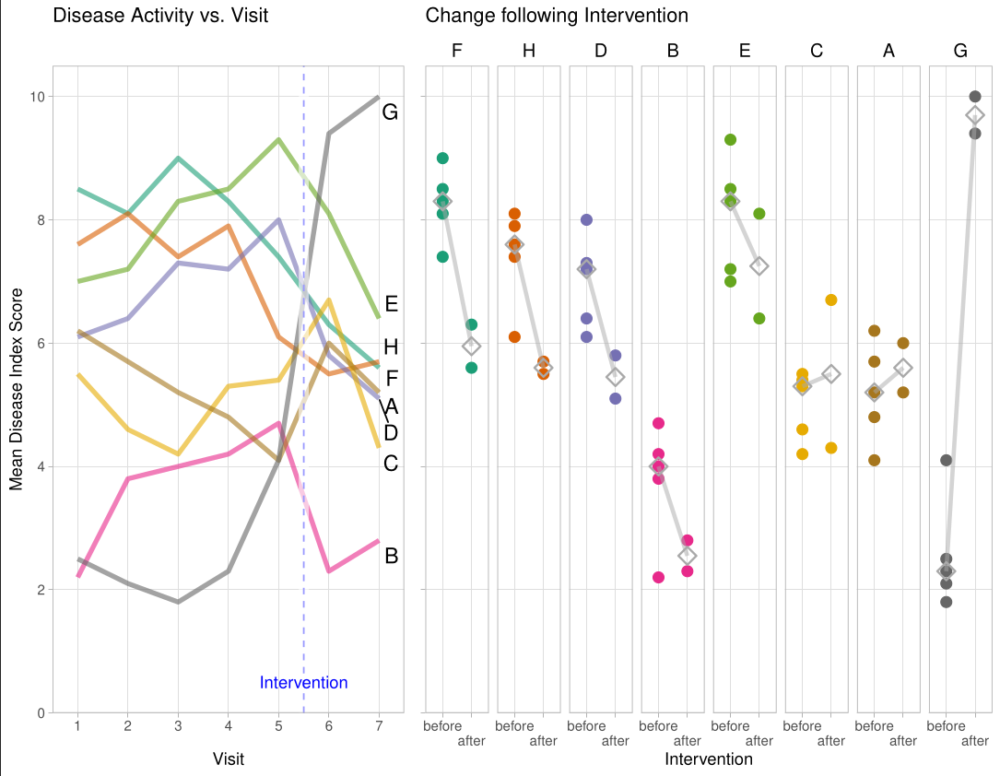

# Improving a Bad Chart
The challenge was about improving a bad chart.

A description of the challenge can be found [here](https://github.com/VIS-SIG/Wonderful-Wednesdays/tree/master/data/2024/2024-10-09).  
A recording of the session can be found [here](https://psiweb.org/vod/item/psi-vissig-wonderful-wednesday-56-improving-a-bad-chart).

## Example 1. Separate Line Plots

  
[high resolution image](./images/AndrewStaroscik_wondwend_Nov2024 - Andrew Staroscik.png)  

[link to code](#example1 code)

## Example 2. Combined Line Plots

  
[high resolution image](./images/WW55_fig1 - Thomas Weissensteiner.pdf)  

.png)  
[high resolution image](./images/WW55_fig1 - Thomas Weissensteiner(1).pdf)  

  
[high resolution image](./images/WW55_fig2 - Thomas Weissensteiner.pdf)  

.png)  
[high resolution image](./images/WW55_fig2 - Thomas Weissensteiner(1).pdf)  

[link to code](#example2 code)

## Example 3. Step-by-Step Example

  
[high resolution image](./images/step-by-step_1.jpg)  
  
[high resolution image](./images/step-by-step_2.jpg)  
  
[high resolution image](./images/step-by-step_3.jpg)  
  
[high resolution image](./images/step-by-step_4.jpg)  

[link to code](#example3 code)

# Code

## Example 1. Separate Line Plots

No code has been submitted.

[Back to blog](#example1)

## Example 2. Combined Line Plots

The Rmd file can be found [here](./code/WWchallenge091024 - Thomas Weissensteiner.Rmd).  
The html file can be found [here](./code/WWchallenge091024.html).

[Back to blog](#example2)

## Example 3. Step-by-Step Example

No code has been submitted.

[Back to blog](#example3)