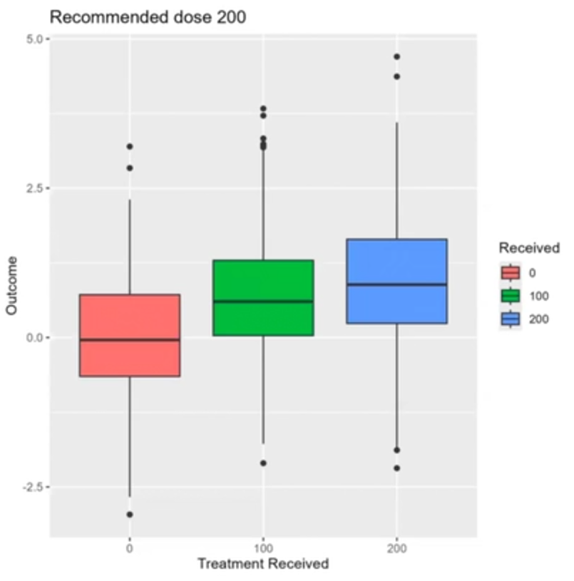
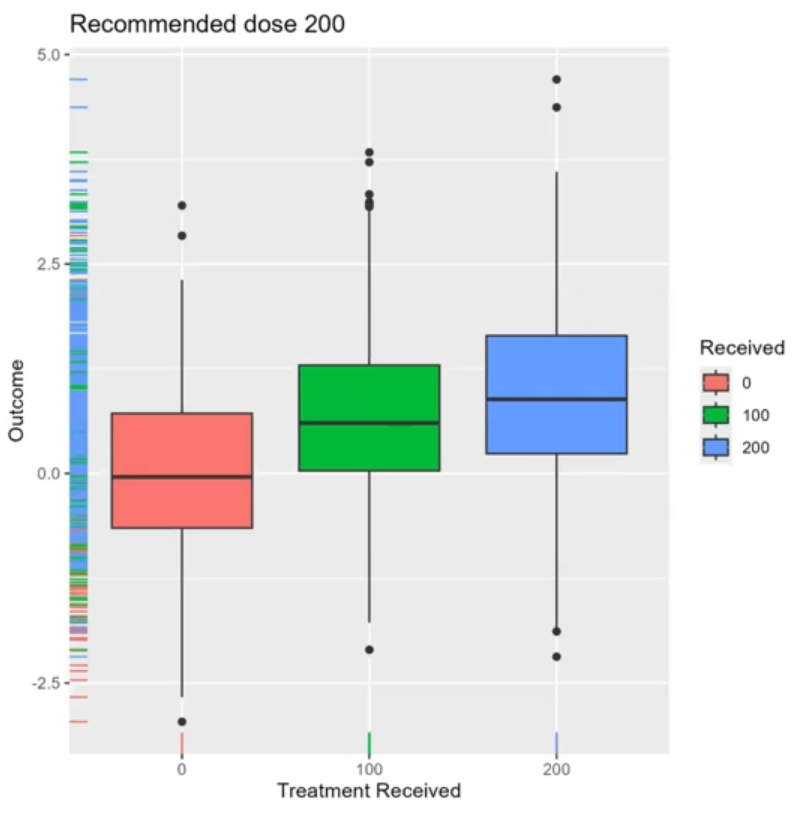
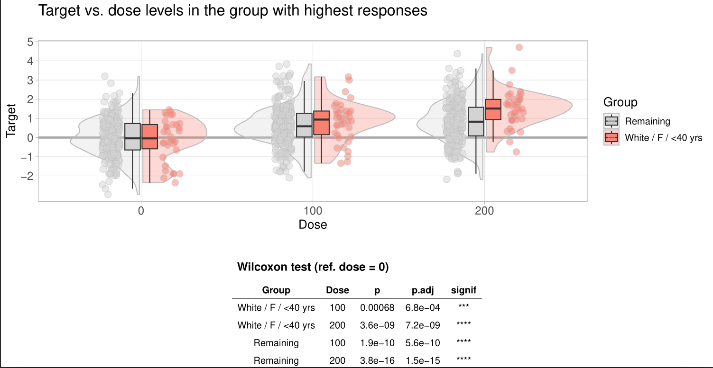

# Personalised dosing
Aim of the visualisation

- Identify subgroups with a dose response that deviates from the remaining study participants
- Therewith potential subgroups for personalized dosing could be identified

A description of the challenge can be found [here](https://github.com/VIS-SIG/Wonderful-Wednesdays/tree/master/data/2024/2024-09-11).  
A recording of the session can be found [here](https://psiweb.org/vod/item/psi-vissig-wonderful-wednesday-55).

<a id="example1"></a>

## Example 1. Identification of patients for personalized dosing with DoRiS

  
[high resolution image](./images/doris - Bodo Kirsch.png)  

[link to code](#example1 code)


<a id="example2"></a>

## Example 2. Boxplots

  
[high resolution image](./images/average.png)  

  
[high resolution image](./images/boxplot.png)  

  
[high resolution image](./images/boxplot_rugs.png)  

  
[high resolution image](./images/augmented_boxplot.png)  

[link to code](#example2 code)

<a id="example3"></a>

## Example 3. Plots by dose and subgroup

  
[high resolution image](./images/Fig1_DoseVsTarget_allPatients - Thomas Weissensteiner.pdf)  

  
[high resolution image](./images/Fig2a_bestMedianResponse_subgroupOverview_numbers - Thomas Weissensteiner.pdf)

  
[high resolution image](./images/Fig2b_bestMedianResponse_subgroupOverview_pWilcox - Thomas Weissensteiner.pdf)  

  
[high resolution image](./images/Fig2c_bestMedianResponse_subgroupOverview_pMood - Thomas Weissensteiner.pdf)  

  
[high resolution image](./images/Fig3a_doseResponse_sex_type - Thomas Weissensteiner.pdf)  

  
[high resolution image](./images/Fig3b_doseResponse_type_race - Thomas Weissensteiner.pdf)  

  
[high resolution image](./images/Fig3c_doseResponse_sex_race - Thomas Weissensteiner.pdf)  

  
[high resolution image](./images/Fig4a_bestRespondersVsRemaining - Thomas Weissensteiner.pdf)  

  
[high resolution image](./images/Fig4b_worstRespondersVsRemaining - Thomas Weissensteiner.pdf)  

[link to code](#example3 code)

<a id="example4"></a>


# Code

<a id="example1 code"></a>

## Example 1. Identification of patients for personalized dosing with DoRiS

```{r, echo = TRUE, eval=FALSE, python.reticulate = FALSE}
# Install if needed:

install.packages("devtools")
install.packages("shiny")
install.packages("shinyWidgets")
install.packages("bslib")
install.packages("bsplus")
install.packages("shinyBS")
install.packages("DT")
install.packages("tidyr")
install.packages("dplyr")


# Install and start doris

devtools::install_github("bayer-group/BIC-doris")
library(doris)

run_doris()
```


[Back to blog](#example1)


<a id="example2 code"></a>

## Example 2. Boxplots

No code has been submitted.

[Back to blog](#example2)


<a id="example3 code"></a>

## Example 3. Plots by dose and subgroup

The Rmd file can be found [here](./code/WWchallenge110924_v3 - Thomas Weissensteiner.Rmd)

[Back to blog](#example3)