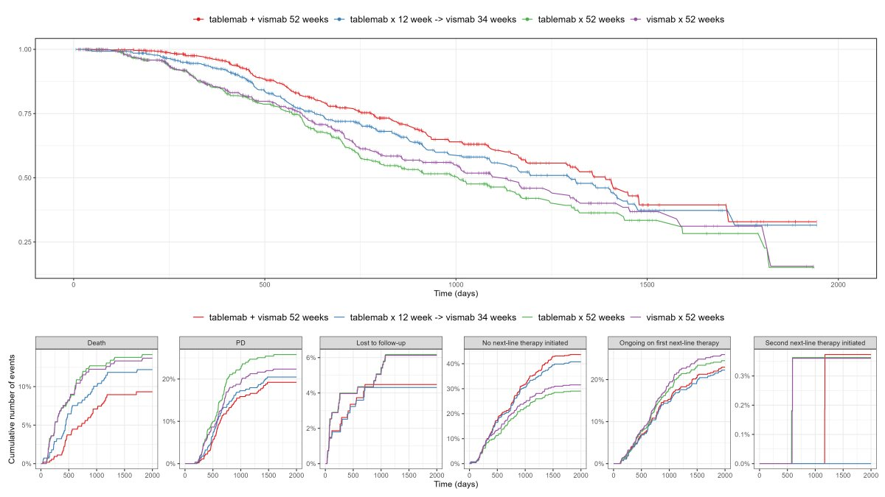
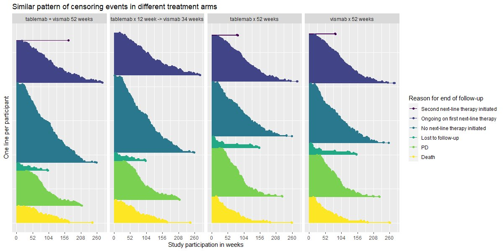

# Progression free survival
The example simulated data set is based on large phase III clinical trials in Breast cancer such as [ALTTO](https://ascopubs.org/doi/pdf/10.1200/JCO.2015.62.1797).

The “trial” aims to determine if a combination of two therapies tablemab (T) plus vismab (V) improves outcomes for metastatic human epidermal growth factor 2–positive breast cancer and increases the pathologic complete response in the neoadjuvant setting (treatment given as a first step to shrink a tumor before the main treatment or surgery).

The trial has four treatment arms, patients with centrally confirmed human epidermal growth factor 2-positive early breast cancer were randomly assigned to 1 year of adjuvant therapy with V, T, their sequence (T→V), or their combination (T+V) for 52 weeks. The primary end point was progression-free survival (PFS).

As defined by [Cancer.gov](https://www.cancer.gov/publications/dictionaries/cancer-terms/def/progression-free-survival): “the length of time during and after the treatment of a disease, such as cancer, that a patient lives with the disease but it does not get worse. In a clinical trial, measuring the progression-free survival is one way to see how well a new treatment works”.

A description of the challenge can be found [here](https://github.com/VIS-SIG/Wonderful-Wednesdays/tree/master/data/2024/2024-08-12).  
A recording of the session can be found [here](https://psiweb.org/vod/item/psi-vissig-wonderful-wednesday-54-progression-free-survival).

<a id="example1"></a>

## Example 1. Augmented survival plots

  
[high resolution image](./images/augmented_survival_1.png)  

  
[high resolution image](./images/augmented_survival_2.png)  


[link to code](#example1 code)


<a id="example2"></a>

## Example 2. Sorted lollipop plots

  
[high resolution image](./images/sorted_lollipop_1.png)  

  
[high resolution image](./images/sorted_lollipop_2.png)  


[link to code](#example2 code)

<a id="example3"></a>


# Code

<a id="example1 code"></a>

## Example 1. Augmented survival plots

Second version:

```{r, echo = TRUE, eval=FALSE, python.reticulate = FALSE}
library(dplyr)
library(ggplot2)
library(broom)
library(survival)
library(patchwork)

# load data
ADTTE <- read_csv('2024-08-12-psi-vissig-adtte.csv') %>%
  mutate(EVNTDESCN=case_when(
    EVNTDESC=="Death" ~ 1,
    EVNTDESC=="PD" ~ 2,
    EVNTDESC=="Lost to follow-up" ~ 3,
    EVNTDESC=="No next-line therapy initiated" ~ 4,
    EVNTDESC=="Ongoing on first next-line therapy" ~ 5,
    EVNTDESC=="Second next-line therapy initiated" ~ 6))

# plot KM curve by treatment 
d <- survfit(Surv(AVAL, CNSR == 0) ~ TRT01P  , data = ADTTE )  %>%
  tidy(fit) %>%
  rename(TRT01P=strata) %>%
  mutate(TRT01P=gsub('TRT01P=', '', TRT01P))

a <- ggplot(data=d, aes(x=time, y=estimate, group = TRT01P, colour = TRT01P)) +
  # do not inherit legend from ggplot
  geom_line(show.legend = T) +
  geom_point(pch=ifelse(d$n.censor>0,"|","")) +
  theme_bw() +
  theme(legend.position="top",
        legend.text = element_text(size=12)) +
  guides(colour = guide_legend(title = "")) +
  labs(y="", x="Time (days)") +
  scale_color_brewer(palette="Set1")+
  annotate("text", x=-250, 0.35, label = "Progression Free Survival", hjust = 0, vjust = 1, angle=90) +
  coord_cartesian(xlim = c(0, 2000),  clip = 'off')
a

b <- ggplot(data = ADTTE, aes(x=AVAL, y=reorder(EVNTDESC, -EVNTDESCN), colour=TRT01P)) + 
  geom_point(pch=ifelse(ADTTE$CNSR==1, "|", "x"), size=3, alpha=0.5) +
  facet_grid(cols = vars(TRT01P)) +
  theme_bw() +
  theme(legend.position="none") +
  labs(y="", x="Time (days)") +
  scale_color_brewer(palette="Set1")
b

a/b +
  plot_layout(heights = c(2, 1))

ggsave("figures/survplot_v1_2024-09-07.png", width = 16, height = 9)
```


[Back to blog](#example1)


<a id="example2 code"></a>

## Example 2. Sorted lollipop plots

No code has been submitted.


[Back to blog](#example2)