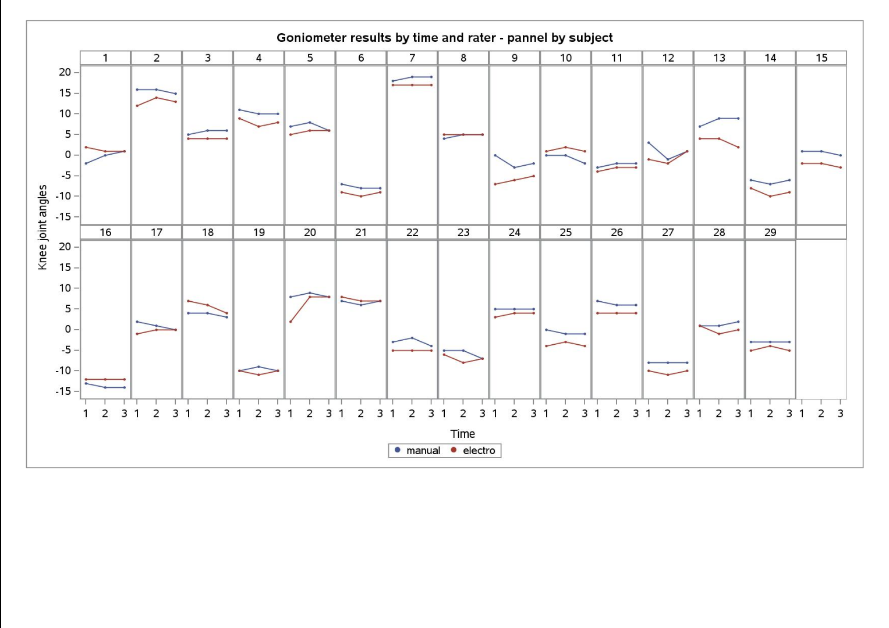
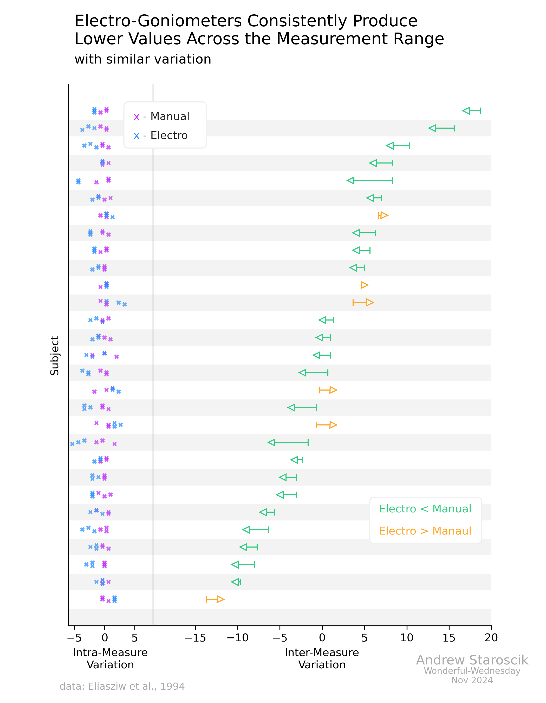
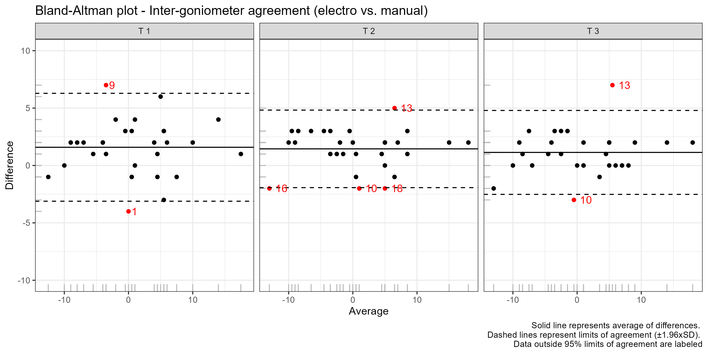
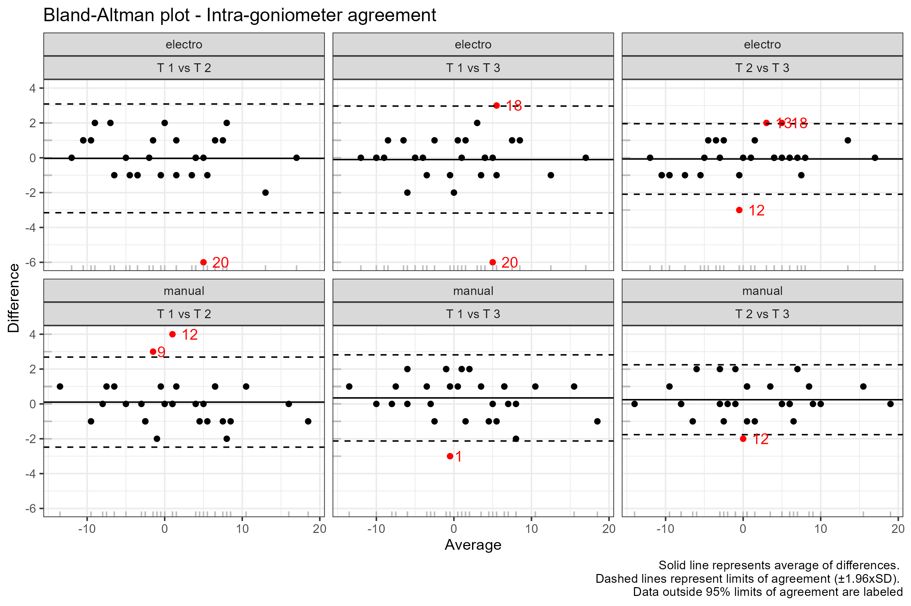
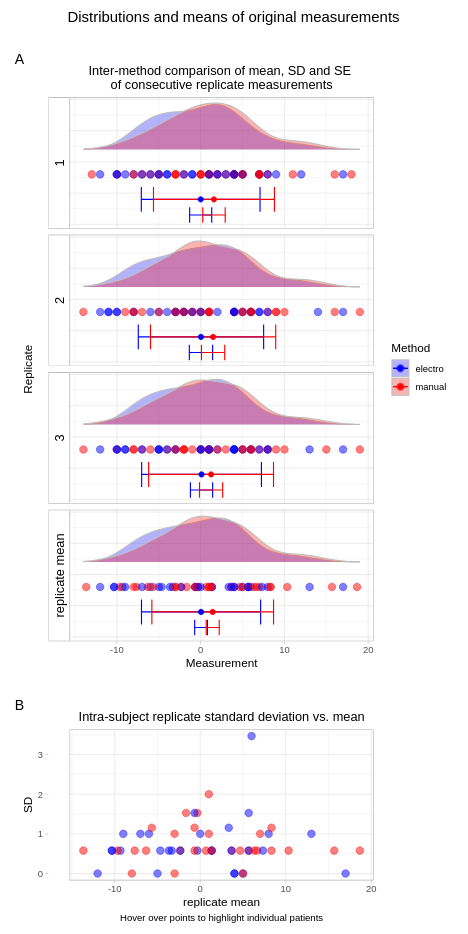
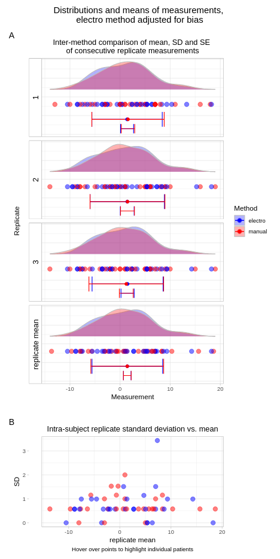
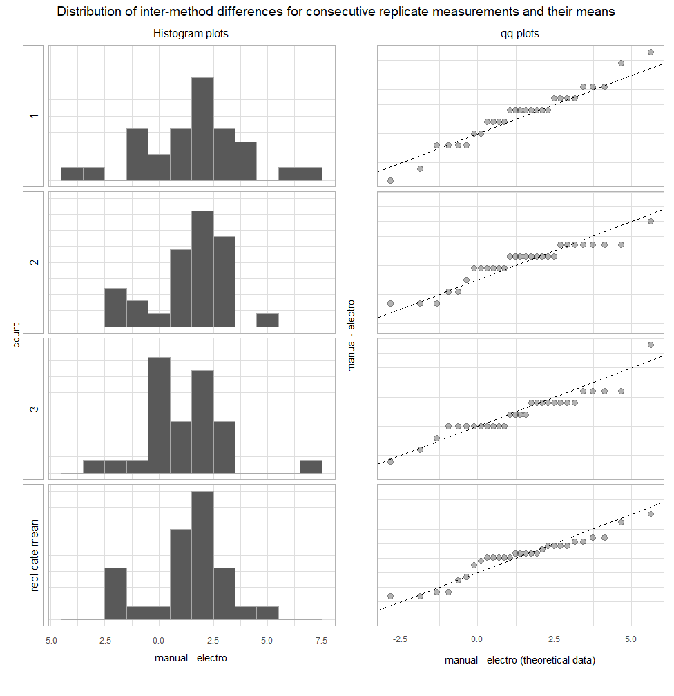
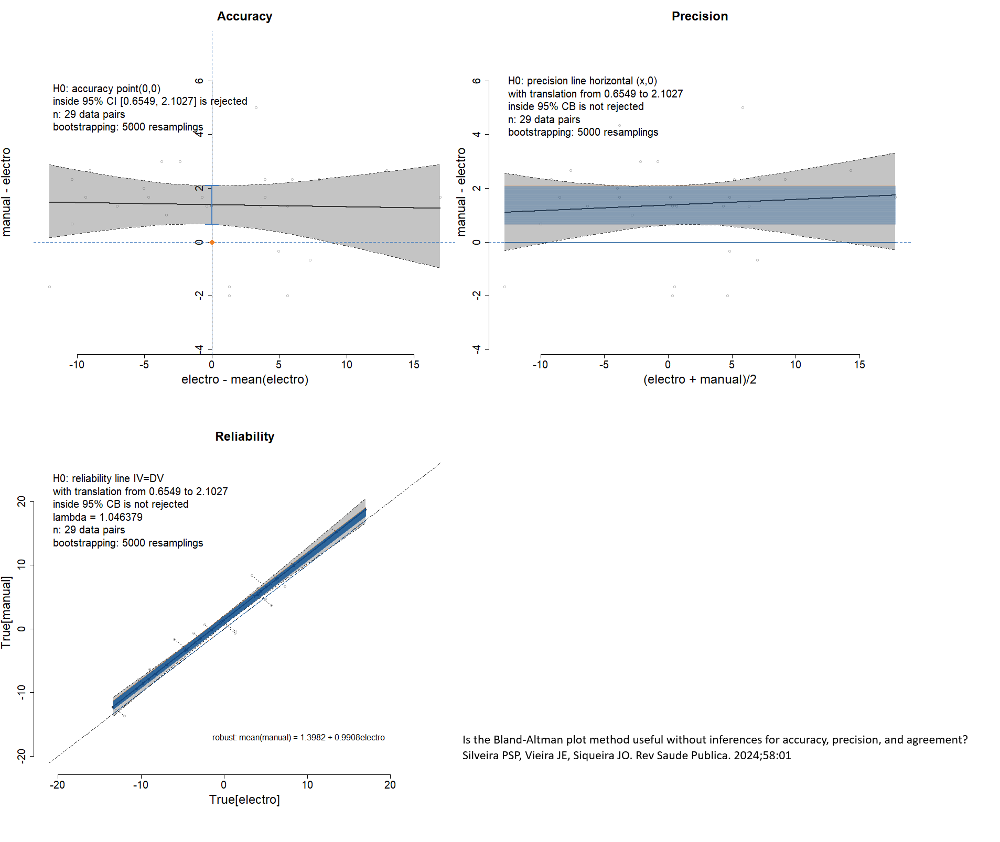

# <Overall title of the webinar>

Data set:

- The data is based on a paper by Eliasziw et al., 1994.
- One therapist uses two goniometers (i.e., electro vs. manual) to measure knee joint angles three times.
- Twenty-nine subjects (n=29) were measured three consecutive times (m=3) on each goniometer (t=2) at one joint position (i.e., full passive extension)

The Challenge:

Visualize the data to answer the following questions:

- Inter-goniometer: do the two goniometers agree?
- Intra-goniometer: do the goniometers measure consistently the knee joint angle across the three repeated measurements?

Reference:

Eliasziw M, Young SL, Woodbury MG, Fryday-Field K. Statistical methodology for the concurrent assessment of interrater and intrarater reliability: using goniometric measurements as an example. Phys Ther. 1994 Aug;74(8):777-88. doi: 10.1093/ptj/74.8.777. PMID: 8047565.

A description of the challenge can also be found [here](https://github.com/VIS-SIG/Wonderful-Wednesdays/tree/master/data/2024/2024-11-13).  
A recording of the session can be found [here](https://psiweb.org/vod/item/psi-vissig-wonderful-wednesday-57-intra--and-interrater-reliability).

<a id="example1"></a>

## Example 1. Faceted line plot

  
  
[pdf file](./images/1-Miriam-Amor-f-gon.pdf)  


[link to code](#example1 code)


<a id="example2"></a>

## Example 2. Visualization by subject

  
[high resolution image](./images/2-measures - Andrew Staroscik.png)  


[link to code](#example2 code)

<a id="example3"></a>

## Example 3. Bland-Altman plot

  
[high resolution image](./images/3a-inter-goniometer-agreement.png)  
  
[high resolution image](./images/3b-intra-goniometer-agreement.png)  


[link to code](#example3 code)

<a id="example4"></a>

## Example 4. Raw data

  


The html file can be found [here](./images/Fig1_raw - Thomas Weissensteiner.html).  


[link to code](#example4 code)


<a id="example5"></a>

## Example 5. Distribution

  
The html file can be found [here](./images/Fig2_distr - Thomas Weissensteiner.html).  


[link to code](#example4 code)


## Example 6. Distribution adjusted

  
The html file can be found [here](./images/Fig7_distr_electroAdj - Thomas Weissensteiner.html).  


[link to code](#example4 code)


## Example 7. QQ plots

  
[high resolution image](./images/Fig3_qq_hist - Thomas Weissensteiner.png)  


[link to code](#example4 code)


## Example 8. BA plot

  
The html file can be found [here](./images/Fig4_BAplots - Thomas Weissensteiner.html).  


[link to code](#example4 code)


## Example 9. Probability of agreement

  
[high resolution image](./images/Fig5_probAgr - Thomas Weissensteiner.png)  


[link to code](#example4 code)


## Example 10. Accuracy, precision, and reliability

  
[high resolution image](./images/Fig6_accur_precis_demingRegr - Thomas Weissensteiner.png)  


[link to code](#example4 code)


## Example 11. BA adjusted

  
The html file can be found [here](./images/Fig8_BAplots_electroAdj - Thomas Weissensteiner.html).  


[link to code](#example4 code)


## Example 12. Probability of agreement (adj.)

  
[high resolution image](./images/Fig9_probAgr_electroAdj - Thomas Weissensteiner.png)  


[link to code](#example4 code)


# Code

<a id="example1 code"></a>

## Example 1. Faceted line plot

The SAS file can be found [here](./code/1-Miriam-Amor-f-gon.sas).


[Back to blog](#example1)


<a id="example2 code"></a>

## Example 2. Visualization by subject

The Python file can be found [here](./code/2-ww_2024_11 - Andrew Staroscik.py).


[Back to blog](#example2)


<a id="example3 code"></a>

## Example 3. Bland-Altman plot

```{r, echo = TRUE, eval=FALSE}
library(readxl)
library(dplyr)
library(tidyr)
library(ggplot2)


# Load data
d <- read_excel('Data/2024-12-11-psi-vissig-goniometer.xlsx') |>
  mutate(time=as.numeric(time))

# Bland-Altman plot - Inter-goniometer agreement
df<-d |>
    pivot_wider(names_from = `rater`, values_from = `y`) |>
    mutate(
      time = paste("T", time),
      diff = manual - electro,
      avg = (manual + electro) / 2)
df2 <- df |>
  group_by(time) |>
  summarise(
    g_avg = mean(avg),
    g_diff = mean(diff),
    sd_diff = sd(diff),
    n = n()
  )
df2  
df <- df |>
  left_join(df2)

ggplot(data=df, aes(x = avg, y = diff, col = ifelse(diff>(g_diff+1.96*sd_diff) | diff<(g_diff-1.96*sd_diff), "1", "0"))) +
  geom_point() +
    geom_rug(col="grey") +
  # orange and blue colors do not show legend  
  scale_color_manual(values = c("black", "red")) +
  geom_hline(aes(yintercept = g_diff)) +
    geom_hline(aes(yintercept = g_diff+1.96*sd_diff), linetype = "dashed") +
    geom_hline(aes(yintercept = g_diff-1.96*sd_diff), linetype = "dashed") +
  #geom_smooth(method = "lm", se = F) +
  labs(
    title = "Bland-Altman plot - Inter-goniometer agreement (electro vs. manual)",
    x = "Average",
    y = "Difference",
    caption = "Solid line represents average of differences. \nDashed lines represent limits of agreement (±1.96xSD). \nData outside 95% limits of agreement are labeled"
  ) +
  facet_wrap(time~.) +
  #plot data outside g_diff+1.96*sd_diff
  geom_text(data=df, aes(label = ifelse(diff>(g_diff+1.96*sd_diff) | diff<(g_diff-1.96*sd_diff), id, NA), hjust = -0.5)) +
  scale_y_continuous(limits = c(-10, 10)) +
  theme_bw() +
  theme(legend.position = "none")
# save the plot
ggsave("Figures/inter-goniometer-agreement.png", width = 10, height = 5)

# Bland-Altman plot - Intra-goniometer agreement
df<-NULL
for (i in 1:3){
  c <- combn(1:3,2)[,i]
  d1 <- d |>
    filter(time %in% c) |>
    pivot_wider(names_from = `time`, values_from = `y`) 
  
  names(d1) <- c("id", "goniometer", "A", "B") 
  
  d2 <- d1 |>
    mutate(
      diff = A - B,
      avg = (A + B) / 2,
      comparison=paste("T",c[1],"vs", "T", c[2]))
  
  df <- rbind(df, d2)
}

df2 <- df |>
  group_by(goniometer, comparison) |>
  summarise(
    g_avg = mean(avg),
    g_diff = mean(diff),
    sd_diff = sd(diff),
    n = n()
  )

df <- df |>
  left_join(df2)
ggplot(data=df, aes(x = avg, y = diff, col = ifelse(diff>(g_diff+1.96*sd_diff) | diff<(g_diff-1.96*sd_diff), "1", "0"))) +
  geom_point() +
  geom_rug(col="grey") +
  # orange and blue colors do not show legend  
  scale_color_manual(values = c("black", "red")) +
  geom_hline(aes(yintercept = g_diff)) +
  geom_hline(aes(yintercept = g_diff+1.96*sd_diff), linetype = "dashed") +
  geom_hline(aes(yintercept = g_diff-1.96*sd_diff), linetype = "dashed") +
  #geom_smooth(method = "lm", se = F) +
  labs(
    title = "Bland-Altman plot - Intra-goniometer agreement",
    x = "Average",
    y = "Difference",
    caption = "Solid line represents average of differences. \nDashed lines represent limits of agreement (±1.96xSD). \nData outside 95% limits of agreement are labeled"
  ) +
  # add text to geom_hline
  facet_wrap(goniometer~comparison) +
  geom_text(aes(label = ifelse(diff>(g_diff+1.96*sd_diff) | diff<(g_diff-1.96*sd_diff), id, NA), hjust = -0.5)) +
  theme_bw() +
  theme(legend.position = "none")
# save the plot
ggsave("Figures/intra-goniometer-agreement.png", width = 9, height = 6)
```

[Back to blog](#example3)


<a id="example4 code"></a>

## Examples 4 - 12.

The html file can be found [here](./code/WWchallenge131124.html).

[Back to blog](#example4)