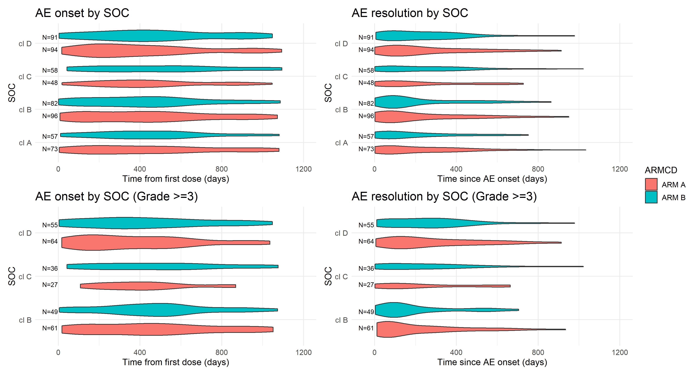
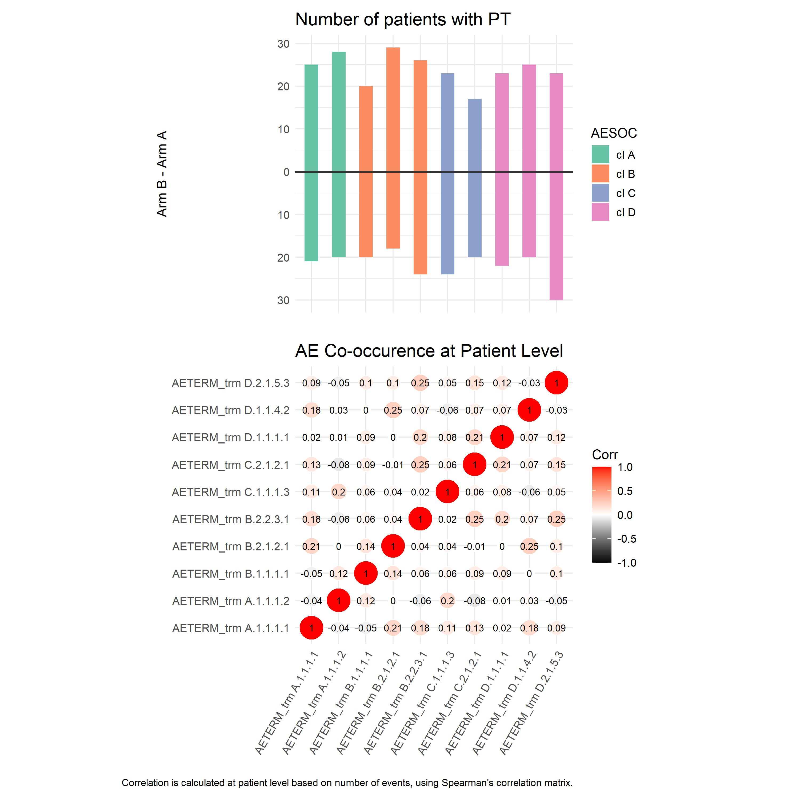
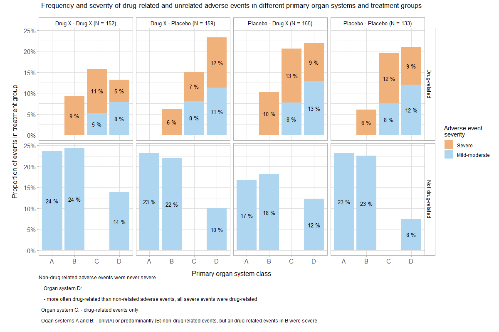
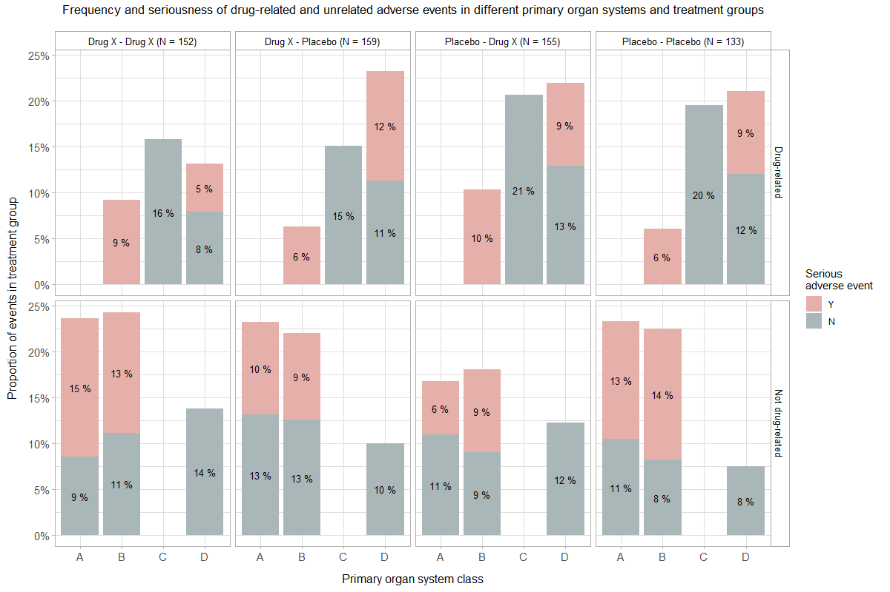
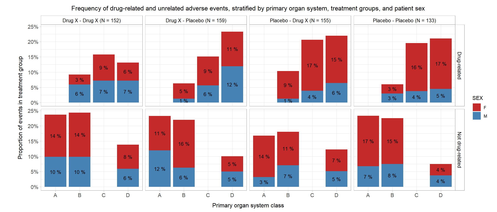
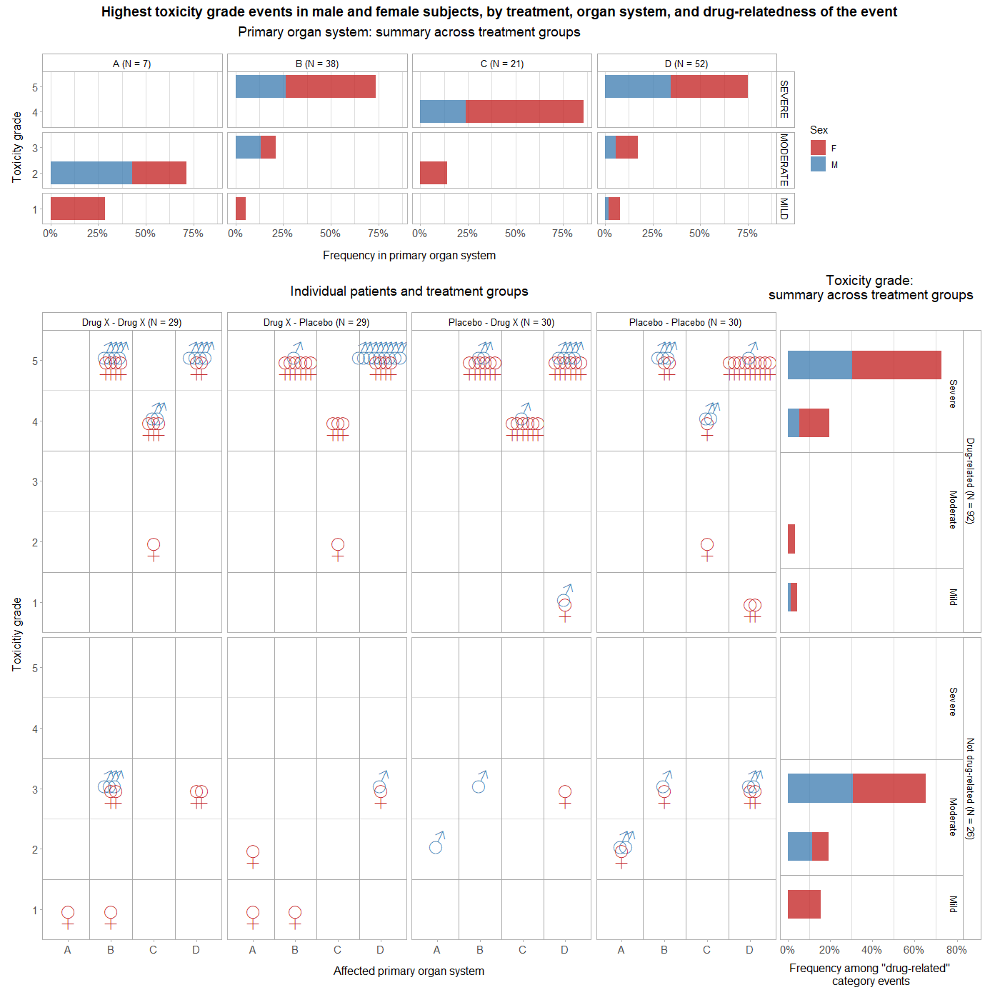
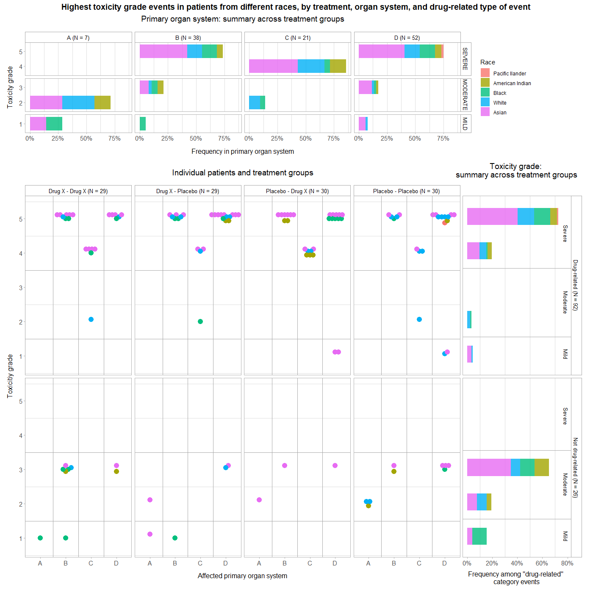
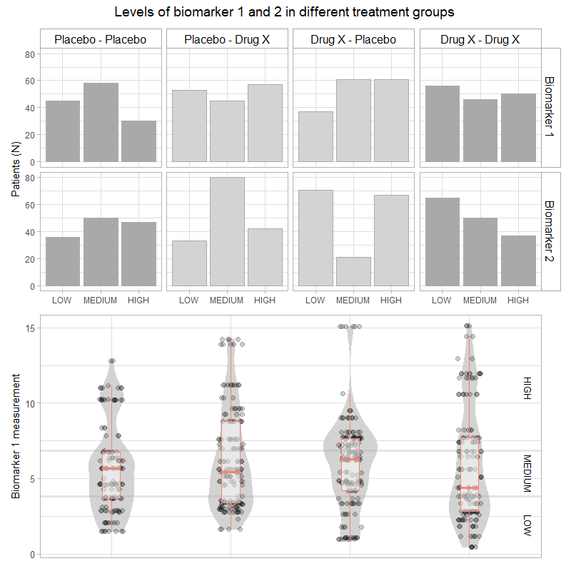
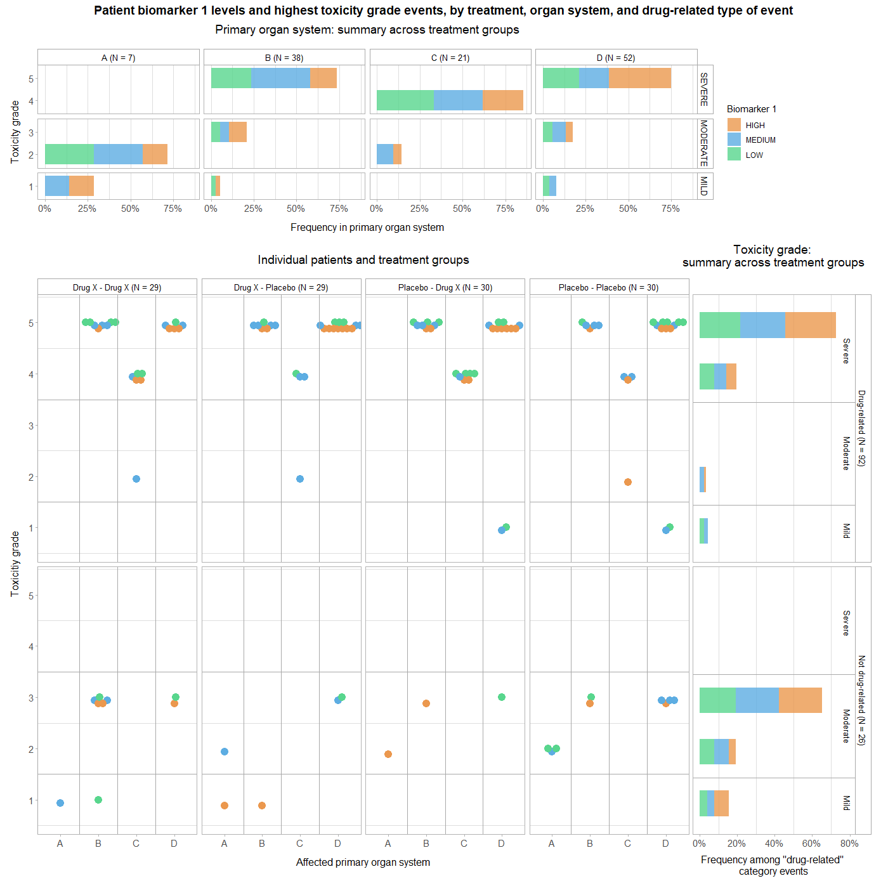
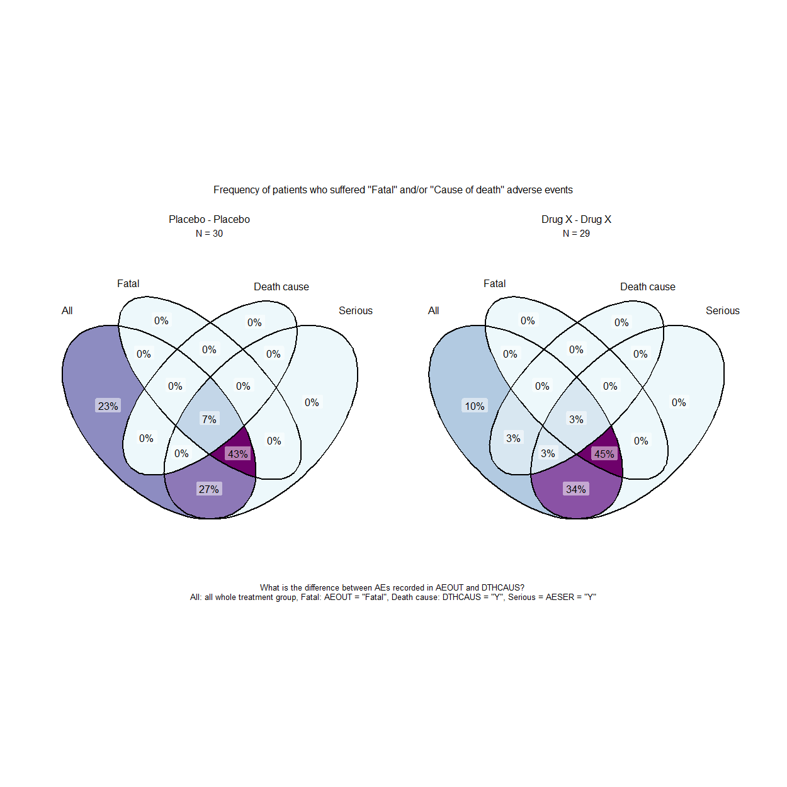

# Adverse Event display

The time course of adverse events can be shown with violin plots. To explore the co-occurrence of events a visually enhanced correlation matrix is helpful. Various ways are presented to effectively combine (stacked) bar charts with indivial patient data display and violin plots to explore subgroup differences.

Data set:

Sample ADAE data set generated using teal.data package in R. Data limited to two treatments (Drug X, Placebo), although subjects may switch between the two.

The Challenge:

Produce a visualization using this sample ADAE data set The challenge is open-ended, and you can choose a feature of the data to focus on. Possible ideas:

- Investigate the co-occurrence of adverse events (the October 2020 webinar might provide some inspiration!) or ‘clusters’ of adverse events – do certain groups of adverse events tend to occur alongside one another or at certain times
- Investigate the time to a given event or adverse event profiles over time
- Explore the hierarchical nature of adverse events (MedDRA terms)


A description of the challenge can also be found [here](https://github.com/VIS-SIG/Wonderful-Wednesdays/tree/master/data/2025/2025-01-08).  
A recording of the session can be found [here](https://psiweb.org/vod/item/psi-vissig-wonderful-wednesday-59-adverse-event-display).

## Visualisations

<a id="example1"></a>

### Example 1: Violin plot on onset and resolution

  

[link to code](#example1 code)


<a id="example2"></a>

### Example 2: Co-occurence

  

[link to code](#example2 code)

<a id="example3"></a>

### Example 3: Frequency and severity of drug-related and unrelated adverse events, in different primary organ systems and treatment groups

  

[link to code](#example3 code)

<a id="example4"></a>

### Example 4: Frequency and seriousness of drug-related and unrelated adverse events, in different primary organ systems and treatment groups

The "seriousness" of an adverse event is determined by several other categories, including whether the event was related to cancer or congential disease, hospitalisation, disability or death. 


"Seriousness" and "severity" form overlapping but non-identical sets. 
<br>

  

[link to code](#example4 code)

<a id="example5"></a>

### Example 5: Frequency of drug-related and unrelated adverse events, stratified by primary organ system, treatment groups, and patient sex

  

[link to code](#example5 code)

A Practical and Efficient Approach in Generating AE (Adverse Events) Tables within a Clinical Study Environment. Jiannan Hu Vertex Pharmaceuticals, Inc., NESUG 2011
https://www.lexjansen.com/nesug/nesug11/cc/cc13.pdf
"Adverse event analysis is a pivotal piece in the safety analysis, and it is common in almost every trial, and every clinical study report. The adverse events related to study drug will be summarized, as well as by severity, by relationship. They are tabulated by MedDRA system organ class (SOC) and preferred term (PT), and _each subject is counted only once_, and the sorting is by descending frequency of SOC and PT"

<a id="example6"></a>

### Example 6: Toxicity grade, affected primary organ system of the most severe adverse event, stratified by treatment, adverse event relation to drug, and patient sex

  

[link to code](#example6 code)

<a id="example7"></a>

### Example 7: Toxicity grade, affected primary organ system of the most severe adverse event, stratified by treatment, adverse event relation to drug, and patient race

  

[link to code](#example7 code)

<a id="example8"></a>

### Example 8: Discretisation of biomarker 1 measurements

Biomarker 1 data were measurements were a continuous variable, whereas biomarker 2 were recorded as "low", "medium", or "high". This plot shows how I discretised biomarker 1 measurements, and compares the numbers of patients in each treatment group and biomarker level category.
Discretising biomarker 1 allows using it as the colour-coded variable in the same kind of plot as the two above.

  

[link to code](#example8 code)

<a id="example9"></a>

### Example 9: Toxicity grade and affected primary organ system of the most severe adverse event in each patient, stratified by treatment, adverse event relation to drug, and biomarker 1 categorical level

  

[link to code](#example9 code)

<a id="example10"></a>

### Example 10: Fatal AEs and cause of death: Visualising membership in multiple sets and their intersections

The ASDL categories AEOUT = FATAL and DTHCAUS = ADVERSE EVENT are related but serve different purposes in the context of clinical trial data.
When AEOUT (Outcome of Adverse Event) is set to "FATAL," it means that the adverse event resulted in the death of the subject.
When DTHCAUS (Cause of Death) is set to "ADVERSE EVENT," it indicates that the cause of death was an adverse event.
AEOUT = FATAL indicates that the adverse event led to death, while DTHCAUS = ADVERSE EVENT specifies that the cause of death was the adverse event itself ^2^.
Use AEOUT = FATAL to indicate the outcome of the adverse event and DTHCAUS = ADVERSE EVENT to specify the cause of death when reporting deaths from treatment-related adverse events.
If an adverse event is determined to be related to the treatment (AEREL), and the outcome of the adverse event is fatal (AEOUT = FATAL), then the cause of death (DTHCAUS) would likely be reported as an adverse event.

What is the difference between AEs recorded in AEOUT and DTHCAUS? 
If "fatal adverse events", represent actual deaths, than their frequency appears extremely high. On the other hand, if "cause of death" represents real fatal events, why is there so little overlap with "fatal" or "serious" adverse events?

  

[link to code](#example10 code)

You may find an updated version of a document containing examples 3 to 10 on: [Rpubs/thomas-weissensteiner](https://rpubs.com/thomas-weissensteiner).

## Code

<a id="example1 code"></a>

### Example 1. Violin plot on onset and resolution

```{r, file = './code/1_AE-vis_weiquan.R', echo = TRUE, eval=FALSE}

```

[Back to blog](#example1)

<a id="example2 code"></a>

### Example 2. Co-occurence

```{r, file = './code/2_AE-vis_weiquan.R', echo = TRUE, eval=FALSE}

```

[Back to blog](#example2)

### Preparation for example 3 to 10

```{r libraries_and_data, echo = TRUE, eval=FALSE}
#################################
# Author: Thomas Weissensteiner #
#################################

# - chunk libraries_and_data

## Load R libraries and the data file                             - #

library(dplyr)        # version 1.1.4  # general grammar
library(purrr)        # version 1.0.2  # set_names, list_rbind, reduce
library(tidyr)        # version 1.3.1  # pivot_longer, pivot_wider
library(tibble)       # version 3.2.1  # deframe
library(purrr)        # version 1.0.2  # list_rbind

library(ggplot2)      # version 3.4.0  # graphs
library(ggbeeswarm)   # version 0.7.2  # geom_beeswarm
library(ggh4x)        # version 0.3.0  # facet_grid2
library(ggVennDiagram)# version 1.5.2  # ggVennDiagram

library(patchwork)    # version 1.3.0  # assembly of interactive plots, synchronous response

library(kableExtra)   # rendering tables in HTML format

dummyAEData <- read.csv("https://raw.githubusercontent.com/VIS-SIG/Wonderful-Wednesdays/refs/heads/master/data/2025/2025-01-08/DummyAEData.csv")
```

```{r data_check, echo = TRUE, eval=FALSE}
# - chunk data_check
# - Required: R libraries, dummyAEData (chunk libraries_and_data)

# - This chunk reproduces my initial checks for non-informative and redundant data columns, and the following cleaning and transformation steps
# - The results is a new data frame dummyAEData_ed (edited) which is required for the generation of the figures below
# - Instead of this chunk, you can run chunk_dataEd below which generates dummyAEData_ed in a more concise way, without checks on intermediate results 

dummyAEData %>% dim()
# [1] 599  93            Original data set has 599 rows and 93 columns

## Remove columns that do not differentiate any patient groups

# Identify columns containing duplicated information (the same values in same rows)
singleValCols <- 
  dummyAEData %>%
    apply(., 2, function(x) unique(x) %>% 
    length) %>% .[as.numeric(.)==1] %>% names
# singleValCols
# [1] "STUDYID"  "AGEU"     "ITTFL"    "SAFFL"    "TRTEMFL"  "SMQ02NAM" "SMQ02SC" 

# Identify columns comprised of NAs 
naCols <- 
  dummyAEData %>% 
    apply(., 2, function(x) unlist(x) %>% {!is.na(.)} %>% 
    sum == 0) %>% .[as.numeric(.)==1] %>% names
# naCols
#[1] "SMQ02NAM" "SMQ02SC" 

# Start generating a data subset with "interesting" columns only
dummyAEData_ed <- 
  dummyAEData %>% 
    select(
      !all_of(c(singleValCols, naCols) ) 
      )

# Remove other columns with no patient-specific information
dummyAEData_ed <-
  dummyAEData_ed %>% 
  select(!X)


## Remove columns with redundant information

# Function for flagging redundant columns
check_redundant_columns <- 
  function(data) {
    pairs <- combn(names(data), 2) %>% t
    redundant <- 
      combn(names(data), 2, function(cols) {
        col1 <- data[[cols[1]]]
        col2 <- data[[cols[2]]]
        if (is.factor(col1)) col1 <- as.character(col1)        # converts variables that are factors to character
        if (is.factor(col2)) col2 <- as.character(col2)
        if (is.numeric(col1) && is.numeric(col2)) {
          all(
            (is.na(col1) & is.na(col2)) |                      # both NA or floating point near equality for numeric columns
            (!is.na(col1) & !is.na(col2) & dplyr::near(col1, col2)) 
            )
          } else {
          all(
            (is.na(col1) & is.na(col2)) |                      # both NA or exact equality for non-numeric columns
            (!is.na(col1) & !is.na(col2) & col1 == col2)
          )
        }
      }
    )
    data.frame(Pairs = pairs, Redundant = redundant) %>% 
    filter(Redundant== TRUE) %>% 
    filter(Pairs.1 %in% setdiff(.$Pairs.1, .$Pairs.2))  %>%  
    with(., table(Pairs.1, Pairs.2)) %>% 
    { lapply(1:nrow(.), function(i) 
      c(rownames(.)[i],
      colnames(.)[.[i,] == 1]
      )
    )
    } %>% unname()
  }
# Note: if no redundant columns are found this function will generate: 
# Error in `[.default`(., i, ) : subscript out of bounds
# Called from: NextMethod()

# Check for identical columns (will not identify redundant columns if values are coded differently)
redundant_columns <- dummyAEData_ed %>% check_redundant_columns() 
#redundant_columns
#[[1]][1] "ARM"    "ACTARM" "TRT01A" "TRT01P"
#[[2]][1] "ARMCD"    "ACTARMCD"
#[[3]][1] "ASEQ"  "AESEQ"
#[[4]][1] "EOSSTT" "EOTSTT"
#[[5]][1] "TRT01EDTM" "AP01EDTM"  "AP02SDTM"  "TRT02SDTM"
#[[6]][1] "TRTEDTM"   "AP02EDTM"  "TRT02EDTM"
#[[7]][1] "TRTSDTM"   "AP01SDTM"  "TRT01SDTM"


# Selection of non-redundant variables
# TRT01A: actual initial treatment (other variables refer to planned treatment)
# ACTARMCD: "a value for an Actual Arm Code (ACTARMCD) variable is expected to be equal to a value of an Arm Code (ARMCD) variable"(FDAC197 / SD2236)
# AESEQ: name indicates relation to AEs, which we are specifically interested in
# EOTSTT: end of treatment and end of study status seem identical in this data set, kept name referring to treatment
# TRTSDTM: datetime of First Exposure to Treatment
# TRT01EDTM: datetime of Last Exposure in Period 01 (identical to TRT02SDTM: Datetime of First Exposure to Treatment in Period 02)
# TRT02EDTM: datetime of Last Exposure in Period 02
selected_columns <- c("TRT01A", "ACTARMCD", "AESEQ", "EOTSTT", "TRTSDTM", "TRT01EDTM", "TRT02EDTM")

dummyAEData_ed <- 
  dummyAEData_ed %>% 
  select(
    !setdiff(
      unlist(redundant_columns), 
      selected_columns
      ) 
    )


## Remove columns with redundant information masked by different codings

# Inspect adverse event variables
# dummyAEData_ed %>% .[ ,grep("AE", names(.))] %>% head()

# Unify coding of potentially redundant variables
dummyAEData_ed <- 
  dummyAEData_ed %>% 
  mutate(
    AETERM = gsub("trm ", "", AETERM),                 # adverse event variables
    AELLT = gsub("llt ", "", AELLT),
    AEDECOD = gsub("dcd ", "", AEDECOD),
    AEHLT = gsub("hlt ", "", AEHLT),
    AEHLGT = gsub("hlgt ", "", AEHLGT),
    AEBODSYS = gsub("cl ", "", AEBODSYS),
    AESOC = gsub("cl ", "", AESOC),
    ACTARMCD = case_when(                              # treatment group
      ACTARMCD == "ARM A" ~ "Drug X",
      ACTARMCD == "ARM B" ~ "Placebo"
      ),
    across(c(TRT01A, TRT02P, TRT02A), 
      function(x) gsub("^[AB]: ", "", x)
      ),
    SMQ01SC = case_when(
      SMQ01NAM == "C.1.1.1.3/B.2.2.3.1 AESI" ~ "C.1.1.1.3/B.2.2.3.1 AESI",
      is.na(SMQ01NAM) ~ NA
      )
    )

# dummyAEData_ed %>% check_redundant_columns()
#[1]][1] "ACTARMCD" "TRT01A"  
#[[2]][1] "AETERM"  "AEDECOD" "AELLT"
#[[3]][1] "SMQ01NAM" "SMQ01SC"

# Selection of non-redundant variables, merging of 1st and 2nd treatment variables into a single cross-over group variable
# TRT01A: Actual initial treatment 
# AEDECOD: also called preferred term, restricted to a single medical concept
dummyAEData_ed <- 
  dummyAEData_ed %>% 
  select(!c(ACTARMCD, AETERM, AELLT, SMQ01SC) ) %>% 
  rowwise() %>% 
  mutate(
    Group = paste(TRT01A, "-", TRT02A),
    .keep = "unused"
    )

# Remove additional columns with information included in other columns
dummyAEData_ed <- 
  dummyAEData_ed %>% 
  select(!c(USUBJID, INVID, INVNAM) )    # covered by SITEID and SUBJID 


## Generate some categorical variables and ordered factors

dummyAEData_ed <- 
  dummyAEData_ed %>% 
  mutate(
    AESEV = factor(                                    
      AESEV, levels = c("MILD", "MODERATE", "SEVERE")
      ),
    BMRKR2 = factor(
      BMRKR2, levels = c("HIGH", "MEDIUM", "LOW")
      ),
    Group = factor(
      Group, 
      levels = c(
        "Placebo - Placebo", 
        "Drug X - Placebo", 
        "Placebo - Drug X", 
        "Drug X - Drug X"
        )
      ),
    AEREL = case_when (
      AEREL == "Y" ~ "Drug-related", 
      AEREL == "N" ~ "Not drug-related"
      ),
    AEREL = factor(
      AEREL, 
      levels = c("Drug-related", "Not drug-related")
      ),
    AESER = factor(
      AESER, 
      levels = c("Y", "N")
      ),
    AESEV_2 = case_when(
      AESEV == "SEVERE" ~ "Severe",
      AESEV %in% c("MILD", "MODERATE") ~ "Mild-moderate"
      ),
      .keep = "unused",
    AESEV_2 = factor(AESEV_2, 
      levels = c("Severe", "Mild-moderate")
      ),
    SEX = factor(
      SEX, 
      levels = c("F", "M")),
    RACE = case_when(
      RACE == "NATIVE HAWAIIAN OR OTHER PACIFIC ISLANDER" ~ "Pacific Ilander",
      RACE == "AMERICAN INDIAN OR ALASKA NATIVE" ~ "American Indian",
      RACE == "BLACK OR AFRICAN AMERICAN" ~ "Black",
      RACE == "WHITE" ~ "White",
      RACE == "ASIAN" ~ "Asian"
      ),
    RACE = factor(
      RACE, 
      levels = c(                                                  # ordered by number of patients
        "Pacific Ilander",
        "American Indian",
        "Black",
        "White",
        "Asian")
      )
    )


## Some initial summaries and observations

# Observations (rows) by treatment groups
dummyAEData_ed %>% group_by(Group,  TRT02P) %>% summarise(n())
# A tibble: 8 × 4
## Groups:   TRT01A, TRT02P [4]
#  TRT01A  TRT02P  TRT02A  `n()`
#  <chr>   <chr>   <chr>   <int>
#1 Drug X  Drug X  Drug X     53
#2 Drug X  Drug X  Placebo    93
#3 Drug X  Placebo Drug X     99
#4 Drug X  Placebo Placebo    66
#5 Placebo Drug X  Drug X     76
#6 Placebo Drug X  Placebo    65
#7 Placebo Placebo Drug X     79
#8 Placebo Placebo Placebo    68
# Possible scenario:
# - TRT01A: actual treatment for the blinded placebo-controlled period
# - TRT02P: planned treatment of the subsequent open label period
# - TRT02A: actual subsequent treatment

# Numbers of unique types of adverse events for each level of the term hierarchy (increasing order)
dummyAEData_ed %>% 
  data.frame %>% 
  summarize (across(c(AEDECOD, AEHLT, AEHLGT, AEBODSYS, AESOC), function (x) unique(x) %>% length ))
#  AEDECOD AEHLT AEHLGT AEBODSYS AESOC
#       10     9      8        7     4

dummyAEData_ed %>% group_by(AEDECOD, AEHLT, AEHLGT, AEBODSYS, AESOC) %>% summarize (n())
# A tibble: 10 × 6
# Groups:   AEDECOD, AEHLT, AEHLGT, AEBODSYS [10]
#   AEDECOD   AEHLT   AEHLGT AEBODSYS AESOC `n()`
#   <chr>     <chr>   <chr>  <chr>    <chr> <int>
# 1 A.1.1.1.1 A.1.1.1 A.1.1  A.1      A        65
# 2 A.1.1.1.2 A.1.1.1 A.1.1  A.1      A        65
# 3 B.1.1.1.1 B.1.1.1 B.1.1  B.1      B        48
# 4 B.2.1.2.1 B.2.1.2 B.2.1  B.2      B        62
# 5 B.2.2.3.1 B.2.2.3 B.2.2  B.2      B        68
# 6 C.1.1.1.3 C.1.1.1 C.1.1  C.1      C        63
# 7 C.2.1.2.1 C.2.1.2 C.2.1  C.2      C        43
# 8 D.1.1.1.1 D.1.1.1 D.1.1  D.1      D        53
# 9 D.1.1.4.2 D.1.1.4 D.1.1  D.1      D        66
#10 D.2.1.5.3 D.2.1.5 D.2.1  D.2      D        66

# Severe vs. serious AEs
dummyAEData_ed %>% group_by(AESEV, AESER) %>% summarise (N=n())
# Groups:   AESEV [3]
#  AESEV    AESER     N
#  <fct>    <chr> <int>
#1 MILD     N       131
#2 MILD     Y        68
#3 MODERATE N       171
#4 MODERATE Y        65
#5 SEVERE   N        63
#6 SEVERE   Y       101

# Deaths

# DTHADY: relative time of death

# Look up columns with with information on patient death

dummyAEData_ed %>% .[ ,grep("DTH", names(.))] %>% head

# DTHFL, ADTHAUT, DTHCAUS, DTHCAT are redundant when filtered for DTHCAT = NA or DTHFL == "N"
dummyAEData_ed %>% 
    select(DTHFL, ADTHAUT, DTHCAUS, DTHCAT) %>% 
    filter(is.na(DTHCAT)) %>% 
    mutate(DTHFL = case_when(DTHFL == "N" ~ NA) ) %>% 
    check_redundant_columns() 
#[[1]][1] "DTHFL"   "ADTHAUT" "DTHCAT"  "DTHCAUS"

dummyAEData_ed %>% 
  select(DTHFL, ADTHAUT, DTHCAUS, DTHCAT) %>% 
  filter(DTHFL == "N" ) %>% 
  mutate(DTHFL = case_when(DTHFL == "N" ~ NA) ) %>% 
  check_redundant_columns()
#[[1]][1] "DTHFL"   "ADTHAUT" "DTHCAT"  "DTHCAUS"

# AETOXGR 5 is *not* defined by patient death: maximum toxicity of patients' AEs in DTHCAUS = ADVERSE EVENT can be as low as 1:
dummyAEData_ed %>% select(SUBJID, AETOXGR, DTHFL, ADTHAUT, DTHCAUS, DTHCAT) %>% filter (DTHCAUS == "ADVERSE EVENT") %>% group_by(SUBJID) %>% slice(which.max(AETOXGR)) %>% arrange(AETOXGR) 
# A tibble: 9 × 6
# Groups:   SUBJID [9]
#  SUBJID AETOXGR DTHFL ADTHAUT DTHCAUS       DTHCAT       
#  <chr>    <int> <chr> <chr>   <chr>         <chr>        
#1 id-386       1 Y     Yes     ADVERSE EVENT ADVERSE EVENT
#2 id-134       3 Y     Yes     ADVERSE EVENT ADVERSE EVENT
#3 id-128       4 Y     Yes     ADVERSE EVENT ADVERSE EVENT
#4 id-62        4 Y     Yes     ADVERSE EVENT ADVERSE EVENT
#5 id-126       5 Y     Yes     ADVERSE EVENT ADVERSE EVENT
#6 id-139       5 Y     Yes     ADVERSE EVENT ADVERSE EVENT
#7 id-235       5 Y     Yes     ADVERSE EVENT ADVERSE EVENT
#8 id-319       5 Y     Yes     ADVERSE EVENT ADVERSE EVENT
#9 id-346       5 Y     Yes     ADVERSE EVENT ADVERSE EVENT
# Same result with filter (DTHCAT == "ADVERSE EVENT" )

```


```{r chunk_dataEd, echo = TRUE, eval=FALSE}
# - chunk dataEd
# - Required: R libraries, dummyAEData (chunk libraries_and_data)

# - This chunk generates dummyAEData_ed (edited) in a more concise way than data_check
# - dummyAEData_ed is required for the generation of all of the following figures


## Remove columns without patient-specific information, comprised of NA values, or containing duplicated information (the same values in same rows)

naCols <- 
  dummyAEData %>% 
    apply(., 2, function(x) unlist(x) %>% {!is.na(.)} %>% 
    sum == 0) %>% .[as.numeric(.)==1] %>% names

singleValCols <- 
  dummyAEData %>%
    apply(., 2, function(x) unique(x) %>% 
    length) %>% .[as.numeric(.)==1] %>% names

dummyAEData_ed <- 
  dummyAEData %>% 
    select(
      !X &
      !all_of(c(singleValCols, naCols) )
      )


## Remove columns with redundant information

dummyAEData_ed <- 
  dummyAEData_ed %>% 
  select(!c(
    ARM, ACTARM, ARMCD, ACTARMCD, 
    AETERM, AELLT, SMQ01SC,
    TRT01P, ASEQ, EOSSTT, 
    AP01EDTM, AP02SDTM, 
    TRT02SDTM, TRTEDTM, 
    AP02EDTM, AP01SDTM, TRT01SDTM, 
    USUBJID, INVID, INVNAM) 
    )


# Unify coding
dummyAEData_ed <- 
  dummyAEData_ed %>% 
  mutate(
    AEDECOD = gsub("dcd ", "", AEDECOD),
    AEHLT = gsub("hlt ", "", AEHLT),
    AEHLGT = gsub("hlgt ", "", AEHLGT),
    AEBODSYS = gsub("cl ", "", AEBODSYS),
    AESOC = gsub("cl ", "", AESOC),
    across(c(TRT01A, TRT02P, TRT02A), 
      function(x) gsub("^[AB]: ", "", x)
      ),
    SMQ01SC = case_when(
      SMQ01NAM == "C.1.1.1.3/B.2.2.3.1 AESI" ~ "C.1.1.1.3/B.2.2.3.1 AESI",
      is.na(SMQ01NAM) ~ NA
      )
    ) %>% 
  rowwise() %>% 
  mutate(
    Group = paste(TRT01A, "-", TRT02A),
    .keep = "unused"
    )


## Generate some categorical variables and ordered factors

dummyAEData_ed <- 
  dummyAEData_ed %>% 
  mutate(
    AESEV = factor(                                    
      AESEV, levels = c("MILD", "MODERATE", "SEVERE")
      ),
    BMRKR2 = factor(
      BMRKR2, levels = c("HIGH", "MEDIUM", "LOW")
      ),
    Group = factor(
      Group, 
      levels = c(
        "Placebo - Placebo", "Placebo - Drug X", 
        "Drug X - Placebo", "Drug X - Drug X"
        )
      ),
    AEREL = case_when (
      AEREL == "Y" ~ "Drug-related", 
      AEREL == "N" ~ "Not drug-related"
      ),
    AEREL = factor(
      AEREL, 
      levels = c("Drug-related", "Not drug-related")
      ),
    AESER = factor(
      AESER, 
      levels = c("Y", "N")
      ),
    AESEV_2 = case_when(
      AESEV == "SEVERE" ~ "Severe",
      AESEV %in% c("MILD", "MODERATE") ~ "Mild-moderate"
      ),
      .keep = "unused",
    AESEV_2 = factor(AESEV_2, 
      levels = c("Severe", "Mild-moderate")
      ),
    SEX = factor(
      SEX, 
      levels = c("F", "M")),
    RACE = case_when(
      RACE == "NATIVE HAWAIIAN OR OTHER PACIFIC ISLANDER" ~ "Pacific Ilander",
      RACE == "AMERICAN INDIAN OR ALASKA NATIVE" ~ "American Indian",
      RACE == "BLACK OR AFRICAN AMERICAN" ~ "Black",
      RACE == "WHITE" ~ "White",
      RACE == "ASIAN" ~ "Asian"
      ),
    RACE = factor(
      RACE, 
      levels = c(                                                  # ordered by number of patients
        "Pacific Ilander",
        "American Indian",
        "Black",
        "White",
        "Asian")
      )
    )

```


<a id="example3 code"></a>

### Example 3. Frequency and severity of drug-related and unrelated adverse events, in different primary organ systems and treatment groups

```{r, chunk_1, fig.dim = c(14, 6), fig.align = "centre", echo = TRUE, eval=FALSE}
# - Chunk 1
# - Required: * R libraries (chunk libraries_and_data)
# -           * dummyAEData_ed (chunk dataEd)

## Function for barplots of frequency of drug-related and unrelated adverse events, in different primary organ systems and treatment groups, stacked columns colored by a 4th variable (preferably binary, or visually comparing subgroups might become difficult)

drawFacet_allAEs <- 
  function(data, AEtype) { 
    data %>%   
      select(
        SUBJID, Group, AEREL, AETOXGR, AESOC, 
        {{AEtype}}                                # {{}} ensures that the argument AEtype is treated as a column name
        ) %>%    
        group_by(Group, AEREL, AESOC, {{AEtype}}) %>%  
        summarise(N = n()) %>% 
        group_by(Group) %>% 
        list( ., 
          summarise(., N_group = sum(N) )
          ) %>% 
        reduce(
          left_join, 
          by = "Group"
          ) %>% 
        mutate(
          Freq = N / N_group, 
          Group = paste0(Group, " (N = ", N_group, ")")
          ) %>%  
        ggplot(
          aes(
            x = AESOC,
            y = Freq,
            fill = {{AEtype}}
            )    
          ) + 
        geom_col() +
        geom_text(
          aes(
            label = Freq %>% 
            { paste(
              round(., digits = 2) * 100, "%"
              ) }
            ),
          size = 3.5,
          position = position_stack(vjust = 0.5)
          ) +
        facet_grid(
          AEREL ~ Group
          ) +
        scale_y_continuous(
          labels = scales::percent_format(
            accuracy = 1
            )
          ) +
  theme_light() +
  theme(
    plot.margin = unit(
      c(0.5, 0.5, 0.5 ,1.5), "cm"
      ),
    plot.title = element_text(
      size = 13,
      hjust = 0.5,
      vjust = 2),
    plot.caption = element_text(
      size = 9,
      hjust = 0,
      vjust = 5),
    strip.background = element_rect(
      fill = "white", 
      color = "darkgrey"
      ), 
    strip.text = element_text(
      colour="black",
      size = 10
      ),
    axis.title.y = element_text(
      size = 12,
      vjust = 4
      ),
    axis.title.x = element_text(
      size = 12,
      vjust = -2
      ),
    axis.text = element_text(
      size = 11
      )
    ) 
  }

## Frequency and severity of drug-related and unrelated adverse events, in different primary organ systems and treatment groups

palette_1 <- c("#f0b27a", "#aed6f1")

drawFacet_allAEs(dummyAEData_ed, AESEV_2) + 
scale_fill_manual(values = palette_1)  +
labs(
  title = "Frequency and severity of drug-related and unrelated adverse events in different primary organ systems and treatment groups",
  caption = 
    "Non-drug related adverse events were never severe\n
    Organ system D:\n
    - more often drug-related than non-related adverse events, all severe events were drug-related\n
  Organ system C: - drug-related events only\n
  Ogan systems A and B: - only(A) or predominantly (B) non-drug related events, but all drug-related events in B were severe",
  x = "Primary organ system class",
  y = "Proportion of events in treatment group",
  fill = "Adverse event \nseverity"    
  ) 

```

[Back to blog](#example3)


<a id="example4 code"></a>

### Examples 4: Frequency and seriousness of drug-related and unrelated adverse events, in different primary organ systems and treatment groups


```{r, chunk_2, fig.dim = c(14, 6), fig.align = "centre", echo = TRUE, eval=FALSE}
# - Chunk 2
# - Required: * R libraries (chunk libraries_and_data)
# -           * dummyAEData_ed (chunk dataEd)
# -           * drawFacet_allAEs (chunk_1)

## Frequency and seriousness of drug-related and unrelated adverse events, in different primary organ systems and treatment groups

## Frequency and seriousness of drug-related and unrelated adverse events, in different primary organ systems and treatment groups

palette_2 <- c("#e6b0aa", "#aab7b8")

drawFacet_allAEs(dummyAEData_ed, AESER) + 
scale_fill_manual(values = palette_2)  +
labs(
  title = "Frequency and seriousness of drug-related and unrelated adverse events in different primary organ systems and treatment groups",
  caption = 
    "Organ system D:\n
    - drug-related events were more frequent among patients receiving placebo, or switched between drug and placebo compared to patients treated with drug only\n
    - more often drug-related than non-related, all serious adverse events were drug-related\n
  Organ system C: - non-serious events drug-related events only\n
  Ogan systems A and B: - only(A) or predominantly (B) non-drug related events, but all drug-related events in B were serious",
  y = "Proportion of events in treatment group",
  x = "Primary organ system class",
  fill = "Serious \nadverse event" 
  )
  

```

[Back to blog](#example4)

<a id="example5 code"></a>

### Examples 5: Frequency of drug-related and unrelated adverse events, stratified by primary organ system, treatment groups, and patient sex

```{r, chunk_3, fig.dim = c(14, 6), fig.align = "centre", echo = TRUE, eval=FALSE}
# - Chunk 3
# - Required: * R libraries (chunk libraries_and_data)
# -           * dummyAEData_ed (chunk dataEd)
# -           * drawFacet_allAEs (chunk_1)

## Frequency and seriousness of drug-related and unrelated adverse events, in different primary organ systems and treatment groups

## Frequency and seriousness of drug-related and unrelated adverse events, in different primary organ systems and treatment groups

palette_3 <- c("#C52A2A", "#4682B4")

drawFacet_allAEs(dummyAEData_ed, SEX) + 
scale_fill_manual(
  values = palette_3)  +
labs(
  title = "Frequency of drug-related and unrelated adverse events, stratified by primary organ system, treatment groups, and patient sex",
  y = "Proportion of events in treatment group",
  x = "Primary organ system class",
  fill = "SEX" 
  ) 

```

[Back to blog](#example5)

<a id="example6 code"></a>

### Examples 6: Toxicity grade, affected primary organ system of the most severe adverse event, stratified by treatment, adverse event relation to drug, and patient sex

```{r, chunk_4, fig.dim= c(12, 12), fig.align = "centre", echo = TRUE, eval=FALSE}
# - Chunk 4
# - Required: * R libraries (chunk libraries_and_data)
# -           * dummyAEData_ed (chunk dataEd)
# -           * palette_3 (chunk 3)

## Toxicity grade and affected primary organ system of the most severe adverse event in each patient, stratified by treatment, adverse event relation to drug,
## and patient sex

theme_facets_1 <- 
  function(base_size = 12, base_family = ""){
  theme_light(base_size = base_size ) +
  theme(
    strip.background = element_rect(
      fill = "white", 
      color = "darkgrey"
      ), 
    strip.text = element_text(
      colour="black",
      size = 10
      ),
    axis.title.y = element_text(
      #size = 12,
      vjust = 4
      ),
    axis.title.x = element_text(
      #size = 12,
      vjust = -2
      ),
    axis.title = element_text(
      #size = 12,
      vjust = -2
      ),
    axis.text = element_text(
      size = 11
      ),
    plot.title = element_text(
      size = 14,
      hjust = 0.5,
      vjust = 5),
    panel.grid.major.y = element_blank()
    )
  }    

p1A <- 
  dummyAEData_ed %>%                                        
  select(SUBJID, Group, AEREL, AETOXGR, AESEV, AESOC, SEX) %>% 
  group_by(SUBJID, AEREL) %>%                             # select AEs with the highest toxicity grade in both the treatment-related and unrelated category for each patient
  slice(which.max(AETOXGR)) %>%                            
  group_by(SUBJID) %>%                                    # select AEs with the highest toxicity grade for each patient
  slice(which.max(AETOXGR)) %>% 

  group_by(AETOXGR, AESEV, AESOC, SEX) %>% 
  summarise(N = n()) %>%
  group_by(AESOC) %>% 
  list( ., 
    summarise(., 
      N_group = sum(N)
      )
    ) %>% 
  reduce(
    left_join, 
    by = "AESOC"
    ) %>% 
  mutate(
    Freq = N / N_group) %>% 
   mutate(
    AESOC = paste0(AESOC, " (N = ", N_group, ")" ),
    AESOC = factor(AESOC),
    AETOXGR = factor(AETOXGR, levels = c(1:5)),
    AESEV = factor(
      AESEV, 
      levels = rev(levels(AESEV) )
      )
    ) %>% 
 
  ggplot(
    aes(
      x = AETOXGR,
      y = Freq,
      fill = SEX
      )
    ) +
  geom_col(alpha = 0.8 ) +
  facet_grid2(
    AESEV ~ AESOC,
    scales = "free_y",                                                  # makes facet height proportional to range of AETOXGR, and
    space = "free"                                                      # generates custom limits for the AETOXGR scale for each AESEV category
    ) +
  scale_fill_manual(values = c("#C52A2A", "#4682B4") ) +
  scale_x_discrete(breaks = levels(factor(dummyAEData_ed$AETOXGR)) ) +   # generates the appropriate custom breaks for each facet
  scale_y_continuous(
    labels = scales::percent_format(
      accuracy = 1
      )
    ) +
  labs(
    title = "Primary organ system: summary across treatment groups",
    x = "Toxicity grade",
    y = "Frequency in primary organ system",
    fill = "Sex"
    ) +
  theme_facets_1() +
  theme(
    plot.margin = unit(
      c(0.5, 0.5, 0.5 ,0.5), "cm"
      )
    ) +
  coord_flip() 

p1B <- 
  dummyAEData_ed %>%                                        
  select(SUBJID, Group, AEREL, AETOXGR, AESOC, SEX) %>% 
  group_by(SUBJID, AEREL) %>%                             # select AEs with the highest toxicity grade in both the treatment-related and unrelated category for each patient
  slice(which.max(AETOXGR)) %>%                            
  group_by(SUBJID) %>%                                    # select AEs with the highest toxicity grade for each patient
  slice(which.max(AETOXGR)) %>% 
  group_by(Group) %>%                                      # add group totals
  list( ., summarise(., N_group = n())) %>% 
  reduce(left_join, by = "Group") %>% 
  mutate(
    Group = paste0(Group, " (N = ", N_group, ")" )
    ) %>% 

    ggplot(
      aes(
        x = AESOC,
        y = AETOXGR + (as.numeric(SEX) - 1.5)/4,
        color = SEX
        )     
      ) +
    geom_beeswarm(
      aes(shape = SEX),
      cex = 3,
      size = 9
      ) +
    scale_shape_manual(
      values = c("\u2640", "\u2642")             # unicode for female and male, https://www.compart.com/en/unicode/, accessed 02/02/25
      ) +
    geom_hline(
        yintercept = c(3.5, 1.5),
        color =  "darkgrey",
        lwd = 0.7 
    ) +
    geom_vline(
        xintercept = c(1.5:3.5),
        color = "darkgrey"
    ) +
    facet_grid(
      AEREL ~ Group
      ) +
    scale_color_manual(values = c("#C52A2A", "#4682B4") ) +
    scale_y_continuous( expand = c(0.07, 0.07)) +                              # adding limits improves alignment of the AESEV categories with p2C
    labs(
      title = "Individual patients and treatment groups",
      x = "Affected primary organ system",
      y = "Toxicitiy grade"
      ) +
  theme_facets_1() +
  theme(
    panel.grid.major.x = element_blank(),
    legend.position = "none"
    ) 

# Plot frequency of different toxicity grades of the most severe adverse event among drug-related and unrelated event categories

annotations_p2C <-                                        # figure annotations for severity category
  data.frame(
  x = c(4.5, 2.5, 1),
  y = c(0.79, 0.79, 0.79),
  label = c("Severe", "Moderate", "Mild")
  )

p1C <- 
  dummyAEData_ed %>%                                        
  select(SUBJID, Group, AEREL, AETOXGR, AESOC, SEX) %>% 
  group_by(SUBJID, AEREL) %>%                             # select AEs with the highest toxicity grade in both the treatment-related and unrelated category for each patient
  slice(which.max(AETOXGR)) %>%                            
  group_by(SUBJID) %>%                                    # select AEs with the highest toxicity grade for each patient
  slice(which.max(AETOXGR)) %>% 

  group_by(AETOXGR, AEREL, SEX) %>% 
  summarise(N = n()) %>%
  group_by(AEREL) %>% 
  list( ., 
    summarise(., 
      N_group = sum(N)
      )
    ) %>% 
  reduce(
    left_join, 
    by = "AEREL"
    ) %>% 
  mutate(
    Freq = N / N_group) %>% 
   mutate(
    AEREL = paste0(AEREL, " (N = ", N_group, ")" )
    ) %>% 
 
  ggplot(
    aes(
      x = AETOXGR,
      y = Freq,
      fill = SEX
      )
    ) +
  geom_col(
    alpha = 0.8,
    width = 0.5
    ) +
  geom_vline(
    xintercept = c(3.5, 1.5),
    color =  "darkgrey",
    lwd = 0.7 
    ) +
  facet_wrap(
    ~ AEREL, 
    strip.position="right",
    nrow = 2
    ) +
  geom_text(
    data = annotations_p2C, 
    inherit.aes = FALSE, 
    aes(
      x = x, 
      y = y, 
      label = label
      ), 
    size = 3.5, 
    angle = 270
    ) +
  scale_fill_manual(values = c("#C52A2A", "#4682B4") ) +
  scale_x_discrete(limits = factor(1:5)) +
  scale_y_continuous(
    labels = scales::percent_format(
      accuracy = 1
      )
    ) +
  labs(
    title = "Toxicity grade: \nsummary across treatment groups",
    y = 'Frequency among "drug-related" \ncategory events',
    fill = "Sex"
    ) +
  theme_facets_1() +
  theme(
    plot.margin = unit(
      c(0.5, 0.5, 0.5 ,0.5), "cm"
      ),
    axis.title.y = element_blank(),
    axis.text.y = element_blank(),
    axis.ticks.y = element_blank(),
    panel.grid.major.x = element_blank(),
    legend.position = "none"
    ) +
  coord_flip() 


p1As <- 
  p1A + plot_spacer() +       # spacers added to reduce gap between plots B and C, and align A: values adjusted for a 1400 x 1400 png image file output
  plot_layout(
    widths = c(8, 1.1)
    ) 

p1BC <- 
  p1B + plot_spacer() + p1C +                 
  plot_layout(
    widths = c(8, -0.3 ,2)
    ) 

p1As / p1BC + 
  plot_layout(
    design = "AAAAA
              BBBBB
              BBBBB
              BBBBB
              BBBBB"      
    ) +    
    plot_annotation(
        title = "Highest toxicity grade events in male and female subjects, by treatment, organ system, and drug-relatedness of the event",
        theme = theme(
            plot.title = element_text(
                face = "bold",
                size = 14, 
                hjust = 0.5
            ),
            plot.caption = element_text(
                size = 9,
                hjust = 0.5
            )
        )
    )
    
```


[Back to blog](#example6)

<a id="example7 code"></a>

### Examples 7: Toxicity grade, affected primary organ system of the most severe adverse event, stratified by treatment, adverse event relation to drug, and patient race

```{r, chunk_5, fig.dim= c(12, 12), fig.align = "centre", echo = TRUE, eval=FALSE}
# - Chunk 5
# - Required: * R libraries (chunk libraries_and_data)
# -           * dummyAEData_ed (chunk dataEd)
# -           * theme_facets_1 (chunk 4)

## Toxicity grade and affected primary organ system of the most severe adverse event in each patient, stratified by treatment, adverse event relation to drug,
## and patient race

p2A <- 
  dummyAEData_ed %>%                                        
  select(SUBJID, Group, AEREL, AETOXGR, AESEV, AESOC, RACE) %>% 
  group_by(SUBJID, AEREL) %>%                             # select AEs with the highest toxicity grade in both the treatment-related and unrelated category for each patient
  slice(which.max(AETOXGR)) %>%                            
  group_by(SUBJID) %>%                                    # select AEs with the highest toxicity grade for each patient
  slice(which.max(AETOXGR)) %>% 

  group_by(AETOXGR, AESEV, AESOC, RACE) %>% 
  summarise(N = n()) %>%
  group_by(AESOC) %>% 
  list( ., 
    summarise(., 
      N_group = sum(N)
      )
    ) %>% 
  reduce(
    left_join, 
    by = "AESOC"
    ) %>% 
  mutate(
    Freq = N / N_group) %>% 
   mutate(
    AESOC = paste0(AESOC, " (N = ", N_group, ")" ),
    AESOC = factor(AESOC),
    AETOXGR = factor(AETOXGR, levels = c(1:5)),
    AESEV = factor(
      AESEV, 
      levels = rev(levels(AESEV) )
      )
    ) %>% 
 
  ggplot(
    aes(
      x = AETOXGR,
      y = Freq,
      fill = RACE
      )
    ) +
  geom_col(alpha = 0.8 ) +
  facet_grid2(
    AESEV ~ AESOC,
    scales = "free_y",                                                  # makes facet height proportional to range of AETOXGR, and
    space = "free"                                                      # generates custom limits for the AETOXGR scale for each AESEV category
    ) +
  scale_x_discrete(breaks = levels(factor(dummyAEData_ed$AETOXGR)) ) +   # generates the appropriate custom breaks for each facet
  scale_y_continuous(
    labels = scales::percent_format(
      accuracy = 1
      )
    ) +
  labs(
    title = "Primary organ system: summary across treatment groups",
    x = "Toxicity grade",
    y = "Frequency in primary organ system",
    fill = "Race"
    ) +
  theme_facets_1() +
  theme(
    plot.margin = unit(
      c(0.5, 0.5, 0.5 ,0.5), "cm"
      )
    ) +
  coord_flip() 

p2B <- 
  dummyAEData_ed %>%                                        
  select(SUBJID, Group, AEREL, AETOXGR, AESOC, RACE) %>% 
  group_by(SUBJID, AEREL) %>%                             # select AEs with the highest toxicity grade in both the treatment-related and unrelated category for each patient
  slice(which.max(AETOXGR)) %>%                            
  group_by(SUBJID) %>%                                    # select AEs with the highest toxicity grade for each patient
  slice(which.max(AETOXGR)) %>% 
  group_by(Group) %>%                                      # add group totals
  list( ., summarise(., N_group = n())) %>% 
  reduce(left_join, by = "Group") %>% 
  mutate(
    Group = paste0(Group, " (N = ", N_group, ")" )
    ) %>% 

    ggplot(
      aes(
        x = AESOC,
        y = AETOXGR + (as.numeric(RACE) - 3)/17,
        color = RACE
        )     
      ) +
    geom_beeswarm(
      aes(),
      cex = 3,
      size = 4
      ) +
    geom_hline(
        yintercept = c(3.5, 1.5),
        color =  "darkgrey",
        lwd = 0.7 
    ) +
    geom_vline(
        xintercept = c(1.5:3.5),
        color = "darkgrey"
    ) +
    facet_grid(
      AEREL ~ Group
      ) +
    scale_y_continuous( expand = c(-0.06, 0.8)) +                             # adding limits improves alignment of the AESEV categories with p2C
    labs(
      title = "Individual patients and treatment groups",
      x = "Affected primary organ system",
      y = "Toxicitiy grade"
      ) +
  theme_facets_1() +
  theme(
    panel.grid.major.x = element_blank(),
    legend.position = "none"
    ) 

# Plot frequency of different toxicity grades of the most severe adverse event among drug-related and unrelated event categories

annotations_p3C <-                                        # figure annotations for severity category
  data.frame(
  x = c(4.5, 2.5, 1),
  y = c(0.79, 0.79, 0.79),
  label = c("Severe", "Moderate", "Mild")
  )

p2C <- 
  dummyAEData_ed %>%                                        
  select(SUBJID, Group, AEREL, AETOXGR, AESOC, RACE) %>% 
  group_by(SUBJID, AEREL) %>%                             # select AEs with the highest toxicity grade in both the treatment-related and unrelated category for each patient
  slice(which.max(AETOXGR)) %>%                            
  group_by(SUBJID) %>%                                    # select AEs with the highest toxicity grade for each patient
  slice(which.max(AETOXGR)) %>% 

  group_by(AETOXGR, AEREL, RACE) %>% 
  summarise(N = n()) %>%
  group_by(AEREL) %>% 
  list( ., 
    summarise(., 
      N_group = sum(N)
      )
    ) %>% 
  reduce(
    left_join, 
    by = "AEREL"
    ) %>% 
  mutate(
    Freq = N / N_group) %>% 
   mutate(
    AEREL = paste0(AEREL, " (N = ", N_group, ")" )
    ) %>% 
 
  
  ggplot(
    aes(
      x = AETOXGR,
      y = Freq,
      fill = RACE
      )
    ) +
  geom_col(
    alpha = 0.8,
    width = 0.5
    ) +
  geom_vline(
    xintercept = c(3.5, 1.5),
    color =  "darkgrey",
    lwd = 0.7 
    ) +
  facet_wrap(
    ~ AEREL, 
    strip.position="right",
    nrow = 2
    ) +
  geom_text(
    data = annotations_p3C, 
    inherit.aes = FALSE, 
    aes(
      x = x, 
      y = y, 
      label = label
      ), 
    size = 3.5, 
    angle = 270
    ) +
  #scale_fill_manual(values = c("#C52A2A", "#4682B4") ) +
  scale_x_discrete(limits = factor(1:5)) +
  scale_y_continuous(
    labels = scales::percent_format(
      accuracy = 1
      )
    ) +
  labs(
    title = "Toxicity grade: \nsummary across treatment groups",
    y = 'Frequency among "drug-related" \ncategory events',
    fill = "RACE"
    ) +
  theme_facets_1() +
  theme(
    plot.margin = unit(
      c(0.5, 0.5, 0.5 ,0.5), "cm"
      ),
    axis.title.y = element_blank(),
    axis.text.y = element_blank(),
    axis.ticks.y = element_blank(),
    panel.grid.major.x = element_blank(),
    legend.position = "none"
    ) +
  coord_flip() 


p2As <- 
  p2A + plot_spacer() +       # spacers added to reduce gap between plots B and C, and align A: values adjusted for a 1400 x 1400 png image file output
  plot_layout(
    widths = c(8, 0.5)
    ) 

p2BC <- 
  p2B + plot_spacer() + p2C +                 
  plot_layout(
    widths = c(8, -0.3 ,2)
    ) 

p2As / p2BC + 
  plot_layout(
    design = "AAAAA
              BBBBB
              BBBBB
              BBBBB
              BBBBB"      
    ) +    
    plot_annotation(
        title = "Highest toxicity grade events in patients from different races, by treatment, organ system, and drug-relatedness of the event",
        theme = theme(
            plot.title = element_text(
                face = "bold",
                size = 14, 
                hjust = 0.5
            ),
            plot.caption = element_text(
                size = 9,
                hjust = 0.5
            )
        )
    )
    
```

[Back to blog](#example7)

<a id="example8 code"></a>

### Examples 8: Discretisation of biomarker 1 measurements

```{r, chunk_6, fig.dim= c(10, 10), fig.align = "centre", echo = TRUE, eval=FALSE}
# - Chunk 6
# - Required: * R libraries (chunk libraries_and_data)
# -           * dummyAEData_ed (chunk dataEd)


## Biomarkers

BMRKR1_lims <- dummyAEData_ed %>%                 # categorise BMRKR1 by quantiles or range
  select(SUBJID, BMRKR1, Group) %>%
  pull(BMRKR1) %>% 
  quantile(c(0.33, 0.67, 1)) %>% 
  c(0, .)
#  range() %>% 
#  {c(.[1] + diff(.)/3 * c(0, 1, 2, 3))}


# Biomarker 1 and 2 discretised values: distribution of measurements among treatment groups

p3A <- 
  dummyAEData_ed %>%
    select(SUBJID, BMRKR1, BMRKR2, Group) %>% 
    mutate(
        "Biomarker 1" = case_when(
            BMRKR1 < BMRKR1_lims[2] ~ "LOW",
            BMRKR1 < BMRKR1_lims[3] ~ "MEDIUM",
            TRUE ~ "HIGH"
        )
    ) %>%
    rename("Biomarker 2" = BMRKR2) %>% 
    pivot_longer(
        cols = c(`Biomarker 1`, `Biomarker 2`),
        names_to = "Biomarker" 
    ) %>% 
    mutate(
        color = case_when(
            Group %in% c(
                "Placebo - Placebo", "Drug X - Drug X"
            ) ~ "1",
            TRUE ~ "0"          
        ),
    value = factor(value, levels = c("LOW", "MEDIUM", "HIGH"))
    ) %>%
    
    
    ggplot() + 
    geom_histogram(
        aes(
            x = value,
            fill = color),
        color = "darkgrey",
        stat = "count", 
        position="dodge") +
    facet_grid(
        Biomarker ~ Group
    ) +
    scale_fill_manual (
        values = c("lightgrey", "darkgrey")
    ) +
    labs(
      # title = "Categorised levels of biomarker 1 and 2 in different treatment groups",
      y = "Patients (N)"
    ) +
    theme_light() +
    theme(
        plot.title = element_text(
            size = 12,
            hjust = 0.5),
        strip.background = element_rect(
            fill = "white", 
            color = "darkgrey"
        ), 
        strip.text = element_text(
            colour="black",
            size = 12
        ),
    axis.title.x = element_blank(),
    legend.position = "none"
    )  


# Biomarker 1 measurements: distribution of measurements among treatment groups

p3B <- 
  dummyAEData_ed %>% 
  select(BMRKR1, Group) %>%
  ggplot(
    aes(
      x = factor(Group),
      y = BMRKR1
    )
  ) +
  geom_violin(
    color = "lightgrey",
    fill  = "lightgrey", 
    width = 0.45
    ) +
  geom_jitter(
    height = 0, width = 0.1, 
    size = 2, 
    alpha = 0.2
    ) +
  geom_boxplot(
    width = 0.15 , 
    outlier.shape = NA,
    color = "salmon",
    lwd = 0.7,
    alpha = 0.5
    ) +
  geom_hline(
    yintercept = BMRKR1_lims[2:3],
    colour = "darkgrey",
    alpha = 0.3,
    lwd = 1.2
    ) +
  annotate(
    "text",
    x = 4.5, 
    y = c(BMRKR1_lims %>%  {.[-1] - diff(.)/2}), 
    label = c("LOW", "MEDIUM", "HIGH"),
    size = 3.5, 
    angle = 270
    ) +
  stat_summary(
    fun.data = function(x){
      data.frame(
        y = 0,
        label = paste("N =", length(x)
        )
      )
    }, 
    geom = "text", 
    vjust = 0.5
    ) +
  labs(
    #title = "Biomarker 1 levels in different treatment groups",
    #x = "Group",
    y = "Biomarker 1 measurement"
  ) +
  expand_limits(y = 0) +
  theme_light() +
  theme(
    axis.text = element_text(
      size = 12),
    axis.title.x = element_blank(),
    axis.ticks.x = element_blank(),
    axis.text.x = element_blank(),
    axis.text.y = element_text(size = 10)
    ) 

p3A / p3B +
  plot_annotation(
    title = "Levels of biomarker 1 and 2 in different treatment groups",
    theme = theme(
      plot.title = element_text(
        size = 14, 
        hjust = 0.5
        )
      )
    )

```

[Back to blog](#example8)

<a id="example9 code"></a>

### Examples 9: Toxicity grade and affected primary organ system of the most severe adverse event in each patient, stratified by treatment, adverse event relation to drug, and biomarker 1 categorical level

```{r, chunk_7, fig.dim= c(12, 12), fig.align = "centre", echo = TRUE, eval=FALSE}
# - Chunk 7
# - Required: * R libraries (chunk libraries_and_data)
# -           * dummyAEData_ed (chunk dataEd)
# -           * theme_facets_1 (chunk 4)
# -           * BMRKR1_lims (chunk 6)

## Toxicity grade and affected primary organ system of the most severe adverse event in each patient, stratified by treatment, adverse event relation to drug,
## and biomarker 1 categorical levels

palette_4 <- c("#eb984e", "#5dade2", "#58d68d")

dummyAEData_bmrkr1Cat <- 
  dummyAEData_ed %>%                                        
  select(
    SUBJID, Group, 
    AEREL, AETOXGR, AESEV, AESOC, 
    BMRKR1
    ) %>% 
    mutate(
      BMRKR1cat = case_when(
      BMRKR1 < BMRKR1_lims[2] ~ "LOW",
      BMRKR1 < BMRKR1_lims[3] ~ "MEDIUM",
      TRUE ~ "HIGH"
      ),
    BMRKR1cat = factor(BMRKR1cat, 
      levels = c("HIGH", "MEDIUM", "LOW")
      )
    ) %>% 
  group_by(SUBJID, AEREL) %>%                             # select AEs with the highest toxicity grade in both the treatment-related and unrelated category for each patient
  slice(which.max(AETOXGR)) %>%                            
  group_by(SUBJID) %>%                                    # select AEs with the highest toxicity grade for each patient
  slice(which.max(AETOXGR)) 


p3A <- 
  dummyAEData_bmrkr1Cat %>% 
  group_by(AETOXGR, AESEV, AESOC, BMRKR1cat) %>% 
  summarise(N = n()) %>%
  group_by(AESOC) %>% 
  list( ., 
    summarise(., 
      N_group = sum(N)
      )
    ) %>% 
  reduce(
    left_join, 
    by = "AESOC"
    ) %>% 
  mutate(
    Freq = N / N_group) %>% 
   mutate(
    AESOC = paste0(AESOC, " (N = ", N_group, ")" ),
    AESOC = factor(AESOC),
    AETOXGR = factor(AETOXGR, levels = c(1:5)),
    AESEV = factor(
      AESEV, 
      levels = rev(levels(AESEV) )
      )
    ) %>% 
  
  ggplot(
    aes(
      x = AETOXGR,
      y = Freq,
      fill = BMRKR1cat
      )
    ) +
  geom_col(alpha = 0.8 ) +
  facet_grid2(
    AESEV ~ AESOC,
    scales = "free_y",                                                  # makes facet height proportional to range of AETOXGR, and
    space = "free"                                                      # generates custom limits for the AETOXGR scale for each AESEV category
    ) +
  scale_fill_manual(values = palette_4) +
  scale_x_discrete(breaks = levels(factor(dummyAEData_ed$AETOXGR)) ) +   # generates the appropriate custom breaks for each facet
  scale_y_continuous(
    labels = scales::percent_format(
      accuracy = 1
      )
    ) +
  labs(
    title = "Primary organ system: summary across treatment groups",
    x = "Toxicity grade",
    y = "Frequency in primary organ system",
    fill = "Biomarker 1"
    ) +
  theme_facets_1() +
  theme(
    plot.margin = unit(
      c(0.5, 0.5, 0.5 ,0.5), "cm"
      )
    ) +
  coord_flip()


p3B <- 
  dummyAEData_bmrkr1Cat %>% 
  group_by(Group) %>%                                      # add group totals
  list( ., summarise(., N_group = n())) %>% 
  reduce(left_join, by = "Group") %>% 
  mutate(
    Group = paste0(Group, " (N = ", N_group, ")" )
    ) %>% 

    ggplot(
      aes(
        x = AESOC,
        y = AETOXGR + (as.numeric(BMRKR1cat) - 3)/17,
        color = BMRKR1cat
        )     
      ) +
    geom_beeswarm(
      aes(),
      cex = 3,
      size = 4
      ) +
    geom_hline(
        yintercept = c(3.5, 1.5),
        color =  "darkgrey",
        lwd = 0.7 
    ) +
    geom_vline(
        xintercept = c(1.5:3.5),
        color = "darkgrey"
    ) +
    facet_grid(
      AEREL ~ Group
      ) +
  scale_color_manual(values = palette_4) +
  scale_y_continuous( expand = c(-0.06, 0.8)) +                             # adding limits improves alignment of the AESEV categories with p2C
    labs(
      title = "Individual patients and treatment groups",
      x = "Affected primary organ system",
      y = "Toxicitiy grade"
      ) +
  theme_facets_1() +
  theme(
    panel.grid.major.x = element_blank(),
    legend.position = "none"
    ) 


# Plot frequency of different toxicity grades of the most severe adverse event among drug-related and unrelated event categories

annotations_p3C <-                                        # figure annotations for severity category
  data.frame(
  x = c(4.5, 2.5, 1),
  y = c(0.79, 0.79, 0.79),
  label = c("Severe", "Moderate", "Mild")
  )

p3C <- 
  dummyAEData_bmrkr1Cat %>%                                        
  group_by(AETOXGR, AEREL, BMRKR1cat) %>% 
  summarise(N = n()) %>%
  group_by(AEREL) %>% 
  list( ., 
    summarise(., 
      N_group = sum(N)
      )
    ) %>% 
  reduce(
    left_join, 
    by = "AEREL"
    ) %>% 
  mutate(
    Freq = N / N_group) %>% 
   mutate(
    AEREL = paste0(AEREL, " (N = ", N_group, ")" )
    ) %>% 
 
  ggplot(
    aes(
      x = AETOXGR,
      y = Freq,
      fill = BMRKR1cat
      )
    ) +
  geom_col(
    alpha = 0.8,
    width = 0.5
    ) +
  geom_vline(
    xintercept = c(3.5, 1.5),
    color =  "darkgrey",
    lwd = 0.7 
    ) +
  facet_wrap(
    ~ AEREL, 
    strip.position="right",
    nrow = 2
    ) +
  geom_text(
    data = annotations_p3C, 
    inherit.aes = FALSE, 
    aes(
      x = x, 
      y = y, 
      label = label
      ), 
    size = 3.5, 
    angle = 270
    ) +
  scale_fill_manual(values = palette_4) +
  scale_x_discrete(limits = factor(1:5)) +
  scale_y_continuous(
    labels = scales::percent_format(
      accuracy = 1
      )
    ) +
  labs(
    title = "Toxicity grade: \nsummary across treatment groups",
    y = 'Frequency among "drug-related" \ncategory events',
    fill = "Biomarker 1"
    ) +
  theme_facets_1() +
  theme(
    plot.margin = unit(
      c(0.5, 0.5, 0.5 ,0.5), "cm"
      ),
    axis.title.y = element_blank(),
    axis.text.y = element_blank(),
    axis.ticks.y = element_blank(),
    panel.grid.major.x = element_blank(),
    legend.position = "none"
    ) +
  coord_flip()


p3As <- 
  p3A + plot_spacer() +       # spacers added to reduce gap between plots B and C, and align A: values adjusted for a 1400 x 1400 png image file output
  plot_layout(
    widths = c(8, 0.7)
    ) 

p3BC <- 
  p3B + plot_spacer() + p3C +                 
  plot_layout(
    widths = c(8, -0.3 ,2)
    ) 

p3As / p3BC + 
  plot_layout(
    design = "AAAAA
              BBBBB
              BBBBB
              BBBBB
              BBBBB"      
    ) +    
    plot_annotation(
        title = "Patient biomarker 1 levels and highest toxicity grade events, by treatment, organ system, and drug-related type of event",
        theme = theme(
            plot.title = element_text(
                face = "bold",
                size = 14, 
                hjust = 0.5
            ),
            plot.caption = element_text(
                size = 9,
                hjust = 0.5
            )
        )
    )
      
```

[Back to blog](#example9)

<a id="example10 code"></a>

### Examples 10: Fatal AEs and cause of death: Visualising membership in multiple sets and their intersections

```{r, chunk_11, fig.dim = c(12,12), echo = TRUE, eval=FALSE}
# - Chunk_11
# - Required: * R libraries (chunk libraries_and_data)
# -           * dummyAEData_ed (chunk dataEd)


## Frequency of patients who suffered "Fatal" and/or "Cause of death" adverse events 

# Function for generating the Venn diagrams

drawVenn_fatalAE <- 

  function(data, treatment) {

  patients_n <- 
    dummyAEData_ed %>% 
    group_by(SUBJID) %>% 
    slice(which.max(AETOXGR)) %>% 
    group_by(Group) %>% 
    summarise(n()) %>% 
    deframe()
  
  data %>% 
    filter(Group == treatment) %>%  
    group_by(SUBJID) %>% 
    {list(
      "All\n" = slice(., which.max(AETOXGR)),
      "Fatal\n" = filter(., AEOUT == "FATAL") %>% 
        slice(which.max(AETOXGR)),
      "Death cause\n" = filter(., DTHCAUS == "ADVERSE EVENT") %>% 
        slice(which.max(AETOXGR)),
      "Serious\n" = filter(., AESER == "Y") %>% 
        slice(which.max(AETOXGR))
        )} %>% 
      lapply(function(x) pull(x, SUBJID) ) %>% 
      ggVennDiagram(
        label = "percent"
        ) +
      scale_fill_distiller(
        palette = "BuPu", 
        direction = 1
        ) +
        labs(
        title = paste(treatment),
        subtitle = paste0("N = ", patients_n[paste(treatment)] )
        ) +
      theme(
        plot.title = element_text(
          size = 12,
          hjust = 0.5
          ),
        plot.subtitle = element_text(
          hjust = 0.5
          ),
        legend.position = "none"
        )
      }

# Generate and combine Venn diagrams

p5A <- 
  drawVenn_fatalAE(dummyAEData_ed, "Placebo - Placebo") + 
  plot_spacer() +
  drawVenn_fatalAE(dummyAEData_ed, "Drug X - Placebo") +
  plot_layout(widths = c(1, 0.1, 1)
  )

p5B <-
  drawVenn_fatalAE(dummyAEData_ed, "Placebo - Drug X") +
  plot_spacer() +
  drawVenn_fatalAE(dummyAEData_ed, "Drug X - Drug X") +
  plot_layout(widths = c(1, 0.1, 1)
  )

p5A / p5B +
  plot_annotation(
    title = 'Frequency of patients who suffered "Fatal" and/or "Cause of death" adverse events',
    caption = 'What is the difference between AEs recorded in AEOUT and DTHCAUS? \nIf "fatal adverse events", represent actual deaths, than their frequency appears extremely high. \nOn the other hand, if "cause of death" represents real fatal events, why is there so little overlap with "fatal" or "serious" adverse events? \nAll: all whole treatment group, Fatal: AEOUT = "Fatal", Death cause: DTHCAUS = "Y", Serious = AESER = "Y"', 
    theme = theme(
    plot.title = element_text(
      size = 12,
      hjust = 0.5,
      vjust = 3.5
      ),   
    plot.caption = element_text(
      size = 10,
      hjust = 0.5,
      vjust = -2
      ),
    plot.margin = unit(
      c(1, 1, 1 , 1), "cm"
      )
    )
  )

```

[Back to blog](#example10)
