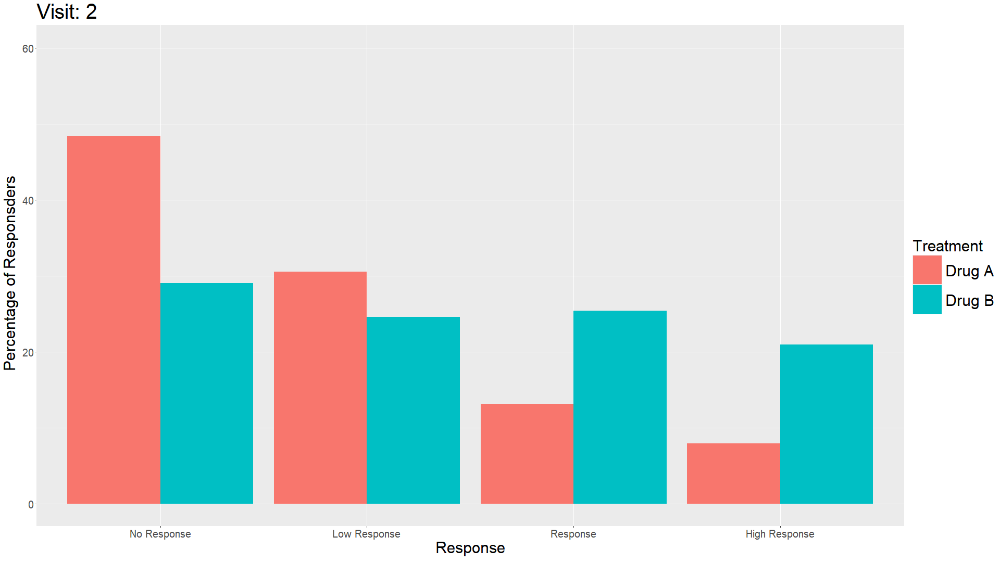

# Markov Trace

Data set:

- 500 subjects randomised 1:1 to Drug A or Drug B
- Patients start in a state of No Response at Visit 1, and transition between four possible health states up to Visit 20 (No Response, Low Response, Response, High Response)

The Challenge:

Visualise the efficacy of the two treatments with respect to state occupancy over time.

Options:

- Compare the treatments at an aggregate level (%s in each state over time)
- Visualise response gain/maintenance/loss over time at a patient level
- Explore decisions which may be made based on patient behaviour – e.g., if rules were introduced to discontinue subjects with suboptimal efficacy, how might different treatment discontinuation rules impact the numbers of subjects discontinuing each treatment?


A description of the challenge can also be found [here](https://github.com/VIS-SIG/Wonderful-Wednesdays/tree/master/data/2025/2025-03-12).  
A recording of the session can be found [here](https://psiweb.org/vod/item/psi-vissig-wonderful-wednesday-57-intra--and-interrater-reliability).

## Visualisations

Animation of plots over time is a very intuitive way to show development of the results over the course of the study. Lasagna plots allow seeing individual patient data, but then right sorting is crucial. Sankey diagrams make it easy to compare proportions over time. This can also be achieved with stacked area charts with careful interpretation of the intermediate stages.
<a id="example1"></a>

### Example 1. Animated bar chart

  

[link to code](#example1 code)


<a id="example2"></a>

### Example 2. Animated line plot

  

[link to code](#example2 code)

<a id="example3"></a>

### Example 3. Static line plot

  

[link to code](#example3 code)

### Example 4. Heat map

  

### Example 5. Sankey diagrams 

  


### Example 6. Stacked area charts

  

### Example 4. Flowing data (non-pharma)

  
Source: [Flowing Data](https://flowingdata.com/2015/12/15/a-day-in-the-life-of-americans/)


## Code

<a id="example1 code"></a>

### Example 1. Animated bar chart

```{r, echo = TRUE, eval=FALSE}
#######################
# Author: Harry Wykes #
#######################

if(!require("pacman")) install.packages("pacman")
p_load("tidyverse", "this.path", "readxl", "gganimate", "gifski")

setwd(this.dir())
dat<-read_xlsx("WWW_APR2025.xlsx", 1) %>%
  mutate(AVALC = reorder(AVALC, AVAL, decreasing = TRUE))

bign <- dat %>%
  filter(AVISITN==1) %>%
  group_by(TRT) %>%
  mutate(N=n()) %>%
  select(TRT, N) %>%
  distinct()

#Proportion of subjects at each level at each time
prop <- dat %>%
  merge(bign) %>%
  group_by(TRT, AVISITN, AVALC) %>%
  mutate(count = n(), prp=count/N, perc = round(100*prp, 2)) %>%
  select(TRT, AVISITN, AVALC, AVAL, count, prp, perc) %>%
  distinct()

#Animated bar plot
bar<-prop %>%
  filter(AVISITN != 1) %>%
  ggplot(aes(x=reorder(AVALC, AVAL), y=perc, group=TRT, fill=TRT)) +
  geom_bar(stat="identity", position="dodge") +
  ylim(c(0,60)) +
  transition_time(AVISITN) +
  enter_grow() +
  exit_fade() +
  labs(x="Response", 
       y="Percentage of Responsders", 
       title="Visit: {frame_time}",
       fill = "Treatment") +
  theme(axis.text = element_text(size=20),
        axis.title = element_text(size=30),
        plot.title = element_text(size=40),
        legend.text = element_text(size=30),
        legend.title = element_text(size=30),
        legend.key.size = unit(2, "cm"))

animate(bar, nframes=19, fps=1, width=1920, height=1080, renderer=gifski_renderer())
anim_save("bar.gif")

```

[Back to blog](#example1)

<a id="example2 code"></a>

### Example 2. Animated line plot

```{r, echo = TRUE, eval=FALSE}
#######################
# Author: Harry Wykes #
#######################

if(!require("pacman")) install.packages("pacman")
p_load("tidyverse", "this.path", "readxl", "gganimate", "gifski")

setwd(this.dir())
dat<-read_xlsx("WWW_APR2025.xlsx", 1) %>%
  mutate(AVALC = reorder(AVALC, AVAL, decreasing = TRUE))

bign <- dat %>%
  filter(AVISITN==1) %>%
  group_by(TRT) %>%
  mutate(N=n()) %>%
  select(TRT, N) %>%
  distinct()

#Proportion of subjects at each level at each time
prop <- dat %>%
  merge(bign) %>%
  group_by(TRT, AVISITN, AVALC) %>%
  mutate(count = n(), prp=count/N, perc = round(100*prp, 2)) %>%
  select(TRT, AVISITN, AVALC, AVAL, count, prp, perc) %>%
  distinct()

#Animated moving line plot
line<-prop %>%
  filter(AVISITN != 1) %>%
  ggplot(aes(x=AVISITN, y=prp, col=TRT)) +
  geom_point(size=10) +
  geom_line(linewidth=5) +
  facet_wrap(~AVALC) +
  scale_x_continuous(breaks=c(2,5,10,15,20)) +
  ylim(c(0,0.6)) +
  transition_reveal(AVISITN) +
  ease_aes("sine-in-out") +
  labs(x="Visit", 
       y="Proportion of Patients", 
       title="Visit: {frame_along}",
       col="Treatment") +
  theme(axis.text = element_text(size=20),
        axis.title = element_text(size=30),
        plot.title = element_text(size=40),
        legend.text = element_text(size=30),
        legend.title = element_text(size=30),
        legend.key.size = unit(2, "cm"),
        strip.text = element_text(size=30))

animate(line, nframes=19, fps=1.9, width=1920, height=1080, renderer=gifski_renderer())
anim_save("line.gif")
```

[Back to blog](#example2)

<a id="example3 code"></a>

### Example 3. Animated bar chart

```{r, echo = TRUE, eval=FALSE}
#######################
# Author: Harry Wykes #
#######################

if(!require("pacman")) install.packages("pacman")
p_load("tidyverse", "this.path", "readxl", "gganimate", "gifski")

setwd(this.dir())
dat<-read_xlsx("WWW_APR2025.xlsx", 1) %>%
  mutate(AVALC = reorder(AVALC, AVAL, decreasing = TRUE))

bign <- dat %>%
  filter(AVISITN==1) %>%
  group_by(TRT) %>%
  mutate(N=n()) %>%
  select(TRT, N) %>%
  distinct()

#Proportion of subjects at each level at each time
prop <- dat %>%
  merge(bign) %>%
  group_by(TRT, AVISITN, AVALC) %>%
  mutate(count = n(), prp=count/N, perc = round(100*prp, 2)) %>%
  select(TRT, AVISITN, AVALC, AVAL, count, prp, perc) %>%
  distinct()

#Non-animated fitted line facet plots
line_static<-prop %>%
  filter(AVISITN != 1) %>%
  ggplot(aes(x=AVISITN, y=perc, group=TRT, col=TRT)) +
  geom_point(alpha=0.5) +
  geom_smooth(method="lm", se=FALSE) +
  xlim(0,20) +
  ylim(0,60) +
  xlab("Visit Number") +
  ylab("% of subjects") +
  labs(col="Treatment") +
  facet_wrap(~AVALC) +
  theme(panel.grid.minor = element_blank())

ggsave("line_static.png", line_static, width=1920, height=1080, units="px")
```

[Back to blog](#example3)

